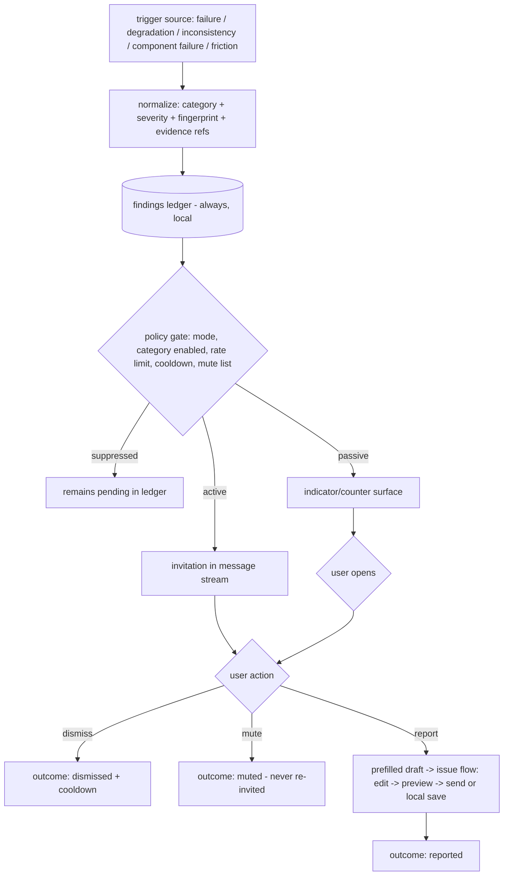

# Report Prompting & Diagnostic Findings

**Version:** 1.1.0
**Status:** Stable
**Layer:** concept

## Overview

The technology-agnostic model of the **system-prompted invitation to report**: when the running system observes something worth telling the makers — an error, a crash discovered on the next start, a health anomaly, an unrepairable inconsistency, a repeated friction pattern — it may *invite* the user to file a report, delivering the invitation into the user's message stream or a passive indicator, governed by a user setting. The invitation carries a prefilled draft and hands off to the existing user-initiated "Report Issue" flow; it never sends anything by itself.

The same mechanism serves the makers directly: every invitation candidate is first recorded locally as a **diagnostic finding** — a normalized, categorized, fingerprinted record of what the system noticed about its own operation (failures, friction, inconsistencies, improvement candidates) with a lifecycle outcome. The findings ledger is the developer-facing triage view of the product's rough edges; the invitation is its user-facing projection.

This spec is the bridge between two established reporting paths: automatic error reporting (system-triggered, system-sent under consent) and issue reporting (user-triggered, user-sent). Report prompting is **system-suggested, user-completed** — it closes the gap where the system knows something went wrong but only the user can decide to speak.

## Related Specifications

- [l1-issue-reporting.md](l1-issue-reporting.md) - The flow every invitation completes into: prefilled compose, mandatory preview-before-send (ISS-3), opt-in diagnostics (ISS-4), local-first capture (ISS-5).
- [l1-error-reporting.md](l1-error-reporting.md) - The sibling automatic path; prompting reuses its fingerprint/dedup discipline (ERR-3), never duplicates its filing, and defers to its autonomy modes (ERR-6).
- [l1-improvement-loop.md](l1-improvement-loop.md) - The loop contract behind the `improvement` trigger: capture discipline (IMP-1/IMP-2), submission autonomy (IMP-3), upstream triage and disposition feedback consuming this ledger's outcomes (IMP-7).
- [l1-operational-health.md](l1-operational-health.md) - Source of graded alerts and trend anomalies (OH-3/OH-4); health measures and hands findings off (OH-7) — prompting is one receiver.
- [l1-doctor.md](l1-doctor.md) - Source of escalated, unrepairable or risky findings (HEAL-3); inconsistencies the doctor cannot safely fix become invitation candidates.
- [l1-diagnostic-log.md](l1-diagnostic-log.md) - Evidence plane: a crash that only the forensic log witnessed (DL-2) is detected on the next start and becomes a finding; bundle egress stays under DL-6.
- [l1-log-legibility.md](l1-log-legibility.md) - The invitation text and prefilled draft are projections of recorded events and obey secret-safety at every projection (LL-7).
- [l1-security.md](l1-security.md) - Findings and invitations are local operational data; no egress occurs at the prompting layer (SEC egress gate untouched).
- [l1-application-shell.md](l1-application-shell.md) - The message-stream and indicator surfaces an invitation renders on; render-from-state, non-modal.
- [l1-architecture.md](l1-architecture.md) - Command parity (INV-3): the findings ledger and prompting controls are equivalent across frontends.

## 1. Motivation

The system already has two mouths but no initiative. Error reporting speaks automatically, but only about errors and only as machine-authored payloads. Issue reporting lets the user speak in their own words, but depends entirely on the user remembering a button exists — and users rarely report the friction that annoyed them an hour ago. Meanwhile the richest diagnostic sources — the health layer's anomalies, the doctor's "I found this but won't touch it" escalations, a crash the forensic log caught while nothing else was alive — terminate in local surfaces the user may never open. Real defects, rough edges, and inconsistencies are observed by the system, recorded locally, and then silently forgotten.

Prompting closes the loop with the cheapest honest step: **tell the user, once, quietly, and offer to help them report it.** The system contributes what it knows (category, evidence, a draft); the user contributes what only they know (what they were doing, whether it mattered) and the decision to send. For the makers, the same normalization produces a local triage ledger: a deduplicated, categorized inventory of everything the product noticed about its own operation — the raw material of a fix list, whether or not any single user chooses to report.

## 2. Constraints & Assumptions

- An invitation is local UI; issuing one is not an egress event and requires no consent. Consent applies to *sending*, which remains owned by the reporting flows.
- Prompting consumes signals the observation planes already record (errors, alerts, escalations, forensic crash records); it mandates no new instrumentation of its own.
- Prompting evaluates and normalizes; it never diagnoses, scores, or repairs — those remain the jobs of the planes it consumes (measure/repair separation preserved).
- Attention is a budgeted resource: an unbounded or repetitive invitation stream is a defect of this mechanism, not a tuning detail.
- The mechanism must degrade gracefully when external filing is unconfigured or declined: a locally-captured report is a valid, complete outcome.
- Whether prompting is active at all is the user's choice, held in settings; when off, the user-facing surface is fully inert (no invitations, no indicators). Finding recording (RP-6) is a local, passive act and continues regardless of mode.

## 3. Core Invariants (Layer 1 only)

Rules every Layer 2 implementation MUST NOT violate:

- **RP-1 (Invitation, never transmission):** the prompting layer only *invites*. It MUST NOT send, file, or egress anything by itself, and MUST NOT introduce a new egress path. A report reaches the tracker exclusively through the existing flows — the user-completed issue flow with its mandatory preview (ISS-3/ISS-6), or error reporting's own consent-gated path (ERR-1). Declining or ignoring an invitation has no egress side effect.

- **RP-2 (Closed trigger taxonomy):** invitations arise only from a closed, named set of trigger sources: **(a) failure** — an error occurrence, including a crash discovered on next start from the forensic record (DL-2); **(b) degradation** — a health alert or trend anomaly of at least warning severity (OH-3/OH-4); **(c) inconsistency** — a self-check escalation the repair layer surfaced as unrepairable or risky (HEAL-3), including cross-component contract mismatches surfaced by its checks; **(d) component failure** — a user-visible, severity-coded failure surfaced by an embedded component's error taxonomy (e.g. the workflow-language runtime's canonical error codes); **(e) friction** — a repeated user-visible failure pattern of the same operation (retry/cancel loops) crossing a conservative threshold; **(f) improvement** — a system-observed improvement or optimization opportunity derived during real work from evidence the observation planes already record (run outcomes, routing/latency patterns, wasted-work signals, capability gaps), captured under the improvement loop's discipline: evidence-backed, product-subject-only, budget-bounded, never a bare opinion (IMP-1/IMP-2). A new trigger kind is an amendment to this taxonomy, never a one-off.

- **RP-3 (Setting-governed modes):** prompting behavior is a user setting with a closed mode set — at minimum **off** (fully inert: no invitations, though findings are still recorded), **passive** (findings surface only as a non-intrusive indicator/counter the user can open), and **active** (invitations are delivered into the user's message stream). Per-trigger-category enablement and thresholds are also settings. The mode is changeable in one step from any invitation itself.

- **RP-4 (Bounded, deduplicated, dismissible):** invitations are non-modal and never interrupt input or block work. Candidates are fingerprinted (reusing the reporting pipeline's fingerprint discipline, ERR-3); a recurring finding updates its existing invitation (occurrence count) instead of creating another. Delivery is rate-limited per time window, with a cooldown after dismissal; a finding the user muted never invites again until an explicit unmute or a product-version change. A finding already satisfied by the automatic error-reporting path — an issue filed or updated for the same fingerprint under its consent preference (ERR-1/ERR-3) — is marked *reported* and MUST NOT be re-invited. Dismissal is a respected outcome, not a retry condition.

- **RP-5 (Prefilled, evidence-linked, sanitized draft):** an invitation carries a prefilled draft — a mapped category, a short system-authored summary, an occurrence count, and references to the local evidence behind it. Prefill content is drawn only from sanitized, secret-free projections (LL-7); raw payloads and diagnostics are attached only through the receiving flow's own opt-in (ISS-4) and are always shown in its preview (ISS-3). The prefill is fully editable — the user's words replace, not decorate, the system's.

- **RP-6 (Local findings ledger, two consumers, bounded):** every candidate — invited or not — is recorded locally as a finding: trigger source, category, severity, fingerprint, first/last seen, occurrence count, evidence references, and lifecycle outcome (pending / shown / dismissed / muted / reported / resolved). A finding becomes *resolved* when its fingerprint ceases to recur after a product change, or by explicit user or maker action. The ledger is inspectable and exportable by the user, and is the developer-facing triage inventory; it never egresses on its own (export is a user act crossing the standard egress gate). The ledger is bounded: resolved and long-inactive findings age out under a retention policy rather than accumulating without limit — it is a triage queue, not a durable audit ledger.

- **RP-7 (Respects reporting configuration, never pressures consent):** prompting reads but never writes reporting consent or tracker configuration. When external filing is unconfigured, declined, or offline, invitations remain honest — offering local capture (ISS-5) rather than promising a send — or are suppressed per settings. An invitation MUST NOT be used to nag the user toward enabling consent or telemetry.

- **RP-8 (Frontend parity):** finding inspection, prompting settings, and invitation delivery are available across all frontends with equivalent behavior: the graphical surface renders an inline card or indicator, the terminal surfaces render an equivalent non-blocking line or panel. The library capability is the source of truth; frontends differ only in rendering (INV-3).

> L2 specs cannot reach RFC status until all invariants here are addressed in their "Invariant Compliance" section.

## 4. Detailed Design

### 4.1 Three reporting postures, one pipeline

| Aspect | Error reporting (ERR) | **Report prompting (this spec)** | Issue reporting (ISS) |
| --- | --- | --- | --- |
| Initiator | system | system suggests | user |
| Completer | system (under consent) | **user** | user |
| Scope | errors/crashes + eligible findings (ERR-6) | failures + degradation + inconsistency + friction + improvement | anything the user wants |
| Egress | ERR-1 consent gate | none (RP-1) — hands off | ISS-3 preview gate |
| Content | machine-authored | machine-drafted, user-rewritten | user-authored |

Prompting adds no second pipeline: it is a *front* that funnels into the issue flow, which itself reuses error reporting's pipeline (ISS-6).

### 4.2 Finding lifecycle

The ledger write precedes the policy gate (RP-6): a suppressed finding is still knowledge. Re-occurrence of the same fingerprint updates `last seen` and the count on the existing finding and its live invitation, if any (RP-4).

### 4.3 Trigger-to-category mapping

| Trigger source (RP-2) | Finding category | Prefill maps to issue category (ISS-2) |
| --- | --- | --- |
| error occurrence / crash-on-next-start | failure | bug |
| health alert / anomaly (≥ warning) | degradation | bug (performance framing) |
| self-check escalation, contract mismatch | inconsistency | bug |
| component error taxonomy (user-visible, `error` severity) | failure | bug |
| repeated retry/cancel of one operation | friction | feedback |
| in-work improvement/optimization opportunity (evidence-backed) | improvement | idea |
| (user-side observation, no trigger) | — | any (plain issue flow, out of scope here) |

[MODIFIED v1.1.0] System-derived improvement suggestions are first-class findings: the improvement loop defines their capture discipline — evidence-backed, product-subject-only, budget-bounded (IMP-1/IMP-2). The principle stands unchanged in stronger form: the system proposes *evidence*, not opinions — an improvement candidate without evidence references is not a finding. Under the automatic submission grant (ERR-6 automatic), a qualifying finding MAY file through the automatic path directly; RP-1 is untouched — transmission is the reporting pipeline's consented act, never the prompting layer's — and such findings are marked *reported* per RP-4.

### 4.4 The invitation surface

An invitation is one compact, non-modal unit containing: what was observed (one sanitized sentence), how often (occurrence count), what happens next ("nothing has been sent"), and the actions — **Report** (opens the prefilled draft), **Dismiss**, **Mute this finding**, **Prompting settings**. Active-mode delivery lands in the user's message stream as a system-attributed message; passive mode only increments an indicator the user opens at will. On terminal frontends the invitation renders as a non-blocking system line/panel at the next natural boundary — it never seizes the prompt mid-input (RP-4, RP-8).

Default posture: **active**, with conservative rate limits (single-digit invitations per day, one per fingerprint per cooldown window) and the one-step mode switch on every invitation. The default is deliberately not silent — a mechanism nobody discovers reports nothing — while RP-4 keeps it from becoming noise. <!-- TBD: validate default mode (active vs passive) and default rate-limit values against real usage -->

### 4.5 Developer-side triage

The ledger is the maker's inventory of the product's observed rough edges: filterable by category/severity/recency, sorted by occurrence count, each finding carrying its evidence references and outcome history. Export produces a self-contained, sanitized document (the same scrub discipline as any egress). Distinction of subject: the agent-learning layer records *the agent's* mistakes to change agent behavior; the findings ledger records *the product's* defects to change the product. The two must not be conflated, though one incident may legitimately appear in both.

### 4.6 Settings surface (concept-level)

| Setting | Values | Default |
| --- | --- | --- |
| prompting mode | off / passive / active | active |
| per-category enablement | on/off per RP-2 category | all on |
| friction threshold | repeats within window | conservative |
| rate limit / cooldown | bounded numeric windows | conservative |

Names and storage are L2 concerns; the closed mode set and one-step reachability from an invitation are the L1 contract (RP-3).

## 5. Drawbacks & Alternatives

- **Notification fatigue:** any proactive surface risks annoying exactly the users it serves. Mitigated structurally by RP-4 (bounds, dedup, cooldown, mute) and RP-3 (one-step off); the active default remains the most contestable choice and is explicitly marked for revisit.
- **Alternative — auto-file every finding (no user in the loop):** rejected. Violates RP-1 and the consent posture of both reporting flows; floods the tracker with unowned, contextless reports.
- **Alternative — fold prompting into error reporting:** rejected. Error reporting's contract is machine-authored error payloads under a consent preference; prompting spans non-error findings and requires user authorship. Overloading it blurs both trigger models (same reasoning that kept issue reporting separate).
- **Alternative — fold the ledger into operational health:** rejected. Health scores continuous condition and already hands findings off (OH-7); the ledger is an outcome-tracking triage record spanning sources health does not own (crashes, friction, component taxonomies).
- **Sampling honesty:** friction heuristics can misfire (a retry loop may be the user experimenting). Accepted: friction findings are low-severity by construction, threshold-gated, and cheap to dismiss; a wrong invitation costs one click.

## Canonical References

| Alias | Path | Purpose |
| --- | --- | --- |
| `[ISS]` | `.design/main/specifications/l1-issue-reporting.md` | The user-completed flow every invitation hands off to (ISS-2/3/4/5). |
| `[ERR]` | `.design/main/specifications/l1-error-reporting.md` | Fingerprint/dedup discipline reused by RP-4; the sibling automatic path. |
| `[OP-HEALTH]` | `.design/main/specifications/l1-operational-health.md` | Alert/anomaly semantics behind the degradation trigger (OH-3/OH-4/OH-7). |
| `[DOCTOR]` | `.design/main/specifications/l1-doctor.md` | Escalation semantics behind the inconsistency trigger (HEAL-3). |
| `[DIAG-LOG]` | `.design/main/specifications/l1-diagnostic-log.md` | Crash-on-next-start evidence and bundle egress rules (DL-2/DL-6). |

## Document History

| Version | Date | Author | Notes |
| --- | --- | --- | --- |
| 1.1.0 | 2026-07-16 | Core Team | RP-2 gains **(f) improvement** — system-observed, evidence-backed improvement/optimization opportunities captured during real work under the improvement loop's discipline (IMP-1/IMP-2); §4.3 mapping row added (improvement → idea) and the "no system trigger for suggestions" stance replaced by the evidence-gated trigger; §4.1 scope updated for ERR-6 autonomy modes. Related link to l1-improvement-loop. |
| 1.0.0 | 2026-07-09 | Core Team | Initial spec — system-prompted, user-completed reporting: invitation-never-transmission (RP-1), closed trigger taxonomy failure/degradation/inconsistency/component-failure/friction (RP-2), setting-governed off/passive/active modes (RP-3), bounded deduplicated dismissible invitations (RP-4), prefilled evidence-linked sanitized drafts (RP-5), local findings ledger with two consumers — user invitations and developer triage (RP-6), respects reporting config and never pressures consent (RP-7), frontend parity (RP-8). Bridges error-reporting (system-sent) and issue-reporting (user-sent); no new egress path. |
