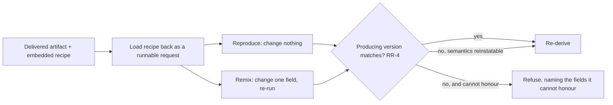

# Reproduction Recipe

**Version:** 1.0.0
**Status:** Stable
**Layer:** concept

## Overview

A delivered artifact carries, **embedded in itself**, the complete versioned recipe that produced it — so anyone holding only the artifact can re-derive it, or change one thing and re-derive a variant.

This is deliberately not the derivation trace. The trace lives *in the system* and answers "what produced this datum" for someone standing inside; the recipe travels *with the artifact* and answers "how do I make this again" for someone who has nothing else. The moment a deliverable leaves — exported, attached, handed to a colleague, filed in a ticket — the trace stays behind and the artifact becomes an orphan whose origin is unrecoverable.

Three layers make a recipe true rather than decorative: the **request**, the **components** identified by content rather than by name, and the **ambient configuration** that was in force and changed the outcome without being asked for. Plus the one field without which all three are misleading — the **producing version**, because a recipe replayed on a changed engine reproduces something else and says nothing about it.

## Related Specifications

- [l1-data-lineage.md](l1-data-lineage.md) - In-system derivation links as side-band metadata (LN-5); complementary and deliberately opposite in placement — lineage stays in the trace, the recipe travels with the artifact.
- [l1-attestation.md](l1-attestation.md) - A witness proves *this is genuine and who made it*; a recipe states *how to make it again*. Different claims, both may accompany one artifact (RR-10).
- [l1-derived-artifact-handoff.md](l1-derived-artifact-handoff.md) - Shares a rebuildable artifact to avoid recomputation; a recipe is what makes rebuilding possible at all.
- [l1-incremental-execution.md](l1-incremental-execution.md) - Memoization keyed on a step's inputs; a recipe is the same idea at delivery grain, for a human rather than a cache.
- [l1-simulation.md](l1-simulation.md) - Execution-mode provenance; a recipe records whether the run that produced the artifact was real (RR-8).
- [l1-competitive-execution.md](l1-competitive-execution.md) - The winning candidate's recipe is what makes a discarded tournament reconstructable.
- [l1-security.md](l1-security.md) - Secret isolation, which RR-9 restates at the recipe boundary.
- [l1-extensions.md](l1-extensions.md) - Any extension that influenced the output must contribute its parameters to the recipe (RR-5).
- [l1-model-runtime.md](l1-model-runtime.md) - Content-addressed model identity (MR-3) and versioned references (MR-12), which RR-3 consumes; a degradation tier that changes outputs is a recipe field (MR-15).
- [../../nodus/specifications/l1-nodus-observability.md](../../nodus/specifications/l1-nodus-observability.md) - The run manifest as a workflow's re-execution recipe (HO-20).

## 1. Motivation

An agent produces a document, a plan, a diff, a report. It is good. Two weeks later someone asks for "the same thing but for the other region", or "the same analysis with the updated data", or simply "how did we get this number?" — and the answer is a reconstruction from memory, if anyone remembers, and a fresh attempt from scratch if nobody does.

The information needed was all present at the moment of production and cost nothing to record. What made it vanish is that it was recorded *somewhere else*. Every system with a trace has this shape: the origin is knowable while the artifact sits inside, and unknowable the instant it is exported, attached, pasted, or handed over — which is precisely when the artifact acquires an audience that cannot query anything.

Three specific losses follow, and each is worse than it first looks.

**Reproduction becomes re-invention.** Re-running the same request without the same components and settings does not reproduce the artifact; it produces a *different* artifact that looks similar enough that nobody notices the substitution. The failure is not "we couldn't reproduce it" — it is "we reproduced something else and called it the same".

**Remixing becomes guessing.** The dominant real use is not exact reproduction but *one change*: same everything, different region, different tone, different input file. Without the recipe, "one change" means reconstructing twenty unknown parameters and changing one, so the twenty become variables too, and the comparison that was supposed to isolate one factor isolates nothing.

**A name is not an identity.** A recipe that records "the standard analysis model" or "the review skill" is worthless a version later. Components drift, get replaced, get renamed, and two different things share one name in different offices. Only content identity survives, and it costs a hash to record.

And the failure that makes the other three invisible: **an engine that changed underneath the recipe.** The same recorded parameters mean something different after the defaults, the prompt scaffolding, or the composition rules change. Replaying an old recipe on a new engine produces a plausible, wrong result with no error and no warning — the reproduction *appears* to succeed. This is why the producing version is not optional metadata but the field that makes every other field mean anything.

## 2. Constraints & Assumptions

- The recipe describes **how to re-derive**, not **that the artifact is genuine** — authenticity is attestation's claim, and the two are independent (RR-10).
- Recording is **cheap and always-on**: everything in a recipe is already known at production time, so a recipe is captured by default rather than on request.
- Recipes are **local-first**: capturing one performs no egress, and a recipe leaves the device only when its artifact does, under the same authorization.
- Re-derivation is not promised to be *identical* where the production was not deterministic; the recipe's obligation is to state which it was (RR-8), never to imply reproducibility it cannot deliver.
- The recipe format is a portable, self-describing key/value record embedded in or adjacent to the artifact; this spec constrains its **contents and honesty**, not its encoding.

## 3. Core Invariants

Rules every Layer 2 implementation MUST NOT violate:

- **RR-1 (The recipe travels with the artifact):** a delivered artifact carries its recipe **embedded in itself or in an inseparable companion** that accompanies every copy, export, attachment, and hand-off. A recipe reachable only by querying the producing system does not satisfy this invariant: the artifact's audience at the moment origin matters most is exactly the audience that cannot query anything.
- **RR-2 (Three layers, or the recipe is a lie):** a recipe records **the request** (what was asked, including the instructions and inputs), **the components** that participated (models, skills, tools, source artifacts), and **the ambient configuration in force** that affected the outcome without being part of the request (defaults, office settings, policy tier, resolved switches). Omitting the third layer is the common and most damaging failure: it produces a recipe that looks complete, replays under different ambient settings, and yields a different artifact with no indication that anything differed.
- **RR-3 (Components by content identity, not by name):** every component in the recipe is identified by **content identity** — a digest of the exact artifact used — with its human name recorded alongside for legibility, never instead. A name drifts, is reassigned, and collides across offices; only content identity survives the interval between production and reproduction, which is exactly the interval a recipe exists to cross. **Inputs are components too**, and are therefore *referenced* by content identity rather than copied into the recipe — a recipe that inlines its inputs grows with them until it is dropped for being unwieldy, which is how completeness dies in practice rather than by decision. The consequence is stated rather than hidden: reproduction requires access to the referenced inputs, and a recipe whose inputs are no longer reachable reports that plainly instead of failing as though the recipe were at fault.
- **RR-4 (The producing version is recorded, and replay honours it):** a recipe records the **version of the producing system**, and a replay reinstates that version's semantics for the fields whose meaning changed — or, where it cannot, **refuses and says which fields it cannot honour**. Replaying an old recipe under current semantics and presenting the result as a reproduction is forbidden: it fails silently, it looks successful, and the difference is invisible to the person who most needs to see it.
- **RR-5 (Every influencing component contributes its own fields):** a component that affected the output — a core subsystem, a skill, an extension, a post-processing step — MUST contribute the parameters it used to the recipe. A component that influences the artifact and contributes nothing makes the recipe **undetectably incomplete**, which is worse than a recipe known to be partial, because a reader has no way to discover the gap.
- **RR-6 (Completeness is not configurable; omissions are declared):** what a recipe records MUST NOT be silently reducible by a setting. Where a field genuinely cannot be captured — unavailable, too large, deliberately excluded — the recipe records the field as **present-but-unavailable with its reason**, never drops it. A recipe that quietly omits is read as a recipe that had nothing to omit. (The recipe-grain member of the discipline that absence is recorded as absence.)
- **RR-7 (Best-effort per field, never all-or-nothing):** a field that cannot be rendered marks itself unavailable (RR-6) and the rest of the recipe is still written. Failing to produce a recipe because one field failed converts a small gap into a total loss — and it does so at the moment of delivery, where a retry is least likely.
- **RR-8 (Determinism is stated, never implied):** the recipe records the **determinism controls** in force (the seed or equivalent, the sampling settings) and states plainly whether the production was **deterministic**, **deterministic-given-the-recorded-controls**, or **non-deterministic**. A recipe for a non-deterministic production promises re-*derivation*, not re-*production*, and MUST say so; a recipe that implies exactness it cannot deliver teaches its readers to distrust every recipe.
- **RR-9 (Secrets are named, never carried):** a field whose value is a secret is recorded as **present and redacted**, never included and never silently dropped. The reader learns that a credential participated and which one, without learning it — and, critically, without being misled into thinking the production needed none. The recipe leaves the device only when its artifact does, under the same authorization.
- **RR-10 (A recipe is not a claim of authenticity, and never a substitute for one):** a recipe states how the artifact was made; it does **not** assert that this artifact is genuine, unmodified, or produced by whom it says. A recipe is trivially editable and MUST NOT be treated as evidence of origin. Where origin must be trusted, an independently verifiable witness accompanies the artifact and is verified separately; the two claims travel together and are never conflated.

> L2 specs cannot reach RFC status until all invariants here are addressed in their "Invariant Compliance" section.

## 4. Detailed Design

### 4.1 The three layers (RR-2)

| Layer | What it captures | Why omitting it breaks reproduction |
| --- | --- | --- |
| **Request** | The instruction, the inputs, the declared parameters | Obvious, and the layer everyone remembers |
| **Components** | Models, skills, tools, source artifacts — by content identity (RR-3) | A name resolves to something else later; the replay silently uses a different component |
| **Ambient configuration** | Defaults, office settings, policy tier, resolved exposure switches, degradation tier | Never asked for, always in force; a replay under different ambient settings produces a different artifact and reports success |

The third layer is the one a design forgets, because at production time it is invisible — it is the environment, not an input. It becomes visible only on replay, as an unexplained difference.

### 4.2 Anatomy of a recipe

```text
[REFERENCE]
Recipe {
  // request
  instruction, inputs[], declared parameters

  // components — content identity first, name for humans only (RR-3)
  components[]: { role, digest, name, version }

  // ambient configuration in force (RR-2, layer three)
  ambient[]: { key, effective value, tier it came from }

  // honesty fields
  producing_version                       // RR-4 — the field that makes the others mean anything
  determinism: deterministic | deterministic-given-controls | non-deterministic   // RR-8
  controls: { seed / sampling settings }  // RR-8
  execution_mode: real | simulated        // composes the simulation marker
  unavailable[]: { field, reason }        // RR-6/RR-7 — declared gaps, never silent
  redacted[]:    { field, what kind }     // RR-9 — named, not carried
}
```

Every field below the divider exists to prevent a specific silent failure. Remove any of them and the recipe still *looks* complete.

### 4.3 The two uses, and which one dominates



**Remix is the common case and the reason round-tripping matters.** Exact reproduction is occasionally needed for audit; changing one thing is needed constantly. A recipe that is only human-readable serves the rare case and fails the frequent one — which is why RR-1's obligation is that the recipe **loads back as a request**, not merely that it is written down.

The refusal arm is deliberate. Producing a plausible result under semantics the recipe did not intend is worse than producing nothing, because the caller believes they reproduced the artifact.

### 4.4 Boundary with neighbouring layers

| Question | Owner |
| --- | --- |
| "How do I make this again?" — travelling with the artifact | **This spec** |
| "What produced this datum?" — inside the system, side-band on the trace | Data lineage |
| "Is this genuine, and who made it?" | Attestation (RR-10 keeps the claims separate) |
| "Can I avoid recomputing this?" | Derived-artifact handoff / incremental execution |
| "Was this run real or simulated?" | Simulation (its marker is a recipe field) |
| "Which arm of a rollout produced this?" | Staged rollout (its resolved switches are ambient configuration) |

## 5. Drawbacks & Alternatives

- **A recipe enlarges every artifact.** Accepted: the content is small relative to any real deliverable, and RR-6's ban on making completeness configurable is precisely what stops the size argument from quietly hollowing out the recipe field by field.
- **An embedded recipe can leak more than intended.** Bounded by RR-9 (secrets named, never carried) and by the recipe travelling under the same authorization as its artifact — a recipe never creates an egress the artifact did not already have.
- **Recipes can be edited, so they are not evidence.** Stated outright by RR-10 rather than left implicit, because a self-describing artifact invites exactly this misreading.
- **Reinstating old semantics has a cost and a horizon.** Accepted, and the horizon is made explicit: past what it can honour, RR-4 requires refusal naming the unhonourable fields rather than a best-effort replay presented as a reproduction.
- **Alternative — keep provenance only in the trace.** Rejected by RR-1: the trace is unreachable exactly when the artifact has left, which is when its origin is most often asked about.
- **Alternative — record component names, not digests.** Rejected by RR-3: names are the part of a system that drifts fastest, and a replay against a drifted name fails silently.
- **Alternative — make recipe fields configurable to save space.** Rejected by RR-6: the fields that get switched off are the ones nobody misses until reproduction fails, and a reduced recipe is indistinguishable from a complete one.
- **Alternative — treat the recipe as proof of origin.** Rejected by RR-10: it is unsigned, editable text, and conflating it with a witness gives a forgeable artifact the authority of a verified one.

## Canonical References

| Alias | Path | Purpose |
| --- | --- | --- |
| `[LINEAGE]` | `.design/main/specifications/l1-data-lineage.md` | The in-system complement; deliberately opposite in placement (LN-5). |
| `[ATTEST]` | `.design/main/specifications/l1-attestation.md` | The authenticity claim RR-10 keeps separate and never substitutes for. |
| `[RUNTIME]` | `.design/main/specifications/l1-model-runtime.md` | Content-addressed model identity (MR-3) and versioned references (MR-12) that RR-3 consumes. |
| `[OBSERVABILITY]` | `.design/nodus/specifications/l1-nodus-observability.md` | The run manifest as a workflow's re-execution recipe (HO-20). |

## Document History

| Version | Date | Author | Notes |
| --- | --- | --- | --- |
| 1.0.0 | 2026-07-23 | Core Team | Initial spec — a delivered artifact carries its own complete versioned reproduction recipe, embedded and travelling with it rather than left behind in the trace: the recipe accompanies every copy, export, and hand-off, because the audience at the moment origin matters most is the one that cannot query anything (RR-1); three layers — request, components, and the **ambient configuration in force**, whose omission is the common and most damaging failure since it yields a recipe that looks complete, replays under different settings, and reports success (RR-2); components by content identity with names for legibility only, since names are what drift fastest across the interval a recipe exists to cross (RR-3); the producing version recorded and honoured on replay, or refusal naming the unhonourable fields — replaying under current semantics and calling it a reproduction fails silently and looks successful (RR-4); every influencing component contributing its own fields, since a silent contributor makes the recipe undetectably incomplete (RR-5); completeness not configurable and omissions declared as present-but-unavailable with a reason (RR-6); best-effort per field so one failure does not lose the whole recipe at the moment of delivery (RR-7); determinism stated rather than implied — deterministic / deterministic-given-controls / non-deterministic (RR-8); secrets named and redacted, never carried and never silently dropped (RR-9); and a recipe explicitly not a claim of authenticity, travelling beside a witness rather than substituting for one (RR-10). Concept-only. |
