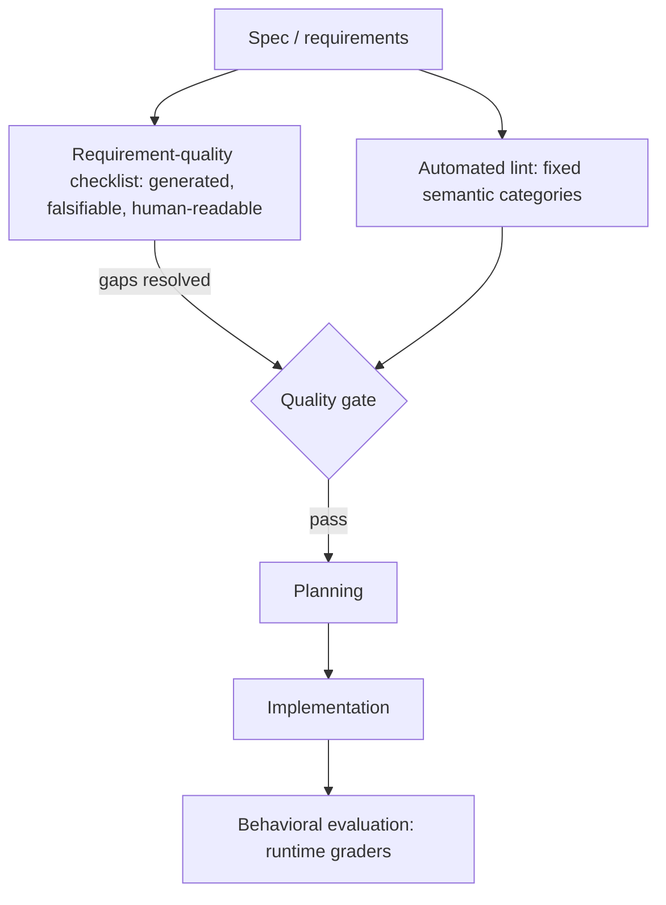

# Requirement-Quality Checklists

**Version:** 1.0.0
**Status:** Stable
**Layer:** concept

## Overview

A requirement-quality checklist is **"unit tests for the specification"** — a generated, domain-tailored set of falsifiable questions that validate whether the *requirements themselves* are well written, before any code is planned or written. If a spec is "code written in English," this checklist is its test suite: it does not ask whether the implementation works, it asks whether the requirements are complete, clear, consistent, measurable, and fully covered.

The defining move is a boundary: the checklist tests **the requirements, never the implementation**. "Does the spec define what happens when the logo image fails to load?" is a valid item (it tests the requirements). "Verify the logo click navigates home" is not (it tests behavior — that is the job of a behavioral evaluation, [l1-evaluation-suites.md](l1-evaluation-suites.md)).

This is the third, distinct member of the quality family, and it must not be confused with the others:

- **Automated document lint** (`l2-quality-pipeline.md`) — a machine pass over fixed semantic categories; no human-readable artifact, no per-spec tailoring.
- **Behavioral evaluation** (`l1-evaluation-suites.md`) — runs the customization/system on tasks and grades runtime behavior.
- **Requirement-quality checklist** (this spec) — a generated, human-readable, falsifiable artifact bound to a spec that gates it on requirements quality before commitment.

## Related Specifications

- [l1-evaluation-suites.md](l1-evaluation-suites.md) — dynamic behavioral testing of customizations; this is its static, requirements-side counterpart (tests the spec prose, not runtime behavior).
- [l2-quality-pipeline.md](l2-quality-pipeline.md) — automated semantic lint + fixed maturity rubric; this checklist is the generated, human-readable complement, not a replacement.
- [l1-quality-standards.md](l1-quality-standards.md) — tiered definition-of-done gates; an unresolved checklist is a gate input.
- [l1-spec-driven-governance.md](l1-spec-driven-governance.md) — the lifecycle this gate sits in: a checklist runs before a spec is promoted toward planning.
- [l1-task-graph-model.md](l1-task-graph-model.md) — planning consumes a spec only after its checklist gaps are resolved.
- [l1-operational-ledger.md](l1-operational-ledger.md) — stable-id, append-only discipline (OL-2) shared by checklist items (RQ-5).
- [l1-facilitation.md](l1-facilitation.md) — the interactive clarification that resolves an item's gap reuses the elicitation surface.

## 1. Motivation

Specs fail silently in a way code does not: a missing or vague requirement produces confident, wrong implementation, and the defect is invisible until it ships. The office already validates specs two ways — an automated lint scans for semantic defects, and a fixed rubric scores maturity — but neither produces the artifact a human reviewer actually reasons with: **a tailored, falsifiable list of "did we actually specify this?" questions for this particular feature**.

Three gaps follow from its absence:

1. **No requirements-side test artifact.** Code gets unit tests; requirements get a vibe check. A generated checklist makes "is this requirement testable / complete / unambiguous?" a concrete, answerable list rather than a reviewer's intuition.
2. **Fixed rubrics miss domain specifics.** A one-size rubric cannot ask "are zero-state and partial-load requirements defined for the episode list?" — that item only exists if generated from *this* spec's domain signals.
3. **Implementation-testing masquerades as spec review.** Reviewers drift into "does it work?" when the spec has not even said what "work" means. An explicit boundary (test requirements, not implementation) keeps the review where the leverage is — before code exists.

## 2. Constraints & Assumptions

- A checklist validates **requirements quality**, not runtime behavior; the latter is owned by behavioral evaluation.
- A checklist is **generated then maintained**: generation seeds it from spec signals; the author owns final coverage.
- A checklist is a **companion artifact** stored with its spec and scoped to a focus domain (ux / api / security / …); several focused checklists may coexist.
- Items are **falsifiable**: each is answerable yes/no from the spec text, and references the location it checks or marks an explicit gap.
- A checklist is a **gate before commitment** (planning/implementation), not a post-hoc audit.

## 3. Core Invariants

Rules any Layer 2 implementation MUST NOT violate:

- **RQ-1 Tests requirements, not implementation**: every item evaluates whether the *requirements* are well written — complete, clear, consistent, measurable, covered. An item asserting runtime behavior ("the button navigates home") is out of scope and belongs to behavioral evaluation. This boundary is the concept's defining invariant.
- **RQ-2 Generated and domain-tailored**: a checklist is generated for a specific spec from its signals (domain keywords, risk indicators, named deliverables, stakeholder/audience hints), not emitted from a fixed universal form. A fixed completion checklist and an automated lint are complements, not substitutes.
- **RQ-3 Falsifiable items tagged by quality dimension**: each item is a yes/no question about what the spec does or does not say, tagged with its quality dimension (completeness / clarity / consistency / measurability / coverage / edge-case / non-functional / dependency / ambiguity). An item that cannot be answered yes/no from the spec text is malformed.
- **RQ-4 Traceable or gap-marked**: each item references the spec location it checks (a section anchor) or carries an explicit gap marker when it checks for an absent requirement. An item with neither anchor nor gap marker is non-actionable.
- **RQ-5 Stable ids, append-only**: items carry stable identifiers and the checklist grows by appending; existing items are never silently deleted or renumbered, so a recorded result stays valid (the single-author analogue of supersede-don't-mutate).
- **RQ-6 Scoped and context-bounded**: a checklist is scoped to a focus domain and generated by reading only the relevant portions of the spec/plan within a context budget — never by dumping the whole corpus. Multiple focused checklists for one spec are allowed and expected.
- **RQ-7 Gate before commitment**: a checklist is consumed as a quality gate *before* planning/implementation; unresolved gap/ambiguity items block a spec's advance toward implementation the way a failing test blocks a merge. It complements, and never replaces, behavioral evaluation or the automated lint.
- **RQ-8 Scaffold then maintain**: generation seeds the checklist; coverage remains the author's responsibility. A checklist still containing only generated items, uncurated, is reported as under-developed.

> An L2 implementation cannot reach RFC until every invariant above is addressed in its Invariant Compliance section.

## 4. Detailed Design

### 4.1 Quality Dimensions

Items are grouped by the requirement-quality dimension they test:

| Dimension | The question it asks of the requirements |
| --- | --- |
| Completeness | Are all necessary requirements documented? (incl. `[Gap]` for absent ones) |
| Clarity | Are requirements specific and unambiguous? Are vague terms quantified? |
| Consistency | Do requirements align without conflicts across sections? |
| Measurability | Are acceptance criteria objectively verifiable? |
| Coverage | Are all flows/scenarios addressed (alternate / exception / recovery)? |
| Edge case | Are boundary and failure conditions defined (zero-state, partial load)? |
| Non-functional | Are performance / security / accessibility requirements specified? |
| Dependency & assumption | Are dependencies and assumptions documented and validated? |
| Ambiguity & conflict | What still needs clarification? |

### 4.2 Item Structure (RQ-3, RQ-4)

```text
[REFERENCE]
<id> <yes/no question about what the spec says or omits> [<dimension>][, §<spec-section> | Gap]

CHK001  Is "prominent display" quantified with specific sizing/positioning? [Clarity, §FR-4]
CHK002  Are error-handling requirements defined for all API failure modes? [Completeness, Gap]
CHK003  Are zero-state requirements defined when the list is empty? [Coverage, Edge Case]
```

Each item: a falsifiable question, a dimension tag, and either a section anchor (checking an existing requirement) or a `Gap` marker (checking for a missing one). Right vs wrong is the RQ-1 boundary:

- Wrong (tests implementation): "Verify the page displays 3 cards."
- Right (tests requirements): "Are the number and layout of featured cards specified? [Completeness]"

### 4.3 Generation Algorithm (RQ-2, RQ-6)

```text
[REFERENCE]
1. EXTRACT  signals — domain keywords, risk indicators, named deliverables, audience hints
2. CLUSTER  into ≤ N focus areas, ranked by relevance
3. DETECT   missing dimensions — scope breadth, depth, exclusions, measurable criteria
4. TAILOR   items per focus area, each tagged + anchored/gap-marked (4.2)
5. SCOPE    read only relevant spec/plan portions (context budget); summarize, don't dump
```

A few targeted clarifying questions may precede generation when intent (depth, audience, focus) is materially ambiguous — reusing the elicitation surface of `l1-facilitation.md` rather than a bespoke prompt. Generation is a scaffold (RQ-8), not authoritative coverage.

### 4.4 Where It Sits in the Quality Family



The checklist gates the spec *before* planning; behavioral evaluation gates the system *after* implementation. They never overlap: one tests the English, the other tests the running code.

### 4.5 Ideas-to-Adopt Mapping

| Mined idea | Disposition | Where it lands |
| --- | --- | --- |
| "Unit tests for requirements" — test the spec, not the implementation | **New** | RQ-1; §4.2 |
| Generated, domain-tailored checklist (signals → focus areas) | **New** | RQ-2; §4.3 |
| Falsifiable items tagged by quality dimension, anchored or gap-marked | **New** | RQ-3, RQ-4; §4.2 |
| Stable ids, append-only checklist | **New** | RQ-5 |
| Focused, context-bounded, multiple-per-spec | **New** | RQ-6 |
| Checklist as a pre-planning quality gate | **New** | RQ-7; §4.4 |
| Scaffold-then-maintain authoring | **Reuse** | mirrors evaluation-suites scaffold discipline |
| Taxonomy-driven ambiguity scan + Clear/Partial/Missing coverage map | **Reuse (+ refine)** | the structured clarification protocol in mission execution; the coverage-map prioritization enriches RQ-3 dimensions |
| `[NEEDS CLARIFICATION]` inline markers | **Reuse** | the TBD-marker discipline in the spec workflow |
| Versioned constitution + constitution-check gate | **Reuse** | the project constitution + constitutional guard |
| Artifact convergence command | **Reuse** | facilitation convergence + plan-review convergence |
| Tasks-to-issues export | **Reuse** | the issue-filing subsystem |

### 4.6 Nodus Relevance

A workflow authored in the agent workflow DSL is requirements expressed in structured form, so a requirement-quality checklist applies directly:

- **Checklist over a workflow definition**: items ask whether the workflow's requirements are complete — are all error paths (`@err`) defined, are all unbounded loops given a max, are all inputs typed, are all branches exhaustive? This is requirements-quality, distinct from the DSL's automated validator (which checks structural correctness).
- **Dimension tags map to DSL concerns**: coverage → branch/loop exhaustiveness; measurability → typed inputs/outputs; edge-case → error and timeout paths.
- **Gate before execution**: an unresolved checklist gap is a pre-execution gate, complementing the validator's E/W diagnostics with human-readable requirement questions.

These are adoption *candidates* recorded at concept level; the concrete language/runtime surface is owned by the nodus specs.

## 5. Implementation Notes

1. The RQ-1 boundary is the whole game — generation must reject implementation-testing items; seed it with the right/wrong contrast (§4.2).
2. Tag and anchor every item (RQ-3, RQ-4) so a reviewer can jump to the spec section or see the `[Gap]`.
3. Append-only with stable ids (RQ-5) lets a checklist accrete across review rounds without invalidating prior sign-off.
4. Keep generation scoped (RQ-6): summarize long spec sections into requirement bullets rather than embedding raw text.

## 6. Drawbacks & Alternatives

**Drawback — checklist theatre.** A long generic checklist invites rote ticking. Mitigation: domain-tailored generation (RQ-2) and the falsifiability rule (RQ-3) keep items specific and answerable; scope focus areas (RQ-6) rather than one mega-list.

**Alternative — rely on the automated lint alone.** Rejected: the lint applies fixed categories and produces no human-readable, domain-specific artifact a reviewer reasons with; it cannot ask the spec-specific question that exposes the real gap.

**Alternative — fold into behavioral evaluation.** Rejected: behavioral evaluation needs an implementation to run; the checklist's entire value is catching defects *before* code exists. Conflating them loses the pre-commitment gate (RQ-7).

**Alternative — a single fixed maturity rubric.** Rejected: a fixed rubric scores known axes but cannot generate the domain-specific items (zero-state, partial-load, this feature's NFRs) that a tailored checklist surfaces (RQ-2).

## Canonical References

| Alias | Path | Purpose |
| --- | --- | --- |
| `[EVAL-SUITES]` | `.design/main/specifications/l1-evaluation-suites.md` | The dynamic/behavioral counterpart; boundary with RQ-1 |
| `[QUALITY-PIPE]` | `.design/main/specifications/l2-quality-pipeline.md` | Automated lint + fixed rubric this checklist complements |
| `[QUALITY-STD]` | `.design/main/specifications/l1-quality-standards.md` | Tiered DoD gate that consumes an unresolved checklist |
| `[GOVERNANCE]` | `.design/main/specifications/l1-spec-driven-governance.md` | Lifecycle position of the pre-planning gate (RQ-7) |

## Document History

| Version | Date | Author | Notes |
| --- | --- | --- | --- |
| 1.0.0 | 2026-06-25 | Core Team | Initial spec — RQ-1…RQ-8; requirements-quality checklists as "unit tests for the spec": test-requirements-not-implementation boundary, generated domain-tailored items, falsifiable dimension-tagged anchored/gap-marked items, stable-id append-only, pre-planning gate; placement in the quality family; ideas-to-adopt + nodus-relevance mapping (mined from an external spec-driven-development toolkit) |
