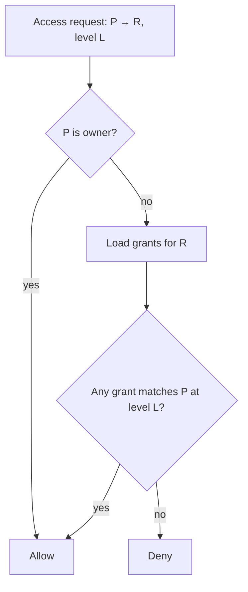

# Resource Sharing

**Version:** 1.0.0
**Status:** Stable
**Layer:** concept

## Overview

A technology-agnostic model for fine-grained, per-resource access control across all shareable entities in the system. Any resource (knowledge collection, skill, tool, note, channel, file, prompt template) can be shared with specific users, named groups, or made publicly accessible via a single, uniform grant mechanism. This model is the single authority for "who may access what and how."

## Related Specifications

- [l1-security.md](l1-security.md) - Secret isolation, egress gate, sandbox — orthogonal layers below resource sharing.
- [l1-groups.md](l1-groups.md) - Groups are a principal type resolved by the sharing model.
- [l1-extensions.md](l1-extensions.md) - Skills and tools are shareable resources governed by this model.
- [l1-knowledge-base.md](l1-knowledge-base.md) - Knowledge collections carry access grants.
- [l1-notes.md](l1-notes.md) - Notes carry access grants.
- [l1-file-management.md](l1-file-management.md) - Files carry access grants.
- [l2-resource-sharing.md](l2-resource-sharing.md) - Concrete implementation of the grant table.

## 1. Motivation

Multiple subsystems — knowledge collections, skills, tools, channels, notes, files — each need controlled sharing. Without a unified model, each subsystem invents its own scheme, duplicating logic and creating inconsistent behaviour at every security boundary. A single grant primitive, applied uniformly, means one enforcement path, one audit log, and one UI surface to reason about.

## 2. Constraints & Assumptions

- The sharing model governs *access to resources*, not authority over the system (admin roles, agent autonomy, egress gates) — those are handled by `l1-security.md` and `l1-orchestration.md`.
- Sessions and memory entries are always owner-private; they are NOT shareable resources under this model.
- Group resolution (group membership → member user IDs) is handled by the group subsystem; the sharing model treats groups as opaque principal IDs.
- The model does not define UI affordances — those belong to the respective resource's L2 spec.

## 3. Core Invariants

Rules every Layer 2 implementation MUST NOT violate:

- **RS-1 (Uniform grant primitive):** sharing of any resource type is expressed as a grant triple `(principal, resource, permission)`; no resource type has a bespoke sharing scheme.
- **RS-2 (Principal types):** valid principals are: individual user, named group, and the public wildcard. A public wildcard grant makes the resource accessible without authentication; a named user or group grant requires identity resolution.
- **RS-3 (Permission levels):** the model defines exactly two permission levels — `read` (observe/use) and `write` (modify/manage). `write` implies `read`. Owner always holds both.
- **RS-4 (Default private):** a resource with no grants is private to its owner; it is invisible to all other principals.
- **RS-5 (Owner invariant):** the owner's `read+write` is immutable and cannot be revoked by any grant operation, including self-modification.
- **RS-6 (Additive grants):** grants are additive; granting `read` to a group does not affect any individual user's separate write grant on the same resource.
- **RS-7 (Audit trail):** every grant creation and revocation is an append-only audit event; no silent grant mutation.
- **RS-8 (Applicable scope):** the model applies to: knowledge collections, skills, tools, notes, channels, files, and prompt templates. It does NOT apply to sessions, memories, system configuration, or agent-internal state.

> L2 specs cannot reach RFC status until all invariants here are addressed in their "Invariant Compliance" section.

## 4. Detailed Design

### 4.1 Grant Structure

A grant is a relationship between a principal and a resource at a given permission level:

```text
Grant {
  resource_type : ResourceKind   // "knowledge" | "skill" | "tool" | "note"
                                 // | "channel" | "file" | "prompt"
  resource_id   : ResourceId
  principal_type: "user" | "group" | "public"
  principal_id  : UserId | GroupId | "*"  // "*" for public wildcard
  permission    : "read" | "write"
}
```

### 4.2 Access Resolution

To determine whether principal P may perform action A on resource R:

1. Retrieve all grants where `resource_type = type(R)` and `resource_id = id(R)`.
2. Check if any grant matches P (user match: `principal_id = P.user_id`; group match: P is a member of `principal_id`; public match: `principal_type = "public"`).
3. If the matched grant's `permission` satisfies the required level (`write` satisfies both; `read` satisfies `read` only) → **allow**.
4. If P is the owner of R → **allow** unconditionally (RS-5).
5. Otherwise → **deny**.



### 4.3 Public vs. Authenticated Access

| Grant | Effect |
| --- | --- |
| None | Private — owner only. |
| `(public, *, read)` | Readable by anyone, including unauthenticated callers. |
| `(public, *, write)` | Writable by anyone — reserved for specific scenarios (e.g., community upload channels). |
| `(group, G, read)` | Readable by all members of group G. |
| `(user, U, write)` | User U can edit; implies read. |

### 4.4 Applicable Resources

| Resource | Notes |
| --- | --- |
| knowledge collection | Read = query/retrieve; write = add/remove documents. |
| skill | Read = invoke; write = edit content. |
| tool | Read = invoke; write = edit code/specs. |
| note | Read = view; write = edit. |
| channel | Read = receive messages; write = post messages. |
| file | Read = download; write = replace/delete. |
| prompt template | Read = use in completion; write = edit text. |

### 4.5 Lifecycle

- **Grant creation:** owner or admin may add grants at any time.
- **Grant revocation:** owner or admin may remove grants; affected principals lose access immediately.
- **Resource deletion:** all grants for a deleted resource are removed atomically with the resource.
- **Owner transfer:** not supported in the base model; ownership is immutable after creation.

## 5. Implementation Notes

1. Implement the grant table (RS-1) before any resource-sharing UI or agent logic depends on it.
2. Index by `(resource_type, resource_id)` for efficient per-resource lookup.
3. Group resolution may be cached for performance; cache invalidation must be triggered on membership change.

## 7. Drawbacks & Alternatives

- **Role-based model (RBAC):** roles are coarser-grained and harder to map to per-resource sharing. The grant model is a capability/ACL approach that scales better to user-generated resources.
- **Embedded access fields per resource:** embedding an `access_control` JSON blob in each resource avoids a join but makes cross-resource queries (e.g., "all resources user U can read") expensive and inconsistent. The separate grant table wins on consistency and queryability.

## Canonical References

| Alias | Path | Purpose |
| --- | --- | --- |
| `[IMPL]` | `.design/main/specifications/l2-resource-sharing.md` | Concrete implementation: table schema, query patterns, Rust types. |
