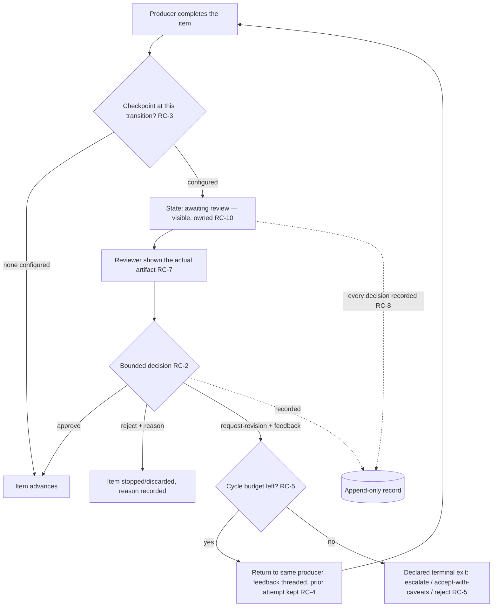

# Review Checkpoint

**Version:** 1.0.0
**Status:** Stable
**Layer:** concept

## Overview

A declared point in a work item's lifecycle where progress **halts and the system asks a human for a bounded decision** — approve, request revision, or reject — before the item advances.

("Checkpoint" here is a *review station* in a work item's life, not a state snapshot for recovery — those are separate concerns owned elsewhere.)

Its defining move, and the one that distinguishes it from every neighbouring control, is what **request-revision** does: the item returns to the *same producer* that made it, carrying the reviewer's feedback threaded into that producer's next context, and the producer revises the *same item in place*. The work is not discarded, not restarted from scratch, and not silently handed to someone else — because the whole point of a revision is to keep the context that makes it targeted.

Three neighbours share the border and none of them is this. Out-of-band intervention is *unsolicited* — the human acts and the system detects it; a review checkpoint is *solicited* — the system pauses and requests the decision. Iterative refinement's grader is *automated and rubric-driven*; a review checkpoint's grader is a *human* whose signal is *free-form feedback*. Action gating gates an *effect* by its *consequence tier* with a permit/deny verdict; a review checkpoint gates a produced *work item's progression* and its verdict includes a *revise-with-feedback* arm the effect gate has no notion of.

## Related Specifications

- [l1-human-intervention.md](l1-human-intervention.md) - The *out-of-band, unsolicited* sibling: there the human acts unasked and the system detects the change (HI-2); here the system stops and asks. In-band and out-of-band are complementary halves of human steering.
- [l1-iterative-refinement.md](l1-iterative-refinement.md) - The *automated-grader* sibling; a review checkpoint is the human-grader case where request-revision is the continue-verdict and the reviewer's free-form feedback is the actionable signal (IR-10), bounded and frozen-criteria as IR-5/IR-6.
- [l1-action-gating.md](l1-action-gating.md) - Consequence-tier friction on an *effect*; RC-6 defers to it for *which* terminal step is checkpointed by default, but a review's verdict set (approve/revise/reject) is richer than permit/deny.
- [l1-completion-verification.md](l1-completion-verification.md) - Evidence over report; RC-7 applies the same rule to a review — the reviewer sees the artifact, never the producer's claim about it.
- [l1-office-model.md](l1-office-model.md) - HITL consent (OFF-6) and the office in which reviews are configured; a checkpoint is one concrete HITL mechanism.
- [l1-security.md](l1-security.md) - Authority the agent cannot rewrite (SEC-10); a producer can neither remove the review of its own work nor self-approve (RC-3).
- [l1-work-liveness.md](l1-work-liveness.md) - An item held for review is owned and has a next-move path; a forgotten pending review is a liveness defect.
- [l1-operational-ledger.md](l1-operational-ledger.md) - The append-only record every review decision is written to (RC-8).
- [../../nodus/specifications/l1-nodus-dialog.md](../../nodus/specifications/l1-nodus-dialog.md) - The workflow-side realization: the solicited pause is the ASK/CONFIRM dialog seam over Status::Paused (NL-12), and the revise loop is the grader-gated `~UNTIL +grade` with feedback threading (NL-14) — a human reviewer is the grader.

## 1. Motivation

Autonomous work needs points where a human can say "not yet" — but *how* those points behave decides whether they help or get switched off. The naive implementation is a boolean "needs approval" that pauses and waits for a thumbs-up. It fails in ways that are individually small and collectively fatal to the whole idea of review.

**A thumbs-up/thumbs-down gate throws away the reason.** Real review rarely yields "yes" or "no"; it yields "yes, but change this". A gate that can only approve-or-reject forces that into a rejection, and a rejection with no channel for the "but change this" means the producer either starts over blind or the human gives up and approves substandard work to keep things moving. The information that makes a revision *targeted* — what specifically was wrong — is exactly what a binary gate discards.

**A revision that loses its context is a restart.** Even when feedback is captured, if request-revision discards the prior attempt, or reassigns to a fresh producer, or drops the work back onto an empty desk, the revision re-does work that was fine and re-discovers problems that were already understood. The producer that made the thing holds the context to fix it; sending the fix anywhere else, or with the prior attempt erased, is throwing that context away and calling it a fresh start.

**A review the producer controls is not a review.** If the agent doing the work can decide whether its own work is reviewed, or approve its own output, the checkpoint is decorative — the one actor with the strongest incentive to pass is the one holding the gate. Whether a checkpoint exists, and who may clear it, has to be set by someone other than the producer, or it protects nothing.

**A review of a claim is not a review of the work.** If the reviewer is shown the producer's summary — "implemented the feature, all tests pass" — rather than the actual artifact, they approve a description. The description and the artifact can differ, and the difference is precisely the silent-incompleteness failure a review exists to catch. Showing the reviewer a self-report reintroduces the failure at the one moment it was supposed to be caught.

And two failures that make reviews get disabled wholesale rather than fixed:

**A review nobody knows is pending never happens.** If an item awaiting review looks the same as one in progress, the decision is simply never made — the item sits, invisible, until someone stumbles on it. A pending review has to announce itself, to a named someone, or it is a silent stall.

**A review that can loop forever is a way to never ship.** Revise → review → revise with no bound is not diligence; it is a treadmill, and the honest response to a treadmill is to stop getting on it. A checkpoint needs a bounded number of cycles and a declared exit when they run out.

The design that survives contact with real use is the opposite of the naive one on every point: a bounded decision set that *includes* a revise-with-feedback arm, revision that returns to the producer with its context intact, control held by someone other than the producer, the actual artifact shown, a visible pending state, and a bounded loop with an honest exit.

## 2. Constraints & Assumptions

- A review checkpoint is **local-first**: the pause, the decision, and the feedback are recorded on-device; nothing here egresses.
- The checkpoint governs a *work item's progression through its lifecycle*, not a single low-level effect (that is action gating) and not the correctness of a factual claim (that is claim verification).
- The reviewer is a **human principal**; an automated reviewer is iterative refinement's grader, a different and complementary mechanism this spec explicitly is not.
- A "producer" is whatever actor made the item under review — an agent, a role, a sub-team; request-revision returns to that identity.
- Checkpoints are **opt-in per transition and scope**; a system with none configured runs fully autonomously, and that is a valid configuration.

## 3. Core Invariants

Rules every Layer 2 implementation MUST NOT violate:

- **RC-1 (Solicited and in-band — the system halts and asks):** a review checkpoint is a declared lifecycle point where the item's progress **halts** and a human is **explicitly asked** for a decision. This is the *solicited, in-band* complement to out-of-band intervention: there the human acts unasked and the system detects it (HI), here the system pauses and requests the decision. An item that continues to advance while "awaiting review" has not been checkpointed — the halt is the mechanism, not a label.
- **RC-2 (A bounded decision set, including a revise arm):** the review yields exactly one decision from a **closed set** with at minimum **approve** (the item advances), **request-revision** (the item returns to its producer, RC-4), and **reject** (the item is stopped or discarded with a recorded reason). Each decision has a defined lifecycle effect; a review that can only approve-or-reject is forbidden, because it forces "yes, but change this" — the common real outcome — into a rejection that discards the reason.
- **RC-3 (The producer neither configures nor clears the review of its own work):** whether a checkpoint exists at a transition, and who may decide it, is set by a **human authority at a declared scope** (this item, this producing role, this class of output) — never by the producer for its own output. A producing agent cannot remove the review of its work and cannot self-approve. The actor with the strongest incentive to pass MUST NOT hold the gate. (Composes SEC-10 authority-not-self-authored.)
- **RC-4 (Request-revision returns to the producer, feedback threaded, prior attempt preserved):** a request-revision decision returns the item to the **same producer that made it**, threads the reviewer's feedback into that producer's next context as a **first-class revision instruction**, and **preserves the prior attempt**. The producer revises the *same item in place* (composing IR-1). Discarding the work, restarting from scratch, and reassigning to a different producer by default are each forbidden — they throw away the context that makes the revision targeted and re-do work that was already right.
- **RC-5 (Bounded cycles with an honest exit):** the revise↔review loop declares a **maximum number of cycles**, and on exhaustion the item moves to a **declared terminal state** — escalate to a higher authority, accept-with-recorded-caveats, or reject — never an unbounded ping-pong. A checkpoint that can loop forever is a way to never ship, and its honest exit is what keeps a demanding reviewer from becoming an infinite one. (Composes IR-5 / the loop-governance ceiling.) A review left **undecided** — the reviewer never responds — is not a silent pass and not a silent block: the pending state persists and is escalated per its declared timeout policy, so an absent decision is surfaced as an *outstanding* decision, never resolved by default in either direction. (The absence-is-not-good-news discipline applied to the reviewer's own silence.)
- **RC-6 (The terminal, expensive, or irreversible step is checkpointed by default; auto-approve is an explicit opt-out):** the **most consequential** produced transition — the one that is expensive, externally visible, or hard to undo (a final delivery, a costly generation, an outward send) — carries a review checkpoint **by default**, and removing it ("auto-approve") is an **explicit, recorded** decision, never the default and never silent. This applies the risk-proportional discipline (action gating) to the *produce-the-final-artifact* transition specifically: the default bias is friction where the cost of a wrong output is highest, and the removal of that friction is a visible choice someone made.
- **RC-7 (The reviewer sees the artifact, not a claim about it):** a review presents the reviewer with the **actual produced work**, or a faithful and complete rendering of it — never the producer's summary or self-report of it. Approving on a claim rather than the artifact reproduces the silent-incompleteness failure at the exact moment review exists to catch it: the reviewer signs off on a description while the artifact says something else. (Composes completion-verification: evidence over report.)
- **RC-8 (Every review is attributed and recorded):** each review records **who** decided, **what** they decided, **what feedback** they gave, **which attempt** they reviewed, and **when** — written to the append-only record so a later reader can reconstruct why an item advanced, revised, or stopped. An anonymous or unrecorded approval is forbidden: it removes the accountability the checkpoint exists to create.
- **RC-9 (A held item pauses itself and its dependents, never the whole office):** an item held at a review checkpoint pauses **that item and the work that depends on it** (composing dependent re-validation), and MUST NOT stall independent items that do not depend on it. A review that freezes everything trains the office to disable reviews to keep moving — the checkpoint must be a hold on one thread, not the loom.
- **RC-10 (Pending review is a distinct, visible, owned state):** an item awaiting review is in a **distinct state, visibly attributed to the reviewer who owes the decision** — never indistinguishable from *in progress* or *done*, and never ownerless. A pending review nobody can see is a decision that never gets made and an item that silently stalls; the state announces itself, to a named someone, so the review actually happens. (The absence-is-not-good-news discipline at the review grain; a held item retains a next-move path per work-liveness.)

> L2 specs cannot reach RFC status until all invariants here are addressed in their "Invariant Compliance" section.

## 4. Detailed Design

### 4.1 The review lifecycle

The loop between `REVISE` and the review is the whole concept. Everything else — the halt, the visible state, the recorded decision — exists to make that loop safe: bounded so it terminates, feedback-threaded so it converges, producer-returning so it stays cheap.

### 4.2 What each decision does (RC-2)

| Decision | Lifecycle effect | Carries |
| --- | --- | --- |
| **approve** | Item advances to the next state | (nothing required) |
| **request-revision** | Item returns to its producer (RC-4) | Feedback, threaded as a revision instruction |
| **reject** | Item stopped or discarded | A recorded reason |
| *(no response)* | Item stays pending; escalated per timeout policy (RC-5) | — never a silent pass or silent block |

The middle row is the one a binary gate cannot express, and it is the most common real outcome. A design that omits it has not simplified review; it has removed the part of review that does the work. The final row is the one a naive gate gets *wrong*: an unanswered review must resolve to neither approve nor reject on its own — silence is an outstanding decision, not a verdict.

### 4.3 Three controls at three lifecycle points, three scopes

A single work item can pass more than one checkpoint, each configured independently and at a different scope:

| Checkpoint | Fires at | Configured at scope | Default |
| --- | --- | --- | --- |
| Proposal review | A task is proposed, before work begins | The task / the plan | Off unless declared |
| Completion review | A producer marks its work complete | The **producing role** (this role's output is reviewed) | Per configuration |
| Final-output review | The terminal, expensive, or irreversible delivery | The **output class / team** | **On** (RC-6) — auto-approve is the opt-out |

The scopes matter: "review this role's output" attaches to the role and applies to every item it produces, including items assigned after the rule was set — the same class-binding discipline that keeps a newly-created producer from being born unreviewed. Only the final-output review defaults *on*, because it is the transition where a wrong result is most expensive.

### 4.4 Why revision returns to the producer (RC-4)

| Request-revision returns to… | Consequence |
| --- | --- |
| The **same producer**, prior attempt kept, feedback threaded | The revision is targeted; only what the feedback names is reworked |
| A **fresh producer** / empty context | Re-does the work that was fine, re-discovers understood problems |
| **Discarded**, restart from scratch | The prior attempt's context — the most valuable thing in the loop — is thrown away |

The producer that made the artifact is holding the reasoning that produced it. Threading the feedback into *that* context is what turns a revision into an edit rather than a rewrite, and it is the single decision that makes the review loop cheap enough to run.

### 4.5 Boundary with neighbouring layers

| Concern | Owner |
| --- | --- |
| The system pauses and *asks* a human at a lifecycle point; revise returns to producer | **This spec** |
| The human acts *unasked*, out of band; the system detects it | Human intervention |
| An *automated* grader decides continuation against a *rubric* | Iterative refinement (this is its human-grader, free-form-feedback case) |
| Whether a single *effect* is permitted, by consequence tier | Action gating (RC-6 defers to it for which terminal step defaults to friction) |
| Clarifying an ambiguous brief before work starts | Office model (OFF-6) — a different question than reviewing produced work |
| The pause/resume + grader-loop mechanics in a workflow | Nodus dialog (NL-12) + grader-gated loop (NL-14) |

## 5. Drawbacks & Alternatives

- **Reviews add latency and demand human attention.** Bounded by RC-9 (a held item does not freeze unrelated work) and by RC-3's scoping (checkpoints are placed deliberately, not everywhere) — the same friction-fatigue discipline action gating names: over-reviewing trains the reviewer to rubber-stamp, which is worse than not reviewing.
- **A demanding reviewer could revise forever.** Bounded by RC-5: a maximum cycle count and a declared exit. The exit is what makes an infinite reviewer a finite process.
- **Auto-approve can be turned on to skip friction.** Accepted and made visible by RC-6: removing the default final-output review is an explicit, recorded choice, so the friction was removed by a decision someone can be held to, not silently.
- **Alternative — a boolean approve/reject gate.** Rejected by RC-2: it discards the "yes, but change this" that is the common real outcome, forcing substandard work through or blind restarts.
- **Alternative — request-revision reassigns or restarts.** Rejected by RC-4: it throws away the producer's context, which is the one thing that makes a revision cheaper than a rewrite.
- **Alternative — let the producer configure its own reviews.** Rejected by RC-3: the actor with the strongest incentive to pass would hold the gate.
- **Alternative — review the producer's summary.** Rejected by RC-7: it reintroduces silent incompleteness at the moment review exists to prevent it.
- **Alternative — fold into action gating.** Rejected: action gating permits or denies an *effect* by consequence tier; it has no revise-with-feedback arm and no notion of a *work item's* lifecycle. The two compose (RC-6) but are not the same control.

## Canonical References

| Alias | Path | Purpose |
| --- | --- | --- |
| `[HI]` | `.design/main/specifications/l1-human-intervention.md` | The out-of-band sibling this in-band checkpoint complements. |
| `[REFINE]` | `.design/main/specifications/l1-iterative-refinement.md` | The automated-grader sibling; this is its human-grader, free-form-feedback case (IR-10). |
| `[GATING]` | `.design/main/specifications/l1-action-gating.md` | Consequence-tier effect gating RC-6 defers to for the default terminal checkpoint. |
| `[DIALOG]` | `.design/nodus/specifications/l1-nodus-dialog.md` | Workflow realization: solicited pause (NL-12) + grader-gated revise loop (NL-14). |

## Document History

| Version | Date | Author | Notes |
| --- | --- | --- | --- |
| 1.0.0 | 2026-07-23 | Core Team | Initial spec — the solicited, in-band human review checkpoint: work halts and the system asks a human for a bounded decision at a declared lifecycle point (RC-1), the decision drawn from a closed set that *includes a revise arm* since approve-or-reject discards the common "yes, but change this" outcome (RC-2), the producer neither configuring nor clearing the review of its own work (RC-3), request-revision returning to the *same producer* with feedback threaded and the prior attempt preserved rather than discarded, restarted, or reassigned — because that context is what makes a revision an edit not a rewrite (RC-4), the revise↔review loop bounded with a declared honest exit so a demanding reviewer is finite (RC-5), the terminal/expensive/irreversible step checkpointed *by default* with auto-approve an explicit recorded opt-out (RC-6), the reviewer shown the actual artifact not a claim about it (RC-7), every review attributed and recorded (RC-8), a held item pausing itself and its dependents but never the whole office (RC-9), and pending review a distinct, visible, owned state so the decision actually gets made (RC-10). The in-band solicited complement to out-of-band intervention (HI), the human-grader case of iterative refinement (IR), and distinct from consequence-tier effect gating (AG). Concept-only. |
