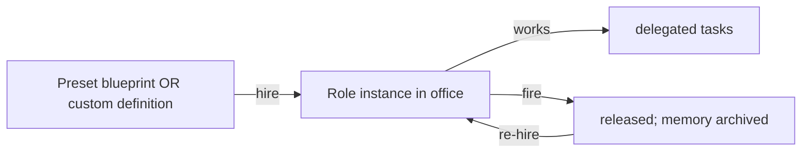

# Roles

**Version:** 1.1.0
**Status:** Stable
**Layer:** concept

## Overview

The technology-agnostic model of the office's workforce: a **role** is a defined specialty (a persona plus capabilities) that the office staffs with. The system ships read-only **preset** roles and allows **custom** roles. Hiring instantiates a role into an office; releasing it archives its memory. Staffing is driven by the manager, adaptively, as the project's needs change.

## Related Specifications

- [l1-office-model.md](l1-office-model.md) - Role specialization and adaptive staffing (OFF-3/4); client does not manage staffing (OFF-5).
- [l1-workspace-lifecycle.md](l1-workspace-lifecycle.md) - Manager hires/releases over the project's life (WSL-6).
- [l1-storage-model.md](l1-storage-model.md) - Preset (catalog) vs instance, and scope lifecycle (STO-3/5).
- [l1-orchestration.md](l1-orchestration.md) - Hired roles receive delegated work and a place in the hierarchy.
- [l2-role-catalog.md](l2-role-catalog.md) - Concrete catalog, preset list, definition format, hire/fire, commands.

## 1. Motivation

An office gets work done through specialists. Shipping a curated set of preset roles makes the office productive immediately and predictably, while custom roles keep it open-ended for unusual projects. Treating hire/fire as cheap, non-destructive operations lets the office right-size itself without losing what a role learned.

## 2. Constraints & Assumptions

- Preset roles are part of the shipped program and are not edited in place.
- A role's accumulated memory is valuable and must survive a release.
- The client does not manage staffing; the manager does.
- Custom roles must use the same contract as presets so the office treats them uniformly.

## 3. Core Invariants (Layer 1 only)

Rules every Layer 2 implementation MUST NOT violate:

- **ROL-1 (Role = specialty):** a role is a defined specialty with a persona and capabilities; working agents are instances of roles.
- **ROL-2 (Preset + custom):** the system provides read-only **preset** roles and supports user/manager-defined **custom** roles. Presets update with the program; customs live in mutable state.
- **ROL-3 (Hire = instantiate):** hiring creates a mutable role instance in an office (from a preset blueprint or a custom definition); the instance owns its own memory and skills (consistent with the employee memory scope, STO-3).
- **ROL-4 (Fire = release, non-destructive):** releasing a role removes it from the active office but archives its memory; re-hiring can restore it. Knowledge is never silently destroyed (consistent with MEM-5).
- **ROL-5 (Manager-driven staffing):** the manager hires and releases roles adaptively as needs change (OFF-4 / WSL-6); the client is not required to manage staffing (OFF-5).
- **ROL-6 (Composition contract):** a role is composed of a persona, configuration (model/limits/budget), skills, and presentation; this composition is the role's contract, identical for presets and customs.
- **ROL-7 (Catalog integrity):** preset roles are authoritative blueprints in the immutable program tier; customizing a preset produces a custom copy rather than editing the preset (STO-3).
- **ROL-8 (Hierarchy placement):** a hired role has a place in the office hierarchy (a reporting line), consistent with the adaptive topology (ORC-2).
- **ROL-9 (Anti-sprawl justification gate):** [ADDED v1.1.0] creating a **custom** role (rather than reusing or extending a preset) requires the role to justify itself on at least **two independent** axes — for example distinct **expertise** (a specialty no existing role covers), a **parallelism** benefit (it enables work to run concurrently), **context isolation** (it keeps an unrelated concern out of another role's context), or genuine **reuse** (it will be needed repeatedly). One weak reason is insufficient; when the gate is not cleared, reusing or extending an existing role is preferred over minting a new one. This keeps the workforce from fragmenting into many thin, overlapping specialists, and is the role-level application of the harness right-sizing discipline (`l1-harness-composition.md` HC-5); a role whose justifying gap later closes is pruned under the same discipline (HC-3, non-destructively per ROL-4).

> L2 specs cannot reach RFC status until all invariants here are addressed in their "Invariant Compliance" section.

## 4. Detailed Design

### 4.1 Role composition

| Part | Purpose |
| --- | --- |
| persona | who the role is and how it works (its rules) |
| configuration | model, limits, budget |
| skills | capabilities the role can apply (and learns) |
| presentation | persona/appearance variants (skins) |

### 4.2 Preset families (illustrative)

| Family | Examples |
| --- | --- |
| Engineering | architect, backend-engineer, frontend-engineer, api-designer, sql-expert |
| Quality | code-reviewer, test-writer, debugger, refactorer, performance-optimizer, security-auditor, accessibility-auditor |
| Ops & docs | devops-engineer, incident-responder, doc-writer, data-analyst, prompt-engineer |
| Memory | archivist |
| Business | finance, hr, marketing, support, game-dev |

Custom roles extend this set per project need (ROL-2).

### 4.3 Hire / fire lifecycle

Hiring is instantiation (ROL-3); firing is a non-destructive release (ROL-4); the manager decides both (ROL-5).

## 5. Drawbacks & Alternatives

- **Catalog curation cost:** maintaining quality presets takes effort; offset by their reuse across all offices.
- **Custom-role sprawl:** many ad-hoc roles can fragment the workforce — governed by the ROL-9 anti-sprawl justification gate (a custom role must justify itself on ≥2 independent axes; otherwise reuse/extend a preset).
- **Alternative — preset-only:** rejected; too rigid for unusual projects. Alternative — fully generated roles: deferred as a later enhancement on top of presets.

## Canonical References

| Alias | Path | Purpose |
| --- | --- | --- |
| `[OFFICE]` | `.design/main/specifications/l1-office-model.md` | Specialization and staffing invariants |
| `[STORAGE]` | `.design/main/specifications/l1-storage-model.md` | Preset/instance and scope lifecycle |
| `[CATALOG]` | `.design/main/specifications/l2-role-catalog.md` | Concrete catalog and hire/fire |
| `[COMPOSITION]` | `.design/main/specifications/l1-harness-composition.md` | Right-sizing discipline ROL-9 applies at the role level (HC-5) |

## Document History

| Version | Date | Notes |
| --- | --- | --- |
| 1.1.0 | 2026-07-02 | ROL-9 added — anti-sprawl justification gate: a custom role must justify itself on ≥2 independent axes (distinct expertise / parallelism / context isolation / reuse); one weak reason is insufficient, reuse-or-extend-a-preset preferred otherwise. Resolves the long-standing "custom-role sprawl" TBD in Drawbacks; the role-level application of l1-harness-composition HC-5 (a role whose justifying gap later closes is pruned non-destructively per ROL-4 + HC-3). Additive — L1 stays Stable; l2-role-catalog carries ROL-9 as a pending Invariant-Compliance obligation reconciled at magic.task. |
| 1.0.0 | 2026-06-24 | Initial stable spec — roles as specialties (ROL-1), preset + custom (ROL-2), hire=instantiate (ROL-3), fire=non-destructive release (ROL-4), manager-driven staffing (ROL-5), composition contract (ROL-6), catalog integrity (ROL-7), hierarchy placement (ROL-8). |
