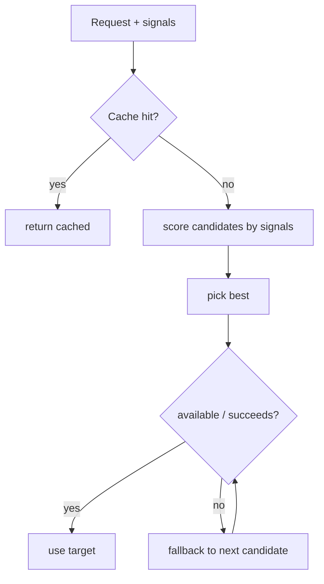

# Smart Routing

**Version:** 1.2.0
**Status:** Stable
**Layer:** concept

## Overview

The technology-agnostic model of Cronus's "smart routers" — one selection pattern applied to several dispatch problems. Given a request and a set of signals, a router chooses the best target from candidates, with graceful fallback and optional short-circuit caching. The pattern governs model selection (which LLM), and context routing (which memory scope, which rules, which session).

## Related Specifications

- [l1-memory-model.md](l1-memory-model.md) - Memory scope resolution (MEM-2) is a routing application.
- [l1-orchestration.md](l1-orchestration.md) - Routers serve the orchestrator and agents on the hot path.
- [l1-architecture.md](l1-architecture.md) - Hub-and-spoke and security (INV-7) constrain model routing.
- [l2-model-router.md](l2-model-router.md) - Model selection (local-first, cost/difficulty, fallback, cache).
- [l2-context-router.md](l2-context-router.md) - Memory, rules, and session routing.
- [l1-cache-stable-context.md](l1-cache-stable-context.md) - Cache-warmth is a routing signal (RTG-10): a continuing session prefers its prior lane so its cached prefix stays valid; lane choice must not void a credential scope (CSC-9).

## 1. Motivation

Cronus repeatedly faces "pick the best option from several, cheaply and safely": which model answers a prompt, which memories to recall, which rules apply, which session to continue. Solving this once as a router pattern — multi-signal selection plus fallback plus caching — keeps these decisions consistent, configurable, and cost-aware instead of hardcoded.

## 2. Constraints & Assumptions

- A router decides quickly on the hot path of agent turns.
- Routing policy is configuration, tunable without code changes.
- A router degrades gracefully when its first choice is unavailable.
- Model routing must respect privacy and cost (a personal-server product).

## 3. Core Invariants (Layer 1 only)

Rules every Layer 2 implementation MUST NOT violate:

- **RTG-1 (Multi-signal selection):** a router selects a target from candidates using more than one signal; it MUST NOT rely on a single hardcoded choice.
- **RTG-2 (Graceful fallback):** every router has an ordered fallback so an unavailable/failed primary degrades to the next candidate rather than failing outright.
- **RTG-3 (Short-circuit caching):** a router MAY short-circuit when an equivalent prior result applies (e.g. a semantic cache hit), avoiding redundant work.
- **RTG-4 (Scope resolution most-specific-first):** for scoped routing (memory, rules), resolution is most-specific-first (consistent with MEM-2); a more specific candidate overrides a general one.
- **RTG-5 (Configurable policy):** routing weights, thresholds, and order are configurable with sensible defaults; behavior changes by config, not code.
- **RTG-6 (Privacy-preserving model routing):** the model router prefers on-device execution when capable and falls back to cloud; routing of client data respects security (INV-7).
- **RTG-7 (Bounded & traceable):** routing is bounded by budgets/limits and records which target was chosen and why.
- **RTG-8 (Lifecycle routing):** session routing decides continue-vs-new and retires stale sessions (consistent with MEM-5).
- **RTG-9 (Function-scoped model roles):** internal LLM chores — conversation titling, trigger triage, task decomposition, profile description, history summarization/compression, memory curation, vision interpretation, approval checks, and similar housekeeping — resolve their serving model through dedicated, independently-configurable *auxiliary roles*, not the user-facing model route. Each role binds to a model by configurable policy (RTG-5) with an economical default and an ordered fallback (RTG-2), and honors privacy routing (RTG-6). A housekeeping function MUST NOT consume the premium user-facing model by default. Auxiliary-role resolution is traceable (RTG-7) like any routing decision.

- **RTG-10 (Credential-lane routing — cache-warm, scope-safe):** [ADDED v1.2.0] when the same model is reachable through more than one **credential lane** (a metered API key vs a subscription or borrowed-session credential), the lane is a first-class routing signal, not an afterthought. Two rules bind lane selection: (a) **cache warmth** — a continuing session prefers the lane/upstream it used before, because a lane switch abandons the provider-side cached prefix and forfeits its discount (composes with `l1-cache-stable-context.md`); (b) **scope safety** — lane selection MUST NOT leak or invalidate the chosen credential's scope: no injecting lane-revealing headers, no auto-actions (e.g. auto-inserting provider cache markers) that could void a subscription's terms. When a cheaper lane is available but switching would bust a warm cache, the router weighs the cache-read saving against the per-token delta rather than switching blindly, and records the decision (RTG-7).

> L2 specs cannot reach RFC status until all invariants here are addressed in their "Invariant Compliance" section.

## 4. Detailed Design

### 4.1 The router pattern



### 4.2 Routing applications

| Router | Chooses | Key signals |
| --- | --- | --- |
| model | which LLM answers a user prompt | task difficulty, cost, token count, capability, latency, quota, local feasibility, credential lane + cache warmth (RTG-10) |
| auxiliary | which model serves an internal function (titling, triage, decomposition, profiling, summarization, curation, vision, approval) | function identity, cost, latency, capability, local feasibility |
| memory | which memories to recall / where to write | scope specificity, similarity, tags, utility |
| rules | which rules apply to a context | scope specificity (global/workspace/role) |
| session | continue vs new; retire stale | recency, topic match, staleness |

### 4.3 Defaults

Sensible defaults ship and are overridable: model routing is local-first with cloud fallback (RTG-6); memory/rules resolve most-specific-first (RTG-4); sessions continue when topically recent, otherwise new, retiring stale ones (RTG-8). Auxiliary roles (RTG-9) default to economical local-or-cheap tiers and fall back per RTG-2, so background chores never preempt the user-facing model's budget.

### 4.4 Function-scoped model roles

The user-facing model route (§4.2 `model`) answers the human. But an office runs a steady stream of *internal* LLM chores that the user never sees — and that should not pay the premium model's price or latency. Each such function is an **auxiliary role** that resolves its own model binding independently of the conversational route:

```plaintext
[REFERENCE]

Auxiliary role        Typical default tier        Why separate
--------------------  --------------------------  ----------------------------------------
titling               cheapest / fast             a chat title is low-stakes, high-volume
triage                cheap classifier             gate before spending the premium model
decomposition         standard                     plan-shaping needs structure, not depth
profiling             cheap                        background user/profile description
summarization /       cheap, long-context          compaction is frequent and bulk
  compression
curation              standard, long-timeout       periodic memory housekeeping
vision                vision-capable               capability constraint, not a tier choice
approval check        cheap classifier             a yes/no safety gate

Resolution per role:  configured binding (RTG-5) → economical default → fallback (RTG-2),
                      privacy-honoring (RTG-6), traceable (RTG-7).
```

Decoupling these roles keeps housekeeping cheap and the user-facing budget intact, lets a capability-bound role (vision) pick an appropriate model without affecting the chat route, and makes each chore's model independently tunable. A role left unconfigured resolves to its economical default rather than silently inheriting the premium conversational model.

- **Mis-routing risk:** a bad policy picks poorly; mitigated by traceability (RTG-7) and tunable config (RTG-5).
- **Cache staleness:** semantic cache can return outdated results. <!-- TBD: cache invalidation/TTL policy per router -->
- **Alternative — fixed choices:** rejected; loses cost/privacy optimization and graceful degradation.

## Canonical References

| Alias | Path | Purpose |
| --- | --- | --- |
| `[MEMORY]` | `.design/main/specifications/l1-memory-model.md` | Scope-resolution routing precedent |
| `[MODEL]` | `.design/main/specifications/l2-model-router.md` | Model selection realization |
| `[CONTEXT]` | `.design/main/specifications/l2-context-router.md` | Memory/rules/session routing realization |

## Document History

| Version | Date | Notes |
| --- | --- | --- |
| 1.0.0 | 2026-06-24 | Initial stable spec — router pattern (multi-signal selection + fallback + cache), RTG-1…RTG-8, model/memory/rules/session applications |
| 1.1.0 | 2026-06-25 | RTG-9 added — function-scoped model roles: internal LLM chores (titling, triage, decomposition, profiling, summarization/compression, curation, vision, approval) resolve through dedicated economical-by-default auxiliary bindings, never the premium user-facing route by default. `auxiliary` routing application added to §4.2; §4.3 default extended; §4.4 added. Additive invariant — the four L2 implementers (l2-model-router, l2-context-router, l2-agent-session, l2-model-error-recovery) carry RTG-9 as unaddressed pending a `magic.task` reconciliation; L1 remains Stable (no destabilization cascade). |
| 1.2.0 | 2026-07-02 | RTG-10 added — credential-lane routing: when one model is reachable via multiple credential lanes (metered API vs subscription/session), lane is a first-class signal bound by cache-warmth (a continuing session prefers its prior lane to keep the provider cached prefix valid) and scope-safety (lane choice never leaks or voids a credential scope; no auto cache-marker injection). `model` router signals extended in §4.2; composes with l1-cache-stable-context (CSC-9). Additive — L1 stays Stable; L2 model-router carries RTG-10 pending a magic.task reconciliation. |
