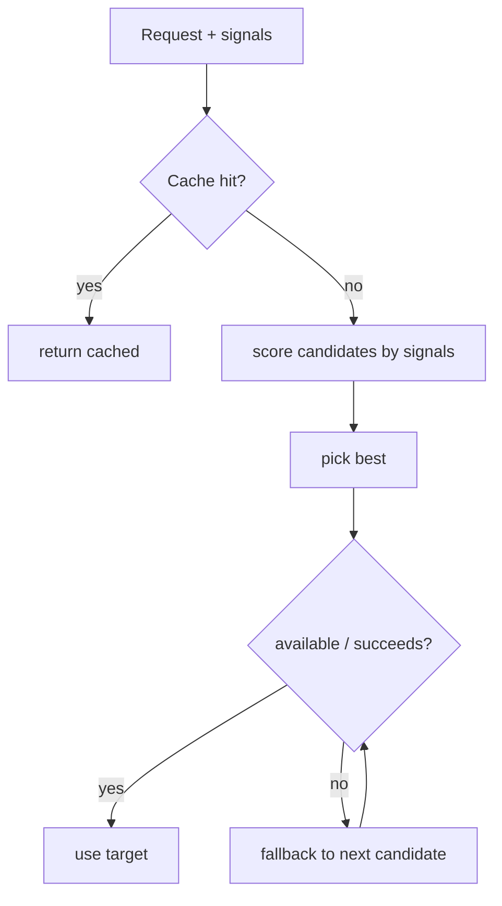

# Smart Routing

**Version:** 1.0.0
**Status:** Stable
**Layer:** concept

## Overview

The technology-agnostic model of Cronus's "smart routers" — one selection pattern applied to several dispatch problems. Given a request and a set of signals, a router chooses the best target from candidates, with graceful fallback and optional short-circuit caching. The pattern governs model selection (which LLM), and context routing (which memory scope, which rules, which session).

## Related Specifications

- [l1-memory-model.md](l1-memory-model.md) - Memory scope resolution (MEM-2) is a routing application.
- [l1-orchestration.md](l1-orchestration.md) - Routers serve the orchestrator and agents on the hot path.
- [l1-architecture.md](l1-architecture.md) - Hub-and-spoke and security (INV-7) constrain model routing.
- [l2-model-router.md](l2-model-router.md) - Model selection (local-first, cost/difficulty, fallback, cache).
- [l2-context-router.md](l2-context-router.md) - Memory, rules, and session routing.

## 1. Motivation

Cronus repeatedly faces "pick the best option from several, cheaply and safely": which model answers a prompt, which memories to recall, which rules apply, which session to continue. Solving this once as a router pattern — multi-signal selection plus fallback plus caching — keeps these decisions consistent, configurable, and cost-aware instead of hardcoded.

## 2. Constraints & Assumptions

- A router decides quickly on the hot path of agent turns.
- Routing policy is configuration, tunable without code changes.
- A router degrades gracefully when its first choice is unavailable.
- Model routing must respect privacy and cost (a personal-server product).

## 3. Core Invariants (Layer 1 only)

Rules every Layer 2 implementation MUST NOT violate:

- **RTG-1 (Multi-signal selection):** a router selects a target from candidates using more than one signal; it MUST NOT rely on a single hardcoded choice.
- **RTG-2 (Graceful fallback):** every router has an ordered fallback so an unavailable/failed primary degrades to the next candidate rather than failing outright.
- **RTG-3 (Short-circuit caching):** a router MAY short-circuit when an equivalent prior result applies (e.g. a semantic cache hit), avoiding redundant work.
- **RTG-4 (Scope resolution most-specific-first):** for scoped routing (memory, rules), resolution is most-specific-first (consistent with MEM-2); a more specific candidate overrides a general one.
- **RTG-5 (Configurable policy):** routing weights, thresholds, and order are configurable with sensible defaults; behavior changes by config, not code.
- **RTG-6 (Privacy-preserving model routing):** the model router prefers on-device execution when capable and falls back to cloud; routing of client data respects security (INV-7).
- **RTG-7 (Bounded & traceable):** routing is bounded by budgets/limits and records which target was chosen and why.
- **RTG-8 (Lifecycle routing):** session routing decides continue-vs-new and retires stale sessions (consistent with MEM-5).

> L2 specs cannot reach RFC status until all invariants here are addressed in their "Invariant Compliance" section.

## 4. Detailed Design

### 4.1 The router pattern

### 4.2 Routing applications

| Router | Chooses | Key signals |
| --- | --- | --- |
| model | which LLM answers a prompt | task difficulty, cost, token count, capability, latency, quota, local feasibility |
| memory | which memories to recall / where to write | scope specificity, similarity, tags, utility |
| rules | which rules apply to a context | scope specificity (global/workspace/role) |
| session | continue vs new; retire stale | recency, topic match, staleness |

### 4.3 Defaults

Sensible defaults ship and are overridable: model routing is local-first with cloud fallback (RTG-6); memory/rules resolve most-specific-first (RTG-4); sessions continue when topically recent, otherwise new, retiring stale ones (RTG-8).

## 5. Drawbacks & Alternatives

- **Mis-routing risk:** a bad policy picks poorly; mitigated by traceability (RTG-7) and tunable config (RTG-5).
- **Cache staleness:** semantic cache can return outdated results. <!-- TBD: cache invalidation/TTL policy per router -->
- **Alternative — fixed choices:** rejected; loses cost/privacy optimization and graceful degradation.

## Canonical References

| Alias | Path | Purpose |
| --- | --- | --- |
| `[MEMORY]` | `.design/main/specifications/l1-memory-model.md` | Scope-resolution routing precedent |
| `[MODEL]` | `.design/main/specifications/l2-model-router.md` | Model selection realization |
| `[CONTEXT]` | `.design/main/specifications/l2-context-router.md` | Memory/rules/session routing realization |
