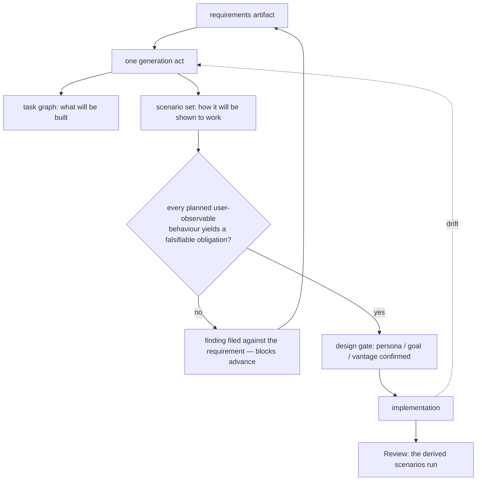

# Scenario Derivation

**Version:** 1.0.0
**Status:** Stable
**Layer:** concept

## Overview

When the office turns a requirement into a plan, it produces **two artifacts from one source
in one act**: the task graph that says what will be built, and the **usage-simulation
scenarios that say how it will be shown to work for a person**. The scenarios are not a
testing step scheduled for later. They are derived while the plan is being derived, from the
same requirements artifact, and the plan is judged partly by whether they could be written at
all.

The structural reason this cannot be a field on a task is short: **a per-unit verification
strategy cannot express a journey.** The task-graph contract already requires every unit to
declare how it will be verified, and a plan can satisfy that completely while nothing in it
exercises the product the way a person uses it — because every unit was verified in
isolation and the journey lives *between* the units. Decomposing a journey into per-unit
checks does not preserve it; it deletes it, and leaves behind a set of green checks that
prove each part works in a world where the other parts are absent.

The second reason is the one that pays for itself immediately: **derivation is a test of the
plan.** If no falsifiable obligation can be written for a planned piece of user-observable
behaviour, the requirement behind it is under-specified — and that is discovered at planning
time, when correcting it costs a sentence, rather than at review time, when it costs a
rebuild. This is the behavioural twin of the requirement checklist, which audits the
requirement prose and deliberately rules behaviour out of its own scope.

Applies to **every project the office builds**, not only to this one. A project delivered to
someone else ships with its scenario corpus in its own repository, and that corpus keeps
working long after the office has moved on.

## Related Specifications

- [l1-usage-simulation.md](l1-usage-simulation.md) — The instrument this spec schedules. USM-1…USM-12 define what a scenario *is* and how a run behaves; this defines *when it comes into existence and from what*. SD-4 strengthens USM-10 where a planning step exists; USM-10 stays the floor for behaviour that arrives without one.
- [l1-task-graph-model.md](l1-task-graph-model.md) — The co-product. TG-1's requirements-sourced generation is the same act; TG-3's per-unit verification strategy is the thing a journey **cannot** be folded into (§4.2); TG-9's drift-driven re-planning is what SD-6 rides on.
- [l1-requirement-checklists.md](l1-requirement-checklists.md) — The requirements-side twin. RQ audits whether the requirement prose is complete, clear and measurable and explicitly excludes behaviour; this audits whether the behaviour it promises can be shown, and reports a gap back at the requirement.
- [l1-acceptance-oracle.md](l1-acceptance-oracle.md) — AO-1: criteria precede the work and completion is judged against *that* set. Deriving scenarios at planning time is what makes AO-1 structurally true rather than aspirational.
- [l1-development-workflow.md](l1-development-workflow.md) — The five-stage pipeline. Derivation sits in Plan, the design gate (DW-2) is where the persona and goal are confirmed, and Review is where the derived set is run.
- [l1-quality-standards.md](l1-quality-standards.md) — QLY-6: one bar for every project the office produces and for the office's own codebase. Derivation is how that bar arrives before the code does.
- [l1-outcome-attributed-cost.md](l1-outcome-attributed-cost.md) — A derived set carries a run cost; SD-7 makes that cost part of the plan instead of a surprise at the gate.
- [l1-workspace-lifecycle.md](l1-workspace-lifecycle.md) · [l1-project-support.md](l1-project-support.md) — The office over a project's whole life. Scenarios derived at construction are what support later runs to tell a regression from a request.
- [l1-exploratory-planning.md](l1-exploratory-planning.md) — The stage *before* a requirements artifact exists. Derivation has nothing to read until exploration has closed enough fog to produce one.
- [l1-simulation.md](l1-simulation.md) — The other simulation: playing out a generated *mechanism* with effects suppressed. A derived scenario is not that, and the two remain separate contracts.

## 1. Motivation

**The plan already promises verification, and the promise has a hole in it.** Every unit in a
task graph must declare how it will be verified or it cannot be marked done. That is a strong
rule and it is not enough: it verifies units, and users do not use units. A plan can be
entirely compliant — every task carrying a sound, specific verification strategy — and still
contain nothing at all that answers *"can a person actually get this done?"*. The hole is not
a lapse in discipline; it is a consequence of where the field lives. A journey crosses units
by definition, so no single unit can own it.

**Verification written after the build describes the build.** A scenario authored once the
implementation exists is authored by someone who now knows which route works, and it will
take that route. It passes on the first run, it keeps passing, and it was never capable of
failing — the acceptance-oracle failure arriving through the door marked "testing". Deriving
the scenario at planning time is the only point in the lifecycle where the author genuinely
does not know the route, because the route does not exist yet.

**A requirement you cannot write a scenario for is not a requirement yet.** *"Users can manage
their work comfortably"* survives requirement review, survives decomposition into tasks, and
collapses the moment someone tries to state what a person would do and what would have to be
observably true afterwards. That collapse is cheap at planning time and expensive at any later
time, and it is information about the **requirement**, not about the testing. The feedback has
to travel back up, or the scenario gets softened into something vague enough to pass and the
plan keeps its hole.

**Verification has a price, and plans commit to it silently.** An agent-driven scenario costs
inference. A plan that implies four hundred exhaustive journeys has committed the project to a
verification budget that nobody approved and that will be quietly abandoned at the first
deadline — taking the discipline with it. The budget is knowable at derivation time, when the
plan can still be shaped around it.

**The office builds projects for other people.** A delivered project keeps its scenarios in its
own repository and runs them without the office present. That makes derivation part of what is
*built*, not part of how the office happened to work that week — and it is why the scenario
corpus must never depend on the office's internal planning artifacts to be runnable.

## 2. Constraints & Assumptions

- **Derivation needs a requirements artifact.** Absent one, generation is refused rather than
  improvised, on the same terms as task-graph generation.
- **Derivation is generation, and generation proposes.** The persona and goal it invents are
  a reading of the requirement, and a wrong reading is corrected at the design gate, before
  any code exists.
- **Not every planned unit yields a scenario.** Internal refactors, infrastructure, and
  build-system work produce no user-observable behaviour. Forcing a scenario onto them
  manufactures the unfalsifiable obligations the whole discipline exists to refuse.
- **The scenario set is smaller than the task set, by a lot.** Journeys are coarse; tasks are
  fine. A one-to-one mapping is a symptom that units have been restated as scenarios.
- **Scenarios ship with the project, not with the office.** They carry no reference to the
  planning artifacts that produced them, and they run in a checkout where those artifacts
  are absent.
- **At planning time there is no shipped surface** to claim coverage against — only the
  planned behaviour set. The denominator changes later, and the change must be deliberate.

## 3. Core Invariants

Rules every Layer 2 implementation MUST NOT violate:

- **SD-1 (One source, one act):** the scenario set and the task graph are derived from the
  **same requirements artifact in the same generation act**, not in sequence and not from each
  other. A scenario derived from the *plan* describes what was planned; a scenario derived from
  the *requirement* describes what was wanted, and the difference between those two is the gap
  planning is supposed to surface. Derivation with no requirements artifact is **refused**,
  never improvised.

- **SD-2 (A journey is never folded into a unit's verification strategy):** per-unit
  verification and derived scenarios are **both** required and neither substitutes for the
  other. A unit's verification strategy proves that unit works in isolation; a scenario proves
  a person can get something done across units. A plan that answers the second with a
  collection of the first has answered a different question, and has done so in a way that
  reads as complete.

- **SD-3 (An underivable scenario is a requirement defect, reported upward):** when no
  falsifiable obligation can be written for a planned piece of user-observable behaviour, the
  finding is filed **against the requirement** — incomplete, ambiguous, or unmeasurable — and
  it blocks that requirement's advance into implementation. It is never resolved by writing a
  softer scenario. A vague obligation admitted here propagates: it cannot fail, so it certifies
  whatever gets built, and the defect surfaces after delivery as a disagreement about what was
  asked for.
  The block is **appealable**, because a generator can simply be wrong: a named human may lift
  it by recording the obligation they would write, or by declaring the outcome **judged** rather
  than run and naming who decides it. What is refused is *softening the obligation until it
  passes* — not disagreeing with the generator. An unappealable block hands a weak generator the
  power to halt a sound requirement, which is the worse of the two failures.

- **SD-4 (Derived before implementation; later revision is disclosed):** a scenario exists
  before the behaviour it exercises does, and completion is judged against **that** scenario. A
  scenario revised after the implementation exists records **what changed and why**, and a
  revision that merely accommodates what was built is a plan change requiring the same
  confirmation any other plan change requires. This strengthens the companion-artifact rule of
  `l1-usage-simulation` (USM-10) wherever a planning step exists; USM-10 remains the floor for
  behaviour that arrives without one.

- **SD-5 (Two denominators, one explicit handover):** at planning time, coverage is claimed
  against the **planned behaviour set**; once the product has shipped surfaces, the claim moves
  to the **action catalog** (USM-8). The handover is an explicit, recorded event, and it happens
  **per behaviour area as that area’s surface materializes** — a product delivered incrementally
  has both denominators live at once, and a report that does not say which applies to which area
  is not readable. A set that keeps claiming against the plan after its surface exists is
  measuring the plan's own
  completeness and will report full coverage of a product half of which nothing touches.

- **SD-6 (Re-derivation follows plan drift):** when implementation diverges and downstream
  units are re-planned, the scenarios bound to those units are re-derived **in the same act**.
  A scenario that passes through a re-plan unchanged is **flagged for confirmation**, not
  assumed still valid: the common case is that it still parses, still runs, and now tests an
  intent the plan no longer holds.

- **SD-7 (The verification budget is part of the plan):** each derived scenario is assigned its
  tier and its run bound at derivation, so the plan carries the **cost of verifying itself**.
  A derived set whose cost exceeds what the project will spend is a **planning finding** —
  resolved by re-tiering, by merging journeys, or by narrowing scope — never by deriving the
  set anyway and discovering the cost at the gate.

- **SD-8 (Derivation proposes; intent is confirmed, not assumed):** the persona, goal, and
  vantage a derivation invents are the office's *reading* of the requirement, and they are put
  to the human at the design gate. A disowned persona is the cheapest correction available in
  the whole lifecycle, and it is available exactly once — before the plan has been worked to.
  Silent adoption converts a guess about who the user is into the standard the work is judged
  against.

- **SD-9 (Scenarios belong to the built project, not to the office):** the derived corpus lives
  in the delivered project's own repository, is versioned with it, and runs with the office and
  its planning artifacts entirely absent. A corpus that cannot run without the planning layer is
  not a deliverable, it is internal process leaking into someone else's product.

> L2 specs cannot reach RFC status until all invariants here are addressed in their
> "Invariant Compliance" section.

## 4. Detailed Design

### 4.1 Where Derivation Sits



The upward arrow is the part that is easy to omit and expensive to omit. Without it,
derivation degrades into a generator that always succeeds, because there is always *some*
sentence that can be written about any requirement — and a set of such sentences is exactly
the checklist of unfalsifiable statements that carries the appearance of verification while
providing none of it.

### 4.2 Why the Task Field Cannot Hold It (SD-2)

A worked case. The requirement is *"a person can track several pieces of work at once and
drop one they no longer want"*. Planning decomposes it:

| Unit | Its verification strategy | Verifies |
| --- | --- | --- |
| create a board | a board exists after the create call | the unit |
| list boards | the listing returns what was created | the unit |
| add a card | the card is attached to the board | the unit |
| archive a board | the board leaves the active set | the unit |

Every row is sound. Every row can fail. Every row passes. And the plan still contains nothing
that would notice if archiving the second board silently dropped the third's cards, if the
listing and the archive disagreed about what "active" means, or if there were no route from
the listing to the archive that a person could find. Those live between the rows, and the
scenario is the only artifact whose subject is the space between them:

```text
[REFERENCE]  field vocabulary (persona / vantage / perturbation / obligation)
             is defined in l1-usage-simulation §4.1
persona   someone with three parallel pieces of work, new to the product
vantage   built-in help only
goal      "keep three things going, then stop caring about one of them"
perturb   reversal (changes their mind), return (comes back later)
obligate  the two they still care about are intact and listed afterwards
          nothing they did not ask to lose is gone
          no failure occurred without a stated cause
```

Note what the obligations do *not* say: which command archives, or in what order. The plan
does not know yet, and pinning it here would fix the route at the one moment it must stay free.

### 4.3 Derivation as a Test of the Plan (SD-3)

The derivation attempt is diagnostic, and each failure mode names a specific requirement
defect:

| Derivation symptom | What it says about the requirement |
| --- | --- |
| no observable end state can be written | the outcome was never specified — only an activity |
| the obligation restates the goal | there is no independent way to tell success from failure |
| the persona cannot be described | the audience was never decided |
| every route is equally plausible | the product's shape is undetermined, not merely undesigned |
| the obligation needs internal knowledge to judge | the behaviour has no user-visible face |

Each of these blocks the requirement rather than the scenario. The temptation in every one of
them is to write something that parses — and the resulting obligation will pass forever.

### 4.4 The Handover Between Denominators (SD-5)

```text
[REFERENCE]
planning time     coverage = derived scenarios / planned user-observable behaviours
                  answers: "does the plan promise anything nothing will check?"

after surfaces    coverage = derived+authored scenarios / declared action catalog
                  answers: "does the product do anything nothing exercises?"

handover          recorded per behaviour area, as that area’s surface materializes;
                  an incrementally delivered product runs both denominators at once,
                  and a report that does not say which applies where is unreadable.
                  before it: a plan-shaped claim.  after it: a product-shaped claim.
                  reporting the first while the second applies overstates coverage
                  by exactly the amount the product grew beyond its plan.
```

### 4.5 Drift and Re-derivation (SD-6)

Re-planning changes what the downstream units are for. A scenario bound to those units keeps
running regardless — it references intent, not commands, so nothing about it breaks. That is
precisely the hazard: **the silent survivor**. It still passes, and it now certifies an intent
the plan abandoned. Flagging every scenario that a re-plan left untouched is what converts a
silent survivor into a decision: still wanted, or superseded.

### 4.6 Budget at Plan Time (SD-7)

```text
[REFERENCE]
at derivation, each scenario is assigned:  tier (short / broad / exhaustive)
                                           bound (steps, wall time, spend)
rolled up per tier, the set yields the plan's own verification cost per cadence.

exceeds what the project will spend  ->  a planning finding, resolved by
                                         re-tiering, merging journeys, or narrowing scope
                                     ->  never by deriving anyway and finding out later
```

A plan that cannot afford to verify itself has a scope problem, and scope problems are
cheapest while they are still on paper.

### 4.7 Demarcation

| Artifact | Subject | Asks | Produced |
| --- | --- | --- | --- |
| **Derived scenario set** (this spec) | the promised behaviour, across units | can a person get this done, and how would we know? | with the plan |
| Requirement checklist | the requirement prose | is what we wrote complete, clear, measurable? | before the plan |
| Per-unit verification strategy | one unit in isolation | does this piece do its job? | with the task |
| Acceptance criteria | the unit's completion condition | is this done, and could that judgement fail? | before the work |
| Usage simulation run | the built product | what happens when someone tries? | at review, and after |

All five coexist. The failure to guard against is the assumption that any one of them, done
well, makes another unnecessary — each is blind to precisely what the next one sees.

## 5. Drawbacks & Alternatives

- **Derivation quality bounds everything downstream.** A generator that invents shallow
  personas produces a corpus that passes forever and measures nothing. SD-8's confirmation gate
  is the mitigation and it is a human one; there is no mechanical substitute for someone saying
  *"that is not who this is for"*.
- **Alternative — derive scenarios after the plan, from the plan.** Rejected (SD-1): scenarios
  derived from a plan can only re-describe it, and lose the ability to show that the plan
  missed something the requirement asked for.
- **Alternative — extend the per-unit verification field to cover journeys.** Rejected (SD-2):
  a journey has no owning unit, so it would have to be duplicated across several or arbitrarily
  assigned to one. Both produce exactly the drift a single artifact avoids.
- **Alternative — let the user author scenarios themselves.** Rejected as the default, retained
  as an override: it is the correct move for a project whose owner has strong opinions about
  its use, and a guarantee of an empty corpus everywhere else.
- **Over-derivation is the likely failure in practice.** A generator asked for scenarios will
  produce one per task, which is both expensive and useless. The constraint that the scenario
  set is much smaller than the task set is a real design pressure, not a stylistic note.
  <!-- TBD: whether a derived set's scenario-to-behaviour ratio should carry a reported upper bound, or stay a review judgement -->
- **The upward feedback path is socially expensive.** SD-3 sends findings back to whoever wrote
  the requirement, mid-planning, and the path of least resistance is always to soften the
  obligation instead. Nothing in this contract removes that pressure; naming the failure mode is
  the only defence it offers.

## Canonical References

| Alias | Path | Purpose |
| --- | --- | --- |
| `[INSTRUMENT]` | `.design/main/specifications/l1-usage-simulation.md` | USM-1…USM-12 — what a scenario is and how a run behaves; this spec only schedules it. |
| `[PLAN]` | `.design/main/specifications/l1-task-graph-model.md` | TG-1 generation act, TG-3 the per-unit field, TG-9 the drift this rides on. |
| `[REQCHECK]` | `.design/main/specifications/l1-requirement-checklists.md` | The requirements-side twin whose scope deliberately stops where this one starts. |
| `[ORACLE]` | `.design/main/specifications/l1-acceptance-oracle.md` | AO-1 — criteria precede the work; SD-4 is what makes it structural. |

## Document History

| Version | Date | Author | Notes |
| --- | --- | --- | --- |
| 1.0.0 | 2026-09-11 | Core Team | Initial spec — usage scenarios derived at planning time as a co-product of the task graph, for every project the office builds: one source and one generation act, refused absent a requirements artifact (SD-1); a journey is never folded into a unit's verification strategy, because a plan can satisfy the per-unit rule completely while nothing exercises the space between units (SD-2); an underivable scenario is a requirement defect reported upward and blocking, never resolved by writing a softer obligation — with the block appealable by a named human recording the obligation they would write or declaring the outcome judged, since an unappealable block hands a weak generator the power to halt a sound requirement (SD-3); derived before implementation with any later revision disclosed, strengthening USM-10 where a planning step exists (SD-4); two coverage denominators — planned behaviour set, then the shipped action catalog — with the handover recorded per behaviour area as its surface materializes, so an incrementally delivered product runs both at once and a report must say which applies where (SD-5); re-derivation follows plan drift, and a scenario a re-plan left untouched is flagged as a silent survivor rather than assumed valid (SD-6); tier and bound assigned at derivation so the plan carries the cost of verifying itself and an unaffordable set is a planning finding (SD-7); derivation proposes and the persona/goal/vantage are confirmed at the design gate (SD-8); the corpus belongs to the delivered project and runs with the office and its planning artifacts absent (SD-9). |
