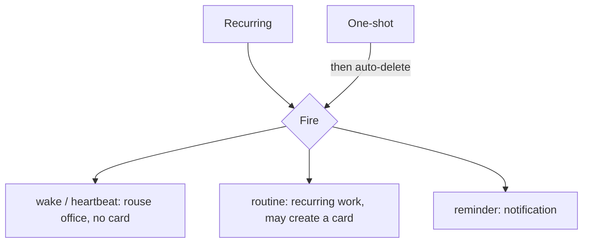

# Scheduler Model

**Version:** 1.0.0
**Status:** Stable
**Layer:** concept

## Overview

The technology-agnostic model of time-driven work in Cronus: schedules that fire on a recurrence (like an advanced alarm clock) or once, driving the office's autonomous operation. It defines the two schedule kinds, what a recurrence can express, what a fire does (wake / routine / reminder), and how schedules live and end. The interaction policy that prevents scheduled work from flooding the board is deliberately deferred to real-world tuning.

## Related Specifications

- [l1-office-model.md](l1-office-model.md) - Autonomous, unattended operation (OFF-8) that schedules drive.
- [l1-kanban-model.md](l1-kanban-model.md) - The board that `routine` fires may produce work on.
- [l1-workspace-lifecycle.md](l1-workspace-lifecycle.md) - Schedules belong to a workspace; home schedules are organizer reminders.
- [l2-scheduler.md](l2-scheduler.md) - Concrete recurrence model (friendly + raw cron), storage, and commands.

## 1. Motivation

An always-on office must act on its own cadence: keep moving when no one is prompting, run recurring routines, and remind the user of things. Users think in alarm-clock terms (weekdays at a time, weekends, once at a date) far more than in cron syntax, so the model is recurrence-first while still allowing precise expressions for power users. Separating a "wake" from "work" keeps autonomy cheap and the board honest.

## 2. Constraints & Assumptions

- Schedules fire against the host clock and operate while unattended.
- A non-technical client should be able to set common schedules without learning cron.
- Time-driven wakes must not, by themselves, manufacture work items.
- Whether repeated fires should be de-duplicated on the board is a tuning concern, settled later (see §5).

## 3. Core Invariants (Layer 1 only)

Rules every Layer 2 implementation MUST NOT violate:

- **SCH-1 (Two kinds):** a schedule is either **recurring** or **one-shot**. A one-shot schedule auto-deletes after it fires once (the "delete after first firing").
- **SCH-2 (Recurrence expressiveness):** a recurring schedule's rule MUST be expressible through common presets at minimum — weekdays, weekends, daily/whole-week, specific days of week, time(s) of day, and fixed intervals — plus an optional start/end window.
- **SCH-3 (Single declared action):** each schedule fire performs exactly one declared action kind: **wake** (heartbeat), **routine** (recurring work), or **reminder** (notification).
- **SCH-4 (Wake produces no work item):** a `wake`/heartbeat fire only rouses the office to act; it MUST NOT itself create a board card. Only `routine` fires may produce work.
- **SCH-5 (Workspace-scoped):** a schedule belongs to one workspace and its fire affects only that office (consistent with OFF-1). Home-workspace schedules serve organizer/reminder purposes.
- **SCH-6 (Autonomous & durable):** schedules drive work unattended (consistent with OFF-8), survive process restarts, and resume firing without manual re-arming.
- **SCH-7 (Lifecycle control):** schedules can be enabled, disabled, edited, and deleted; disabling suspends firing without deleting the schedule.

> L2 specs cannot reach RFC status until all invariants here are addressed in their "Invariant Compliance" section.

## 4. Detailed Design

### 4.1 Schedule kinds and actions

### 4.2 Recurrence (advanced alarm clock)

A recurrence is built from familiar pieces: a day pattern (weekdays / weekends / whole week / chosen days / chosen dates), time(s) of day, or a fixed interval (every N minutes/hours — the heartbeat cadence), within an optional start/end window and time zone. One-shot schedules instead carry a single target date-time and auto-delete on fire.

### 4.3 Wake vs work

The heartbeat is the office's pulse — it rouses the manager to advance whatever already exists, creating nothing (SCH-4). Routines represent actual recurring work and may place a card on the board. Reminders surface to the user (especially in the home/organizer workspace) without entering the work pipeline.

## 5. Drawbacks & Alternatives

- **Board flooding by routines — deferred:** if a routine fires repeatedly while its previous occurrence is unfinished, the board could accumulate duplicate cards. A de-duplication/coalescing policy is intentionally NOT specified yet; it will be tuned against real usage. <!-- TBD: decide routine-fire board de-duplication policy (coalesce vs skip) after real-world testing -->
- **Alternative — cron-only model:** rejected as the primary surface; it burdens non-technical clients (OFF-6). Raw cron remains available for power users at the implementation layer.
- **Missed fires (downtime):** behavior when the host was off during a fire window is an implementation choice (skip vs catch-up). <!-- TBD: missed-fire behavior -->

## Canonical References

| Alias | Path | Purpose |
| --- | --- | --- |
| `[OFFICE]` | `.design/main/specifications/l1-office-model.md` | Autonomous operation (OFF-8) |
| `[KANBAN]` | `.design/main/specifications/l1-kanban-model.md` | The board routines may produce work on |
| `[SCHED]` | `.design/main/specifications/l2-scheduler.md` | Concrete realization (recurrence + cron, storage, commands) |
