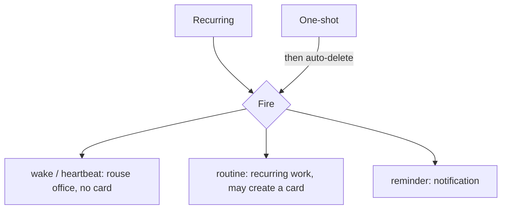
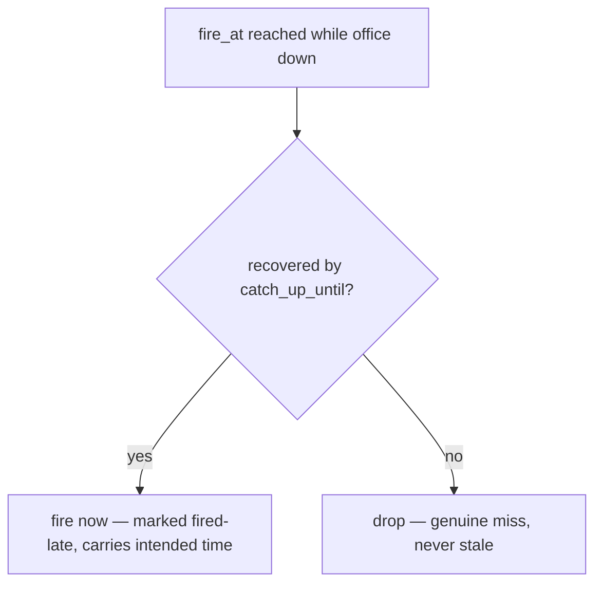

# Scheduler Model

**Version:** 1.1.0
**Status:** Stable
**Layer:** concept

## Overview

The technology-agnostic model of time-driven work in Cronus: schedules that fire on a recurrence (like an advanced alarm clock) or once, driving the office's autonomous operation. It defines the two schedule kinds, what a recurrence can express, what a fire does (wake / routine / reminder), and how schedules live and end. The interaction policy that prevents scheduled work from flooding the board is deliberately deferred to real-world tuning.

## Related Specifications

- [l1-office-model.md](l1-office-model.md) - Autonomous, unattended operation (OFF-8) that schedules drive.
- [l1-kanban-model.md](l1-kanban-model.md) - The board that `routine` fires may produce work on.
- [l1-workspace-lifecycle.md](l1-workspace-lifecycle.md) - Schedules belong to a workspace; home schedules are organizer reminders.
- [l1-work-liveness.md](l1-work-liveness.md) - Owns wake coalescing (WL-4) — how many missed/redundant occurrences collapse into one run; SCH-8's catch-up window bounds lateness, orthogonally.
- [l1-doctor.md](l1-doctor.md) - Crash recovery: the restart/recovery sweep evaluates each missed occurrence's catch-up window (SCH-8) against the recovery time.
- [l2-scheduler.md](l2-scheduler.md) - Concrete recurrence model (friendly + raw cron), storage, commands, and catch-up/concurrency policy realizing SCH-8.

## 1. Motivation

An always-on office must act on its own cadence: keep moving when no one is prompting, run recurring routines, and remind the user of things. Users think in alarm-clock terms (weekdays at a time, weekends, once at a date) far more than in cron syntax, so the model is recurrence-first while still allowing precise expressions for power users. Separating a "wake" from "work" keeps autonomy cheap and the board honest.

## 2. Constraints & Assumptions

- Schedules fire against the host clock and operate while unattended.
- A non-technical client should be able to set common schedules without learning cron.
- Time-driven wakes must not, by themselves, manufacture work items.
- Whether repeated fires should be de-duplicated on the board is a tuning concern, settled later (see §5).

## 3. Core Invariants (Layer 1 only)

Rules every Layer 2 implementation MUST NOT violate:

- **SCH-1 (Two kinds):** a schedule is either **recurring** or **one-shot**. A one-shot schedule auto-deletes after it fires once (the "delete after first firing").
- **SCH-2 (Recurrence expressiveness):** a recurring schedule's rule MUST be expressible through common presets at minimum — weekdays, weekends, daily/whole-week, specific days of week, time(s) of day, and fixed intervals — plus an optional start/end window.
- **SCH-3 (Single declared action):** each schedule fire performs exactly one declared action kind: **wake** (heartbeat), **routine** (recurring work), or **reminder** (notification).
- **SCH-4 (Wake produces no work item):** a `wake`/heartbeat fire only rouses the office to act; it MUST NOT itself create a board card. Only `routine` fires may produce work.
- **SCH-5 (Workspace-scoped):** a schedule belongs to one workspace and its fire affects only that office (consistent with OFF-1). Home-workspace schedules serve organizer/reminder purposes.
- **SCH-6 (Autonomous & durable):** schedules drive work unattended (consistent with OFF-8), survive process restarts, and resume firing without manual re-arming.
- **SCH-7 (Lifecycle control):** schedules can be enabled, disabled, edited, and deleted; disabling suspends firing without deleting the schedule.

- **SCH-8 (Bounded catch-up window for missed fires):** a schedule MAY declare a **catch-up window** — a bounded lateness interval extending beyond its exact fire instant (e.g. a fire nominally at 09:00 that stays valid until 10:30) — governing an occurrence *missed* because the office was off, asleep, or otherwise unable to act at the exact time. If the office recovers **within** the window, the missed occurrence still fires (a *catch-up fire*), honestly marked as fired-late and carrying its intended time — a late reminder announces its lateness rather than masquerading as on-time. Once the window **closes**, the missed occurrence is a genuine miss: it is dropped, never executed stale. A schedule with no declared window is the degenerate zero-width case — a missed fire is dropped immediately, so **drop-if-missed is the safe default and the window is an explicit opt-in**. The window bounds *lateness only*: it is orthogonal to how many coalesced occurrences a single catch-up collapses into one run (owned by work-liveness WL-4) and to whether a routine replays one or every missed occurrence (a routine execution-policy choice, itself bounded by this window). A `wake`/heartbeat that recovers within its window still creates no card (SCH-4 holds).

> L2 specs cannot reach RFC status until all invariants here are addressed in their "Invariant Compliance" section.

## 4. Detailed Design

### 4.1 Schedule kinds and actions



### 4.2 Recurrence (advanced alarm clock)

A recurrence is built from familiar pieces: a day pattern (weekdays / weekends / whole week / chosen days / chosen dates), time(s) of day, or a fixed interval (every N minutes/hours — the heartbeat cadence), within an optional start/end window and time zone. One-shot schedules instead carry a single target date-time and auto-delete on fire.

### 4.3 Wake vs work

The heartbeat is the office's pulse — it rouses the manager to advance whatever already exists, creating nothing (SCH-4). Routines represent actual recurring work and may place a card on the board. Reminders surface to the user (especially in the home/organizer workspace) without entering the work pipeline.

### 4.4 Missed fires and the catch-up window

When the office is off, asleep, or otherwise unable to act at a fire's exact time, that occurrence is *missed*. A schedule MAY declare a **catch-up window** bounding how late a missed occurrence may still run (SCH-8). This is distinct from SCH-2's optional start/end window (which bounds when the *schedule as a whole* is active); the catch-up window is a per-occurrence lateness tolerance.

```text
[REFERENCE]
occurrence:
  fire_at         : the nominal fire instant                     (e.g. 09:00)
  catch_up_until  : latest instant a missed fire may still run   (e.g. 10:30)
                    absent → zero-width window (miss = drop immediately)

on recovery at time T (office back online / woken):
  for each missed occurrence with fire_at ≤ T:
    if T ≤ catch_up_until  → fire now, marked fired-late (carries intended fire_at)
    else                   → drop (genuine miss; never fire stale)
```



The window bounds *lateness only*. Collapsing several coalesced occurrences into one run is work-liveness's concern (WL-4); replay breadth (one vs every missed occurrence) is a routine execution-policy choice — both operate *within* the freshness bound this window sets. Marking a catch-up fire as fired-late keeps the record honest: a consumer (or the user) can always tell an on-time fire from a recovered one.

## 5. Drawbacks & Alternatives

- **Board flooding by routines — deferred:** if a routine fires repeatedly while its previous occurrence is unfinished, the board could accumulate duplicate cards. A de-duplication/coalescing policy is intentionally NOT specified yet; it will be tuned against real usage. <!-- TBD: decide routine-fire board de-duplication policy (coalesce vs skip) after real-world testing -->
- **Alternative — cron-only model:** rejected as the primary surface; it burdens non-technical clients (OFF-6). Raw cron remains available for power users at the implementation layer.
- **Missed fires (downtime) — resolved (SCH-8):** a missed occurrence runs only if the office recovers within its declared catch-up window, and is dropped (never fired stale) once the window closes; with no window declared the miss drops immediately. Drop-if-missed is the default; the window is an explicit opt-in. Replay breadth (one vs every missed occurrence) remains routine tuning, and board coalescing remains a WL-4 concern — both bounded by the window.

## Canonical References

| Alias | Path | Purpose |
| --- | --- | --- |
| `[OFFICE]` | `.design/main/specifications/l1-office-model.md` | Autonomous operation (OFF-8) |
| `[KANBAN]` | `.design/main/specifications/l1-kanban-model.md` | The board routines may produce work on |
| `[SCHED]` | `.design/main/specifications/l2-scheduler.md` | Concrete realization (recurrence + cron, storage, commands, catch-up policy) |

## Document History

| Version | Date | Author | Notes |
| --- | --- | --- | --- |
| 1.1.0 | 2026-07-07 | Core Team | Added SCH-8 (bounded catch-up window for missed fires) + §4.4, resolving the open §5 missed-fire (downtime) TBD: a schedule MAY declare a per-occurrence catch-up window (a lateness bound beyond the exact fire instant, e.g. 09:00 valid until 10:30) — a fire missed because the office was off/asleep still runs if the office recovers within the window (a catch-up fire, honestly marked fired-late with its intended time) and is dropped (never fired stale) once the window closes; no window = zero-width = drop-if-missed default, the window an explicit opt-in. Bounds lateness only, orthogonal to WL-4 coalescing (how many collapse) and to routine replay breadth (one vs all), composing with l1-doctor crash-recovery (the recovery sweep evaluates each window against recovery time). Distinguished from SCH-2's schedule-wide start/end window. L1 stays Stable (C9, additive); l2-scheduler carries SCH-8 as a pending Invariant-Compliance obligation (extending its existing catchUpPolicy with a freshness/deadline bound) reconciled at magic.task. Also added this Document History section (previously absent). |
| 1.0.0 | 2026-06-24 | Core Team | Initial spec — two schedule kinds (recurring/one-shot), recurrence expressiveness, single declared action (wake/routine/reminder), wake-produces-no-work, workspace-scoped, autonomous & durable, lifecycle control (SCH-1…SCH-7). |
