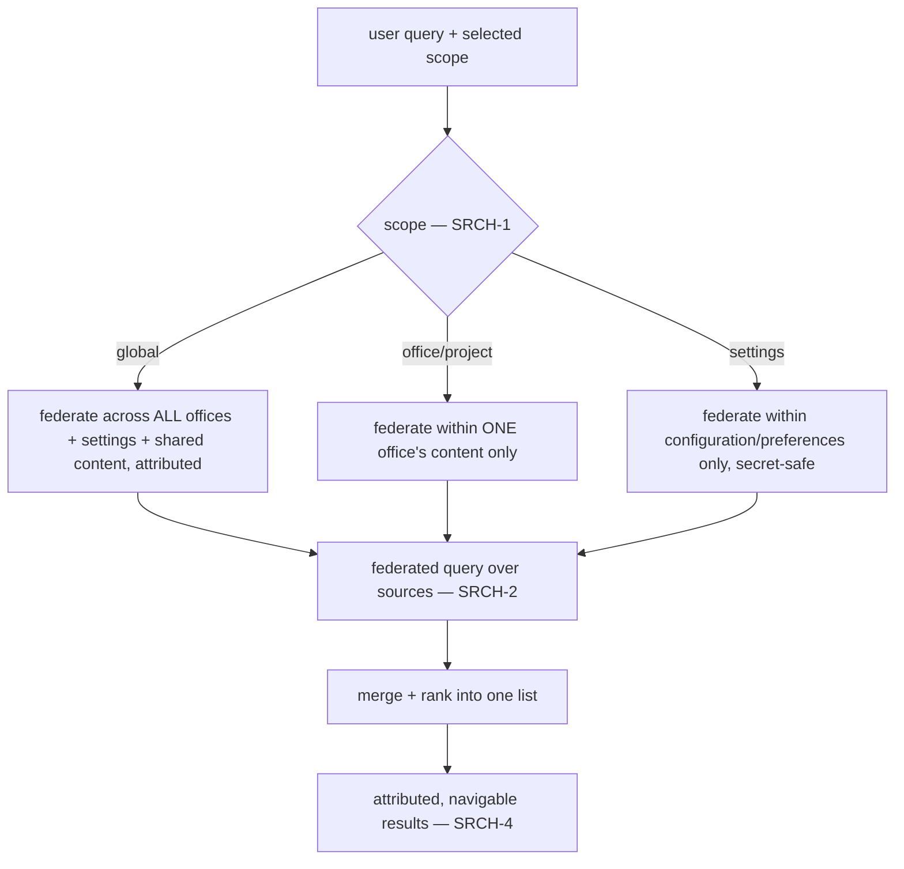

# Search

**Version:** 1.0.0
**Status:** Stable
**Layer:** concept

## Overview

Search is the application-wide capability to *find anything* the user can already
see — an office, a kanban card, a memory, a message, a file, a document, a setting —
through one query surface, within an explicit, selectable **scope**. The user can
search the whole application at once, a single project/office in isolation, or the
settings alone, and always knows which of those they are searching. One query
federates across the many heterogeneous sources inside the active scope and returns
one merged, ranked, navigable result list.

This spec defines search as a scope-aware, federated, read-only projection over the
system's existing content. It does not own the content or its per-domain query
semantics — memory recall, knowledge-base retrieval, and code search remain theirs —
it is the unifying *find surface* that federates them and adds the cross-cutting
guarantees every search must honour: explicit scope, isolation, honest freshness,
navigable attribution, and secret-safety.

## Related Specifications

- [l1-workspace-lifecycle.md](l1-workspace-lifecycle.md) — office/project isolation (WSL-8); a per-office search never crosses into another office's content (SRCH-3).
- [l1-navigation-model.md](l1-navigation-model.md) — the surface a result navigates to; search is a cross-cutting entry point that jumps into the containment tree (SRCH-4).
- [l1-event-mesh.md](l1-event-mesh.md) — content-change events keep the search index fresh incrementally (SRCH-6).
- [l1-system-readout.md](l1-system-readout.md) — shares the honest-freshness and read-only-projection discipline (SRCH-5/SRCH-6 parallel SR-5/SR-7).
- [l1-security.md](l1-security.md) — search never surfaces secrets or crosses an access boundary (SRCH-3).
- [l1-dev-office.md](l1-dev-office.md) — elevated dev-office content is not searchable without admission (SRCH-3, DVO-3).
- [l1-memory-intelligence.md](l1-memory-intelligence.md) — memory recall is one federated source, not replaced by this surface.
- [l1-knowledge-base.md](l1-knowledge-base.md) — KB retrieval is another federated source; SRCH federates, it does not re-implement it.
- [l1-architecture.md](l1-architecture.md) — INV-3 command parity: search behaves the same across CLI/TUI/GUI (SRCH-8).

## 1. Motivation

As the application accumulates offices, boards, memories, messages, files, and a
growing settings surface, "where is that thing?" becomes a first-order user need. Two
naïve answers both fail:

- **No unified search** — the user hunts manually through each surface, or every
  surface grows its own incompatible search box with different scope, ranking, and
  freshness behaviour.
- **One flat global search** — everything is searchable in one undifferentiated pile,
  so a search inside one project drags in every other project's content, a search for
  a setting returns work items, and isolation between offices silently erodes.

The resolving idea is **scope as a first-class, explicit dimension of every search**.
The user picks *what they are searching* — the whole app, one office, or the settings
— and the search is federated within that scope only. This gives both reach (one
query across many sources) and precision (never crossing the boundary the user chose),
while inheriting the system's isolation and secret-safety rules rather than quietly
bypassing them.

## 2. Constraints & Assumptions

- Every search runs within exactly one explicit scope; there is no ambient
  "search everything and everywhere" that ignores isolation.
- Search is a read path over content the user is already entitled to see; it never
  widens visibility.
- Sources are heterogeneous (offices, cards, memory, messages, files, settings, docs)
  and federate into one result list.
- Content changes continuously; the index must stay fresh without a full re-scan.
- Local-first: searched content and its index stay on-device.

## 3. Core Invariants

Rules every Layer 2 implementation MUST NOT violate:

- **SRCH-1 (Explicit, selectable scope):** every search runs within one scope drawn
  from a closed set — **global** (the whole application), **office/project** (one
  workspace's content only), and **settings** (configuration/preferences only) — and
  the active scope is always visible to the user. A result never silently crosses its
  scope: a per-office search returns only that office's content, a settings search
  returns only settings, a global search attributes each result to its origin.

- **SRCH-2 (Unified query, federated over sources):** one query federates across the
  heterogeneous searchable sources within the active scope; each source contributes
  typed results to one merged, ranked list. The user issues one query, not one per
  source, and does not choose a source before searching — the mechanism fans the
  query out and merges the results.

- **SRCH-3 (Isolation & access-respecting):** search honours the same isolation and
  access boundaries as the rest of the system. Office content is searchable only
  within its own office scope or in a global search that attributes it (never
  cross-office by accident, consistent with WSL-8); a settings search never surfaces a
  secret or protected field (consistent with security and the log-legibility
  secret-safety rule); elevated dev-office content is not searchable without admission
  (DVO-3). Search is read-only visibility — it MUST NOT reveal anything the user could
  not already reach.

- **SRCH-4 (Attributed & navigable results):** every result carries its source kind,
  its scope/office of origin, and a location, so the user sees *where* it came from and
  can navigate directly to it — open the office, the card, the file, or the exact
  setting. A result is a pointer to a real place, never a dead excerpt.

- **SRCH-5 (Read-only projection):** searching observes content; it MUST NOT mutate
  the content it searches (parity with the observe-only posture of readouts and
  monitors).

- **SRCH-6 (Fresh & honestly reconciled):** search reflects current content — the
  index is kept fresh incrementally as content changes (driven by content-change
  events), not rebuilt on every query. A hit whose underlying content has since
  changed or disappeared is reconciled: it is refreshed, marked stale, or dropped —
  never presented as a live match it no longer is.

- **SRCH-7 (Bounded & economical):** search is bounded — ranked, paginated, and
  latency-budgeted — and economical: it queries the incremental index rather than
  re-scanning everything, and expensive semantic search is opt-in over cheap lexical
  matching by default. It does not re-index the world on every keystroke, and searched
  content does not egress the device.

- **SRCH-8 (Cross-frontend parity):** search behaves consistently across CLI, TUI, and
  graphical frontends — the same scopes, the same federated sources, the same ranking
  and freshness semantics — only the rendering differs (consistent with command
  parity, INV-3).

> L2 specs cannot reach RFC status until all invariants here are addressed in their
> "Invariant Compliance" section.

## 4. Detailed Design

### 4.1 Scope is the first choice



The scope is chosen *before* results are produced and constrains which sources are
even consulted (SRCH-1/SRCH-3). Global search is not "everything merged blindly" — it
is every source consulted *with each result attributed to its office/source of
origin*, so the user can still tell things apart.

### 4.2 Source taxonomy (per scope)

| Source | In global | In office scope | In settings scope |
| --- | --- | --- | --- |
| Offices / workspaces | yes (list + jump) | n/a (already inside one) | no |
| Kanban cards | yes (attributed) | yes | no |
| Memory | yes (attributed) | yes (this office's) | no |
| Messages / inbox | yes (attributed) | yes | no |
| Files / documents | yes (attributed) | yes | no |
| Settings / preferences | no (settings is its own scope) | no | yes (secret-safe) |

Settings is a deliberately *separate* scope, not a source folded into global — a user
looking for a preference should not wade through work content, and work search should
not surface configuration. This is the concrete realization of the user-visible
"search settings separately" requirement.

### 4.3 Federation, ranking, and freshness

```text
[REFERENCE]
search(query, scope):
    sources := sources_for(scope)              # SRCH-1/4.2 — scope decides the source set
    results := []
    for s in sources:
        results += s.query(query)              # each source returns typed, attributed hits — SRCH-2/4
    rank(results)                              # one merged ranked list
    reconcile(results)                         # drop/mark hits whose content changed — SRCH-6
    return paginate(results)                   # bounded — SRCH-7

on content_change_event(item):                 # SRCH-6, via the event mesh
    index.update_incrementally(item)
```

Ranking merges across sources by relevance; freshness is maintained by incremental
index updates on content-change events (SRCH-6), never by a full re-scan per query
(SRCH-7).

### 4.4 What search does NOT own

Search federates existing query capabilities; it does not replace them. Memory recall
(its relevance model), knowledge-base retrieval (its attribution), and code search
(its structural index) remain owned by their specs — search consults them as sources
and adds the cross-cutting scope/isolation/attribution/freshness guarantees on top.
This keeps SRCH a thin unifying surface, not a second copy of every domain's search.

## 5. Drawbacks & Alternatives

- **Alternative — one flat global search only.** Rejected (SRCH-1/SRCH-3): it erodes
  office isolation and mixes settings with work content, exactly the precision the
  scope dimension exists to preserve.
- **Alternative — a separate search box per surface.** Rejected (SRCH-2): incompatible
  scope, ranking, and freshness per box; the user learns N different searches and none
  reaches across sources.
- **Index freshness cost.** Maintaining an incremental index has upkeep. Accepted and
  bounded by SRCH-6/SRCH-7: incremental updates on change events, not a rebuild per
  query, and lexical-by-default with semantic search opt-in.
- **Over-reach risk.** A federated search could become a lever to see across isolation
  boundaries. Prevented by SRCH-3: search is strictly read-only visibility over what
  the user may already reach, and honours every existing isolation and secret rule.

## Canonical References

| Alias | Path | Purpose |
| --- | --- | --- |
| `[WSL]` | `.design/main/specifications/l1-workspace-lifecycle.md` | Office isolation the office-scope search must not cross (SRCH-3). |
| `[MESH]` | `.design/main/specifications/l1-event-mesh.md` | Content-change events that keep the index fresh (SRCH-6). |
| `[NAV]` | `.design/main/specifications/l1-navigation-model.md` | The containment tree a result navigates into (SRCH-4). |
| `[SECURITY]` | `.design/main/specifications/l1-security.md` | Secret-safety and access boundaries search must honour (SRCH-3). |

## Document History

| Version | Date | Author | Notes |
| --- | --- | --- | --- |
| 1.0.0 | 2026-07-07 | Core Team | Initial spec — application-wide scope-aware federated search: explicit selectable scope global/office/settings always visible, results never cross scope (SRCH-1); one unified query federated over heterogeneous sources into one ranked list (SRCH-2); isolation & access-respecting, never surfaces secrets nor crosses office/dev-office boundaries (SRCH-3); attributed & navigable results pointing to a real place (SRCH-4); read-only projection (SRCH-5); fresh via incremental event-driven indexing with honest reconciliation of stale hits (SRCH-6); bounded & economical, index-not-rescan, lexical-default/semantic-opt-in, local-first (SRCH-7); cross-frontend parity (SRCH-8, INV-3). Settings is a deliberately separate scope, not a global source. Federates memory/KB/code search as sources rather than replacing them. Main-only (a host find-surface). |
