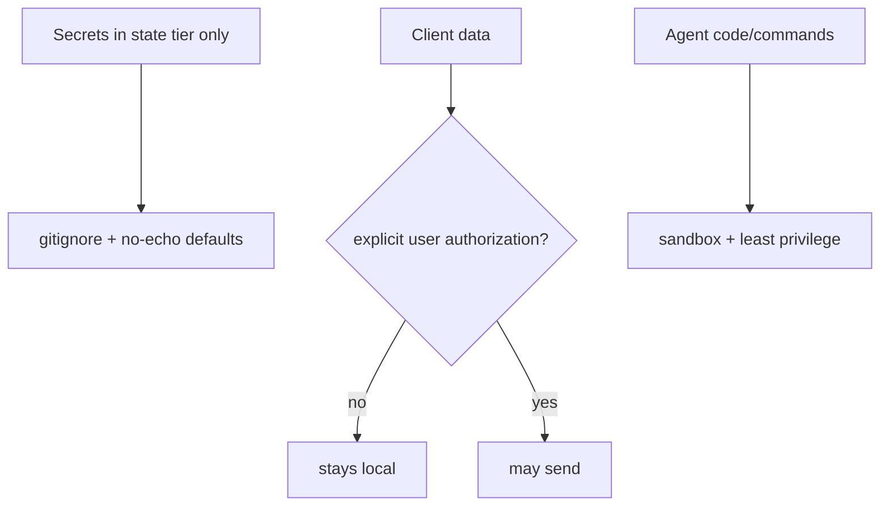

# Client Security

**Version:** 1.3.1
**Status:** Stable
**Layer:** concept

## Overview

The technology-agnostic model of protecting the client: keeping secrets isolated, shipping safe defaults, never leaking sensitive data off-device without consent, sandboxing agent-run code, and keeping an audit trail. It elevates the architecture's security invariant (INV-7) into concrete guarantees.

## Related Specifications

- [l1-architecture.md](l1-architecture.md) - Security of client data (INV-7).
- [l1-storage-model.md](l1-storage-model.md) - Secret isolation in the state tier (STO-6).
- [l1-telemetry.md](l1-telemetry.md) - The only sanctioned off-device data path (opt-in, program data only).
- [l2-security.md](l2-security.md) - Concrete secret storage, gitignore, sandboxing, redaction.
- [l1-policy-governance.md](l1-policy-governance.md) - Governs the SEC-9 durable-promotion escape hatch (max scope, cross-session persistence, forbid entirely); the managed-tier writer of part of the SEC-10 authority plane.
- [l2-agent-autonomy.md](l2-agent-autonomy.md) - Realizes SEC-9: the approval gate that learns a durable, scoped, revocable allow-rule; SEC-10's "autonomy level cannot be model-elevated" is enforced here.
- [l1-messaging-gateway.md](l1-messaging-gateway.md) - The reachability half of the SEC-10 authority plane (who may reach the agent — channels, admitted parties, pairing); MG-3/MG-5/MG-7.
- [l2-sandbox-policy.md](l2-sandbox-policy.md) - Concrete SEC-10 instance: the host is the sole writer of the policy file; the agent's policy context is read-only and it requests changes through an approval path.
- [l1-confidentiality-flow.md](l1-confidentiality-flow.md) — [ADDED v1.3.1] CF-4 generalizes the SEC-3 device-edge egress gate to a per-sink capacity at *every* outbound sink, and SEC-1 secret isolation is the top of the confidentiality lattice.

## 1. Motivation

The product runs on the user's machine with access to their projects, credentials, and data. "Always think about the client's safety" means secrets never leak, nothing sensitive leaves the device unless the user says so, and agent-executed code cannot run wild.

## 2. Constraints & Assumptions

- Secrets and user data live only in the mutable state tier.
- The system distinguishes user data from operational/program data.
- Agents execute untrusted code/commands and must be contained.

## 3. Core Invariants (Layer 1 only)

- **SEC-1 (Secret isolation):** secrets live only in the state tier and MUST NOT appear in version control, backups, exports, or logs (reaffirms INV-7 / STO-6).
- **SEC-2 (Safe defaults):** the system ships secure defaults — gitignore covering secrets and state, no secret echo, least-privilege.
- **SEC-3 (No unauthorized exfiltration):** client data MUST NOT leave the device except where the user explicitly authorizes it.
- **SEC-4 (Data vs telemetry separation):** user data is distinguishable from program/operational data; only non-sensitive program data may ever be shared, and only when enabled.
- **SEC-5 (No secret leakage in output):** CLI/TUI output and logs never print secrets (redaction by default).
- **SEC-6 (Sandboxed execution):** agent-run code and commands execute in a sandbox with least privilege; escalation is explicit.
- **SEC-7 (Auditable):** security-relevant actions (auth use, external sends, sandbox escalations) are logged.

- **SEC-8 (Confinement-mode duality with non-mixing mount scope):** [ADDED v1.1.0] sandboxed execution (SEC-6) is offered in two confinement modes behind **one** interface: **embedded** — an in-process/local manager on the user's machine — and **remote** — execution delegated across an authenticated boundary to a separate manager. Host-path exposure is **mode-scoped and never mixed**: a client-local working directory may be mounted only into an *embedded* sandbox; a *remote* sandbox exposes only paths on its own side and MUST NOT mount a client-local path. Reaching a remote sandbox requires an explicit bearer credential; the selected mode and any mount are audited (SEC-7). This keeps the choice "run it here vs. run it elsewhere" from silently leaking a local path across a trust boundary.

- **SEC-9 (Learnable, scoped, revocable, governed permission promotion):** [ADDED v1.2.0] a human approval decision MAY be durably remembered as an allow-rule so a later equivalent request resolves without re-prompting — but only under strict discipline: **(a)** promotion is an *explicit* human act ("always-allow"), never inferred from a one-time "allow" and never silent; **(b)** every durable rule carries an *explicit, minimal* scope — the narrowest of {this action on this target, this action class, one office, global} the user chose, defaulting to the narrowest offered; **(c)** the rule is keyed to a *stable action identity* (operation + target signature) so it matches only genuinely-equivalent future requests, not a broader family; **(d)** every promotion and every prompt it later suppresses is auditable (SEC-7), and every durable rule is *independently revocable* with immediate effect; **(e)** durable promotion is itself a *governed escape hatch* — the managed policy tier can cap the maximum scope, disable cross-session persistence, or forbid promotion entirely (composes policy governance); **(f)** hard-forbidden paths and the destructive/irreversible risk class are *non-promotable* — no rule can pre-authorize them; they always re-prompt. A learnable gate that cannot satisfy (a)–(f) MUST fall back to prompting; promotion is fail-closed.

- **SEC-10 (Authority self-containment — the agent cannot author its own authority or reachability):** [ADDED v1.3.0] the plane that governs **what the agent may do** (permission/trust rules, autonomy level, credential grants, sandbox policy) and **who may reach the agent** (channels, admitted parties, identity pairing, ingress) is authored **only by the human principal**, through a boundary the agent's own execution cannot write to. The agent MAY *read* its constraints — to comply with them and explain them — but MUST NOT *write* them: a model-produced action can never elevate its own autonomy, grant itself or widen a credential, add or relax a trust rule, admit a new party, or open a new ingress path. The agent's only move toward more authority is to **request** a change through an approval path the human resolves — the human-only promotion of SEC-9 — and that request is *data*, never a self-grant. The isolation is a **security confinement** boundary (consistent with the architecture's sanctioned security process-boundary carve-out — motivated by safety, not scale — INV-8), enforced **structurally** rather than by trusting the agent to abstain: an agent subverted by untrusted content (prompt injection) still cannot rewrite the plane it runs under, because it has no write path to it. Reads of the authority plane are permitted; every write is human-authored and every agent-side *request* to change it is auditable (SEC-7). This is the counterpart to SEC-9: SEC-9 says the human *may* grant durably; SEC-10 says the agent *never* grants at all.

> L2 specs cannot reach RFC status until all invariants here are addressed in their "Invariant Compliance" section.

## 4. Detailed Design

### 4.1 Layers of protection



### 4.2 Boundaries

Secrets: `.env`/keychain in state, gitignored, redacted in logs. Data egress: gated by explicit authorization (telemetry opt-in, model routing local-first). Execution: sandboxed with an approval axis for escalation (consistent with the orchestration approval gate).

### 4.3 Confinement modes and mount scope [ADDED v1.1.0]

One sandbox interface, two confinement modes, one hard rule about what each may see:

| Mode | Where code runs | Host-path mounts | Reach requirement |
| --- | --- | --- | --- |
| **Embedded** | Local in-process/child manager on the user's device | A declared client-local workspace directory MAY be mounted | Local process trust |
| **Remote** | Delegated to a separate manager across a boundary | Only the remote side's own paths; **never** a client-local path | Explicit bearer credential |

```text
[REFERENCE]
open_sandbox(mode, workspace_dir?, credential?):
    if mode == remote and workspace_dir is set:
        reject("local mount not permitted for remote confinement")   // SEC-8 non-mixing
    if mode == remote and credential is absent:
        reject("remote sandbox requires bearer credential")          // SEC-8
    audit("sandbox_open", mode, mounts)                              // SEC-7
```

The value is that "run it elsewhere" can never quietly become "expose a local path
elsewhere." Mode selection is explicit and audited; a remote confinement failure is
fail-closed (rejected), never a silent fallback to mounting local state.

### 4.4 Learnable permission promotion [ADDED v1.2.0]

Approval prompts have a cost: a trusted, routine action re-asked on every occurrence
trains the user to click "allow" without reading — the opposite of a real safety
gate. The remedy is to let a human approval *learn* into a standing decision, but
only under discipline strict enough that the learning never quietly becomes a
blanket bypass. SEC-9 makes an approval promotable to a durable allow-rule while
keeping scope explicit and minimal, the match narrow, the rule revocable, the
promotion governed, and the dangerous classes forever un-promotable.

**Scope ladder (narrowest chosen offered first, default = narrowest):**

| Scope | A durable rule at this scope suppresses re-prompting for… |
| --- | --- |
| `this-action` | the *same operation on the same target* (stable action key) only |
| `action-class` | the same operation class (e.g. a named tool) irrespective of target |
| `office` | that class within one office/workspace |
| `global` | that class everywhere the caller operates |

```text
[REFERENCE]
on approval decision D for request R:
    record_audit(R, D, actor)                              // SEC-7 always
    if D is a one-time "allow"/"deny":
        return D                                           // no learning
    if D is "always-allow":                               // explicit human act — never inferred
        if R.risk_class is destructive/irreversible
           or R matches an always-forbidden path:
            reject_promotion("class is non-promotable")    // SEC-9(f) — still one-time only
        scope := D.scope or narrowest_offered              // SEC-9(b)
        cap   := policy_governance.max_promotion_scope()   // SEC-9(e) governed clamp
        if scope > cap or policy_governance.promotion_disabled():
            reject_promotion("governance")                 // fail-closed to prompting
        rule := AllowRule{ key = stable_action_key(R), scope, created_by = actor }
        durable_store.put(rule)                            // survives sessions
        record_audit("promotion", rule)                    // auditable + revocable later

on new request R':
    if durable_store.matches(R') and not R'.non_promotable: // SEC-9(c) equivalence match only
        record_audit("auto-allowed", matched_rule); allow   // suppressed prompt is audited
    else: prompt                                            // fall through to the gate
```

A promotion is only ever an *explicit* human "always-allow", never an inference from
a one-time "allow" (SEC-9a). The rule is keyed to a stable action identity so it
matches genuinely-equivalent future requests, not a broader family (SEC-9c). Every
promotion and every prompt it later suppresses is auditable (SEC-9d / SEC-7), and any
durable rule is independently revocable with immediate effect. Durable promotion is a
governed escape hatch: the managed policy tier can cap the maximum scope, disable
cross-session persistence, or forbid promotion outright (SEC-9e, composes policy
governance). Destructive/irreversible actions and always-forbidden paths are
non-promotable — they always re-prompt regardless of any rule (SEC-9f).

### 4.5 Authority self-containment [ADDED v1.3.0]

A permission gate the agent could quietly widen is not a gate. SEC-10 draws the
line structurally: the agent runs *under* an authority plane it can read but has
no path to write. Two halves compose it — *what it may do* and *who may reach it* —
and both are human-authored.

| Authority-plane element | Written by | Agent's access |
| --- | --- | --- |
| Autonomy level / risk gate | human (`l2-agent-autonomy`) | read-only; not model-elevatable |
| Trust / permission rules, durable allow-rules (SEC-9) | human | read; request-to-add only |
| Sandbox / egress policy | human (host sole writer, `l2-sandbox-policy`) | read-only policy context |
| Credential grants | human (mediated vault) | use via mediated request, never mint |
| Managed config tier | administrator (`l1-policy-governance` PG-2) | read-only, un-overridable |
| Reachability: channels, admitted parties, pairing, ingress | human (`l1-messaging-gateway`) | read; cannot admit/widen |

```text
[REFERENCE]
authority_plane.write(change, actor):
    if actor is the agent (a model-produced action):
        reject_structural("agent has no write path to the authority plane")  // SEC-10
        // the agent may instead emit a request:
        //   request := AuthorityChangeRequest{change, rationale}  (data, not a grant)
        //   route request → human approval path (SEC-9 human-only promotion)
    else if actor is the human principal (or administrator, for the managed tier):
        apply(change); audit("authority_write", actor, change)               // SEC-7

authority_plane.read(query, agent):
    return constraints(query)                                                // always allowed
    // reads let the agent COMPLY and EXPLAIN; they never widen anything
```

The value is injection-resilience: a prompt-injected agent can *ask* for more
authority (the human still decides) but cannot *take* it, because "take" is not a
capability it holds. The confinement is a security boundary sanctioned as such
(INV-8 permits out-of-process confinement of agent code for security, not scaling);
it is not a distributed decomposition and does not fork the monolith into services.

## 5. Drawbacks & Alternatives

- **Sandbox friction:** least-privilege can block legitimate actions; mitigated by explicit, audited escalation.
- **Alternative — trust-by-default:** rejected outright for a product holding client credentials. <!-- TBD: default sandbox backend per OS -->

## Canonical References

| Alias | Path | Purpose |
| --- | --- | --- |
| `[ARCH]` | `.design/main/specifications/l1-architecture.md` | Security invariant elevated here |
| `[SECURITY]` | `.design/main/specifications/l2-security.md` | Concrete realization |
| `[AUTONOMY]` | `.design/main/specifications/l2-agent-autonomy.md` | Approval gate that realizes SEC-9 durable promotion; autonomy level not model-elevatable (SEC-10) |
| `[POLICY-GOV]` | `.design/main/specifications/l1-policy-governance.md` | Governs the SEC-9 promotion escape hatch; managed-tier writer of the SEC-10 plane |
| `[MSG-GATEWAY]` | `.design/main/specifications/l1-messaging-gateway.md` | Reachability half of the SEC-10 authority plane (who may reach the agent) |
| `[SANDBOX-POLICY]` | `.design/main/specifications/l2-sandbox-policy.md` | Concrete SEC-10 instance: host is the sole policy writer, agent context read-only |

## Document History

| Version | Date | Author | Notes |
| --- | --- | --- | --- |
| 1.3.0 | 2026-07-02 | Core Team | Added SEC-10 (authority self-containment — the agent cannot author its own authority or reachability plane: what it may do (permission/trust rules, autonomy level, credential grants, sandbox policy) and who may reach it (channels, admitted parties, pairing, ingress) are human-principal-write-only through a boundary the agent's execution cannot write to; the agent reads its constraints but its only move toward more authority is a request through the SEC-9 human approval path — a request is data, never a self-grant; a security confinement enforced structurally not by trust, so a prompt-injected agent still cannot rewrite the plane it runs under; INV-8-sanctioned security boundary, not a service decomposition) + §4.5 authority-plane read/write table + structural-reject pseudocode. Consolidates previously-scattered guarantees (autonomy-not-model-elevatable, sandbox host-sole-writer, managed-tier un-overridable, SEC-9 human-only promotion) into one L1 invariant; the counterpart to SEC-9 (human may grant / agent never grants). nodus realization = l1-nodus-portability LP-10. |
| 1.2.0 | 2026-07-02 | Core Team | Added SEC-9 (learnable, scoped, revocable, governed permission promotion — an explicit human "always-allow" MAY become a durable allow-rule at an explicit minimal scope keyed to a stable action identity; every promotion + suppressed prompt auditable and independently revocable; governed escape hatch the managed tier can cap/disable; destructive/irreversible + always-forbidden classes non-promotable, fail-closed to prompting) and §4.4 scope-ladder + promotion pseudo-code. Turns a routine re-asked approval into a standing decision without letting learning become a blanket bypass. |
| 1.1.0 | 2026-07-01 | Core Team | Added SEC-8 (confinement-mode duality — embedded vs remote sandbox behind one interface — with non-mixing mount scope: client-local paths mount only in embedded mode, remote sandboxes never mount a local path and require a bearer credential; mode + mounts audited) and §4.3 confinement-mode table + fail-closed open_sandbox guard. Sharpens SEC-6. |
| 1.0.0 | 2026-06-24 | Core Team | Initial spec — SEC-1…SEC-7, layers of protection, boundaries. |
