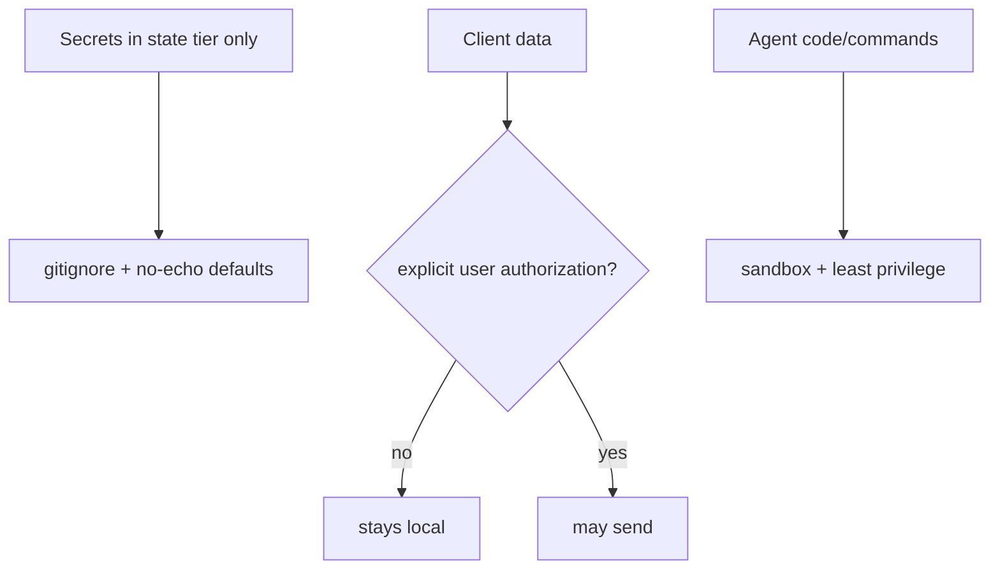

# Client Security

**Version:** 1.0.0
**Status:** Stable
**Layer:** concept

## Overview

The technology-agnostic model of protecting the client: keeping secrets isolated, shipping safe defaults, never leaking sensitive data off-device without consent, sandboxing agent-run code, and keeping an audit trail. It elevates the architecture's security invariant (INV-7) into concrete guarantees.

## Related Specifications

- [l1-architecture.md](l1-architecture.md) - Security of client data (INV-7).
- [l1-storage-model.md](l1-storage-model.md) - Secret isolation in the state tier (STO-6).
- [l1-telemetry.md](l1-telemetry.md) - The only sanctioned off-device data path (opt-in, program data only).
- [l2-security.md](l2-security.md) - Concrete secret storage, gitignore, sandboxing, redaction.

## 1. Motivation

The product runs on the user's machine with access to their projects, credentials, and data. "Always think about the client's safety" means secrets never leak, nothing sensitive leaves the device unless the user says so, and agent-executed code cannot run wild.

## 2. Constraints & Assumptions

- Secrets and user data live only in the mutable state tier.
- The system distinguishes user data from operational/program data.
- Agents execute untrusted code/commands and must be contained.

## 3. Core Invariants (Layer 1 only)

- **SEC-1 (Secret isolation):** secrets live only in the state tier and MUST NOT appear in version control, backups, exports, or logs (reaffirms INV-7 / STO-6).
- **SEC-2 (Safe defaults):** the system ships secure defaults — gitignore covering secrets and state, no secret echo, least-privilege.
- **SEC-3 (No unauthorized exfiltration):** client data MUST NOT leave the device except where the user explicitly authorizes it.
- **SEC-4 (Data vs telemetry separation):** user data is distinguishable from program/operational data; only non-sensitive program data may ever be shared, and only when enabled.
- **SEC-5 (No secret leakage in output):** CLI/TUI output and logs never print secrets (redaction by default).
- **SEC-6 (Sandboxed execution):** agent-run code and commands execute in a sandbox with least privilege; escalation is explicit.
- **SEC-7 (Auditable):** security-relevant actions (auth use, external sends, sandbox escalations) are logged.

> L2 specs cannot reach RFC status until all invariants here are addressed in their "Invariant Compliance" section.

## 4. Detailed Design

### 4.1 Layers of protection

### 4.2 Boundaries

Secrets: `.env`/keychain in state, gitignored, redacted in logs. Data egress: gated by explicit authorization (telemetry opt-in, model routing local-first). Execution: sandboxed with an approval axis for escalation (consistent with the orchestration approval gate).

## 5. Drawbacks & Alternatives

- **Sandbox friction:** least-privilege can block legitimate actions; mitigated by explicit, audited escalation.
- **Alternative — trust-by-default:** rejected outright for a product holding client credentials. <!-- TBD: default sandbox backend per OS -->

## Canonical References

| Alias | Path | Purpose |
| --- | --- | --- |
| `[ARCH]` | `.design/main/specifications/l1-architecture.md` | Security invariant elevated here |
| `[SECURITY]` | `.design/main/specifications/l2-security.md` | Concrete realization |
