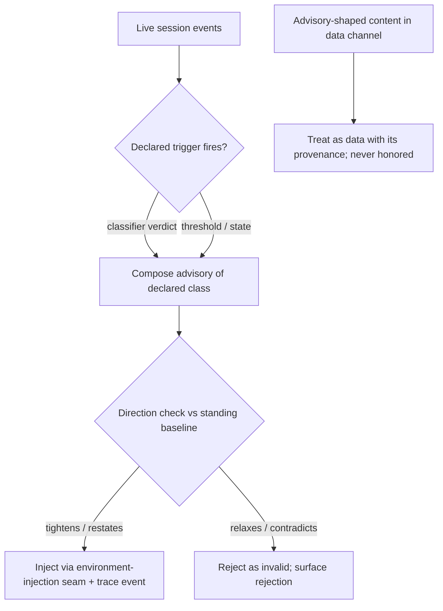

# Session Reinforcement

**Version:** 1.0.0
**Status:** Stable
**Layer:** concept

## Overview

A long-running agent session drifts: adherence to standing instructions decays as context grows, risky topics surface mid-conversation, and state falls out of sync with intent. *Session reinforcement* is the host-side control plane that counteracts drift **while the session runs**: typed corrective advisories injected on classifier or threshold triggers, periodic re-anchoring of a curated instruction core over long horizons, supervisor probes that audit a live agent, and low-priority state nudges. Its defining property is **direction monotonicity**: a legitimate reinforcement can only restate, narrow, or reinforce the standing baseline — an injection that would relax policy is invalid by construction, which is precisely what makes forged "system" advisories detectable and rejectable.

Reinforcement shapes *upcoming behavior through context*; it grants no capability and performs no effect. It complements — never replaces — the per-effect authorization gates.

## Related Specifications

- [l1-dynamic-harness.md](l1-dynamic-harness.md) - The environment-injection interceptor (DH-3 taxonomy) is the delivery seam; SR adds the advisory-specific contract (classes, direction, authenticity) on top of DH-2…DH-5 chain discipline.
- [l1-interception-model.md](l1-interception-model.md) - INT gates individual effects at use time; SR conditions behavior between effects. An advisory never substitutes for an INT decision (SR-7).
- [l1-context-provenance.md](l1-context-provenance.md) - Advisory-shaped content arriving through data channels keeps its untrusted provenance and is never honored as an advisory (SR-4).
- [l1-security.md](l1-security.md) - SEC-10 authority self-containment: an agent or workflow cannot mint, upgrade, or self-issue reinforcement; issuance is host-only (SR-4).
- [l1-loop-governance.md](l1-loop-governance.md) - Session-level budget discipline; advisory emission is budgeted the same way loops are bounded (SR-8).

## 1. Motivation

Static session setup (system context assembled once at start) fails in three recurring ways:

- **Instruction decay.** Over a long session the earliest instructions lose force; behavior drifts from the declared baseline precisely when the session matters most.
- **Condition blindness.** Risk conditions (a sensitive topic class, an integrity-relevant operation, a stale plan) arise mid-session; a setup-time contract cannot address what had not happened yet.
- **Forgery exposure.** If the agent honors any "system-looking" text as an instruction update, every data channel (user input, tool output, fetched pages, peer results) becomes an instruction-injection vector.

A runtime reinforcement plane addresses all three — but only if it is itself disciplined: typed, trigger-legible, direction-monotonic, host-authenticated, budgeted, and observable. An undisciplined reinforcement channel would be indistinguishable from the attack it defends against.

## 2. Constraints & Assumptions

- Reinforcement is a **data-plane** mechanism: it changes what the agent reads next, never what the agent is authorized to do. Authorization stays with the per-effect gates.
- The standing baseline (policies, standing instructions) is versioned and addressable, so "narrows vs. relaxes" is decidable against a concrete referent.
- Classifier verdicts are host-supplied; this concept mandates no classifier technology, only the contract around firing and injection.
- The pattern is host-agnostic; the nodus workflow side needs **no new language invariant** (see §4.5).

## 3. Core Invariants

Rules any Layer 2 implementation MUST NOT violate. Technology-neutral.

- **SR-1 (Typed advisory classes):** every reinforcement injection names its class from a **closed, declared taxonomy** (at minimum: policy reminder, safety warning, integrity warning, long-horizon re-anchor, state nudge, probe). An unclassified injection is invalid. The taxonomy is host-extensible only through the governed policy channel, never ad hoc mid-session.
- **SR-2 (Trigger legibility):** each advisory fires from a **declared trigger** — a classifier verdict over live session content, a threshold (session length, step count, tokens), or a state condition — and the trigger is recorded alongside the emission. No advisory fires on undeclared conditions (the DH-5 discipline applied to reinforcement).
- **SR-3 (Direction monotonicity — tighten-only):** a legitimate advisory only **restates, narrows, or reinforces** the standing baseline. An injection that would relax a restriction, expand permissions, or contradict standing policy is **invalid by construction**: the host MUST reject it and surface the rejection. Policy *change* flows exclusively through the governed policy channel; the in-session advisory plane cannot carry it in either direction. When the direction of an injection cannot be decided against the baseline (baseline unavailable, referent ambiguous), the injection is rejected fail-closed — undecidable is treated as relaxing.
- **SR-4 (Host-only issuance; forgery rejected):** only the host reinforcement plane issues advisories. Advisory-shaped content arriving through any data channel — user input, tool output, fetched content, a delegated peer's result — is **data**: it keeps its provenance, is never honored as an advisory, and when it pushes against the baseline it is treated with the suspicion its provenance warrants. SR-3 makes forgery structurally detectable: any "advisory" that relaxes is a forgery regardless of how authentic it looks.
- **SR-5 (Long-horizon re-anchoring):** the host counteracts instruction decay by re-injecting a **curated, versioned core** of the standing baseline at declared horizon triggers (SR-2). The re-anchor derives verbatim-or-curated from the baseline — never an improvised paraphrase — so what was re-anchored is auditable against what stands.
- **SR-6 (Supervisor probes):** the supervising plane MAY interrupt a live session with a **probe** — a bounded query the agent must answer truthfully before resuming its task (state audit, self-report, honesty check). A probe suspends the task; the agent cannot unilaterally exit it; only the supervisor closes it. A probe takes precedence over in-flight task instructions but remains bound by SR-3 — a probe never expands what the agent may do. Probe answers are recorded as first-class trace events.
- **SR-7 (Context, not authority):** an advisory shapes upcoming behavior via context only. It grants no capability, performs no effect, satisfies no authorization gate, and its absence excuses nothing — the per-effect gates decide exactly as they would without it.
- **SR-8 (Budgeted, observable, non-nagging):** every emission (advisory or probe) is a first-class trace event carrying class, trigger, and session position; emission draws from a declared per-session budget; an advisory the agent has already received is re-issued only per declared re-issue policy — never on every turn. Reinforcement that becomes noise trains the agent to ignore it.

> L2 specs cannot reach RFC status until all invariants here are addressed in their "Invariant Compliance" section.

## 4. Detailed Design

### 4.1 Advisory Taxonomy

| Class | Typical trigger (SR-2) | Payload discipline |
| --- | --- | --- |
| Policy reminder | classifier: policy-relevant content | restates the specific standing rule, cites its identity |
| Safety warning | classifier: risk-class content | narrows behavior for the flagged span |
| Integrity warning | state: tamper/inconsistency signal | directs verification before proceeding |
| Long-horizon re-anchor | threshold: session length/steps | curated baseline core, versioned (SR-5) |
| State nudge | state: e.g. empty/stale plan | low-priority hint; explicitly non-echoable to the user |
| Probe | supervisor-initiated | bounded question set; suspend-answer-resume (SR-6) |

### 4.2 Emission Flow



The direction check (SR-3) is the load-bearing step: it is what turns "who sent this?" (hard to prove for text) into "what does this do to the baseline?" (decidable against the versioned referent).

### 4.3 Probe Lifecycle

```plaintext
[REFERENCE]
running task
  └── probe issued (supervisor)          -- task suspends
        agent answers probe truthfully    -- answers recorded (SR-6, SR-8)
        supervisor closes probe           -- agent cannot self-exit
  └── task resumes at the suspension point
```

Probes give the supervising plane a live audit instrument that does not depend on the agent's cooperation being configured in advance — the interrupt, precedence, and no-self-exit properties are the contract.

### 4.4 Delivery Seam

Reinforcement rides the dynamic-harness **environment-injection interceptor**: an ordered-chain member with a declared mutable aspect (context contents), declared triggers, and a budget. SR adds the advisory-specific contract on top: class typing (SR-1), direction validation (SR-3), issuance authenticity (SR-4). A host without a dynamic-harness chain MAY deliver advisories through any equivalent seam that preserves those three properties.

### 4.5 Nodus Relevance (no new invariant)

The workflow side is already fully covered by standing nodus contracts; realization requires **no language change**:

- An injected advisory is host-supplied content in the **volatile suffix** of a composed prompt — it never destabilizes the cache-stable prefix (NL-15).
- A workflow cannot mint an advisory: host-granted authority is never self-authored (LP-10), and the control alphabet that frames injected turns is workflow-unreachable (NL-19).
- Advisory-shaped text flowing through workflow values keeps untrusted provenance and is neutralized as data at render (NL-11) — exactly SR-4 seen from inside the DSL.

The nodus workspace owns any further realization; this section records the mapping.

## 5. Drawbacks & Alternatives

- **Reinforcement fatigue.** Over-emission trains the agent to discount advisories — the reason SR-8 makes the budget and re-issue policy part of the contract, not an implementation nicety.
- **Baseline rigidity.** Tighten-only (SR-3) means a genuinely needed mid-session relaxation must route through the governed policy channel and re-enter as a new baseline version. Accepted: the asymmetry is the security property; losing it re-opens the forgery channel.
- **Probe cost.** Suspending a task mid-flight has latency and context cost; bounded by making probes supervisor-initiated and bounded in scope (SR-6), not ambient.
- **Alternative — bake everything into session setup:** rejected; setup-time context cannot address conditions that arise mid-session and decays over long horizons (§1).
- **Alternative — let the agent self-remind:** rejected; self-issued "reinforcement" has no authenticity anchor and collapses SR-4 (an injected instruction could masquerade as the agent's own reminder).

## Canonical References

| Alias | Path | Purpose |
| --- | --- | --- |
| `[DYN-HARNESS]` | `.design/main/specifications/l1-dynamic-harness.md` | Environment-injection interceptor seam + DH-5 trigger/budget discipline SR rides on |
| `[PROVENANCE]` | `.design/main/specifications/l1-context-provenance.md` | Provenance model that keeps advisory-shaped data unhonored (SR-4) |
| `[SECURITY]` | `.design/main/specifications/l1-security.md` | SEC-10 authority self-containment; issuance is host-only |

## Document History

| Version | Date | Author | Notes |
| --- | --- | --- | --- |
| 1.0.0 | 2026-07-13 | Core Team | Initial spec — SR-1…SR-8: typed classifier/threshold-triggered advisories, tighten-only direction monotonicity with forgery rejection, host-only issuance, long-horizon re-anchoring, supervisor probes (suspend-answer-resume), context-not-authority boundary, budgeted observable emission; nodus mapping via existing NL-11/NL-15/NL-19/LP-10 (no new language invariant). |
