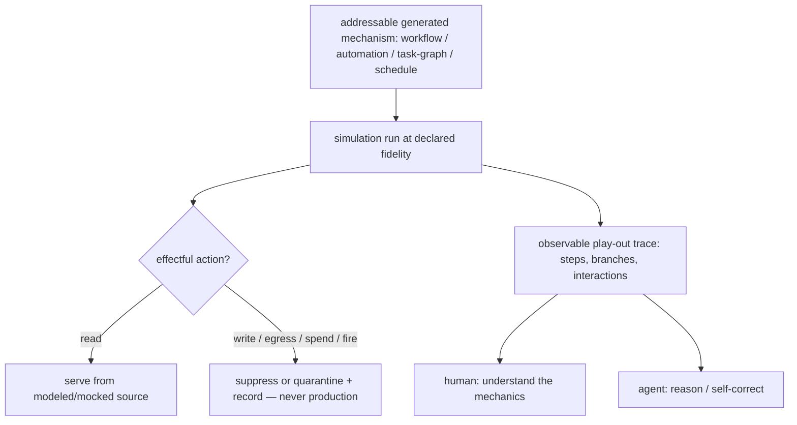

# Simulation

**Version:** 1.0.0
**Status:** Stable
**Layer:** concept

## Overview

Simulation is the office's capability to **play out a generated mechanism to see how
it behaves** — a workflow, an automation pipeline, a role interaction, a task graph,
a schedule — in a modeled world where real effects are suppressed, so the mechanics
can be worked through, understood, and validated before or without committing them to
production. Its output is an observable play-out, not a verdict.

This is deliberately *not* a test. A test asserts a known-expected outcome and returns
pass/fail; a simulation exercises the mechanism to reveal what actually happens — its
flow, its branches, its emergent interactions — for a human or an agent to inspect.
It is also not evaluation (which grades a run against a reward) and not lookahead
(which predicts a single proposed action's consequence to gate a commit). Those three
answer "how well?", "should I commit this?", and "did it match expectation?";
simulation answers the distinct fourth question: **"how does this mechanism behave?"**

The project already realizes pieces of this idea in scattered places — the automation
pipeline's dry-run side-effect quarantine, the evaluation suite's sandboxed run,
lookahead's what-if reasoning pass. This spec names simulation as a first-class
capability, gives it one contract, and reconciles those realizations under it.

## Related Specifications

- [l1-lookahead-planning.md](l1-lookahead-planning.md) — the consequence-prediction sibling; lookahead predicts one proposed action's downstream effects to gate a commit, simulation plays out a whole mechanism to reveal its behaviour (SIM-7 demarcation).
- [l1-evaluation-suites.md](l1-evaluation-suites.md) — the grading sibling; its sandboxed run (ES-11) is a realization of SIM-2, and a simulation may be the run an evaluation grades (SIM-7).
- [l1-automation-pipeline.md](l1-automation-pipeline.md) — its dry-run side-effect quarantine (AP §4.9) is the precedent realization of SIM-2 for pipeline nodes.
- [l1-execution-sandbox.md](l1-execution-sandbox.md) — the isolation substrate a modeled run executes within (SIM-2).
- [l1-security.md](l1-security.md) — the no-escape-to-production and secret-safety guarantees a simulation must not breach (SIM-2/SIM-8).
- [l1-log-legibility.md](l1-log-legibility.md) — the play-out trace is a legible projection over the observation substrate; honest fidelity marking reuses LL-5 (SIM-3/SIM-6).
- [l1-loop-governance.md](l1-loop-governance.md) — the bound that keeps a simulation from running unbounded (SIM-8).
- [l1-generative-surface.md](l1-generative-surface.md) — the source of the generated mechanisms a simulation exercises (SIM-5).
- [l1-quality-standards.md](l1-quality-standards.md) — assertion-first testing is a distinct definition-of-done gate; simulation is observational, not a gate (SIM-1).

## 1. Motivation

Generated mechanics are hard to trust before you see them move. A newly generated
automation, a restructured office topology, a multi-step workflow, a schedule with a
catch-up window — each is a set of interacting rules whose *emergent* behaviour is not
obvious from reading it. Two existing tools do not close this gap:

- **Tests** answer a narrow question — does output equal expectation for this fixed
  input? They confirm known cases and catch regressions, but they do not *show you the
  mechanics*; a green test suite tells you nothing about how the mechanism plays out on
  the inputs you did not think to assert.
- **Real execution** shows the mechanics but pays real costs and causes real effects —
  the very thing you cannot afford while you are still working out whether the mechanism
  is right.

Simulation is the missing middle: run the mechanism for real *as a mechanism*, but in a
modeled world where effects are suppressed and everything is observable, so you can
watch it behave, find the surprising branch, and iterate — cheaply, safely, and
repeatably. The office needs this to rehearse its own generated work before activating
it; the user needs it to understand what a mechanism will do before trusting it. And
because the project has already grown several ad-hoc "run it without real effects"
mechanisms, naming the capability once prevents them from drifting into inconsistent
half-simulations.

## 2. Constraints & Assumptions

- A simulation is a run of a real mechanism in a modeled world — not a reimplementation
  of the mechanism for testing, and not a prediction of it.
- Suppressing real effects is a hard safety boundary, not a best-effort convenience.
- Fidelity is a spectrum, not a binary; a cheap structural pass and a full modeled
  play-out are both simulations, and which one ran must be legible.
- Simulation composes with — but never replaces — testing, evaluation, and lookahead.
- This spec defines the capability; the modeled responses (mock model/tool outputs) are
  supplied per run, not fixed here.

## 3. Core Invariants

Rules every Layer 2 implementation MUST NOT violate:

- **SIM-1 (Play-out, not assertion):** a simulation *exercises* a generated mechanism to
  reveal how it behaves; its primary output is an observable play-out (a trace of the
  mechanics), not a pass/fail verdict against a fixed expectation. It is observational,
  not a definition-of-done gate. A simulation MAY feed a test or an evaluation, but it is
  not one, and it never blocks work by "failing".

- **SIM-2 (No production side effects — modeled world):** a simulation runs against a
  modeled, isolated world. Real effectful actions — tool calls, file writes, network
  egress, board/state mutations, real-account model spend, schedule fires — are
  suppressed, mocked, or quarantined-and-recorded, never applied to production state.
  This is a hard boundary: a simulation that cannot guarantee an effect is contained MUST
  suppress it, never risk it. (This is the same quarantine the automation dry-run and the
  evaluation sandbox already use, stated once here as the simulation invariant.)

- **SIM-3 (Declared, legible fidelity):** every simulation declares its fidelity along a
  spectrum — **structural** (validate the mechanism's shape and flow, no model/tool
  calls), **modeled** (mocked deterministic model and tool responses play out the full
  control flow), **shadow** (real inputs and real reads, effects still quarantined) — and
  records the level with its result. A simulation MUST NOT present itself as more faithful
  than it ran: a structural dry-run is never reported as a full behavioural play-out
  (reuses the honest-reduction discipline of `l1-log-legibility` LL-5).

- **SIM-4 (Deterministic & repeatable):** given the same mechanism version, the same
  modeled inputs, and the same seed, a simulation plays out the same way. Nondeterministic
  sources — wall-clock time, randomness, model sampling — are pinned or seeded so a
  mechanism can be studied, compared across versions, and shared as a reproducible
  artifact. A simulation that cannot be made reproducible declares that limitation rather
  than hiding it.

- **SIM-5 (Mechanism-addressable — simulates what was generated):** a simulation targets
  an *addressable generated mechanism* by identity and version — a workflow, an automation
  pipeline, an office/role interaction, a task graph, a schedule — not only hand-authored
  fixtures. Rehearsing an already-generated mechanism, before or without activating it, is
  a first-class use: the office can simulate work it (or the user) produced.

- **SIM-6 (Observable play-out — the trace is the product):** a simulation's value is its
  legible record of the mechanics — an ordered, attributed trace of every step, branch,
  and interaction the mechanism produced at the declared fidelity — consumable by both a
  human (to understand) and an agent (to reason and self-correct). The trace is a
  projection over the standard observation substrate, not a parallel bespoke format
  (composes `l1-log-legibility`).

- **SIM-7 (Distinct from evaluation and lookahead):** simulation plays out mechanics; it
  does not *grade* them (evaluation's reward/verdict over a run) nor *predict a single
  proposed action's consequence to gate a commit* (lookahead). The three compose — a
  simulation may be the run an evaluation grades, or the modeled substrate a lookahead
  reasons over — but each owns a distinct question ("how does it behave?" vs "how well?"
  vs "should I commit this next action?"). Conflating them is a category error a
  conforming implementation must not encode.

- **SIM-8 (Bounded & safe by default):** a simulation is bounded — step, time, and token
  budgets, and a loop guard — and safe by default: it cannot escape its modeled world into
  production, cannot run unbounded, and its resource cost is declared. A budget-exhausted
  simulation returns a partial, honestly-marked play-out (SIM-3/SIM-6), never a silent
  truncation and never a fallback to real effects.

> L2 specs cannot reach RFC status until all invariants here are addressed in their
> "Invariant Compliance" section.

## 4. Detailed Design

### 4.1 The Four Questions (SIM-1 / SIM-7)

Simulation is one of four distinct disciplines that run or reason about a mechanism.
Naming their questions keeps them from collapsing into each other:

| Discipline | Question | Output | Effects |
| --- | --- | --- | --- |
| **Simulation** (this spec) | How does this mechanism behave? | an observable play-out (trace) | modeled / suppressed |
| Testing | Did output match the expected value? | pass / fail | usually none (fixtures) |
| Evaluation | How well did the run do? | a reward / graded verdict | sandboxed (may grade a simulation) |
| Lookahead | Should I commit this next action? | confirm / modify / escalate | none (reasoning pass) |

They compose deliberately: an evaluation may grade a simulated run; a lookahead may
reason over a modeled substrate a simulation provides. What they must not do is
masquerade as one another — a simulation that starts returning pass/fail is a test in
disguise and has lost its purpose.

### 4.2 Fidelity Spectrum (SIM-3)

```text
[REFERENCE]
structural  — parse + walk the mechanism's flow; no model calls, no tool calls.
              answers "is the shape sound and where does control go?"
modeled     — mocked deterministic model + tool responses drive the full control flow.
              answers "how does it behave end to end under these responses?"
shadow      — real inputs + real reads; every WRITE/effect still quarantined.
              answers "how does it behave against real-looking state, safely?"

result always carries: fidelity_level, seed, budget_used, bounded?/partial?
```

Higher fidelity costs more and reveals more; the level is chosen per run and recorded
so a reader never over-trusts a cheap pass (SIM-3).

### 4.3 The Modeled World (SIM-2)



Every effect that would leave the modeled world is intercepted (SIM-2). The
quarantine is the same one the automation dry-run (`l1-automation-pipeline` §4.9) and
the evaluation sandbox (`l1-evaluation-suites` ES-11) already apply — reconciled here
as one contract rather than three private ones.

### 4.4 Reconciliation of Existing Realizations

| Existing realization | What it is | Relationship to this spec |
| --- | --- | --- |
| Automation dry-run + side-effect quarantine | preview a node/pipeline without persisting effects | a SIM-2 realization scoped to pipelines |
| Evaluation-suite sandboxed run (ES-11) | run isolated so a grader observes without touching production | a SIM-2 realization, then graded (SIM-7) |
| Lookahead what-if pass | predict one action's consequences to gate a commit | a *sibling*, not a simulation (SIM-7) |

These are dispositioned as reconciliation candidates: their side-effect-containment
mechanics should converge on the SIM-2 contract rather than each re-deriving it.

## 5. Drawbacks & Alternatives

- **Alternative — "simulation is just tests with mocks".** Rejected: it conflates SIM-1
  with testing. A mocked test still asserts a fixed expectation; a simulation surfaces
  behaviour for inspection. The output shape (trace vs verdict) is the whole difference.
- **Alternative — fold simulation into evaluation.** Rejected (SIM-7): evaluation grades,
  simulation plays out. Coupling them forces every play-out to invent a reward it may not
  have, and hides the ungraded exploratory use the user asked for.
- **Alternative — leave the scattered dry-run mechanisms as they are.** Rejected: without
  one named contract they drift, and a "dry-run" in one subsystem quietly means something
  different from a "dry-run" in another — exactly the inconsistency SIM-2/SIM-3 prevent.
- **Fidelity confusion risk.** Accepted and mitigated by SIM-3: because a structural pass
  and a full modeled play-out are both "simulations", the fidelity level must always be
  recorded so the two are never conflated.

## Canonical References

| Alias | Path | Purpose |
| --- | --- | --- |
| `[AUTOMATION]` | `.design/main/specifications/l1-automation-pipeline.md` | The dry-run side-effect quarantine (§4.9) that SIM-2 generalizes. |
| `[EVAL]` | `.design/main/specifications/l1-evaluation-suites.md` | ES-11 sandbox — a SIM-2 realization and the grading sibling (SIM-7). |
| `[LOOKAHEAD]` | `.design/main/specifications/l1-lookahead-planning.md` | The consequence-prediction sibling SIM-7 demarcates from. |
| `[LEGIBILITY]` | `.design/main/specifications/l1-log-legibility.md` | The trace projection and honest-fidelity discipline (SIM-3/SIM-6). |

## Document History

| Version | Date | Author | Notes |
| --- | --- | --- | --- |
| 1.0.0 | 2026-07-07 | Core Team | Initial spec — simulation as a first-class capability to play out a generated mechanism in a modeled, side-effect-suppressed, observable, repeatable run, distinct from testing/evaluation/lookahead: play-out not assertion (SIM-1); no production side effects — modeled world (SIM-2, generalizing the automation dry-run §4.9 + evaluation ES-11 quarantine); declared legible fidelity structural/modeled/shadow (SIM-3); deterministic & repeatable via seeding (SIM-4); mechanism-addressable — simulates what was generated (SIM-5); observable play-out trace as the product (SIM-6, composes l1-log-legibility); distinct from evaluation & lookahead, the four-questions taxonomy (SIM-7); bounded & safe by default (SIM-8). Reconciles the scattered dry-run/sandbox realizations under one contract; nodus realization of the execution-mode-provenance half = l1-nodus-observability HO-12. |
