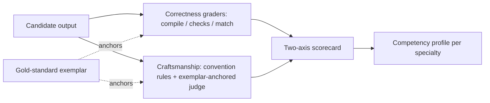
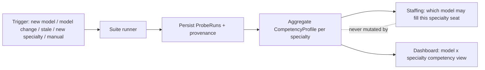

# Specialty Exemplars

**Version:** 1.0.0
**Status:** Stable
**Layer:** concept

## Overview

Specialty exemplars are the **per-specialty competency instrument**: a small, fixed set of concentrated real-work tasks — one suite per office specialty (role) — each shipped with a human-authored, convention-perfect **reference exemplar** that embodies how a master of that specialty does the work. A candidate model is given the task cold; its output is then scored by structured comparison against the exemplar along two separable axes — **did it work** (functional correctness) and **is it well-crafted** (adherence to the specialty's conventions, principles, and idioms). The result aggregates into a per-(model, specialty) **competency profile** the office consumes as one signal when it decides which model is fit to be seated in a given specialty's seat.

The exemplar is the point. Rather than asking "did the output pass some hidden checks," a specialty exemplar asks "how close did the candidate come to what a great {specialty} would have produced, and where exactly did it fall short of the craft." A programmer suite might carry two or three tiny tasks (or even a single well-chosen one) across a couple of concrete modalities; an analyst, writer, or reviewer suite carries the equivalent for their craft. Each probe is deliberately concentrated — dense, minimal, expensive to fake, cheap to run — so a full suite reads competency within a hard token and time budget rather than a research-grade evaluation.

This is a sibling to, not a replacement for, model benchmarking. [l1-model-benchmarking.md](l1-model-benchmarking.md) measures **base-model fitness per router task class** (three abstract classes, graded by mechanical checks / reference checklists / schema match, consumed by the model router when choosing a model for a task). Specialty exemplars measure **per-specialty competency against a gold standard** (organized by the role catalog, graded by convention-adherence versus an authored exemplar, consumed by staffing when deciding which model can competently fill a role). Same measurement disciplines — fixed authored fixtures, multi-dimensional scoring, deterministic-first grading, bounded budget, honest failure — pointed at a different question.

## Related Specifications

- [l1-model-benchmarking.md](l1-model-benchmarking.md) - Sibling instrument and shared disciplines (fixed probes MB-1, multi-dimension scorecard MB-3, deterministic-first grading MB-4, bounded/isolated runs MB-8, honest failure MB-9); demarcation: task-class fitness for the router vs specialty competency for staffing.
- [l1-roles.md](l1-roles.md) - The specialty axis: a suite exists per role (ROL-1 role = specialty); custom roles inherit the same suite contract (ROL-6), and the anti-sprawl gate (ROL-9) applies to exemplar suites too.
- [l1-quality-standards.md](l1-quality-standards.md) - The craft axis: an exemplar embodies the same "ideal code" a quality gate demands (QLY-2/QLY-4); the craftsmanship grader reuses those standards, never a parallel definition.
- [l1-evaluation-suites.md](l1-evaluation-suites.md) - Grader machinery reused, never redefined (ES-3 discipline); demarcation: suites measure a customization's marginal effect, this measures a model's specialty competency.
- [l1-parallel-staffing.md](l1-parallel-staffing.md) - A consumer: competency in a specialty informs whether a model is fit to staff — and fan out within — that specialty's seat.
- [l1-employee-availability.md](l1-employee-availability.md) - A consumer boundary: competency gates who *can* be staffed; availability governs who currently *is* — the profile is a fitness signal, never an availability override (EMP-6).
- [l1-routing.md](l1-routing.md) - Boundary: routing consumes model-benchmarking's task-class signal; specialty competency is a staffing signal — related economy, different decision, kept distinct.
- [l1-security.md](l1-security.md) - Exemplars are authored fixtures with no user data; runs respect secret isolation and no-exfiltration (SEC-2, INV-7).
- [l2-budget-engine.md](l2-budget-engine.md) - Budget caps that bound suite runs on metered credentials (SE-9).

## 1. Motivation

The office staffs specialists — a programmer, a reviewer, an analyst, a writer — and each specialty has a craft: not just "does the output work" but "is it done the way a good {specialty} does it," to convention, to principle, idiomatically. When the office picks which model to seat in a specialty, it currently leans on catalog metadata and the router's task-class signal. But the router's three abstract classes are coarse: "code" collapses a brilliant idiomatic engineer and a model that emits working-but-graceless code into the same bucket, and it says nothing at all about specialties that do not map onto one of the three classes.

A specialty exemplar closes that gap cheaply and honestly. An expert authors, once, a **gold-standard reference** for a concentrated task in their specialty — a complete, convention-perfect artifact. The candidate model does the same task cold, and its output is compared to the exemplar on two axes kept deliberately separate: **correctness** (did it produce a working, right answer) and **craftsmanship** (did it honor the conventions, principles, structure, and idioms the exemplar embodies). A model that is right but sloppy and a model that is elegant but wrong are now *distinguishable* — which is exactly what a staffing decision needs and a single pass/fail score destroys.

The smallness is deliberate and load-bearing. This is not a certification battery; it is a fitness read. One to a few concentrated probes per specialty — sometimes a single well-chosen one — is enough to tell a competent candidate from an unfit one, and being cheap is what lets the office re-read competency whenever a model, a specialty, or the exemplar set changes.

## 2. Constraints & Assumptions

- **Exemplars are concentrated and cheap to run.** Each probe is small, dense, and hard to fake; a full specialty suite completes within a hard per-probe and per-suite budget (tokens and wall time). Density over breadth — the check must not itself become expensive.
- **Exemplars contain no user data.** Both the task prompt and the reference exemplar are authored fixtures shipped with the product; nothing from user sessions, memory, or workspaces enters a probe (SEC-2, INV-7). The only egress is the probe call to the candidate model's serving endpoint.
- **The specialty axis is the role catalog's.** A suite exists per office specialty (role), so a competency reading maps 1:1 onto a seat the office staffs. Specialties without an authored suite simply have no reading — never a fabricated one.
- **Craft is judged against the exemplar, not an open ideal.** "Well-crafted" means "close to how the reference does it," anchored to a concrete authored artifact — not a model's open-ended notion of good. This keeps craftsmanship grading comparable over time.
- **Results are indicative, not authoritative.** A handful of concentrated probes read *fitness for a specialty*, not a global ranking. Model output is nondeterministic; declared trials and variance disclosure are part of the design.
- **Local models depend on hardware.** For on-device models, latency and feasibility readings are valid only for the host that produced them; profiles carry a hardware fingerprint.

## 3. Core Invariants

Rules every Layer 2 implementation MUST NOT violate. They are technology-neutral.

- **SE-1 (Specialty-organized suites):** exemplar probes are organized into one suite per office specialty, and the specialty axis is the role catalog's (ROL-1). A suite is a small set of concentrated tasks for that specialty; each maps to a seat the office staffs. Preset and custom specialties use the identical suite contract (ROL-6). A specialty with no authored suite has no competency reading — never a fabricated one.

- **SE-2 (Gold-standard reference exemplar as ground truth):** every probe ships a human-authored, convention-perfect **reference exemplar** — a complete, correct artifact that embodies the specialty's conventions, principles, and idioms. The exemplar is the grading anchor: the candidate's output is scored by structured comparison against it. Exemplars are fixed artifacts with stable identity — no model under test ever authors, selects, or edits an exemplar, and a model never grades its own output.

- **SE-3 (Two-axis scoring — correctness and craftsmanship, never fused):** grading reports at least two separable axes — **functional correctness** (is the answer right / does the artifact work) and **craftsmanship** (convention, principle, structure, naming, idiom adherence measured against the exemplar) — with a per-axis breakdown. The system never collapses them into one opaque number: a right-but-sloppy result and a wrong-but-elegant result are always distinguishable in the record.

- **SE-4 (Concentrated, budget-bounded probes):** each probe is deliberately small and dense — concentrated work, minimal token footprint — and a full specialty suite is capped by a hard token and wall-time budget. Breadth is traded for cost: one to a few probes per specialty, sometimes a single well-chosen probe, is the design target. Enlarging a suite for statistical power is declined by default; variance disclosure (SE-11) carries the honesty instead.

- **SE-5 (Deterministic-first, exemplar-anchored grading):** correctness grading is mechanical and deterministic wherever the modality permits (does it compile/parse, do the exemplar's fixed checks pass, does declared output match). Craftsmanship grading applies declared convention rules mechanically where it can; an LLM judge is complementary only, anchored to the reference exemplar (compare-to-exemplar, never compare-to-open-ideal) and bounded by a hybrid floor — a judge MAY lower a mechanically-passing craftsmanship score, it MUST NOT rescue a mechanically-failed correctness check. Graders compose the evaluation-suite typed grader taxonomy (ES-3); this spec defines no parallel validation engine.

- **SE-6 (Fixed, versioned exemplar set):** the probe-and-exemplar set carries a whole-set version; a candidate's readings are comparable to another's, and across time, only within the same set version. Any change to a probe or its exemplar is a versioned amendment that invalidates cross-version comparison. This is the contamination-hygiene discipline: shipped exemplars may leak into training corpora over time, and refreshing them is the normal, versioned countermeasure.

- **SE-7 (Craft standard is the office's, not a parallel one):** the conventions and principles an exemplar embodies, and the rules its craftsmanship grader checks, are drawn from the office's own quality standards (QLY-2/QLY-4) for that specialty — not a separately invented rubric. An exemplar is, by construction, an artifact that would pass the specialty's quality gates; craftsmanship grading measures distance from that same bar.

- **SE-8 (Competency profile as staffing signal, not override):** probe results aggregate into a per-(model, specialty) **competency profile** the office consumes as *one* signal when deciding which model may be seated in that specialty (a staffing decision), weighed alongside cost, availability, and privacy. The profile never directly mutates staffing policy, never overrides an availability state, never rewrites the role catalog. A model with no profile for a specialty is staffed under a neutral default — an absent reading is never fabricated.

- **SE-9 (Bounded, isolated, off the staffing hot path):** suite execution is budget-capped per probe and per suite, runs in isolation with no access to production state, and never executes on the staffing hot path. Runs against metered credentials occur only under an explicitly configured budget or an explicit user action — competency measurement is never a silent background cost.

- **SE-10 (Provenance, baseline, and staleness):** every run persists with full provenance — model identity/version/lane, exemplar-set version, harness version, hardware fingerprint for local models, timestamp, trial count, and per-probe raw metrics per axis. Results are reported as signed deltas against the model's previous baseline for that specialty. A profile older than a configured age, or produced under an older exemplar-set or harness version, degrades to *indicative*, is flagged for re-measurement, and is never silently treated as fresh.

- **SE-11 (Honest failure & axis separation):** timeout, refusal, malformed output, and provider error are first-class typed outcomes, recorded with their reason and counted against the run — never dropped, never silently retried until they pass. Nondeterminism is handled by a declared trial count with variance reported alongside the mean; an unstable result is marked unstable, not averaged into false confidence. Correctness failure and craftsmanship failure are never conflated (SE-3). A fault in the grader, exemplar, or harness itself invalidates the probe run — no score is recorded against the model and the fault is surfaced — it is never counted as a model failure.

> L2 specs cannot reach RFC status until all invariants here are addressed in their "Invariant Compliance" section.

## 4. Detailed Design

### 4.1 Probe and exemplar anatomy

Declarative data, not code (mirroring the evaluation-suite and probe shapes):

```text
SpecialtyProbe {
  id             : ProbeId           // stable, e.g. "engineer-01"
  specialty      : RoleId            // the office specialty this suite serves (ROL-1)
  modality       : Text              // a concrete language/medium for the craft (L2 choice)
  prompt         : Text              // the concentrated task given cold to the candidate
  fixtures       : Fixture[]         // authored inputs, no user data
  exemplar       : Artifact          // the gold-standard reference solution (SE-2)
  correctness    : GraderRef[]       // mechanical checks (compile/run/match), ES-3 composed
  craftsmanship  : ConventionRule[]  // convention/idiom rules drawn from quality standards (SE-7)
  budget         : { max_tokens, max_wall_time }
  trials         : u8                // default small (e.g. 3)
}

ExemplarSet {
  version        : SemVer            // bump invalidates cross-version comparison (SE-6)
  suites         : Map<RoleId, SpecialtyProbe[]>   // one small suite per specialty (SE-1)
}
```

### 4.2 The grading mechanism (gold-standard comparison)

A candidate's output is scored on two separated axes against the exemplar:

**Correctness axis (deterministic-first).** Does the produced artifact work — parse/compile, pass the exemplar's fixed hidden checks, satisfy declared constraints, match the required output. Fully mechanical wherever the modality permits; this is the pass/fail spine a judge may never overturn upward (SE-5).

**Craftsmanship axis (convention adherence versus the exemplar).** How closely does the output honor the conventions, principles, structure, naming, error-handling, and idioms the exemplar embodies. Mechanical where a convention rule can be checked directly (drawn from the specialty's quality standards, SE-7); an exemplar-anchored judge grades the residue — *"compared to this reference, how idiomatic and principled is the candidate"* — under the hybrid floor (may lower craftsmanship, never rescue correctness). The two scores are reported separately (SE-3), so the profile records both "it worked" and "it was well made."



### 4.3 Scorecard and competency profile

```text
ProbeRun {
  probe_id, exemplar_set_version, harness_version
  model          : { model_id, model_version, lane, quantization?, hardware_fingerprint? }
  outcome        : completed | timeout | refusal | malformed | provider_error
  correctness    : { score: 0..1, checks: CheckResult[], variance }
  craftsmanship  : { score: 0..1, findings: ConventionFinding[], variance }
  time           : { total_wall_time, time_to_first_output? }
  tokens         : { input, output, total, derived_cost }
  trials         : u8
  measured_at    : Timestamp
}

CompetencyProfile {                      // aggregate, per (model, specialty)
  model               : ModelIdentity
  specialty           : RoleId
  correctness_mean    : 0..1
  craftsmanship_mean  : 0..1
  variance            : { correctness: f32, craftsmanship: f32 }
  latency_median      : Duration
  cost_per_probe      : Money
  sample_count        : u32
  exemplar_set_version : SemVer
  measured_at         : Timestamp
  staleness           : fresh | indicative | stale
}
```

### 4.4 Staffing integration



The office reads the competency profile as one input when deciding which model to seat in a specialty (and, under parallel staffing, which model to fan out within it), weighed alongside cost, availability, and privacy. Guards:

- **Minimum-sample guard:** a profile below a configured sample count does not significantly shift a staffing decision.
- **Staleness discount:** `indicative` and `stale` profiles carry reduced weight; `stale` raises a re-measurement flag, never an automatic silent run on metered lanes (SE-9).
- **Absent profile:** neutral default — never a fabricated score (SE-8).
- **Availability boundary:** competency governs who *can* be staffed; it never overrides who currently *is* available (EMP-6).

### 4.5 Suite lifecycle

Triggers (all resolve to a scheduled, budget-checked run — never inline on the staffing hot path):

1. **Model registered** — a new catalog entry schedules first competency reads across the specialties it might serve.
2. **Model changed** — version, lane, or quantization change invalidates the profiles and schedules a re-run.
3. **Exemplar-set or harness version bump** — all profiles degrade to `indicative` and queue for refresh.
4. **New or amended specialty** — authoring a suite for a specialty (or amending an existing suite) queues competency reads for candidate models.
5. **Staleness refresh** — a configured age threshold re-queues measurement.
6. **Manual run** — the user invokes a specialty competency read on demand for any model, with frontend parity across CLI/TUI/GUI (INV-3 command parity; verb-first command grammar).

For metered (paid) lanes, triggers 1–5 execute only within an explicitly configured budget; absent a budget they surface as a pending recommendation the user confirms (SE-9).

### 4.6 Demarcation

| Spec | Subject under test | Organizing axis | Grading anchor | Primary consumer |
| --- | --- | --- | --- | --- |
| **This spec** | Model, per specialty | Office role catalog | Gold-standard exemplar (correctness + craft) | Staffing |
| l1-model-benchmarking | Base model, per task class | Router's three task classes | Hidden checks / checklist / schema | Model router |
| l1-evaluation-suites | A customization (skill/role/workflow) | The customization | Golden tasks + typed graders | Quality gates, skill evolution |
| l1-agent-coevaluation | (Model, harness) pair | Diagnostic slices | Sliced matrix | Harness engineering |
| l1-evaluations | Delivered responses | Live sessions | Subjective human feedback | Router weights, analytics |

The distinguishing move is the **gold-standard exemplar as the grading anchor** and the **specialty as the organizing axis**: this is the only member that asks "how close did the candidate come to how a master of this specialty does the work," and separates *right* from *well-made* so a staffing decision can see both.

## 5. Implementation Notes

1. **Author exemplars first** — for each specialty, write the concentrated task(s) and their convention-perfect reference exemplar as declarative data, drawing the craft rules from that specialty's quality standards (SE-7); no new validation engine (compose ES-3 graders).
2. **Grader wiring** — correctness graders mechanical and deterministic; craftsmanship as convention rules plus an exemplar-anchored judge under the hybrid floor (SE-5), reporting the two axes separately.
3. **Runner** — budget-capped, isolated execution off the staffing hot path; persist `ProbeRun` records with full provenance and per-axis metrics.
4. **Profile store + aggregation** — per-(model, specialty) competency profiles with staleness tracking and baseline deltas.
5. **Staffing wiring** — expose the profile as one staffing input with minimum-sample and staleness guards, and the availability boundary.
6. **Frontend surface** — on-demand run + model×specialty competency view with CLI/TUI/GUI parity, verb-first command grammar.

## 6. Drawbacks & Alternatives

- **Fold into model benchmarking instead:** rejected — model benchmarking is deliberately organized by the router's three abstract task classes and graded by hidden checks; the specialty axis and gold-standard-exemplar grading answer a different question (staffing competency, craft-vs-correctness) and would overload MB-2's closed three-class taxonomy. The two remain siblings sharing disciplines, demarcated in §4.6.
- **Judge-only grading against an open ideal:** rejected as the base — an open-ended "is this good code" judge drifts and is incomparable over time. Anchoring the judge to a concrete authored exemplar (SE-5) and keeping correctness mechanical (SE-3) preserves comparability.
- **Large per-specialty batteries:** deliberately declined — the instrument's value is being cheap enough to re-read on every model or specialty change; variance disclosure (SE-11) carries the honesty a small N costs. <!-- TBD: revisit per-specialty probe counts once field data shows whether 1–3 concentrated probes discriminate models adequately -->
- **One fused competency score:** rejected — fusing correctness and craftsmanship hides exactly the distinction staffing needs (a model that works but writes poorly vs one that is elegant but wrong); SE-3 keeps them separate.
- **Contamination risk:** shipped exemplars can leak into training corpora, inflating both axes. Mitigated by exemplar-set versioning (SE-6) — refreshing exemplars is a normal versioned amendment; cross-version comparison is already forbidden.

## Document History

| Version | Date | Change |
| --- | --- | --- |
| 1.0.0 | 2026-07-03 | Initial concept: per-specialty competency instrument — one concentrated suite per office specialty (role-catalog axis), each probe graded by structured comparison against a human-authored gold-standard reference exemplar on two separated axes, correctness and craftsmanship (SE-1…SE-11); competency profiles feed staffing as a signal, never an override; deterministic-first, exemplar-anchored grading composing the evaluation-suite grader taxonomy; craft standard drawn from the office quality standards. Sibling to l1-model-benchmarking (task-class fitness for the router), demarcated in §4.6. |

## Canonical References

| Alias | Path | Purpose |
| --- | --- | --- |
| `[ROLES]` | `.design/main/specifications/l1-roles.md` | The specialty axis (ROL-1) suites are organized by |
| `[QUALITY]` | `.design/main/specifications/l1-quality-standards.md` | The craft standard (QLY-2/QLY-4) exemplars embody and graders check |
| `[SUITES]` | `.design/main/specifications/l1-evaluation-suites.md` | Typed grader taxonomy that probe graders compose (ES-3) |
| `[BENCHMARK]` | `.design/main/specifications/l1-model-benchmarking.md` | Sibling instrument and demarcation (task-class fitness vs specialty competency) |
