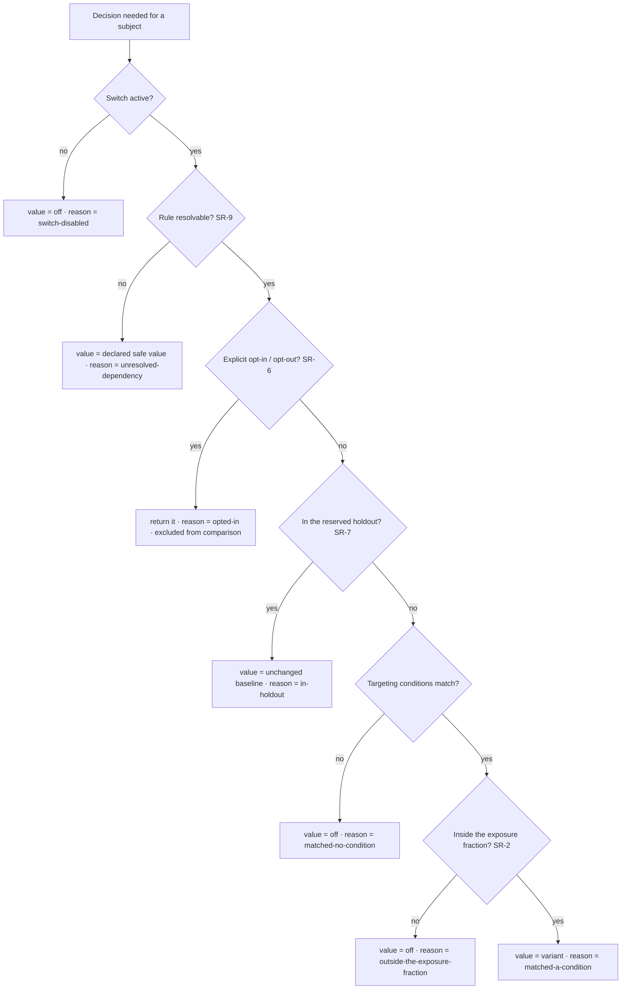

# Staged Rollout & Progressive Enforcement

**Version:** 1.1.0
**Status:** Stable
**Layer:** concept

## Overview

How a running system changes **itself** without betting everything on being right.

Two moves, one discipline. A **behaviour change** — a revised prompt, a different harness setting, a new default, another model — is exposed to a declared fraction of live work behind a named, instantly revertible switch, with assignment computed deterministically rather than stored, and with a reserved holdout that never sees any change so the *cumulative* effect of everything shipped stays measurable. A **new constraint** — a budget, a rate cap, a gate — ratchets through *observe* (blocks nothing, records exactly what it would have blocked) and *warn* (succeeds, but tells the caller it crossed the line) before it is ever allowed to *enforce*.

The unifying rule is one sentence: **nothing goes from absent to universal in a single step, and the counterfactual is measured before the change becomes the only path.**

This is the *shipping* half of self-improvement. The offline optimizer decides which candidate is better; this decides how that candidate reaches real work.

## Related Specifications

- [l1-harness-optimization.md](l1-harness-optimization.md) - The offline search that produces an accepted candidate; HX-8 acceptance is necessary and not sufficient — a candidate still reaches live work through this contract (HX-12).
- [l1-optimization-integrity.md](l1-optimization-integrity.md) - Verifies an optimization's claimed parity; a staged exposure supplies the live control group OI-3/OI-4 measurement wants.
- [l1-improvement-loop.md](l1-improvement-loop.md) - Product-level findings feeding what gets changed; this governs how a change is released.
- [l1-policy-governance.md](l1-policy-governance.md) - Tiered configuration and managed restrictions; a newly introduced restriction ratchets through SR-10 (PG-10).
- [l1-outcome-confidence.md](l1-outcome-confidence.md) - Per-outcome estimate; a rollout metric is a population statistic and the two are never interchanged.
- [l1-declarative-configuration.md](l1-declarative-configuration.md) - A switch is a configuration surface and obeys that contract; its ruleset is the artifact SR-9 distributes.
- [l1-operational-health.md](l1-operational-health.md) - Guardrail signals that can halt a rollout (SR-11) and the alert discipline they reuse.
- [l1-observation-retention.md](l1-observation-retention.md) - The record a rollout comparison is computed over; the holdout's long horizon depends on its retention.
- [l1-security.md](l1-security.md) - Secret isolation, which bounds what a distributed ruleset may carry (SR-9).
- [../../nodus/specifications/l1-nodus-portability.md](../../nodus/specifications/l1-nodus-portability.md) - A workflow reads a host-supplied switch value, resolved once and frozen for the run (LP-19).
- [../../nodus/specifications/l1-nodus-observability.md](../../nodus/specifications/l1-nodus-observability.md) - The run manifest records which variant a run executed under, so a trace is attributable to its arm (HO-18).
- [l1-fault-lifecycle.md](l1-fault-lifecycle.md) - [ADDED v1.1.0] The canonical case for shadow evaluation (SR-12): a changed grouping rule or a new detector is a *recognizer*, and its identity namespace must stay separate from the incumbent's (FL-2).

## 1. Motivation

A system that modifies its own behaviour has a release problem that ordinary software does not. The change is not a feature a user opted into; it is a change to how the system *thinks*, applied to work already in flight, whose effect is measurable only in aggregate and only after the fact. Three failures follow if the release is a flip.

**A flip has no controlled failure mode.** A revised prompt that is 3% worse looks exactly like noise on any single task and is catastrophic across ten thousand. If it went to everyone at once there is no unaffected population to compare against, so the regression is invisible until someone complains, and the only remedy is a full reversal that itself has to be shipped.

**Improvement is measured one change at a time and never in total.** Each individual comparison says "this change beat its baseline". Run fifty of them and every one can be a genuine local win while the system as a whole drifts somewhere worse — because each baseline was the *previous* changed state, and nobody ever compared against the original. Only a population deliberately excluded from *everything* can answer "is all of this actually better than where we started?", and that population has to be reserved before it is needed, not reconstructed afterwards.

**A new limit is a change too, and the most dangerous kind.** Introducing a budget cap, a rate limit, or a gate looks like tightening safety. In practice a threshold chosen from intuition and switched straight to blocking discovers its real blast radius by breaking whatever it was mis-sized against — and it breaks it everywhere simultaneously, because limits do not roll out, they simply start refusing. The measurement that would have prevented this is trivially available beforehand: run the limit, block nothing, count what it *would* have blocked.

There is a fourth reason, quieter and more corrosive: **assignment state is a liability**. Storing "who is in which arm" in a table creates something that can be lost, partially written, replicated stale, or silently diverge between the component that assigns and the component that reports. Computing assignment as a pure function of the switch's name and the subject's key removes the entire class: there is nothing to lose, the answer is reproducible offline for any subject, and two components independently arrive at the same result without talking to each other.

## 2. Constraints & Assumptions

- Rollout is **local-first**: assignment is computed on-device, the ruleset is held locally, and no decision requires a network round trip.
- A "subject" is whatever the change is applied to — a work unit, a session, an office, a device. Which one is a per-switch declaration, not a global choice.
- This spec governs *release*, not *decision quality*. Whether a candidate is better is owned by evaluation and the offline optimizer; whether it should reach everyone at once is owned here.
- Rollout state (which switches exist, at what exposure) is user-inspectable and user-controllable; nothing here creates a hidden channel through which the system changes itself unobserved.
- The population sizes on a single user's device may be small. Small-sample honesty is therefore a first-class requirement, not an afterthought (SR-11).

## 3. Core Invariants

Rules every Layer 2 implementation MUST NOT violate:

- **SR-1 (Every behaviour change ships behind a named, instantly revertible switch):** a change to how the system behaves — a prompt, a harness setting, a default, a model choice, a newly enforced limit — is introduced behind a **named switch** whose current exposure is inspectable and whose previous state is restorable **without a rebuild, a reinstall, or a restart of in-flight work**. A change that can only be undone by shipping another version is not staged; it is a bet, and it is forbidden for anything that alters live behaviour.
- **SR-2 (Assignment is a pure function — deterministic, stateless, reproducible):** whether a subject is exposed is computed from `(switch identity, subject's pinned key)` alone — never drawn at random, never read from an assignment table. Three properties follow and all three are required: the same subject always gets the same answer; any answer is reproducible offline from the two inputs, so "why did this run get that variant?" is always answerable; and there is no assignment state to lose, corrupt, or let drift between the component that assigns and the component that reports.
- **SR-3 (Switches are mutually independent):** the assignment function is **salted by the switch's identity**, so two switches at the same exposure fraction select different, uncorrelated subsets. Two changes at 10% MUST NOT land on the same 10% of subjects — if they do, every effect is confounded with every other and no comparison means anything. Independence is a property of the function, not something an operator has to remember to arrange.
- **SR-4 (Monotone under widening):** raising a switch's exposure fraction MUST only **add** subjects — no subject already exposed may be dropped by a widening — and lowering it removes only the most recently added. A subject flipping in and out as an operator tunes a percentage is a correctness defect, not an inconvenience: it silently destroys the comparability of everything measured on either side of the tuning. Separately and for the same reason, a decision already taken for a **unit of work in flight** is fixed for that unit's lifetime: changing or disabling a switch governs future decisions only, and never re-decides work already running. A unit that straddled two variants — half its steps under one, half under the other — is attributable to neither arm and silently poisons every comparison it enters, so it must be unrepresentable rather than merely discouraged.
- **SR-5 (The bucketing key is pinned and survives identity transitions):** the key used for assignment is declared once per switch and chosen so it does **not change** when the subject's identity does — a subject that gains a name, is renamed, or is merged keeps its assignment. Where a key genuinely must change, the prior key is recorded and continues to govern that subject for the switch's lifetime. A subject silently changing arm mid-flight corrupts both its experience and every measurement it contributed to.
- **SR-6 (Explicit opt-in outranks computed targeting):** a human's explicit opt-in or opt-out for a switch is evaluated **first** and short-circuits every percentage and targeting rule, and the resulting decision records that it came from an opt-in. Exposure rules govern who is *offered* a change; they never override who *asked* for one. Subjects reached by opt-in are excluded from the rollout's comparison population — a self-selected group is not a sample.
- **SR-7 (Reserved holdout for cumulative effect):** a declared fraction of subjects MAY be reserved as a **holdout** excluded from *every* switch, assigned by a key independent of any individual switch's identity so the same subjects remain held out across changes and over time. This is the only construct that answers whether the **accumulation** of everything shipped is better than where the system started — a question no individual comparison asks, since each one measures against the previous already-changed state. A holdout is reserved before it is needed; it cannot be reconstructed after the fact.
- **SR-8 (Every decision explains itself, including the negatives):** an evaluation returns the value **and a reason** from a closed vocabulary — opted-in · in-holdout · matched-a-condition · outside-the-exposure-fraction · matched-no-condition · switch-disabled · unresolved-dependency. Where several could apply, the **most informative** is returned: "outside the exposure fraction" tells an operator that targeting matched and only the dice did not, which "no match" does not. A rollout that can only say *no* is undebuggable, and an undebuggable rollout gets turned off rather than fixed.
- **SR-9 (Local, offline, fail-closed evaluation):** the ruleset is resolved **at the decision point** from a locally-held copy: a decision requires no network round trip, and loss of connectivity changes no behaviour — it only freezes the ruleset, whose staleness is bounded and observable. A switch that cannot be resolved — definition missing, dependency missing or cyclic, ruleset older than its declared staleness bound — evaluates to its **declared safe value**, normally *off*; never to on, and never to an error that stalls the work. A ruleset distributed to a surface carries nothing that surface is not entitled to hold: a switch declares where it may be evaluated, and no secret rides in a payload.
- **SR-10 (New constraints ratchet: observe → warn → enforce):** a newly introduced *limit* — a budget, a rate, a size cap, a gate — MUST NOT go from absent to blocking in one step. It is introduced in **observe** mode, blocking nothing and recording exactly what it *would have* blocked; promoted to **warn**, in which the affected operation still succeeds but the caller is told it crossed the threshold so it can adapt before hitting the wall; and only then to **enforce**. The warn threshold is **derived** from the enforce threshold by a declared ratio rather than configured separately, so the two cannot drift apart. Skipping observe is forbidden: a limit whose would-have-blocked set was never measured is a limit whose blast radius is unknown, and it will discover that radius by breaking something.
- **SR-11 (Pre-declared question, frozen stopping rule, independent guardrails):** where a switch exists to *decide* between alternatives, the metric, the minimum exposure and duration, and the stopping rule are declared **before** exposure begins and are frozen for the switch's lifetime. A decision MUST NOT be made by watching the numbers until they look favourable — that is not a measurement, it is a search for a moment. Separately and independently, a declared set of **guardrail** signals MAY halt or revert the rollout at any time regardless of the primary metric; a guardrail trip is always allowed to stop a rollout early, and a favourable primary metric never is. When the pre-declared minimum is not reached, the honest outcome is *undecided* — never a directional claim from an underpowered comparison.

- **SR-12 (Shadow evaluation — a third mode, and its identity trap):** [ADDED v1.1.0] where the change is a **recognizer** rather than a behaviour — a detector, a classifier, a grouping rule, a scorer: something that *decides what things are* rather than *what happens to them* — it MAY be introduced in **shadow**: run against **all** live input while producing **no** user-visible effect, its output compared against the incumbent's before either replaces the other. Shadow answers the question a fractional exposure cannot, because a recognizer's value is measured by *what it finds across everything*, not by *how a fraction of subjects fare*. Two rules make it safe. **Quarantined output**: a shadow's findings raise nothing, notify nobody, and enter no record a consumer reads as real; they exist only for comparison. **A shadow MUST NOT share an identity namespace with the incumbent** — it computes its findings under a distinct namespace, and its identities are discarded on promotion. This is the trap that makes shadow mode dangerous rather than merely useless when done wrong: if the shadow writes identities into the same space, then every finding it makes is *already recorded* by the time the change is promoted, so the promoted recognizer sees a world where nothing is new — and the entire first-occurrence path (notification, assignment, escalation, initial triage) is silently skipped for exactly the findings the change was made to surface. The failure is invisible, permanent for those findings, and indistinguishable from "the new detector found nothing".

> L2 specs cannot reach RFC status until all invariants here are addressed in their "Invariant Compliance" section.

## 4. Detailed Design

### 4.1 Evaluating a switch



The order is load-bearing at three points. **Opt-in first**, because a human's explicit request must never be overruled by a percentage. **Holdout before conditions**, because a held-out subject must be untouched by every switch regardless of how well it matches any of them. **Fraction last**, because it is the only step that consumes the pinned key — everything cheaper and more decisive happens before it.

### 4.2 Why assignment is computed, not stored

```text
[REFERENCE]
exposed(switch, subject) :=
    position := stable_hash(switch.identity ‖ subject.pinned_key) → [0, 1)
    position < switch.exposure_fraction
```

Four properties fall out of this one line, each of which would otherwise be a separate mechanism to build and keep correct:

| Property | Why it holds | What it would cost otherwise |
| --- | --- | --- |
| Stability (SR-2) | Same inputs → same position, forever | An assignment table that must never be lost |
| Independence (SR-3) | The switch identity is part of the hashed input, so each switch permutes subjects differently | Manual coordination to keep concurrent rollouts disjoint |
| Monotonicity (SR-4) | A subject's `position` never moves; only the threshold does, so widening can only admit | Re-randomisation on every change, destroying comparability |
| Reproducibility (SR-2) | Any past decision recomputes from two recorded values | Retaining every decision to answer "why this variant?" |

Monotonicity has a second half that lives in time rather than in the threshold: a decision taken for a unit of work is frozen for that unit's lifetime (SR-4). Disabling a switch stops new work from entering the change; it does not reach into a run already underway and swap the ground out from under its remaining steps. A run that was half one variant and half another cannot be attributed to either arm, so the guarantee is not "we avoid that" but "that cannot be recorded, therefore cannot happen".

Monotonicity is the property most often lost by implementations that draw randomly per evaluation or re-shuffle when a percentage changes, and it is the one whose loss is hardest to notice: everything looks fine until a comparison spanning a tuning event quietly compares two different populations.

### 4.3 The holdout answers a different question (SR-7)

| | An individual switch | The reserved holdout |
| --- | --- | --- |
| Compares | This change vs. the state just before it | Everything shipped vs. the state before all of it |
| Baseline | Moves with every prior change | Fixed, by construction |
| Answers | "Did this change help?" | "Did all of this help?" |
| Can be created after the fact | Yes | **No** — it must be reserved in advance |
| Cost | None beyond the split | A declared fraction never receives improvements |

Fifty changes can each beat their own immediate baseline while the system as a whole ends up worse, because each baseline already contained the previous forty-nine. The holdout is the only construct that notices, and it is worth its cost precisely in a system that changes itself often.

### 4.4 The constraint ratchet (SR-10)

| Mode | Blocks? | Caller told? | What it produces | Promote when |
| --- | --- | --- | --- | --- |
| **observe** | No | No | The counterfactual: exactly what *would* have been blocked, and how often | The would-have-blocked set is understood and sized as intended |
| **warn** | No | **Yes** — the operation succeeds and the caller learns it crossed the threshold | Adaptation time for callers that can back off on their own | Warn rate is stable and callers have adapted |
| **enforce** | Yes | Yes | Actual protection | — |

```text
[REFERENCE]
warn_threshold := enforce_threshold × declared_ratio      // derived, never separately configured
```

Deriving the warn threshold is not a convenience. Two independently configured thresholds drift — someone raises the enforce limit and forgets the warn limit, and the warning that was supposed to arrive first now arrives after the block, which is worse than no warning at all because it is trusted.

The three modes also give a limit the same reversibility a behaviour change has (SR-1): demoting `enforce → warn` restores service immediately without changing any threshold, which is the correct first response to a limit that turns out to be mis-sized.

### 4.5 Honest measurement at small populations (SR-11)

A single user's device does not produce large samples, and the temptation is to report a direction anyway. The spec forbids it in three specific ways: the minimum exposure and duration are declared **before** the comparison starts, so they cannot be relaxed once the numbers look promising; the stopping rule is frozen, so a favourable moment is not a reason to stop; and an under-powered comparison reports **undecided** rather than a direction. Guardrails are deliberately exempt from this symmetry — a guardrail may stop a rollout on evidence that would be too weak to *approve* one, because the costs of the two errors are not the same.

### 4.6 Three modes, three questions (SR-1 / SR-10 / SR-12)

| Mode | Applies to | Who is affected | Question it answers |
| --- | --- | --- | --- |
| **Fractional exposure** | A behaviour change | A declared fraction | "Does this change make outcomes better for those who get it?" |
| **Ratchet** (observe → warn → enforce) | A new limit | Nobody, then everybody | "What would this limit have blocked?" |
| **Shadow** (SR-12) | A recognizer — detector, classifier, grouping rule | Nobody | "What would this find, across *everything*?" |

Shadow is not a weaker fractional exposure. A recognizer's quality is a property of its findings over the whole input, so exposing it to 10% of subjects answers the wrong question — it measures 10% of the findings rather than the finding rate. Conversely, fractional exposure is wrong for a recognizer in the other direction too: half the record classified one way and half another is a record with two incompatible meanings in it.

### 4.7 Boundary with neighbouring layers

| Concern | Owner |
| --- | --- |
| Which candidate is better, measured offline | Harness optimization (its acceptance is necessary, not sufficient) |
| Whether an optimization preserved outcomes | Optimization integrity (this supplies the live control) |
| How a change reaches live work, and how it is undone | **This spec** |
| Whether *one* outcome will hold up | Outcome confidence — a per-outcome estimate, never interchangeable with a population statistic |
| Tiered configuration precedence and managed restrictions | Policy governance (a *new* restriction ratchets through SR-10) |
| The retained record a comparison is computed over | Observation retention |

## 5. Drawbacks & Alternatives

- **A reserved holdout permanently withholds improvements from some subjects.** Accepted and declared: it is the price of being able to tell whether the improvements are real. The fraction is a configured, inspectable number, and a system that ships few changes may set it to zero.
- **Deterministic assignment means a subject cannot be re-randomised.** That is the point (SR-4), but it does mean a badly-assigned subject stays badly assigned for the switch's lifetime; the remedy is a new switch identity, which is explicit and recorded rather than silent.
- **Small populations limit what can be concluded.** Addressed by SR-11's *undecided* outcome rather than by lowering the bar. Some questions genuinely cannot be answered on one device, and saying so is the honest result.
- **The ratchet delays protection.** Accepted: a limit that blocks nothing for a while is strictly safer than one whose blast radius is unknown, and observe mode is usually short because it produces its answer immediately.
- **Alternative — ship changes directly and revert on complaint.** Rejected by SR-1: a 3% regression produces no complaint, only a slow decline, and by the time it is visible there is no unaffected population left to compare against.
- **Alternative — store assignments in a table.** Rejected by SR-2: it creates state that can be lost, partially written, or diverge between assigner and reporter, and it makes "why did this get that variant?" unanswerable once the row is gone.
- **Alternative — re-randomise when a percentage changes.** Rejected by SR-4: it silently destroys comparability across the change, and the destruction is invisible in the data.
- **Alternative — measure each change against its predecessor and trust the chain.** Rejected by SR-7: a chain of locally-favourable steps has no global guarantee, and this is exactly the failure mode of a system that improves itself continuously.
- **Alternative — turn a new limit on and watch for breakage.** Rejected by SR-10: the watching happens after the breaking, and the information that would have prevented it was available for free beforehand.

## Canonical References

| Alias | Path | Purpose |
| --- | --- | --- |
| `[OPTIMIZER]` | `.design/main/specifications/l1-harness-optimization.md` | Produces the accepted candidate this contract releases (HX-8 → HX-12). |
| `[INTEGRITY]` | `.design/main/specifications/l1-optimization-integrity.md` | Parity measurement that consumes the live control a staged exposure provides. |
| `[POLICY]` | `.design/main/specifications/l1-policy-governance.md` | Tier model a switch's configuration resolves through; newly introduced restrictions ratchet per SR-10. |
| `[RETENTION]` | `.design/main/specifications/l1-observation-retention.md` | The retained record over which a rollout comparison and the holdout's long horizon are computed. |

## Document History

| Version | Date | Author | Notes |
| --- | --- | --- | --- |
| 1.1.0 | 2026-07-23 | Core Team | Added SR-12 (shadow evaluation) + §4.6 — a third introduction mode beside fractional exposure and the ratchet, for a **recognizer** (a detector, classifier, grouping rule, or scorer — something deciding *what things are* rather than *what happens to them*): run against all live input while producing no user-visible effect, output compared against the incumbent before either replaces the other. Shadow answers what a fractional exposure cannot, since a recognizer's value is its findings across *everything* rather than how a fraction of subjects fare; conversely a fraction is wrong in the other direction too, leaving a record with two incompatible classifications in it. Two rules make it safe: **quarantined output** (findings raise nothing, notify nobody, enter no record read as real) and **no shared identity namespace with the incumbent** — the trap that makes shadow mode dangerous rather than merely useless when done wrong, because a shadow writing into the same identity space makes every finding *already recorded* by promotion time, so the promoted recognizer sees a world where nothing is new and the entire first-occurrence path (notification, assignment, escalation, initial triage) is silently skipped for exactly the findings the change existed to surface — invisibly, permanently for those findings, and indistinguishable from "it found nothing". Related Specifications extended with `l1-fault-lifecycle`. |
| 1.0.0 | 2026-07-23 | Core Team | Initial spec — the release half of self-improvement: nothing goes from absent to universal in one step, and the counterfactual is measured before the change becomes the only path. Named, instantly revertible switches for every behaviour change (SR-1); assignment as a pure deterministic stateless function of switch identity + pinned subject key, reproducible offline with no assignment table to lose (SR-2); mutual independence by salting on the switch identity so concurrent rollouts never confound (SR-3); monotonicity under widening so tuning a percentage never re-shuffles subjects and silently destroys comparability, plus its temporal half — a decision taken for a unit of work in flight is frozen for that unit's lifetime, so no run straddles two arms (SR-4); a pinned bucketing key that survives identity transitions (SR-5); explicit opt-in short-circuiting computed targeting and excluded from the comparison population (SR-6); a reserved cross-switch holdout — the only construct that answers whether the accumulation of many locally-favourable changes actually improved anything, and one that cannot be created after the fact (SR-7); every decision returning the most informative reason from a closed vocabulary, including the negatives (SR-8); local, offline, fail-closed-to-a-declared-safe-value evaluation with bounded observable staleness and no secret in a distributed ruleset (SR-9); the observe → warn → enforce ratchet for newly introduced limits with the warn threshold derived rather than separately configured (SR-10); pre-declared frozen stopping rule with independent guardrails and an honest *undecided* outcome at small populations (SR-11). Concept-only. |
