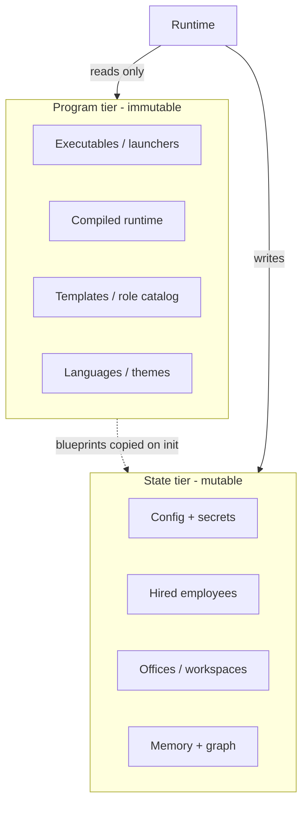
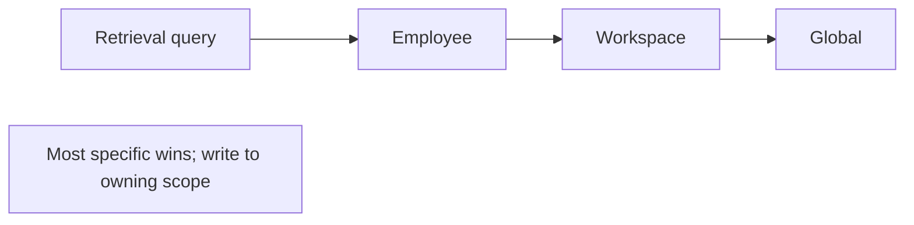

# Storage & State Model

**Version:** 1.0.0
**Status:** Stable
**Layer:** concept

## Overview

The technology-agnostic model for how Cronus stores everything on a user's machine. It defines two tiers — an **immutable program** tier and a **mutable state** tier — and a **multi-level memory** model (global / workspace / employee / session). It is the "start from the end" view: what lands on the user's device and how it changes over time.

## Related Specifications

- [l1-architecture.md](l1-architecture.md) - Refines INV-5 (durable state) and INV-7 (security) in the storage domain.
- [l1-office-model.md](l1-office-model.md) - Office-per-project isolation (OFF-1) and persistent learning (OFF-9) realized as state scopes.
- [l2-filesystem-layout.md](l2-filesystem-layout.md) - Concrete OS-native paths and directory trees.
- [l2-technology-stack.md](l2-technology-stack.md) - Storage technology (SQLite + sqlite-vec, optional remote sync).

## 1. Motivation

Designing "from the end" — the installed footprint — forces clarity about what is shipped versus what is grown. Separating an immutable program from mutable state makes updates safe (replace the program, keep the state), makes backups trivial (copy one tier), and makes the system's learning durable (OFF-9). A scoped memory model lets the agent remember at the right granularity (the human, the office, the role, the conversation) and forget cleanly when a scope disappears.

## 2. Constraints & Assumptions

- The program tier is read-only at runtime; the runtime writes only into the state tier.
- State is local-first and self-contained; remote synchronization is optional, never required.
- Secrets are part of the state tier but are excluded from backups, exports, and version control.
- Some state is regenerable (caches, indices) and may be discarded without data loss.

## 3. Core Invariants (Layer 1 only)

Rules every Layer 2 implementation MUST NOT violate:

- **STO-1 (Two-tier separation):** program artifacts are immutable at runtime; all mutable state lives in a separate tier. Updating or reinstalling the program MUST NOT modify or require the state tier.
- **STO-2 (Durable, restartable state):** all runtime-produced state persists durably and the system resumes from it after a restart, with no loss (consistent with architecture INV-5).
- **STO-3 (Catalog vs instance):** blueprints (role and workspace templates, the role catalog) are read-only in the program tier. Using a blueprint creates a mutable **instance** in the state tier; an instance MUST NOT mutate its blueprint.
- **STO-4 (Multi-level memory):** memory is partitioned into scopes — **global**, **workspace**, **employee**, **session**. Retrieval resolves most-specific-first (employee → workspace → global); a write targets the scope the fact belongs to.
- **STO-5 (Scope-bound lifecycle):** deleting a scope (office, role, or session) deletes the memory owned by that scope. Only the global level outlives all others. Session memory decays and is pruned over time.
- **STO-6 (Secret isolation):** secrets are confined to the state tier and MUST be excluded from backups, exports, and version control (consistent with architecture INV-7).
- **STO-7 (Restore-by-copy):** the mutable state tier (excluding secrets and regenerable caches) is self-contained and restorable by copying it; no hidden external dependency is required to resume.
- **STO-8 (Human-inspectable state):** durable state SHOULD be human-readable and editable where practical (text/Markdown), with machine indices (databases) derived from it rather than being the sole source of truth.

> L2 specs cannot reach RFC status until all invariants here are addressed in their "Invariant Compliance" section.

## 4. Detailed Design

### 4.1 The two tiers

### 4.2 Memory levels

| Level | Scope | Holds | Lifecycle |
| --- | --- | --- | --- |
| Global | The installation / the human client | Cross-project facts, preferences, shared skills | Long-lived |
| Workspace | One office/project | Office knowledge, project graph | Lives with the office |
| Employee | One hired role | Role expertise | Grows with the role (OFF-9) |
| Session | One conversation/run | Episodic dialogue/decisions | Decays, auto-pruned |

### 4.3 Backup and update flows

- **Update:** replace the program tier; the state tier is untouched (STO-1).
- **Backup:** copy the state tier minus secrets and caches (STO-6, STO-7).
- **Restore:** drop the copied state tier back in place; the runtime resumes from it (STO-2).

## 5. Drawbacks & Alternatives

- **Two indices vs one source:** STO-8 implies maintaining derived databases alongside human-readable text, adding sync cost; justified by inspectability and git-friendliness.
- **Alternative — single opaque database:** simpler but violates STO-8 and complicates backup/merge; rejected.
- **Alternative — one global memory only:** simplest but breaks office isolation (OFF-1) and clean forgetting (STO-5); rejected in favor of multi-level. <!-- TBD: whether global+workspace+employee share one physical database (attached) or separate files -->

## Canonical References

| Alias | Path | Purpose |
| --- | --- | --- |
| `[ARCH]` | `.design/main/specifications/l1-architecture.md` | State/security invariants this model refines |
| `[OFFICE]` | `.design/main/specifications/l1-office-model.md` | Office isolation and learning realized as scopes |
| `[LAYOUT]` | `.design/main/specifications/l2-filesystem-layout.md` | Concrete realization of this model |
