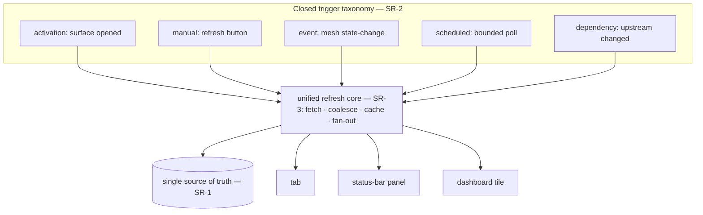

# System Readout & Refresh

**Version:** 1.0.0
**Status:** Stable
**Layer:** concept

## Overview

A **readout** is a piece of live system state the application shows a user — the
remaining token balance, a health score, process statistics, a connection status.
The same readout can be shown in several places (a dedicated tab, a dashboard tile, a
persistent status-bar panel) and can need refreshing for several reasons (the surface
just opened, the user pressed *Refresh*, a state-change event fired, or a
persistently-displayed panel polls on a cadence). Left to grow organically, every
readout on every surface reinvents its own fetch, its own poll timer, its own
debounce, and its own "when is this stale?" logic — and two surfaces showing the same
number start to disagree.

This spec defines the **one unified mechanism** every system readout flows through.
Just as all work flows through one board and all internal events through one routing
mesh, all live readouts flow through one refresh core: a readout has a single source
of truth, is refreshed only through a closed set of trigger kinds, coalesces
redundant refreshes into one fetch, carries its own freshness so it never lies about
being current, and is refreshed only when something is actually looking at it. Add a
new readout, or show an existing one in a new place, and you subscribe to the core —
you do not write refresh logic again.

## Related Specifications

- [l1-event-mesh.md](l1-event-mesh.md) — the event-routing substrate the **event** trigger kind rides (SR-2); the mesh routes the signal, this spec is the readout-refresh discipline over it.
- [l1-scheduler-model.md](l1-scheduler-model.md) — the **scheduled** trigger kind for a persistently-displayed readout uses the scheduler's recurring fire (SR-2), durable across restarts (SCH-6).
- [l1-navigation-model.md](l1-navigation-model.md) — the status-bar/panel and tab surfaces where readouts render (the bottom system panel is a persistent readout host).
- [l1-application-shell.md](l1-application-shell.md) — the frontend state authority and action dispatch this refresh core plugs into; readouts are shell-hosted state.
- [l1-dashboard.md](l1-dashboard.md) — a readout surface (statistics tiles) that becomes one consumer of the core, not a bespoke refresher.
- [l1-process-monitor.md](l1-process-monitor.md) — its live, configurable-cadence sampling (PM-6) is a readout on the **scheduled** trigger; observe-only (PM-1) parallels SR-7.
- [l1-operational-health.md](l1-operational-health.md) — the health score/snapshot is a readout; measure-don't-act (OH-1/OH-7) parallels SR-7.
- [l1-log-legibility.md](l1-log-legibility.md) — honest staleness (SR-5) and visibility-gated economy (SR-6) mirror LL-5 honest-reduction and the log economy discipline.

## 1. Motivation

The concrete case: a token-balance readout. A user might open a tab that shows it
(refresh on open), press a *Refresh* button (manual), expect it to update when the
balance actually changes (event), or pin it to the bottom status panel where it
should stay current on its own (a periodic poll). That is four different reasons to
refresh *one* number. Multiply by every system readout — health, process stats,
connection state, sync status — and by every surface each can appear on, and the
naïve result is dozens of independent little refreshers, each with subtly different
timing, caching, and staleness behaviour.

Three problems follow, and one mechanism prevents all three:

- **Disagreement.** Two surfaces fetching the same datum independently drift out of
  sync; the tab says one balance, the status bar another. One source of truth per
  readout (SR-1) removes this by construction.
- **Waste.** Independent pollers refresh data nobody is looking at, and a burst of
  triggers fires N fetches for one number. Visibility-gated economy (SR-6) and
  coalescing (SR-4) make refresh proportional to actual need — which matters acutely
  when a refresh costs an API call or quota, as a token-balance check may.
- **Dishonesty.** A surface that silently shows a cached value as if it were current,
  or blanks on a failed refresh, misleads the user. Explicit freshness (SR-5) makes
  every value say how current it is.

Unifying the mechanism is the same move the system already made for work (one board)
and for internal events (one mesh): name the common pattern once so every readout —
current and future — inherits correct, consistent, economical behaviour instead of
re-deriving it.

## 2. Constraints & Assumptions

- A readout is *displayed* system state; this spec governs how it is kept fresh, not
  what any particular datum means.
- Refreshing a readout may be costly (an API call, a quota draw); economy is a
  correctness concern, not only performance.
- The trigger kinds are a closed, small set; a genuinely new kind is a taxonomy
  amendment, not a per-readout invention.
- The mechanism is in-process within one engine instance (parity with the event mesh
  and the modular-monolith architecture).
- Refreshing observes state; it never commands it.

## 3. Core Invariants

Rules every Layer 2 implementation MUST NOT violate:

- **SR-1 (One source of truth per readout):** each readout has exactly one
  authoritative provider of its current value. Every surface that displays the readout
  reads that same source through the shared mechanism; a surface MUST NOT independently
  re-fetch or re-derive the value. Two surfaces showing the same readout therefore can
  never display disagreeing values.

- **SR-2 (Closed trigger taxonomy):** a readout is refreshed only through a closed,
  named set of trigger kinds — **activation** (a surface displaying it opens/mounts),
  **manual** (an explicit user refresh), **event** (a subscribed state-change signal,
  routed over the event mesh), **scheduled** (a bounded periodic poll for a
  persistently-displayed readout, driven by the scheduler), and **dependency** (an
  upstream readout it derives from changed). A surface MUST NOT introduce a refresh
  path outside this taxonomy; a new kind is an amendment to the taxonomy, not a
  one-off.

- **SR-3 (Unified refresh mechanism — no per-surface refresh logic):** all trigger
  kinds feed one shared refresh mechanism. A surface *declares* which readout it shows
  and which triggers apply and *subscribes*; it does not implement its own fetch, poll
  timer, debounce, or cache. The mechanism owns fetching, caching, coalescing, and
  fan-out to every subscribed surface. Refresh behaviour lives in the core, once.

- **SR-4 (Coalescing & single-flight):** concurrent or rapid refreshes of the same
  readout are collapsed into a single in-flight fetch whose result fans out to all
  requesters and triggers. A manual refresh landing during a scheduled poll, or ten
  surfaces mounting at once, MUST NOT produce ten fetches of one datum. Redundant
  refreshes are deduplicated, not multiplied.

- **SR-5 (Explicit freshness & honest staleness):** every readout value carries its
  freshness — a last-updated marker and a state drawn from a closed set (fresh /
  refreshing / stale / error). A surface MUST NOT present a value as current when it is
  not: on a pending or failed refresh it shows the last-known value marked stale (or an
  explicit error state), never a blank pretending to be a value nor a stale value
  pretending to be fresh.

- **SR-6 (Visibility-gated economy):** a readout is refreshed only when something needs
  it — a surface is currently displaying it, or a persistent panel has declared a poll
  cadence — and every scheduled cadence is bounded and configurable. A readout no
  surface is displaying is not polled; a hidden or backgrounded surface suspends its
  activation and scheduled refreshes and resumes on return. The mechanism never spends
  cost or quota refreshing data nobody is looking at.

- **SR-7 (Read-only projection):** refreshing a readout observes system state; it MUST
  NOT mutate it. A readout is a projection of state, never a command — refreshing the
  token balance reads it, it never changes it (parity with the observe-only posture of
  the process monitor and operational health).

- **SR-8 (Cross-surface & cross-frontend consistency):** the same readout behaves
  identically wherever it appears — a tab, a status-bar panel, a dashboard tile — and
  across CLI, TUI, and graphical frontends: same source, same trigger taxonomy, same
  freshness semantics, only the rendering differs (consistent with command parity,
  INV-3). Showing an existing readout on a new surface requires subscribing to the
  core, never authoring new refresh logic.

> L2 specs cannot reach RFC status until all invariants here are addressed in their
> "Invariant Compliance" section.

## 4. Detailed Design

### 4.1 One core, many surfaces, five triggers



Every readout resolves onto this one core. The surfaces on the right subscribe; they
carry no refresh logic of their own (SR-3). The triggers on the left are the only ways
a refresh is ever requested (SR-2).

### 4.2 A refresh request's life

```text
[REFERENCE]
request_refresh(readout, trigger):
    if readout has no live subscriber and trigger != scheduled-declared:   # SR-6
        ignore (nobody is looking)
    if a fetch for readout is already in flight:                           # SR-4
        attach this requester to it; do NOT start a second fetch
    else:
        mark readout state = refreshing                                    # SR-5
        result := source_of_truth.read(readout)          # read-only       # SR-7
        on success: value := result; state := fresh; stamp last_updated
        on failure: keep last value; state := error
    fan out (value, state, last_updated) to every subscribed surface       # SR-1/SR-8
```

The value a surface renders is always `(value, freshness_state, last_updated)`, never
a bare value — that triple is what makes SR-5 honest.

### 4.3 The token-balance readout, mapped

The motivating example, expressed entirely in the taxonomy — no bespoke logic:

| Where shown | Trigger(s) it declares | Behaviour |
| --- | --- | --- |
| Token-info tab | activation + manual + event | Refreshes on open, on the button, and when a balance-changed event arrives; coalesced. |
| Bottom status panel (persistent) | scheduled (bounded cadence) + event | Polls on a bounded cadence while visible, and updates immediately on a balance-changed event; suspended when the panel is hidden (SR-6). |
| Dashboard tile | activation + event | Same source, same freshness; only the rendering differs (SR-8). |

All three read one source (SR-1); a poll and a button press at the same instant are
one fetch (SR-4); each shows *last updated* and a stale/refreshing/error state (SR-5).

### 4.4 Relationship to the mesh and the scheduler

This mechanism does not replace the event mesh or the scheduler — it *consumes* them.
The **event** trigger is a subscription on the mesh (EM-3/EM-4); the **scheduled**
trigger is a recurring scheduler fire (SCH-2/SCH-6). The readout core is the layer
*above* both that turns "a signal arrived" or "the timer fired" into "refresh this
readout, coalesced, and fan the fresh value out to its surfaces." The mesh routes; the
scheduler times; this core keeps displayed data honest and economical.

## 5. Drawbacks & Alternatives

- **Indirection over a direct fetch.** For a one-off, single-surface readout the core
  is more machinery than a direct fetch. Accepted: the cost is paid once in the core,
  and the moment a readout gains a second surface or a second trigger — which the
  token example shows is the norm, not the exception — the direct-fetch approach starts
  re-deriving SR-1/SR-4/SR-5 badly.
- **Alternative — let each surface own its refresh.** The status quo the spec exists to
  prevent: drift between surfaces (SR-1), fetch storms (SR-4), inconsistent staleness
  (SR-5), and wasted polling (SR-6). Rejected.
- **Alternative — poll everything on a global timer.** Simple but violates SR-6: it
  burns cost/quota refreshing readouts nobody is viewing, which is unacceptable when a
  refresh is a metered API call.
- **Over-generalization risk.** Not every value on screen is a "readout" — a one-shot
  result of a user action is not live system state. The taxonomy (SR-2) and the
  "displayed live system state" definition keep the mechanism scoped to genuine
  readouts, not every rendered value.

## Canonical References

| Alias | Path | Purpose |
| --- | --- | --- |
| `[MESH]` | `.design/main/specifications/l1-event-mesh.md` | The event-routing substrate the **event** trigger rides (SR-2). |
| `[SCHED]` | `.design/main/specifications/l1-scheduler-model.md` | The recurring fire behind the **scheduled** trigger (SR-2). |
| `[NAV]` | `.design/main/specifications/l1-navigation-model.md` | The status-bar/panel and tab surfaces that host readouts. |
| `[SHELL]` | `.design/main/specifications/l1-application-shell.md` | The frontend state authority the refresh core plugs into. |

## Document History

| Version | Date | Author | Notes |
| --- | --- | --- | --- |
| 1.0.0 | 2026-07-07 | Core Team | Initial spec — the unified system-readout refresh mechanism (the third convergence beside the one work board and the one event mesh): one source of truth per readout so surfaces never disagree (SR-1); a closed trigger taxonomy activation/manual/event/scheduled/dependency (SR-2); one shared refresh core with no per-surface fetch/poll/debounce logic (SR-3); coalescing & single-flight so N triggers/surfaces yield one fetch (SR-4); explicit freshness & honest staleness — fresh/refreshing/stale/error + last-updated, never a value pretending to be current (SR-5); visibility-gated economy — refresh only what a surface is showing or a panel polls, bounded cadence, never burn quota on unwatched data (SR-6); read-only projection, refresh observes never mutates (SR-7); cross-surface & cross-frontend consistency, only rendering differs (SR-8, INV-3). Consumes the event mesh (event trigger) and scheduler (scheduled trigger) rather than replacing them; the token-balance readout mapped end-to-end in the taxonomy. Main-only; no nodus angle (a host frontend/data-freshness mechanism). |
