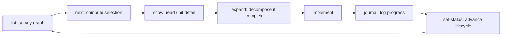
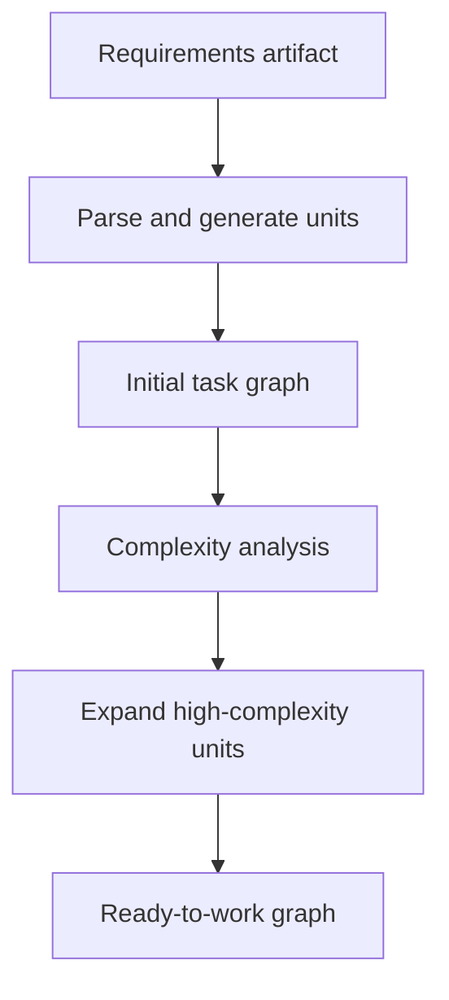
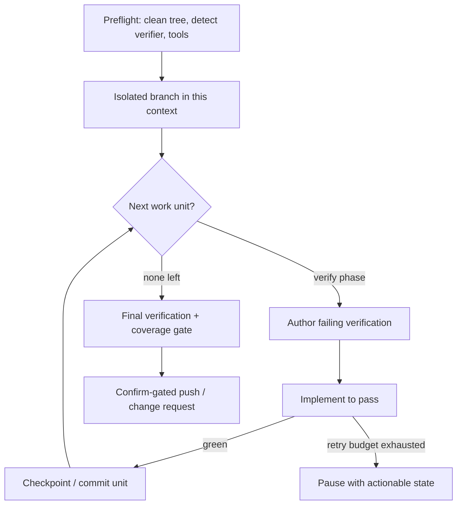

# Task Graph Model

**Version:** 1.0.0
**Status:** Stable
**Layer:** concept

## Overview

A paradigm-neutral model for turning a requirements artifact into a **managed,
hierarchically-decomposable, dependency-ordered task graph** that an agent office
navigates, refines, and executes. It names the small set of primitives and operations
that recur across task-driven development systems — requirement-to-tasks generation,
complexity-gated decomposition, a dependency DAG with deterministic "what's next"
selection, isolated planning contexts, an append-only implementation journal,
drift-driven re-planning, and an autonomous orchestrator/executor split.

This spec is a **model-spec** (sibling to [l1-kanban-model.md](l1-kanban-model.md) and
[l1-scheduler-model.md](l1-scheduler-model.md)): it does not replace existing
subsystems. The board *states* of work live in the kanban model; autonomous *goal
execution* lives in mission-mode; the *stage pipeline* lives in the development
workflow; *quality gates* live in the quality standards. This document owns what those
do not yet name as one coherent concept: the **decomposition algebra** that produces and
maintains the plan itself — how a requirement becomes a graph, how finely that graph is
broken down, how the graph stays correct under change, and how multiple such graphs
coexist without interference. Concrete subsystems remain authoritative for their own
design; this model is the shared vocabulary they compose around.

## Related Specifications

- [l1-kanban-model.md](l1-kanban-model.md) - Canonical work board and pipeline states; this model supplies the *plan and decomposition* whose units the board *tracks*.
- [l1-development-workflow.md](l1-development-workflow.md) - Five-stage Design→Plan→Execute→Review→Deliver pipeline; this model details the Plan/Execute substrate it relies on.
- [l1-orchestration.md](l1-orchestration.md) - Delegation, adaptive topology, error containment; the runtime that drives §6 autonomous execution.
- [l1-agent-framework-skeleton.md](l1-agent-framework-skeleton.md) - Primitive triad and coordination patterns; the orchestrator/executor split of §6 is the work-unit realization of its hierarchical pattern; TG-12 ties to AFS-13.
- [l1-quality-standards.md](l1-quality-standards.md) - Tiered quality gates as definition-of-done; the verification each task unit must declare (TG-3) and the green-gate of TG-14.
- [l1-version-control.md](l1-version-control.md) - Commit authority, card-aligned boundaries, isolated staging; the commit/branch guardrails of TG-14.
- [l1-lookahead-planning.md](l1-lookahead-planning.md) - Pre-execution consequence simulation; complements TG-6 complexity scoring as a second analytical gate.
- [l1-workspace-lifecycle.md](l1-workspace-lifecycle.md) - Home vs project workspaces; the heavier sibling that isolated planning contexts (TG-10) sit *inside*, not duplicate.

## 1. Motivation

Requirement documents and running code sit at two ends of a gap. Bridging that gap by
hand — enumerating tasks, guessing their order, deciding how deeply to break each one
down, keeping the list correct as reality diverges — is exactly the undifferentiated
labor an agent office should absorb. Studied task-driven development systems converge on
a shared answer: treat the plan as a *first-class, navigable data structure* and give it
a small algebra of operations.

Four benefits follow from naming that algebra explicitly:

1. **Generation, not transcription.** A requirements artifact is parsed once into a
   structured task graph that honors its stated constraints and fills only genuine gaps —
   replacing the error-prone manual transcription of intent into a checklist.
2. **Measured decomposition.** How finely to break a task down becomes an analytical
   decision (a complexity score against a threshold), not a fixed habit — avoiding both
   under-planned monoliths and over-shredded busywork.
3. **A plan that stays correct.** Dependency integrity, deterministic next-selection, and
   drift-driven re-planning keep the graph trustworthy as implementation teaches the
   office things the requirements did not know.
4. **Safe autonomy.** A clean separation between a *coordinator* that owns plan state and
   an *executor* that does the work — fenced by isolated branches, green-gated commits,
   and resumable run artifacts — lets the office advance a task end-to-end with
   intervention only where it matters.

The cost of *not* modeling this is a plan that rots: a static task list that drifts from
the code, decomposed by gut feel, with "what's next" re-litigated every session and no
safe path from a chosen task to a delivered, reviewed change.

## 2. Constraints & Assumptions

- **Technology-agnostic.** This is a Layer 1 concept. It names no language, storage
  engine, model provider, transport, or branch tool. Concrete bindings (file formats,
  schemas, runners) live in Layer 2 specs.
- **Defers where a concern is already owned.** Board states defer to the kanban model;
  autonomous goal framing and requirements-clarification defer to mission-mode; stage
  sequencing defers to the development workflow; quality-gate definition defers to the
  quality standards; commit authority defers to version control. This model wins only on
  the decomposition algebra (§3 TG-1…TG-9), isolated planning contexts (TG-10), and the
  work-unit orchestrator/executor protocol (TG-13…TG-14).
- **Requirements-first, but not requirements-only.** The primary input is an explicit
  requirements artifact; ad-hoc single tasks may still be added directly and slotted into
  the same graph.
- **On-device-first.** The task graph, its journal, and run artifacts are user data and
  stay local unless the user authorizes egress (inherited from the security concept).
- **Plan is a living artifact.** The graph is expected to change during implementation;
  immutability applies only to completed units and to historical journal entries, never to
  the forward plan.

## 3. Core Invariants

Layer 2 realizations and concrete subsystems MUST NOT violate these.

- **TG-1 Requirement-sourced generation.** A task graph is *generated* from an explicit
  requirements artifact, not hand-enumerated. Generation strictly honors every concrete
  requirement the artifact states (named libraries, schemas, frameworks, stacks) and fills
  only genuine gaps, favoring the most direct implementation path over speculative scope.
- **TG-2 Hierarchical addressable units.** Every unit of work carries a stable
  hierarchical identifier (task → subtask → sub-subtask, open-ended depth) so any unit is
  individually addressable and every parent/child relationship is explicit. Each level is a
  strict refinement of its parent, never a reorganization of unrelated work.
- **TG-3 Typed task contract.** Each unit declares a fixed field set: title, concise
  description, status, priority, dependencies, implementation detail, and a
  **verification/test strategy**. A unit with no verification strategy is incomplete and
  cannot be marked done.
- **TG-4 Dependency-DAG integrity.** Prerequisite links form a directed acyclic graph.
  Cycles and references to non-existent units are detectable and auto-repairable, and the
  system refuses to introduce a cycle. Dependency state is surfaced (which prerequisites
  are satisfied, which block) wherever a unit is shown.
- **TG-5 Deterministic next-selection.** "What to work on next" is *computed*, never
  guessed: among units whose dependencies are all satisfied, rank by priority, then by
  unblock-impact (how many units a unit gates), then by identifier order. The procedure
  always yields exactly one next unit, or none — never an arbitrary pick.
- **TG-6 Complexity-gated decomposition.** How finely a unit is broken down is decided
  analytically: each unit carries a complexity score, and that score against a threshold
  determines whether it should be expanded and roughly into how many subtasks.
  Decomposition depth is a measured recommendation, not a fixed constant.
- **TG-7 Additive, reversible expansion.** Breaking a unit into subtasks defaults to
  *append*; wholesale replacement is an explicit, separate act (clear-then-expand).
  Decomposition never silently discards an existing breakdown.
- **TG-8 Append-only implementation journal.** Progress, findings, dead-ends, and
  decisions are recorded as timestamped, append-only entries on the unit itself — what
  worked (confirmed truths), what did not and why, and choices made — so a unit accumulates
  an auditable implementation history instead of being overwritten. New entries add fresh
  insight rather than restating existing detail.
- **TG-9 Drift-driven re-planning.** When implementation diverges from plan, the
  not-yet-done units downstream of the divergence point are re-planned from a single
  contextual instruction; completed units are immutable. The plan is reconciled forward —
  never left silently stale, never retroactively rewritten.
- **TG-10 Isolated planning contexts.** Multiple task graphs may coexist as named, fully
  isolated contexts (per feature, branch, or experiment). A change in one context never
  affects another; context switching is explicit and user-controlled (no automatic
  switching); a default context always exists; and legacy single-context data migrates into
  the default context transparently, with zero disruption to existing operations.
- **TG-11 Bounded status lifecycle.** Each unit occupies exactly one status from a bounded
  set (pending / in-progress / done / review / deferred / blocked / cancelled); status is
  the single source of execution truth. Cancellation is distinguished from removal —
  excluding a unit from active planning while preserving it is preferred over deletion, and
  removing a unit cleans up every dangling dependency that referenced it.
- **TG-12 Role-bound generation with external novelty.** Plan-shaping operations
  (generation, complexity analysis, expansion, update) may bind to distinct model roles: a
  default generation role, a **research role** that injects fresh external information
  beyond the model's training horizon, and a fallback role for resilience. The research
  role is the model's channel for external novelty and the disciplined place to consult it
  is before implementing an unfamiliar unit (this is the bounded-novelty requirement of the
  agent-framework anti-collapse rule, applied to planning).
- **TG-13 Coordinator/executor separation.** Autonomous execution splits a pure
  state-machine **coordinator** — which validates preconditions, emits the next typed
  *work unit* (what to do, for which unit, in which phase), and records completion to
  advance state — from an **executor** that performs the work and reports results back. The
  coordinator generates no implementation; the executor holds no plan state. This keeps plan
  logic inspectable and lets the executor be any capable agent.
- **TG-14 Guarded autonomous delivery.** An autonomous run is fenced by hard guardrails:
  work proceeds on an **isolated branch**, never the mainline; a unit is committed only
  after its verification passes (green-gated); a bounded retry budget precedes a
  **pause-with-actionable-state** rather than an open-ended loop; every step appends to a
  durable, resumable run artifact; and outward, hard-to-reverse actions (branch creation,
  push, opening a change request) pass a confirmation gate unless explicitly waived.

> A Layer 2 spec cannot reach RFC status until every TG-n invariant above is addressed in
> its "Invariant Compliance" section.

## 5. Detailed Design

### 5.1 Primitive model

Three primitives compose the model. A given realization populates the subset of fields it
needs.

**Task unit** — the addressable thing that is planned and executed.

| Facet | Purpose |
| --- | --- |
| Identifier | Stable hierarchical address (`N`, `N.M`, `N.M.K`); dotted notation encodes parentage (TG-2). |
| Title / description | Brief name plus a concise summary of what the unit involves. |
| Status | Exactly one lifecycle state (TG-11). |
| Priority | Importance tier used by next-selection (TG-5). |
| Dependencies | Identifiers of prerequisite units; edges of the DAG (TG-4). |
| Detail | In-depth implementation guidance for the unit. |
| Verification | The test/verification strategy that defines done for the unit (TG-3). |
| Complexity | Analytical score driving decomposition depth (TG-6). |
| Journal | Append-only timestamped implementation log (TG-8). |
| Subtasks | Child units — a strict refinement of this unit (TG-2, TG-7). |

**Task graph** — the whole set of units under one planning context: a forest of
parent/child trees overlaid with a dependency DAG. It is the navigable structure that
next-selection (TG-5), validation/repair (TG-4), and re-planning (TG-9) operate on.

**Planning context** — a named, isolated namespace holding one task graph (TG-10).
Contexts let parallel lines of work (a feature, a risky refactor, a teammate's slice) keep
fully separate graphs while sharing the same office, board, and tooling.

### 5.2 The core development loop

The day-to-day cycle the office facilitates over a task graph:

`list` surveys the graph and its statuses; `next` applies deterministic selection (TG-5);
`show` reads a unit's full contract; `expand` decomposes it when complexity warrants
(TG-6); implementation proceeds; `journal` appends findings (TG-8); `set-status` advances
the lifecycle (TG-11). Most sessions never leave this loop.

### 5.3 Requirement-to-graph pipeline

Bootstrapping a graph from a requirements artifact is a distinct, AI-assisted pipeline:

Generation strictly adheres to stated requirements and fills gaps with the most direct
implementation path (TG-1). A second requirements artifact may be parsed *additively* into
an existing context, growing the graph rather than replacing it. The number of top-level
units generated is scaled to the artifact's scope, not fixed.

### 5.4 Complexity-gated decomposition

Decomposition depth is measured, not habitual (TG-6). Each unit is scored (a bounded scale,
e.g. 1–10) for complexity; the score is recorded in a complexity report. A threshold
separates units that warrant breakdown from those simple enough to implement directly, and
the score informs *how many* subtasks to target. Expansion is append-by-default and
reversible (TG-7): generating subtasks adds them; replacing a breakdown is an explicit
clear-then-expand. Expansion may itself be research-augmented (TG-12) for unfamiliar
domains, and may run over one unit or sweep all eligible units at once.

### 5.5 Dependency graph and next-selection

Dependencies form a DAG whose integrity is continuously enforceable (TG-4): a validation
pass detects cycles and dangling references; a repair pass fixes them; and adding an edge
that would close a cycle is refused. Units may be **moved** within the hierarchy
(task↔subtask, re-parenting, reordering) to refine structure as understanding evolves and
to resolve cross-branch planning conflicts by relocation rather than overwrite.

Next-selection (TG-5) is a pure function of graph state: filter to units whose every
prerequisite is `done`, then order by priority → unblock-impact → identifier. The result is
deterministic and explainable, which is what lets the office (and the user) trust "work on
this next" without re-deciding each session.

### 5.6 Multi-context planning

Isolated planning contexts (TG-10) are lightweight namespaces — far cheaper than a full
workspace — that keep parallel task graphs from colliding. The model recognizes recurring
moments to introduce a new context, and treats them as *suggestions*, never forced:

| Trigger | Why a separate context helps |
| --- | --- |
| A new feature branch | Mirror the branch so its units never tangle with the mainline graph. |
| Parallel collaborators | Each contributor plans in isolation; reconcile by moving units later. |
| A risky experiment or refactor | A sandbox graph that can be discarded wholesale if abandoned. |
| A large, multi-step initiative | A dedicated context seeded from its own requirements artifact. |
| A maturity shift (prototype → production) | Re-tune generation toward speed or toward robustness per the context's intent. |

Contexts are isolated, explicitly switched, and migration-safe: a project that never opts
in sees a single default context and no added complexity.

### 5.7 Implementation journal and drift handling

The journal (TG-8) turns each unit into a running log of its own implementation: before
coding, the explored plan (files, intended changes, risks) is appended; during coding,
fresh findings are appended — what worked, what failed and why, decisions taken. Entries
are timestamped and additive, so the unit becomes a durable record an agent (or human) can
learn from instead of repeating mistakes.

Drift handling (TG-9) keeps the *forward* plan honest. When implementation diverges enough
that downstream units are now wrong, a single contextual instruction re-plans every
not-yet-done unit from the divergence point; a narrower form updates exactly one unit.
Completed units and past journal entries are never rewritten — reconciliation flows
forward only.

### 5.8 Dual-surface delivery and tool economy

Plan operations are exposed over more than one surface (a programmatic tool surface for
integrated agents, a command surface for direct use) while **all logic lives in one core**
and the surfaces stay thin (consistent with the layered architecture and CLI-grammar
conventions). Two economy rules matter at this model's altitude:

- **Single source of truth.** Parsing, validation, selection, and transformation live in
  the core library; the tool and command surfaces only invoke and present. The same
  intelligent identifier handling (a unit and its subtask resolved alike) is implemented
  once.
- **Tiered tool exposure.** The agent-facing tool surface is loaded in tiers (a minimal
  daily-driver set, a standard set, the full suite) so context-window budget is spent on
  the operations a session actually needs — the broad management and research operations
  load only when invoked.

### 5.9 Autonomous task execution

A task graph is not only navigated by hand; a single task can be driven end-to-end
autonomously. The model separates two roles (TG-13):

- **Coordinator** — a pure state machine over phases. For the selected task it walks
  eligible subtasks in dependency order and, per subtask, emits typed work units through a
  *verify-first* cycle: produce failing verification first, then minimal implementation to
  satisfy it, then checkpoint on success. It validates preconditions, records completion,
  and persists resumable state. It writes no implementation.
- **Executor** — any capable agent that asks the coordinator for the next work unit,
  performs it (authoring verification, writing code, running checks, committing), and
  reports the result back.

The run is fenced by TG-14 guardrails and leaves a durable trail:

Every step appends to a run artifact (a manifest of run metadata, an event log, per-phase
verification results, the produced change set) so a run is inspectable, resumable from its
last completed work unit, and summarizable into a change-request description. Committing per
subtask — rather than per task — yields atomic, reviewable, individually revertible
checkpoints and natural resume points.

### 5.10 Ideas-to-adopt mapping

What the studied task-driven development systems contribute, and where each lands. Sources
are named by structural idea, not by product.

| Source idea | Worth adopting | Where it lands |
| --- | --- | --- |
| Requirements-artifact parsing into a structured plan | One-shot generation that honors stated constraints and fills only real gaps; additive re-parse. | **New** as TG-1 / §5.3; complements mission-mode's requirements-clarification with a decomposition algebra. |
| Hierarchical dotted task IDs + dependency DAG | Addressable units, integrity validation/repair, deterministic next-selection. | **New** as TG-2/TG-4/TG-5; the plan substrate the kanban board's cards reference. |
| Complexity scoring before breakdown | A measured gate deciding whether and how deeply to decompose. | **New** as TG-6 / §5.4; pairs with lookahead-planning as a second analytical gate. |
| Append-only subtask logging | An implementation journal of confirmed truths and dead-ends on the unit itself. | **New** as TG-8 / §5.7. |
| Drift-driven multi-task update | Re-plan downstream not-done units from one contextual instruction. | **New** as TG-9 / §5.7; the plan-rewrite counterpart to orchestration's drift *checks*. |
| Isolated, named task contexts | Lightweight parallel planning namespaces with safe migration. | **New** as TG-10 / §5.6; sits inside the heavier workspace concept. |
| Three model roles incl. a research role | Role-bound plan-shaping with an external-novelty channel. | TG-12; binds to the model-router and ties to the agent-framework anti-collapse rule. |
| Dual surface with one core + tiered tools | Single source of truth; context-budget-aware tool tiers. | §5.8; already the layered-architecture/CLI-grammar stance, sharpened with tiering. |
| Autopilot orchestrator/executor split | Pure state-machine coordinator emitting work units; verify-first per-subtask loop; isolated branch, green-gated commits, resumable run artifacts. | **New** as TG-13/TG-14 / §5.9; the work-unit realization of the framework's hierarchical pattern. |

## 7. Drawbacks & Alternatives

- **Overlap with neighboring specs.** The model touches board, pipeline, and autonomy
  concerns that other specs own. Mitigation: it states only the decomposition *algebra* and
  the work-unit *protocol*, deferring states to kanban, goal framing to mission-mode, gates
  to quality standards, and commit authority to version control — earning its place through
  the nine invariants those specs do not provide.
- **Generation quality risk.** Auto-generated graphs can be shallow or mis-scoped.
  Mitigation: generation is constraint-strict and gap-minimal (TG-1), complexity-gated
  (TG-6), research-augmentable (TG-12), and always editable — the graph is a living artifact
  (TG-9), not a frozen output.
- **Autonomy blast radius.** A coordinator/executor run touches branches and commits.
  Mitigation: TG-14 fences it — isolated branch, green-gated commits, bounded retries,
  durable resumable artifacts, and confirmation gates on outward actions.
- **Alternative — a flat task list.** Drop the graph and keep an ordered checklist.
  Rejected: a flat list cannot express dependencies, cannot compute a trustworthy "next,"
  cannot scale decomposition by complexity, and rots silently under drift — the exact
  failures this model exists to prevent.
- **Alternative — fold everything into the kanban model.** Rejected: the board models work
  *states*; conflating it with the *plan's structure and generation* would overload one
  spec and lose the clean board↔plan separation that lets each evolve independently.

## Canonical References

| Alias | Path | Purpose |
| --- | --- | --- |
| `[KANBAN]` | `.design/main/specifications/l1-kanban-model.md` | Authoritative board states and pipeline whose cards reference this model's units. |
| `[DEVFLOW]` | `.design/main/specifications/l1-development-workflow.md` | Authoritative Design→Plan→Execute→Review→Deliver pipeline this model's Plan/Execute substrate serves. |
| `[ORCH]` | `.design/main/specifications/l1-orchestration.md` | Authoritative runtime topology and error containment driving §5.9 autonomous execution. |
| `[SKELETON]` | `.design/main/specifications/l1-agent-framework-skeleton.md` | Authoritative primitive triad and coordination patterns; TG-13 realizes its hierarchical pattern, TG-12 ties to AFS-13. |
| `[QUALITY]` | `.design/main/specifications/l1-quality-standards.md` | Authoritative definition-of-done gates behind TG-3 verification and TG-14 green-gating. |

## Document History

| Version | Date | Change |
| --- | --- | --- |
| 1.0.0 | 2026-06-25 | Initial model: requirement-to-graph decomposition algebra, complexity-gated breakdown, dependency DAG with deterministic next-selection, isolated planning contexts, append-only journal, drift-driven re-planning, and the coordinator/executor work-unit protocol for guarded autonomous delivery (TG-1…TG-14). |
