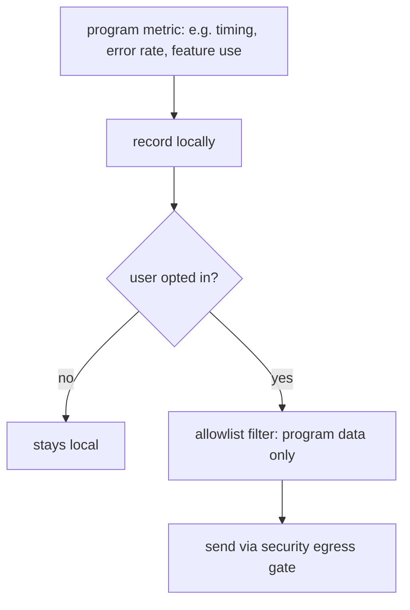

# Telemetry

**Version:** 1.0.0
**Status:** Stable
**Layer:** concept

## Overview

The technology-agnostic model of improvement data: Cronus may collect anonymized **program** metrics — never user data or content — to improve the product, and only when the user opts in. Telemetry is off by default, transparent, purpose-bound, and recorded locally before any send.

## Related Specifications

- [l1-security.md](l1-security.md) - Data-vs-telemetry separation and egress authorization (SEC-3/4).
- [l1-architecture.md](l1-architecture.md) - Security of client data (INV-7).
- [l1-error-reporting.md](l1-error-reporting.md) - A separate, also consent-gated, diagnostic channel.

## 1. Motivation

"Send program operation data, not user data, to improve the product." A privacy-first telemetry model lets Cronus learn what to fix and where it is slow, while guaranteeing the user's projects and content never leave the device.

## 2. Constraints & Assumptions

- The default is no telemetry; sharing is an explicit choice.
- Only non-sensitive program/operational metrics qualify.
- Sending is a separate step from recording.

## 3. Core Invariants (Layer 1 only)

- **TEL-1 (Opt-in):** telemetry is OFF by default; sharing requires explicit user opt-in.
- **TEL-2 (Program data only):** only anonymized program/operational metrics are shared — never user data, content, or secrets (consistent with SEC-4).
- **TEL-3 (Transparent):** what is collected and what would be sent is inspectable by the user.
- **TEL-4 (Purpose-bound):** shared data is used only to improve the product.
- **TEL-5 (Local-first):** telemetry is recorded locally; sending is a separate, gated step that the user controls.

> L2 specs cannot reach RFC status until all invariants here are addressed in their "Invariant Compliance" section.

## 4. Detailed Design

Examples of program metrics: operation latencies, error/repair counts, feature usage, routing outcomes — all aggregated and anonymized. User content, file contents, prompts, and project data are never included (TEL-2). <!-- TBD: default-on vs default-off prompt at first run; exact metric allowlist -->

## 5. Drawbacks & Alternatives

- **Less data when off-by-default:** accepted; privacy outweighs collection volume.
- **Alternative — on-by-default:** rejected; violates the privacy-first stance.

## Canonical References

| Alias | Path | Purpose |
| --- | --- | --- |
| `[SECURITY]` | `.design/main/specifications/l1-security.md` | Data separation and egress |
| `[ARCH]` | `.design/main/specifications/l1-architecture.md` | Client-data security invariant |
