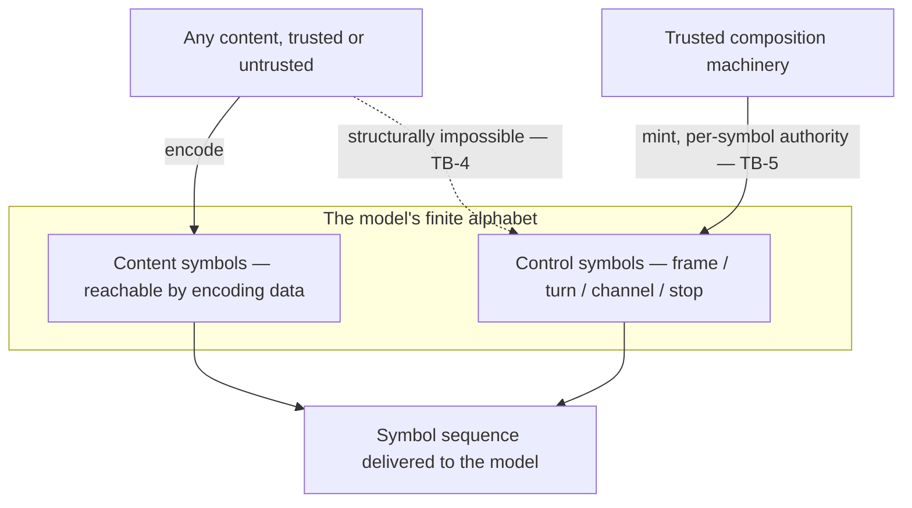

# Tokenization Boundary

**Version:** 1.0.0
**Status:** Stable
**Layer:** concept

## Overview

A model does not consume text. It consumes a sequence of **symbols** drawn from a finite alphabet fixed by that model, and the frontier where the system's characters become that model's symbols is the **tokenization boundary**. Every claim the system makes about a context — how large it is, what it costs, where it may be cut, whether it matches a cached prefix, whether a fragment can reach the model's control channel — is a claim about the symbol sequence, not about the characters or bytes the system happens to hold. Today those claims are made one level too high, in bytes and fragments, and the boundary itself is left unnamed.

This spec names it, and asserts three properties that are counter-intuitive enough that a system which does not state them will get them wrong:

1. **The alphabet is partitioned.** Control symbols — frame, turn, channel, and stop markers — are **structurally unreachable** from any content whatsoever. Not filtered after the fact: unreachable. This is the floor beneath every prompt-injection defense the system already has.
2. **Encoding is not composable.** `encode(A + B)` is not, in general, `encode(A) + encode(B)`. Appending content can retroactively change the symbols already emitted for the content before it. Every design that splits a context and treats the pieces as independent — a frozen cache prefix, a streamed chunk, a truncation point, a compression window — is assuming a property the boundary does not have.
3. **The measure belongs to the model.** A token count produced by a different encoder is a different quantity. An unidentifiable encoder must fail loudly, because a wrong measure yields numbers that are plausible and wrong, which is worse than no numbers at all.

## Related Specifications

- [l1-context-provenance.md](l1-context-provenance.md) — CP-2/CP-6 neutralize untrusted fragments as *text*, with delimiters made of ordinary content. TB-4/TB-5 supply the **structural floor** beneath that: the forgery capability is removed from the alphabet, not escaped in the string. CP-9 is the composing invariant.
- [l1-cache-stable-context.md](l1-cache-stable-context.md) — CSC-2's frozen/live partition point is a symbol seam, not a byte offset (CSC-12). Byte-stability is necessary, never sufficient.
- [l1-inference-cache.md](l1-inference-cache.md) — IC-1's prefix-addressed reuse and IC-9's byte-stability rest on TB-2/TB-3; a prefix cut at an unstable seam either misses or silently violates IC-2 (IC-10).
- [l1-generation-budget.md](l1-generation-budget.md), [l1-context-compression.md](l1-context-compression.md) — both enforce and report token quantities (GB-1/GB-8, CC-6). TB-6/TB-7 name the measure those quantities are denominated in.
- [l1-model-runtime.md](l1-model-runtime.md) — the runtime that owns the encoder artifact; MR-3 content-addressed store, MR-4 verifiable named acquisition, and MR-12 versioned references are the acquisition discipline TB-8 applies to encoders, which are model-bound artifacts in their own right.
- [l1-progressive-disclosure.md](l1-progressive-disclosure.md) — PD-7's addressable cache-friendly tiers are only cache-friendly if their boundaries are stable seams (TB-3).
- [l1-data-lineage.md](l1-data-lineage.md), [l1-claim-verification.md](l1-claim-verification.md) — both attribute an output back to a source span; TB-10 makes the symbol→span correspondence reportable, which is non-trivial because symbol boundaries do not align with character boundaries.
- [l1-security.md](l1-security.md) — SEC-10's authority self-containment has an alphabet-level analog: content may request a frame but can never mint one (TB-5).
- [../../nodus/specifications/l1-nodus-language.md](../../nodus/specifications/l1-nodus-language.md) — NL-19 unforgeable frame markers & seam-anchored segmentation is the host-neutral workflow realization.
- [../../nodus/specifications/l1-nodus-environment.md](../../nodus/specifications/l1-nodus-environment.md) — NE-14 carries TB-6/TB-7 into the evaluation substrate: a token budget without a declared measure is not a budget.

## 1. Motivation

The system already reasons carefully about tokens. It caps output allowances, budgets input context, compresses redundant content, freezes cache prefixes, prices runs from trace counts rather than invoices, and normalizes graded runs to fixed token budgets. Every one of those mechanisms depends on a quantity — *the number of symbols this content becomes* — and on a location — *where in that symbol sequence a cut may fall*. Neither the quantity nor the location is well-defined until the encoder is named.

Left unnamed, the boundary fails in three characteristic ways, and all three fail *quietly*.

**It fails on trust.** Prompt-injection defense is expressed as escaping and delimiting text. But the frame markers that separate a system instruction from a user message are not text — they are symbols in a distinguished sub-alphabet, and if untrusted content can be serialized into that sub-alphabet, then no amount of string escaping matters: the attacker does not need to break out of a delimiter, they need only to *be* one. Conversely, if the encoder makes control symbols unreachable from content, the entire class of frame-forgery attacks is closed by construction rather than by vigilance — and the delimiter discipline becomes a defense-in-depth second layer rather than the load-bearing one.

**It fails on composition.** A cache keyed on a byte-identical leading context looks correct and is not, because a byte prefix is a *symbol* prefix only when the cut lands where no continuation can move it. Content appended after the cut can merge across it and re-encode symbols that were already emitted before it. The cache then either misses (a warmth regression that IC-7 will surface as a mystery) or, worse, serves state computed for a symbol sequence the real request does not have — a silent violation of the guarantee that a hit equals a recompute. The same non-composability quietly corrupts streamed chunk assembly, incremental truncation, and every compression window boundary.

**It fails on measurement.** A ratio-based estimate ("roughly four characters per symbol") is not wrong by a constant; it is wrong by content, and most wrong exactly where it matters — dense code, non-Latin scripts, structured data. A budget enforced with the wrong encoder truncates the wrong place, halts the wrong run, and reports a cost that reconciles with nothing. And a system that silently falls back to a default encoder when it does not recognize a model produces its most confident numbers precisely when it understands least.

Naming the boundary once turns three silent failure modes into three checkable invariants, and lets every downstream spec cite the contract instead of re-deriving it badly.

## 2. Constraints & Assumptions

- Layer 1: this spec names **no** encoding algorithm, alphabet size, merge strategy, symbol format, or vocabulary artifact layout. Whether the encoder combines adjacent units by learned priority, segments on lexical boundaries, or does something else entirely is a Layer-2 concern; the invariants hold for **any** encoder whose output for a span can depend on content beyond that span.
- The boundary is a property of a **model**, not of the system. The system does not choose the alphabet; it discovers, verifies, and obeys it.
- Encoding is assumed **deterministic**: the same content under the same encoder yields the same symbols. An encoder that is not deterministic cannot support cache keying, replay, or budget enforcement, and is out of scope.
- Some models expose no distinguished control sub-alphabet (a flat prompt surface). TB-4/TB-5 are then vacuously satisfied; the remaining invariants are unaffected. This spec never *requires* a control alphabet — it governs what must hold **where one exists**.
- The invariants govern decisions, not implementations of counting. A component that never makes a size, cut, cost, or trust decision does not need an encoder.

## 3. Core Invariants

Rules every Layer 2 realization MUST NOT violate. They are technology-neutral.

- **TB-1 (The model's alphabet is the ground truth):** every statement the system makes about a context's **size, cost, cut points, or cache identity** is a statement about the **symbol sequence the model will receive**, not about the characters, bytes, messages, or fragments the system holds. A component that reasons about "how much context" or "where to cut" MUST either reason in the model's alphabet, or **declare that it is not** and forgo any irreversible decision (TB-7).

- **TB-2 (Encoding is not composable — the unstable tail):** encoding the concatenation of two spans is **not**, in general, the concatenation of their encodings. Appending content can **retroactively change the symbols already emitted for content before it**. Therefore a span's encoding, taken alone, is **not** a prefix of the whole's encoding, and a design that splits content, encodes the pieces independently, and assumes the results concatenate is **wrong by construction** — regardless of how carefully it preserved the bytes.

- **TB-3 (Cut only at declared stable seams):** a cut point is **stable** when no continuation of the content can alter the symbols before it. Every mechanism that splits content — a frozen cache prefix, a streamed chunk, a compression window, a truncation point, a disclosed segment — MUST cut only at a seam the encoder **declares stable**, or MUST re-encode across the cut and pay for it. **A boundary whose stability is unknown is unstable.** Stability is a property the encoder asserts; it is never inferred from the bytes on either side.

- **TB-4 (Control symbols are a disjoint, unreachable sub-alphabet):** where a model distinguishes control symbols — frame, turn, role, channel, and stop markers — they occupy a sub-alphabet **structurally unreachable by encoding any content whatsoever**. No content, however chosen, adversarially or accidentally, encodes to a control symbol. This is a property **of the encoder**, not a sanitizer applied after it, and it is what makes control symbols the **only** provably stable seams (TB-3): the two properties are one fact seen from two sides.

- **TB-5 (Minting a control symbol is an authority; the default is refusal):** emitting a control symbol is an **explicit, per-symbol authority** held by trusted composition machinery and **never by content**. Content that *textually resembles* a control symbol is, by default, **refused at the boundary** — an error, surfaced. The only alternatives are explicit, per-symbol, per-surface dispositions: **encode it inertly** as ordinary content (the neutralization untrusted content receives), or **mint the control symbol** (the authority trusted scaffolding holds). Neither silent inerting nor silent promotion is permitted: the first hides an attack, the second is the attack.

- **TB-6 (The measure is the receiving model's own):** any decision that consumes or enforces a symbol quantity — a context budget, a truncation point, a compression saving, a reported cost, a cache-fit test, a graded run's budget — is computed with the encoder belonging to **the model that will receive the context**. A count produced by a different encoder is **a different quantity** and MUST NOT be substituted for it, compared against it, or aggregated with it.

- **TB-7 (Unknown encoder fails loudly; estimates are declared and never authoritative):** when the receiving model's encoder cannot be identified, the system **fails loudly** and MUST NOT substitute a default encoder. A **family rule** that maps unseen model versions onto a known encoder is permitted, MUST be declared, and its reach is a stated assumption — never a silent catch-all. An **approximate** measure (a heuristic ratio) is permitted only where it is **declared approximate**, and MUST NOT ground an irreversible decision: no truncation, no eviction, no hard budget halt, and no asserted cost figure rests on an estimate.

- **TB-8 (The encoder is a versioned, verified, self-validating artifact):** an encoder is identified by a name covering **both** its content symbols **and** its control sub-alphabet — two encoders sharing content symbols but differing in control symbols are **different encoders and MUST NOT share a name**, because every cache key, budget, and trust decision denominated in one is invalid under the other. Encoder data acquired from any source is **verified against an expected digest before use**, cached content-addressed, re-fetched on mismatch, and **rejected fail-closed** when verification fails. On load its structural invariants are **checked, never assumed**: the content-symbol↔identifier mapping is bijective, the declared alphabet size matches the actual, and no identifier is duplicated.

- **TB-9 (Round-trip fidelity; lossy decode is declared, never default-silent):** encoding is **lossless** over the content it accepts — decoding an encoded content sequence returns the original exactly. Decoding an **arbitrary or truncated** symbol sequence need not yield well-formed text; the lossy repair that makes it presentable is a **declared behavior with a strict alternative**, never a silent default on a path whose output is treated as faithful. In particular, a symbol sequence cut at an arbitrary point does **not** decode to a prefix of the original text — TB-2's mirror image on the decode side, and the reason a streamed partial symbol MUST NOT be rendered as if complete.

- **TB-10 (Symbol↔source correspondence is reportable):** the boundary can report, for each emitted symbol, the **source span it derived from**. This is not a convenience: symbol boundaries **do not align** with character boundaries — one symbol may cover a fraction of a character, or several — so attribution of cost, lineage, grounding, or highlighting back to authored content is impossible for any consumer that assumes they do. A boundary that cannot produce this correspondence forces every downstream attribution to guess.

> L2 specs cannot reach RFC status until all invariants here are addressed in their "Invariant Compliance" section.

## 4. Detailed Design

### 4.1 The two alphabets



The dotted edge is the whole point. It is not a rule that content *must not* reach the control sub-alphabet; it is a fact that it *cannot*. Everything the system builds on top — injection resistance, frame integrity, stable seams — inherits from that one structural impossibility rather than from a filter someone has to remember to apply.

An encoder SHOULD reserve unused identifiers in the control sub-alphabet so the alphabet can grow without renumbering, since renumbering changes the encoder's identity (TB-8) and invalidates every key denominated in it.

### 4.2 The unstable tail

```text
[REFERENCE]
// The property that breaks naive splitting:
encode(A + B)  ≠  encode(A) + encode(B)          // in general — TB-2

// Why: the encoder may combine content across the A|B junction into a symbol
// that neither span produces alone. Appending B re-encodes the tail of A.

split_safely(content, at):
    if not encoder.is_stable_seam(content, at):    // TB-3 — the encoder asserts, we do not infer
        FAIL or re-encode across the cut
    prefix, tail := content[..at], content[at..]
    assert encode(content) == encode(prefix) + encode(tail)   // holds only at a stable seam

// A control symbol is a stable seam by construction (TB-4): no continuation
// can merge across it, because no content can encode into it.
is_stable_seam(content, at) := at follows a control symbol
                            OR encoder declares the junction merge-stable
```

The practical consequence is that **"the bytes did not change" is not a cache-correctness argument.** A frozen prefix whose final characters can merge with the first characters of the live zone has a byte-stable key and an unstable symbol sequence. It will either miss forever, or hit and serve state for a sequence the request does not actually have.

### 4.3 Three dispositions at the boundary

For content that textually resembles a control symbol, exactly three behaviors exist. TB-5 fixes which is the default and forbids the two silent variants.

| Disposition | Behavior | Who chooses it | Default? |
| --- | --- | --- | --- |
| **Refuse** | Reject at the boundary; surface the event to the composition layer | the boundary itself | **Yes (TB-5)** |
| **Inert** | Encode as ordinary content symbols; the model sees characters, not a frame | the surface handling untrusted content (realizes CP-2) | No — explicit, per surface |
| **Mint** | Emit the control symbol | trusted scaffolding, per-symbol authority (CP-3 kinship) | No — explicit, per symbol |

Refusal is the default precisely because it is the only disposition that is never *wrong*: silent inerting is safe but conceals an attempted frame forgery from the trace that CP-8 requires; silent promotion **is** the frame forgery. Refusing hands the decision to a layer that knows which surface it is composing, and that layer then declares its disposition once, explicitly, per surface.

The composition layer's standard configuration therefore reads: *untrusted fragments → inert; system scaffolding → mint the specific frame symbols it owns and no others.* An untrusted fragment reaching a surface whose disposition was never declared is refused, not guessed.

### 4.4 Measurement fidelity

```text
[REFERENCE]
measure(content, for_model):
    enc := encoder_of(for_model)                  // TB-6 — the receiving model's own
    if enc is UNKNOWN:
        if a declared family rule covers for_model:  enc := that rule's encoder   // TB-7, declared
        else:                                        FAIL LOUDLY                  // TB-7, never a default
    return |encode(content, enc)|

// An estimate is a distinct, non-interchangeable kind of value:
estimate(content) -> Approximate(n)
    // permitted for display, prioritization, and early warning
    // FORBIDDEN as the basis of: truncation, eviction, a hard budget halt, an asserted cost
```

Two counts are comparable only when they share an encoder identity (TB-6, TB-8). This is why an evaluation profile's token budget carries its measure's identity: the same nominal budget under two encoders is two different budgets, and rewards earned under them are not comparable.

## 5. Drawbacks & Alternatives

**Alternative: treat tokens as an opaque quantity the provider reports.** Rejected by TB-1/TB-6. Post-hoc reporting cannot answer the questions that must be answered *before* the call — does this fit, where do I cut, does this hit the cache — and it makes the system unable to verify what it is billed for.

**Alternative: escape control-symbol literals in text (a sanitizer).** Rejected by TB-4. A sanitizer is a filter someone must remember to apply on every surface, and CP-7 already establishes there is no unguarded composition surface. Structural unreachability discharges the obligation once, at the encoder, for every surface that will ever exist.

**Alternative: silently encode control-looking content as inert text (no refusal).** Rejected by TB-5 — it is *safe* but it is *dishonest*: an attempted frame forgery becomes indistinguishable from ordinary text, and the trace CP-8 requires never records the attempt. Refuse-by-default surfaces it once; the surface then declares `inert` deliberately, and the declaration is auditable.

**Alternative: assume byte-stability implies symbol-stability.** Rejected by TB-2/TB-3 — this is the specific, plausible, load-bearing error this spec exists to name. It is invisible in review, silent in production, and manifests as an unexplained cache-warmth regression or, worse, as a correct-looking hit on the wrong state.

**Cost: the boundary must be consulted.** Reasoning in the model's alphabet is more expensive than counting characters, and every cut point now requires a stability question. Accepted: TB-7 explicitly permits declared estimates for display, prioritization, and early warning — the exactness obligation attaches only to irreversible decisions, which is where being plausibly wrong is unaffordable.

**Risk: encoder proliferation.** TB-8's rule that a changed control alphabet is a changed encoder means encoders multiply as frame protocols evolve. Accepted deliberately: the alternative is two encoders sharing a name, under which every cache key and budget in the system is quietly invalid.

## Canonical References

| Alias | Path | Purpose |
| --- | --- | --- |
| `[PROVENANCE]` | `.design/main/specifications/l1-context-provenance.md` | The trust contract TB-4/TB-5 supply the structural floor for (CP-9) |
| `[CACHE-STABLE]` | `.design/main/specifications/l1-cache-stable-context.md` | The authoring-side prefix discipline whose boundary TB-3 constrains (CSC-12) |
| `[INFERENCE-CACHE]` | `.design/main/specifications/l1-inference-cache.md` | The storage-side prefix cache whose key TB-2/TB-3 govern (IC-10) |
| `[MODEL-RUNTIME]` | `.design/main/specifications/l1-model-runtime.md` | The acquisition/verification discipline TB-8 applies to encoder artifacts |
| `[BUDGET]` | `.design/main/specifications/l1-generation-budget.md` | The output-side quantities TB-6/TB-7 denominate |
| `[NODUS-LANG]` | `.design/nodus/specifications/l1-nodus-language.md` | The host-neutral realization: NL-19 unforgeable frame markers & seam-anchored segmentation |
| `[NODUS-ENV]` | `.design/nodus/specifications/l1-nodus-environment.md` | The evaluation-substrate realization: NE-14 declared budget measure |

## Document History

| Version | Date | Author | Notes |
| --- | --- | --- | --- |
| 1.0.0 | 2026-07-10 | Core Team | Initial stable spec — the tokenization boundary, the frontier where the system's characters become the receiving model's symbol alphabet, and the contract every size/cut/cost/trust decision made across that frontier must satisfy. The model's alphabet is the ground truth for size, cost, cut points, and cache identity (TB-1); encoding is not composable — appending content retroactively re-encodes content before it, so a span's encoding is not a prefix of the whole's (TB-2); cut only at seams the encoder declares stable, an unknown boundary being unstable (TB-3); control symbols occupy a disjoint sub-alphabet structurally unreachable from any content, which is also exactly why they are the only provably stable seams (TB-4); minting a control symbol is a per-symbol authority held by trusted scaffolding, and the boundary's default for control-looking content is refusal — never silent inerting, never silent promotion (TB-5); the measure is the receiving model's own encoder and counts under different encoders are different quantities (TB-6); an unidentifiable encoder fails loudly, family rules are declared, and declared estimates never ground a truncation, eviction, budget halt, or cost claim (TB-7); an encoder is a versioned, digest-verified, self-validating artifact whose identity covers its control sub-alphabet (TB-8); round-trip fidelity with declared — never silently default — lossy decode, and a truncated symbol sequence is not a text prefix (TB-9); symbol↔source-span correspondence is reportable because symbol and character boundaries do not align (TB-10). Supplies the structural floor beneath l1-context-provenance CP-2/CP-6, the seam rule beneath l1-cache-stable-context CSC-2 and l1-inference-cache IC-1/IC-9, and the measure beneath l1-generation-budget / l1-context-compression / trace-derived cost accounting. Distilled from an adoption pass over an external model-tokenizer reference (a disjoint control-symbol alphabet with refuse-by-default encoding and a per-symbol allowlist, unstable-tail completion enumeration, a model→encoder registry that fails loudly on unrecognized models, digest-verified self-validating vocabulary artifacts, and symbol→character offset mapping). |
