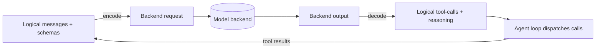

# Tool-Call Transport

**Version:** 1.0.0
**Status:** Stable
**Layer:** concept

## Overview

A paradigm-neutral model for the **tool-call transport** — the seam by which a logical
tool invocation crosses the boundary between the agent loop and the model backend, and by
which the backend's reply is decoded back into logical tool-call and tool-result events.

The subsystem names one contract that studied agent frameworks converge on but that the
existing specs assume rather than state: a tool call is a *logical* event (name + arguments)
that may travel over more than one *wire* form — the backend's **native** structured
tool-call channel, or a **text-encoded** protocol carried inside ordinary prompt and
completion text — with a deterministic, round-tripping translation between the two so the
agent loop is identical regardless of which transport a given backend supports.

This matters because the office is **local-first and backend-pluggable** (see
[l1-model-runtime.md](l1-model-runtime.md)): many local and open-weight models expose no
native tool-call API, yet must still drive tools. A transport-neutral contract is what lets
one tool-composition layer, one agent loop, and one budget/governance policy run unchanged
across a backend that speaks native tool-calls and one that must be *prompted* into emitting
them and *parsed* on the way back.

This spec owns the encode/decode contract only. It does not organize tools into toolkits
(that is tool composition), decide *which* model serves a turn (routing), or run the
call/observe loop (the agent-framework skeleton). It sits beneath all three as the wire
contract they share.

## Related Specifications

- [l1-model-runtime.md](l1-model-runtime.md) — The serving contract (MR-8 streaming + compatibility surface) the transport rides on; native tool-calling is a backend capability the runtime exposes, encoded transport is the universal fallback when it is absent.
- [l1-tool-composition.md](l1-tool-composition.md) — Toolkits and the auto-derived dispatcher schema (TC-2); the single tool-schema source this transport advertises to the model, and the dependency DAG that orders the calls it decodes.
- [l1-agent-tool-ergonomics.md](l1-agent-tool-ergonomics.md) — Tool description/argument quality; the material this transport renders into a schema advertisement is only as good as the ergonomics of the tools behind it.
- [l1-agent-framework-skeleton.md](l1-agent-framework-skeleton.md) — The call→observe loop (AFS-*) that consumes decoded tool-calls and produces tool-results; the transport is the wire under that loop.
- [l1-output-contracts.md](l1-output-contracts.md) — Inline validation with bounded repair-retry; a malformed decoded call (TCT-8) is repaired through the same evaluator-retry discipline.
- [l1-context-provenance.md](l1-context-provenance.md) — Per-fragment trust and untrusted-by-default neutralization (CP-1/CP-2); the ground for provenance-gated decode (TCT-10) — an encoded-protocol look-alike in untrusted content is inert, never a call.
- [l1-generation-budget.md](l1-generation-budget.md) — The per-run generation/loop budget that each decoded tool-call round consumes; the transport surfaces calls, the budget governs how many rounds run.
- [l1-nodus-portability.md](../../nodus/specifications/l1-nodus-portability.md) — The workflow-library `ModelProvider` seam (LP-2) behind which a nodus host implements exactly this transport; see §5.8.

## 1. Motivation

An office that reasons over many interchangeable model backends needs its tool-use to be
*backend-shaped*, not *backend-bound*. Backends split into two camps:

1. **Native tool-callers** expose a structured request field for tool schemas and return
   tool calls as first-class structured objects.
2. **Text-only backends** (many local, open-weight, and older hosted models) expose only
   prompt-in / text-out. To use tools they must be *told*, in the prompt, how to emit a call
   as text, and their output must be *parsed* to recover the call.

Without a transport seam, a framework hard-wires one camp and strands the other: either it
assumes native tool-calls and cannot drive a local model, or it hand-rolls text parsing at
every call site and cannot cleanly use a native backend when one is available. Both are the
same failure — the *wire form* of a tool call has leaked into the *agent loop*.

Naming the transport as a contract buys four things:

1. **Backend reach.** One agent loop drives tools over any backend, native or text-only —
   the local-first default and a hosted native API are the same code path above the seam.
2. **Loop simplicity.** The call→observe loop consumes logical tool-calls and emits logical
   tool-results; it never branches on how a call was encoded or decoded.
3. **Single schema source.** Tool schemas are authored once and *rendered* per transport
   (a native tool list, or an injected description block) — never authored twice.
4. **Safety by construction.** Because decode is a defined, provenance-gated step, an
   encoded-call look-alike arriving inside retrieved text or a prior tool result is inert
   data, not an injected action.

The cost of *not* modeling this is a tool layer that fragments: local backends unusable for
tool-use, text parsing duplicated and subtly divergent across call sites, thoughts
mis-parsed as calls, streamed partial calls executed half-formed, and an injection surface
where any untrusted text can forge a tool call.

## 2. Constraints & Assumptions

- **Technology-agnostic.** This is a Layer 1 concept. It names no markup, tag, JSON dialect,
  vendor API, or model family. The concrete encoding (which delimiters, which fields) and the
  native-API mapping live in Layer 2.
- **At least two transports.** The model MUST accommodate a native structured transport and a
  text-encoded transport; it MUST NOT assume only one exists. Additional transports (e.g. a
  backend-specific parser) are admissible as long as they satisfy the same encode/decode
  contract.
- **Encoded transport is the universal fallback.** Every backend that can accept a system/prompt
  preamble and return text can carry the encoded transport; it is the floor that guarantees
  tool-use is never impossible, only sometimes less efficient than native.
- **Defers where a concern is owned.** Tool grouping/authorization/dependency ordering defers
  to tool composition; model selection defers to routing; the call/observe loop and its
  stop/budget rules defer to the agent-framework skeleton and generation budget; repair-retry
  policy defers to output contracts. This model owns only the encode/decode wire contract.
- **On-device-first.** The transport performs no egress of its own; it renders and parses
  text/objects already flowing through the serving contract.

## 3. Core Invariants

Layer 2 realizations and concrete backends MUST NOT violate these.

- **TCT-1 Logical/​wire separation.** A tool call and a tool result are defined as *logical*
  events — a call is `(tool name, arguments)`, a result is `(tool name, output, correlation)`
  — independent of how they cross the model boundary. At least two transports realize the same
  logical events: a **native** structured tool-call channel and a **text-encoded** protocol
  carried in prompt/completion text. The agent loop produces and consumes only logical events;
  no transport-specific token, tag, or field appears above the seam.

- **TCT-2 Deterministic bidirectional translation.** Each transport defines a total pair of
  functions — **encode** (logical messages + tool schemas → backend request) and **decode**
  (backend output → logical tool-call / tool-result messages). The pair round-trips: decoding
  an encoded call recovers the same logical `(name, arguments)` that was encoded, for every
  well-formed call. Translation is pure and self-contained; it holds no loop state and makes no
  loop decision.

- **TCT-3 Capability-detected selection with recorded override.** The transport for a turn is
  chosen by detecting whether the active backend advertises a native tool-call capability:
  native when present, encoded otherwise. The choice is explicitly overridable per call, and
  the transport actually used is recorded for that turn. A backend lacking native tool-calling
  is never a dead end — encoded transport applies.

- **TCT-4 Single schema source, transport-idiomatic advertisement.** Tool schemas are advertised
  to the model in the transport's own idiom — a native tool/function list for the native
  transport, an injected description block for the encoded transport — but both are *rendered*
  from the same single tool-schema source (the tool-composition dispatcher schema, TC-2). A tool
  is never described to the model by two independently-authored schemas.

- **TCT-5 Reasoning isolation.** Model-emitted reasoning — a dedicated reasoning field, or a
  delimited thought span in text — is separated from tool-call decoding. Content inside a thought
  span is never decoded as a tool call. A model's private reasoning is preserved as reasoning and
  never mistaken for an intent to act.

- **TCT-6 Multi-call fidelity.** A single model turn MAY carry zero, one, or many tool calls
  (parallel or batched). Decode yields all of them, in emission order, as distinct logical calls;
  the transport never silently drops, merges, or reorders calls. Dispatch and any ordering among
  the decoded calls is the loop's concern (respecting the tool-composition dependency DAG), not
  the transport's.

- **TCT-7 Streaming-safe incremental decode.** When output streams, the decoder tolerates partial
  protocol tokens: an incomplete encoded call is held, not emitted, and incomplete special tokens
  are never surfaced as user-visible content. A call is materialized only once complete, or
  finalized deterministically at stream end. Cancellation mid-stream leaves no half-parsed call in
  the logical history.

- **TCT-8 Malformed-call containment.** A syntactically invalid encoded call — unparseable
  arguments, an unknown tool name, an arity/type mismatch against the schema — is a *typed,
  recoverable* outcome routed back to the model as a tool-result/repair signal, never a process
  crash and never a silent no-op. Repair follows the output-contract retry discipline under the
  generation budget; an unrecoverable call after bounded retry is surfaced, not swallowed.

- **TCT-9 Result re-injection symmetry.** A tool result re-enters the conversation through the same
  transport idiom the call left by — the native tool-result channel for a native call, an encoded
  result block for an encoded call — so a multi-turn tool loop is coherent under either transport.
  When the transport changes between turns of one session, the logical history remains consistent
  and replayable; the switch is a wire detail, not a break in the conversation.

- **TCT-10 Provenance-gated decode.** Only the model's own generated output channel is decoded for
  tool calls. An encoded-protocol look-alike appearing in untrusted content — retrieved document
  text, a prior tool's output, user-supplied input — is inert data and is never executed as a call.
  Decode honors the context-provenance trust boundary (CP-1/CP-2): the encoded transport's tokens
  carried inside untrusted fragments are neutralized as data, so the text protocol is never an
  injection vector.

> A Layer 2 spec cannot reach RFC status until every TCT-n invariant above is addressed in its
> "Invariant Compliance" section.

## 4. Detailed Design

### 4.1 The logical tool-call model

The transport's job is to preserve these logical primitives across any wire form:

| Primitive | Shape | Role |
| --- | --- | --- |
| Tool call | `(name, arguments, call_id)` | The model's request to invoke a tool (TCT-1). |
| Tool result | `(name, output, call_id)` | The outcome of a call, correlated back by `call_id` (TCT-9). |
| Reasoning | `(thought)` | Model-private reasoning, kept distinct from calls (TCT-5). |
| Schema advertisement | `[tool schema]` | The tool surface offered to the model, rendered per transport (TCT-4). |

`call_id` is the correlation handle that lets a turn carry several calls (TCT-6) and lets each
result rejoin its call (TCT-9), independent of transport.

### 4.2 The two transports

| | Native transport | Encoded transport |
| --- | --- | --- |
| **Schema advertisement (TCT-4)** | Structured tool/function list on the request | Description block injected into the system preamble |
| **Call carried as** | A first-class structured tool-call object in the reply | A delimited text span the model is instructed to emit |
| **Result carried as** | The backend's structured tool-result channel | A delimited result block appended to the transcript |
| **Decode (TCT-2)** | Read structured fields directly | Parse the delimited spans out of completion text |
| **Availability** | Only backends that advertise the capability (TCT-3) | Any backend that accepts a preamble and returns text — the universal floor |

Both realize the identical logical events of §4.1. The concrete markup, field names, and native-API
mapping are Layer 2; this table fixes only the *shape* of the two-transport contract.

### 4.3 Encode / decode round-trip



The loop closes over logical events only (TCT-1). `encode` and `decode` are the sole points aware
of a transport; they are pure (TCT-2) and hold no loop state. A round-trip guarantee — decode ∘
encode preserves the logical call set — is the property a Layer 2 transport is tested against.

### 4.4 Transport selection

```text
[REFERENCE]
select_transport(backend, override):
    if override is set:            return record(override)      # TCT-3, explicit + recorded
    if backend.advertises_native:  return record(native)        # prefer native when present
    else:                          return record(encoded)       # universal fallback, never a dead end
```

Selection is a per-turn decision keyed to the *active* backend (which routing may have changed
between turns). The recorded transport is part of the turn's trace, so a later reader knows how a
call was carried — and TCT-9 keeps the logical history consistent even when the transport differs
across turns of one session.

### 4.5 Reasoning isolation and streaming-safe decode

Two decode hazards are handled structurally, not by heuristic:

- **Reasoning (TCT-5).** A thought span — whether a separate reasoning field or a delimited region
  in text — is lifted out *before* call parsing. Nothing inside it is scanned for calls, so a model
  that "thinks about" calling a tool inside its reasoning does not accidentally call it.
- **Streaming (TCT-7).** While output streams, a partially-received encoded call is buffered until
  its closing delimiter arrives; only then is a logical call emitted. Partial protocol tokens are
  withheld from the user-visible content stream so a half-written call never flashes as text, and a
  cancellation drops the buffer rather than emitting a truncated call.

### 4.6 Multi-call and malformed-call handling

A turn may decode to several calls (TCT-6); each is an independent logical call with its own
`call_id`, handed to the loop in emission order. The loop — not the transport — decides how to
dispatch them (sequentially, or in parallel per the tool-composition DAG).

A call that fails to decode or fails schema validation (TCT-8) becomes a typed error result routed
back to the model:

```text
[REFERENCE]
decode_one(span, schemas):
    call = parse(span)
    if call is None:                 return err("unparseable arguments")     # typed, recoverable
    if call.name not in schemas:     return err("unknown tool: " + call.name)
    if not validates(call, schemas): return err("argument mismatch")
    return ok(call)

# an err(...) is re-injected as a tool-result the model can repair from (output-contract retry,
# under the generation budget); it is never a crash and never dropped.
```

### 4.7 Ideas-to-adopt mapping

What the studied open-source agent frameworks contribute, and where each lands. Sources are named
by structural idea, not by product.

| Source idea | Worth adopting | Where it lands |
| --- | --- | --- |
| A tool call is prompted-and-parsed for models without a native tool API | The encoded transport as a universal fallback so any text backend drives tools. | **New** as TCT-1 / TCT-3; §4.2 |
| Symmetric preprocess/postprocess around the model call | The pure encode/decode round-trip that keeps the loop transport-agnostic. | **New** as TCT-2; §4.3 |
| Choose native vs prompted encoding by a backend flag | Capability-detected selection with an explicit, recorded per-call override. | **New** as TCT-3; §4.4 |
| One tool schema rendered as a native list *or* an injected description block | Single schema source, transport-idiomatic advertisement — no double authoring. | **New** as TCT-4; reuses tool-composition TC-2 |
| Keep the model's reasoning span out of the tool-call parser | Reasoning isolation so a thought is never mis-parsed as an intent to act. | **New** as TCT-5; §4.5 |
| Emit and parse several tool calls in one turn | Multi-call fidelity — decode yields all calls in order, loop dispatches. | **New** as TCT-6; ordering delegated to the tool-composition DAG |
| Tolerate partial special tokens while streaming | Streaming-safe incremental decode; cancellation leaves no half-parsed call. | **New** as TCT-7; §4.5 |
| Malformed generated call handled gracefully | Typed recoverable error re-injected for repair, never a crash. | TCT-8; reuses output-contract retry + generation budget |
| Tool results fed back in the model's expected shape | Result re-injection symmetry across transports and transport switches. | **New** as TCT-9; §4.2 |
| (Gap the sources leave open) a text protocol is an injection surface | Provenance-gated decode — only the model's own channel is decoded. | **New** as TCT-10; reuses context-provenance CP-1/CP-2 |

The last row is a deliberate *addition* over the studied sources: a text-encoded tool protocol is
only safe when decode is gated by provenance, which this project already owns as a first-class
contract — so the mined mechanic is adopted with the injection hole closed by construction.

### 4.8 Nodus relevance

The workflow library reaches models exclusively through its `ModelProvider` extension role
([l1-nodus-portability.md](../../nodus/specifications/l1-nodus-portability.md) LP-2), and a nodus
`tool_use` / model-call effect (LP-11) is an *effectful step* the host executes. The disposition is
therefore **Reuse, no new nodus invariant**:

- **Transport lives host-side behind LP-2.** Whether a host's `ModelProvider` drives tools over a
  native API or an encoded text protocol is exactly the kind of concrete, backend-specific detail
  LP-2 keeps in the host adaptor, never in nodus core. A workflow declares a model/tool capability
  in its LP-8 manifest; *how* the host satisfies it (which transport) is the host's business.
- **No vocabulary leak.** Adding a transport invariant to nodus core would name a wire concern the
  library is contractually forbidden to know (LP-1/LP-4). The two-transport contract is a property
  a *host's* `ModelProvider` implementation should satisfy, recorded here at concept level.
- **Portability already covered.** A workflow that runs against a native-tool-calling host and a
  text-only host is portable across both precisely because the transport is behind the seam — this
  is LP-3 (two-host generalization) already doing its job, not a gap needing a new LP-n.

This is an adoption *note* for the nodus workspace, recorded at concept level; if a future host
observation shows a transport concern that genuinely must surface in the portable contract (LP-7
feedback lifecycle), it graduates via a spec amendment then — not speculatively now.

## 5. Implementation Notes

1. Define the logical event model (§4.1) first; both transports and the loop depend on it.
2. Build the encoded transport before the native one — it is the universal floor (TCT-3) and its
   decode path (parsing, streaming buffer, reasoning lift-out) is where the real complexity lives;
   the native transport is then a thin structured-field mapping.
3. The round-trip property (TCT-2) is the primary test target: for a corpus of logical call sets,
   assert `decode(encode(x))` preserves the call set, for both transports.
4. Streaming decode (TCT-7) is a state machine over the token stream, not a regex over the final
   string — implement it as an incremental buffer with an explicit "inside a call span" state.
5. Provenance-gated decode (TCT-10) is enforced at the decode entry point: decode is only ever
   called on the model's own completion channel, never on interpolated untrusted fragments.

## 6. Drawbacks & Alternatives

- **Overlap with the serving contract.** The model-runtime already exposes a streaming, industry-
  compatible surface. Mitigation: that surface is *transport of tokens*; this spec is *transport of
  tool calls* over those tokens — a strictly higher layer that the serving contract does not own.
- **Encoded transport is less reliable than native.** A prompted-and-parsed call can be malformed
  where a structured one cannot. Mitigation: TCT-8 makes malformation a bounded, recoverable repair
  loop rather than a failure, and TCT-3 prefers native whenever the backend offers it — encoded is
  the floor, not the default when a better option exists.
- **Alternative — assume native tool-calling everywhere.** Rejected: it strands every local and
  open-weight backend that has no native tool API, which is exactly the local-first majority the
  office targets; tool-use would silently require a hosted native model.
- **Alternative — parse tool calls ad hoc at each call site.** Rejected: it duplicates the fragile
  decode logic, diverges subtly across sites, and re-opens the injection hole TCT-10 closes; one
  audited transport seam is the whole point.

## Canonical References

| Alias | Path | Purpose |
| --- | --- | --- |
| `[RUNTIME]` | `.design/main/specifications/l1-model-runtime.md` | Authoritative serving contract (MR-8) the transport rides on; native tool-calling as a backend capability. |
| `[TOOLKIT]` | `.design/main/specifications/l1-tool-composition.md` | Authoritative single tool-schema source (TC-2) rendered per transport, and the dependency DAG ordering decoded calls. |
| `[SKELETON]` | `.design/main/specifications/l1-agent-framework-skeleton.md` | Authoritative call→observe loop that consumes decoded calls and produces results. |
| `[PROVENANCE]` | `.design/main/specifications/l1-context-provenance.md` | Authoritative trust boundary (CP-1/CP-2) grounding provenance-gated decode (TCT-10). |
| `[CONTRACTS]` | `.design/main/specifications/l1-output-contracts.md` | Authoritative bounded repair-retry discipline for malformed decoded calls (TCT-8). |

## Document History

| Version | Date | Change |
| --- | --- | --- |
| 1.0.0 | 2026-07-09 | Initial model: transport-neutral tool-call contract — logical/wire separation (TCT-1), deterministic bidirectional encode/decode round-trip (TCT-2), capability-detected transport selection with encoded universal fallback and recorded override (TCT-3), single schema source rendered per transport (TCT-4), reasoning isolation (TCT-5), multi-call fidelity (TCT-6), streaming-safe incremental decode (TCT-7), typed recoverable malformed-call containment (TCT-8), result re-injection symmetry across transports (TCT-9), provenance-gated decode closing the text-protocol injection hole (TCT-10); ideas-to-adopt mapping (mined from studied open-source agent frameworks' native-vs-prompted tool-calling) + nodus-relevance disposition (Reuse behind the ModelProvider LP-2 seam, no new nodus invariant). |
