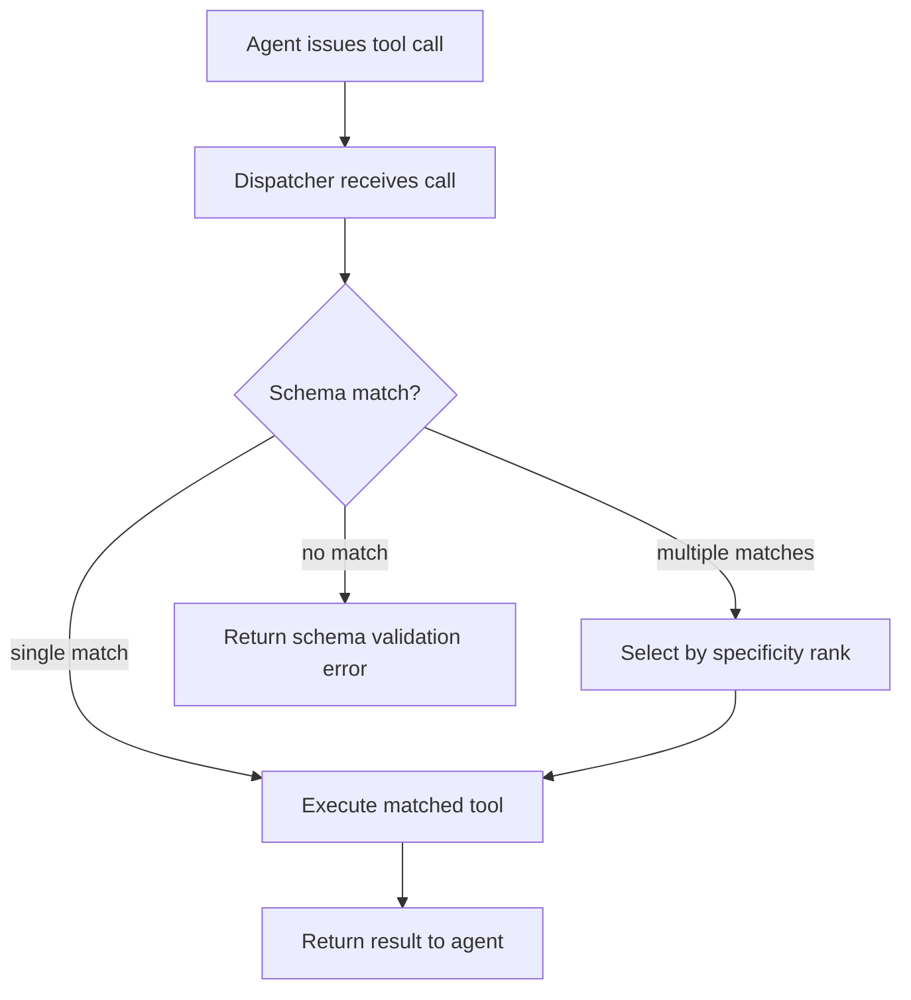
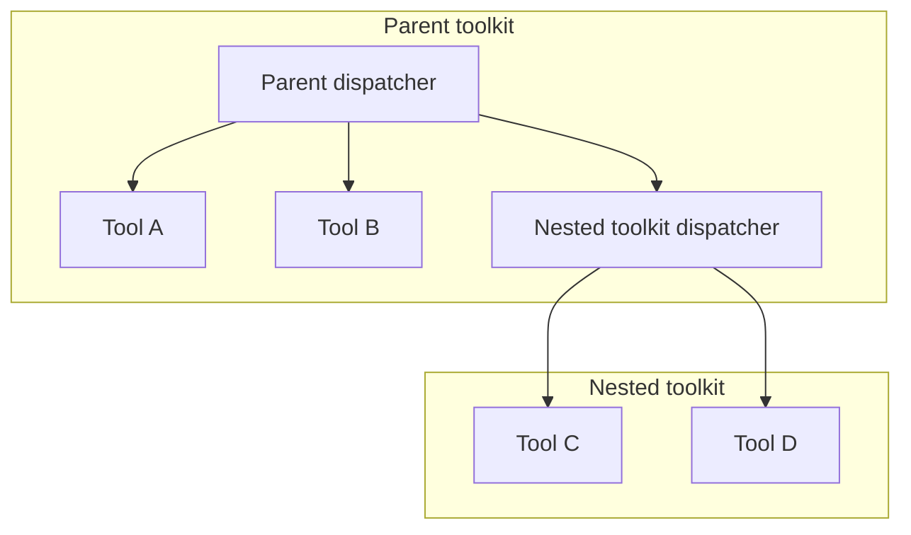

# Tool Composition Model

**Version:** 1.0.0
**Status:** Stable
**Layer:** concept

## Overview

The model by which individual tools are organized into logically cohesive **toolkits**. A toolkit is a named, access-controlled group of related tools that exposes a single dispatcher entry point, shares execution context, and enforces declared dependency ordering among its members. Toolkits enable hierarchical capability organization, coordinated parallel execution of independent tools, and a stable authorization surface that grows automatically as tools are added.

This spec governs compositional structure only. Tool lifecycle (installation, sandboxing, activation) is defined in the extensions spec; agent capability selection is defined in the routing spec.

## Related Specifications

- [l1-extensions.md](l1-extensions.md) — Extension lifecycle: sandboxing, activation, and skill generation. Toolkits are composed of extension-managed tools.
- [l1-routing.md](l1-routing.md) — Smart-router selects agents; toolkit dispatcher selects the tool within an agent's active toolkit.
- [l1-orchestration.md](l1-orchestration.md) — Orchestrator delegates toolkit-level capability units to workers; ORC-5 context isolation applies per toolkit invocation.
- [l1-execution-graph.md](l1-execution-graph.md) — Tool calls are nodes in the execution graph; toolkit dispatcher is a routing node.
- [l2-extension-registry.md](l2-extension-registry.md) — Concrete tool registration, manifest format, and MCP integration.

## 1. Motivation

Without a compositional layer, tools accumulate as a flat list. A flat list creates three problems: (a) agents must search the entire list to find relevant capabilities, increasing selection latency and error rate; (b) adding a tool forces updating every agent's authorization set individually; (c) parallel execution of independent tools and sequential enforcement of dependent ones require ad-hoc coordination per call site.

Toolkits solve all three: a dispatcher narrows the selection space to a coherent domain, a single toolkit grant covers all member tools, and dependency declarations let the executor enforce ordering automatically.

## 2. Constraints & Assumptions

- A tool may belong to at most one toolkit at a time; it cannot be a member of two toolkits simultaneously.
- Toolkit membership is declared statically (at registration time), not dynamically at runtime.
- Toolkits are composable: a toolkit may contain nested sub-toolkits, which appear as a single tool to the parent dispatcher.
- The dispatcher's interface is derived from member schemas; no manual schema authoring is required when adding a tool.
- The model is technology-agnostic; no specific API format, protocol, or runtime is prescribed.

## 3. Core Invariants

Rules every Layer 2 implementation MUST NOT violate:

- **TC-1 (Toolkit as unit):** a toolkit is a named, versioned group of tools sharing a single dispatcher entry point, a shared execution context, and a single authorization scope. Creating a toolkit requires at minimum: a unique name, a non-empty member set, and a dispatcher schema derived from member schemas.
- **TC-2 (Dispatcher schema auto-derivation):** the dispatcher's callable interface MUST be automatically derived from the union of member tool schemas at registration time. Adding or removing a tool from a toolkit updates the dispatcher schema without any manual authoring.
- **TC-3 (Declared dependency ordering):** a tool may declare one or more prerequisite tools within the same toolkit. The executor MUST enforce that a prerequisite completes before a dependent tool runs. Circular prerequisites are rejected at registration time.
- **TC-4 (Parallel execution of independent tools):** tools within a toolkit that share no declared dependency relation MAY execute concurrently. The executor determines concurrency from the dependency DAG; no explicit parallelism annotation is required on the caller's side.
- **TC-5 (Single authorization surface):** permission to invoke a toolkit grants access to all member tools. Member tools do not carry separate authorization checks beyond the toolkit grant. This invariant is enforced by the executor; a caller invoking a member tool directly (bypassing the toolkit) receives the same authorization outcome as invoking via the dispatcher.
- **TC-6 (Nested toolkits as opaque members):** a toolkit may include another toolkit as a member. The nested toolkit appears as a single, opaque tool in the parent dispatcher; its internal structure is invisible to the parent. Nesting depth is bounded at compile/registration time to prevent unbounded recursion.

## 4. Detailed Design

### 4.1 Toolkit Structure

```plaintext
[REFERENCE]

ToolkitSpec:
  id           : ToolkitId          -- globally unique
  name         : String             -- human-readable domain label
  version      : SemVer
  members      : [ToolId | ToolkitId]   -- ordered for display, not for execution
  dependencies : [(ToolId, ToolId)]     -- (from, to) prerequisite pairs
  context      : ContextSchema      -- shared data available to all members

Dispatcher:
  schema       : ToolSchema         -- auto-derived union of all member schemas
  route(call)  : ToolId             -- selects the member that satisfies the call
```

### 4.2 Dispatcher Routing

The dispatcher receives a tool call from an agent and routes it to the correct member. Routing is deterministic and schema-driven:



Schema specificity ranks more-constrained schemas above less-constrained ones. Ties are resolved by member declaration order within the toolkit.

### 4.3 Dependency Graph and Execution Order

Dependencies form a directed acyclic graph (DAG) over the toolkit's member tools. The executor derives an execution schedule from this DAG:

```plaintext
[REFERENCE]

Given: members = {A, B, C, D}
       dependencies = {(A → C), (B → C), (C → D)}

Execution schedule when all four are needed:
  Step 1 (parallel): A, B          -- no prerequisites
  Step 2 (sequential): C           -- waits for both A and B
  Step 3 (sequential): D           -- waits for C
```

The caller requests a toolkit invocation; the executor computes the minimum necessary execution schedule from the dependency DAG and the specific tool(s) the dispatcher selected.

### 4.4 Nested Toolkits

A nested toolkit is registered as a member with its own `ToolkitId`. In the parent dispatcher's schema it appears as a single callable unit whose schema is the nested toolkit's dispatcher schema.



Authorization at the parent level covers the nested toolkit's dispatcher; the nested toolkit's internal authorization rules apply only when the nested toolkit is invoked directly (not via a parent).

### 4.5 Shared Execution Context

All member tools within a toolkit have read access to the toolkit's shared context. The context is populated at invocation time and is immutable for the duration of the invocation. It may include: caller identity, active session ID, workspace path, or any domain-specific datum declared in the `ContextSchema`.

Tools MUST NOT mutate the shared context. Side-effect outputs travel through the execution graph's state channels (see `l1-execution-graph.md`).

### 4.6 Authorization Model

```plaintext
[REFERENCE]

Authorization check at invocation:
  1. Caller presents toolkit grant (ToolkitId, permission level)
  2. Executor verifies grant covers the target toolkit
  3. Dispatcher routes to member tool
  4. Member tool executes; no additional grant check

Direct member invocation (bypassing dispatcher):
  1. Executor resolves the parent toolkit for the target tool
  2. Applies TC-5: same check as dispatcher path
```

This ensures that splitting a toolkit into sub-toolkits (refactoring) never changes the effective authorization surface.

## 5. Implementation Notes

1. Register toolkits eagerly (not lazily) — the dispatcher schema is built once at registration time so schema errors surface before any invocation.
2. Validate the dependency DAG at registration: detect cycles via topological sort and reject. Registration MUST fail, not defer.
3. Implement the executor as a DAG traversal: maintain a ready-set of nodes with no unresolved predecessors; spawn them concurrently, remove each from the pending set on completion, and promote its dependents into the ready-set. This pattern is agnostic to concurrency runtime.
4. The dispatcher's schema union MUST detect name collisions: if two member tools declare a parameter with the same name but incompatible types, reject the toolkit at registration.
5. Nesting depth is bounded at registration by a configurable constant enforced by the executor; implementations MUST reject toolkits that exceed it rather than failing silently at invocation time.

## 6. Drawbacks & Alternatives

- **Alternative — flat tool list with tags:** simpler to implement but does not provide automatic dispatcher derivation or dependency enforcement. Scales poorly beyond ~20 tools per agent context.
- **Alternative — explicit tool routing in agent prompt:** agents can be instructed to call tools in order, but this burdens the agent context and is unreliable — agents can deviate. Toolkit dependencies are enforced by the executor regardless of agent behavior.
- **Nesting vs. inheritance:** nesting (a toolkit as a member) is preferred over capability inheritance (toolkit B extends toolkit A) because nesting keeps authorization surfaces explicit and avoids MRO-style ambiguities.

## Canonical References

| Alias | Path | Purpose |
| --- | --- | --- |
| `[EXT]` | `.design/main/specifications/l1-extensions.md` | Extension lifecycle: sandboxing and activation for toolkit members |
| `[RTR]` | `.design/main/specifications/l1-routing.md` | Smart router: agent selection (complements toolkit's tool selection) |
| `[EG]` | `.design/main/specifications/l1-execution-graph.md` | Execution graph: tool calls as nodes, channels for result propagation |
| `[REG]` | `.design/main/specifications/l2-extension-registry.md` | Concrete tool registration and MCP integration |

## Document History

| Version | Date | Summary |
| --- | --- | --- |
| 1.0.0 | 2026-06-24 | Initial stable spec — toolkit unit, dispatcher auto-derivation, dependency DAG, parallel execution, nested toolkits, single authorization surface |
