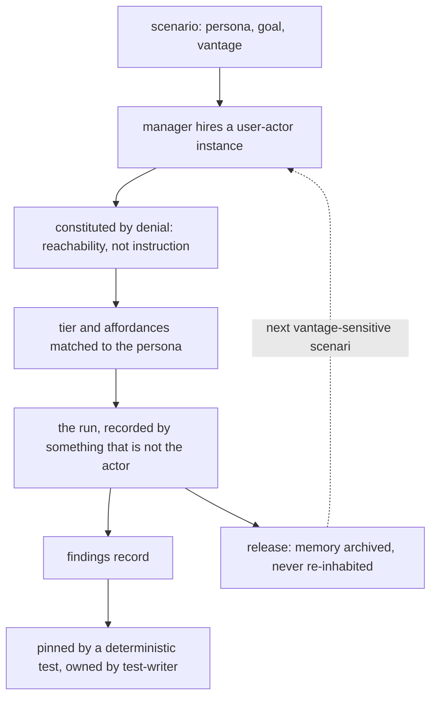

# Uninformed Actor

**Version:** 1.0.0
**Status:** Stable
**Layer:** concept

## Overview

An office role whose qualification is **not knowing**. The office calls it *the user*; as a
catalog entry it is `user-actor`. It is staffed to pursue a goal against the product the way
a person would, and every other role in the office is defined by what it can do, while this
one is defined by what it is **denied**: the specification, the source, the plan, the
rationale, the prior findings, and the office's model of the real person it is pretending to
be.

That inversion is the whole point, and it is what makes this a role rather than a prompt. The
free-route instrument already states that judgements about discoverability and error clarity
must be made from a bounded vantage. Stating it is not enforcing it: the actor who must not
know is, in every naive implementation, the same agent that just read the repository, and an
agent instructed to disregard what it knows cannot comply — it merely reports confidently
that the product was clear. **Denial has to be a property of how the worker is constituted,
not an instruction given to a worker who already read everything.** A role is the office's
mechanism for constituting a worker, so the vantage becomes real exactly when it becomes a
hiring decision.

It is close to the tester and is not the tester. A tester's competence derives *from* the
specification; this one's derives from its absence. Along every axis that matters the two are
polar opposites (§4.2), including the one that decides how the office manages them: when a
tester fails to find a defect it wrote a bad test, and when this actor fails to reach its goal
**it has produced the finding**. Failure is the deliverable. Every reflex the office has for
helping a struggling worker — send more context, hand over the spec, escalate to the author,
retry with a hint — destroys the measurement instead of improving it.

Together with its two companions this closes the shape: the instrument spec says **what** a
scenario is, derivation says **when** scenarios come into existence, and this says **who**
performs them and what the office must refrain from doing to that worker.

## Related Specifications

- [l1-roles.md](l1-roles.md) — The contract this lives under. ROL-1 role-as-specialty, ROL-3 hire-as-instantiate, ROL-4 release-archives-memory (reconciled by UIA-5, not excepted), ROL-6 composition including model configuration (the seat UIA-6 sits in), ROL-9 the anti-sprawl and originality gate this clears explicitly in §4.3.
- [l1-usage-simulation.md](l1-usage-simulation.md) — The instrument this role operates. USM-4 states the declared vantage as a scenario property; UIA-2 makes it a staffing property, which is what converts it from a discipline into a constraint.
- [l1-scenario-derivation.md](l1-scenario-derivation.md) — Where the persona comes from. SD-8 has derivation propose a persona and a human confirm it; this role is who wears it, and the confirmation is also a decision about how to staff.
- [l2-role-catalog.md](l2-role-catalog.md) — Where the `user-actor` preset lands. Its Quality group holds the informed instruments (code-reviewer, test-writer, debugger, auditors); this is the first entry in it that is denied the artifact it examines.
- [l1-development-workflow.md](l1-development-workflow.md) — DW-9 review neutrality is the rung below on the same ladder (§4.1): a reviewer is denied the implementer's rationale, this actor is denied the implementation.
- [l1-corpus-originality.md](l1-corpus-originality.md) — ORI-1's admission gate, which ROL-9 v1.2.0 requires a custom role to clear. §4.2's inversion table is the answer: not a domain-noun swap of the tester but its polarity reversed on every axis.
- [l1-office-model.md](l1-office-model.md) — Manager-driven adaptive staffing; hiring cadence in §4.5.
- [l1-session-reinforcement.md](l1-session-reinforcement.md) · [l1-scoped-generalization.md](l1-scoped-generalization.md) — The machinery UIA-4 excludes this role's instances from, in both directions: nothing reinforces product familiarity into the actor, and nothing generalizes the actor's confusion into an office norm.
- [l1-user-model.md](l1-user-model.md) — The office's evolving model of the **real** person. The actor's persona is a constructed fiction; it never reads from the user model and never writes back to it (§4.6).
- [l1-harness-composition.md](l1-harness-composition.md) — HC-5 right-sizing behind ROL-9, and HC-3 pruning if the justifying gap ever closes.
- [l1-project-support.md](l1-project-support.md) — After delivery, a standing cadence of this role is how support distinguishes a regression from a request.
- [l1-capability-leveling.md](l1-capability-leveling.md) — Narrows the spread between models on construction work. Deliberately does **not** apply here: UIA-6 wants the tier that matches the persona, and a levelled-up newcomer is a worse instrument, not a better worker.

## 1. Motivation

**The vantage rule has no enforcement mechanism, and a rule with no enforcement is a wish.**
The instrument spec asks that judgements about discoverability and error clarity come from
inside a declared vantage, and names the failure it guards against: the same agent is both
actor and judge, and it knows things the actor is not supposed to know. What it cannot supply
is a way to make that false. Prompting does not: "act as though you have not read the source"
is an instruction to an entity that has read the source, and its compliance is unobservable.
Staffing does, because a worker that was never given the repository cannot consult it.

**The office's best instincts are this instrument's failure modes.** An office that notices a
worker stalling supplies context, and context is the one thing that must not arrive. An office
that notices repeated failure escalates, and escalation to the author is precisely the move a
real user cannot make. An office that assigns its strongest model to a hard task produces a
newcomer who is not a newcomer. None of these are bugs in the office; they are correct
behaviour applied to a role for which they are inverted, and they will happen by default
unless the role's contract forbids them by name.

**Accumulated familiarity is the quantity being measured, and it only goes one way.** Every
other role in the office gets better as it learns the project — that is why instances own
memory and why released roles archive it rather than losing it. An actor that has run forty
scenarios has learned the product and can no longer tell you whether the product is learnable.
It does not degrade gracefully; it degrades **invisibly**, continuing to pass the scenarios it
has already internalized while the class of defect it was hired to find becomes unreachable.

**Without a role, the personas fragment.** The workflow author, the command-line newcomer, the
host integrator embedding a library, the administrator, the returning user after a month — each
is a different costume over an identical employment contract. Minting a specialist for each is
exactly the workforce fragmentation the anti-sprawl gate exists to prevent; leaving them
implicit means each scenario re-derives its own rules about what the actor may know, and they
will not agree.

## 2. Constraints & Assumptions

- **Denial is only meaningful if it is reachable-denial.** A monorepo puts the source one
  directory away; the constraint must be on what the instance can *reach*, not on what it is
  told to avoid.
- **The persona is a fiction, deliberately.** It is not the real user, not drawn from the
  office's user model, and not evidence about any actual person.
- **Some deprivation cannot be achieved in-house.** An instance constituted inside the project
  is still closer to it than a stranger; where a judgement is high-consequence, an external
  actor is strictly better evidence and this contract does not pretend otherwise.
- **Rotation is cheap; the actor carries no craft.** Unlike an architect or a reviewer, nothing
  of value is lost when an instance is replaced, because everything of value was written down
  as findings.
- **The role is hired, not standing.** A permanent user-employee accumulates exactly the
  familiarity that disqualifies it.
- **It never writes to the product.** Its deliverable is an account and a set of findings.

## 3. Core Invariants

Rules every Layer 2 implementation MUST NOT violate:

- **UIA-1 (Constituted by what it is denied):** the role's definition is a set of
  **exclusions** — the specification, the source, the plan and its rationale, prior findings,
  and the office's model of the real user — together with the narrow set of things a person in
  the persona's position would actually have. A definition written as a capability list has
  described a tester and given it a different name. What the actor may know is stated
  positively per scenario as its vantage; everything not granted is withheld.

- **UIA-2 (Denial is staffing, not discipline):** the exclusion is enforced by **how the
  instance is constituted and what it can reach**, never by instructing an informed agent to
  set aside what it already knows. An agent cannot comply with an instruction to forget, and
  its non-compliance is silent, confident, and indistinguishable from success. This invariant
  is the reason the role exists: it is what turns the declared-vantage contract from a
  discipline that erodes into a constraint that holds.
  Where a host genuinely cannot restrict reachability, the run **declares that its denial was
  instructional rather than constituted**, and every vantage-sensitive verdict it produced
  carries that mark as weaker evidence. The declaration is mandatory precisely because the
  alternative is not honest failure but silent false compliance: an absolute with no disclosed
  fallback is an absolute that gets claimed rather than met.

- **UIA-3 (Failure is the deliverable; the office's helping reflexes are corrupting):** when
  the actor cannot reach its goal, that is a **finding about the product**, not a performance
  problem to be managed. Supplying additional context, handing over the specification,
  escalating to whoever built it, or retrying with a hint are each **recorded as the finding**
  — *"the actor could not proceed without X"* — rather than performed. A retry the actor
  decides on itself is legitimate, because real users retry — within the run's declared bound,
  which is what stops a stuck actor from spending without limit on a goal the product cannot
  satisfy; that exhaustion is itself the finding. A retry the office *improves* is a destroyed
  measurement.

- **UIA-4 (Experience is depreciation; instances are rotated, not developed):** accumulated
  product familiarity is the exact quantity under control, so a vantage-sensitive scenario is
  staffed with a **fresh instance**, and the office's learning, reinforcement, pattern-
  codification and generalization machinery **excludes this role's instances in both
  directions** — nothing reinforces product knowledge into the actor, and nothing promotes the
  actor's confusion into an office norm. An instance's engagement history is a **disclosed
  property** of any run it performs, because a report from a well-practised newcomer is a
  different kind of evidence and must not read as the same kind.

- **UIA-5 (Knowledge is preserved as findings, never as the actor's memory):** rotation
  destroys nothing. What a run learned is written to the **findings record**, where it is more
  useful than in an actor's head and where it cannot contaminate the next one. An archived
  instance's memory is therefore never re-inhabited by a successor playing a newcomer persona.
  This satisfies the role contract's guarantee that knowledge is never silently destroyed by
  changing **where** the knowledge lives, not by making an exception to it.

- **UIA-6 (Capability is matched to the persona, never maximized):** the role's configuration —
  model tier, tools, time, patience — is chosen to match **the person being portrayed**, not to
  maximize competence. The office default of assigning the most capable available tier produces
  an unusually able newcomer and silently removes the finding, which is the same class of error
  as running the scenario with the specification open.

- **UIA-7 (One role, many personas):** the workflow author, the command-line newcomer, the host
  integrator, the administrator, the returning user are **costumes worn per scenario**, not
  separate roles. The employment contract — denial, non-self-report, rotation, tier matching,
  no write access — is identical across all of them, and minting a role per persona is the
  fragmentation the anti-sprawl gate forbids.

- **UIA-8 (Not trusted to self-report — observed instead):** the actor's account of what it did
  is **testimony**, and testimony about one's own confusion is the least reliable kind there is.
  Its actions and the product's responses are recorded independently, as they happen, by
  something that is not the actor; the actor supplies **citations into that record**, never
  narration in place of it. This is not distrust of the worker — it is that the worker's
  introspection is structurally unreliable about precisely the thing being measured.

- **UIA-9 (Independent of whoever built the thing):** the instance that plays a user is never
  the instance that built or planned the subject, and never inherits its context. This is the
  next rung of the ladder the office already climbs for reviewers: a reviewer is denied the
  implementer's stated rationale, and this actor is denied the implementation itself.

- **UIA-10 (It reports; it never repairs):** the actor holds no write access to the product. A
  user-role that fixes what it found has destroyed the evidence for the defect, made the next
  run's baseline unknowable, and converted a measurement into an unreviewed change.

> L2 specs cannot reach RFC status until all invariants here are addressed in their
> "Invariant Compliance" section.

## 4. Detailed Design

### 4.1 The Ladder of Deprivation

The office already grants less knowledge the further a role sits from the work. This role is
the bottom rung, and naming the ladder shows it is an extension rather than a novelty:

| Rung | Role | Has | Denied | Sees what the rung above cannot |
| --- | --- | --- | --- | --- |
| 1 | implementer | everything | — | — |
| 2 | reviewer (DW-9) | the code | the implementer's rationale | claims unsupported by the diff |
| 3 | test-writer | the specification | — (writes from intent) | divergence from stated intent |
| 4 | **user-actor** | the shipped surface, and the persona's own knowledge | code, spec, plan, rationale, findings | what cannot be found, understood, or recovered from |

Each rung exists because the rung above it is blind to something, and each is blind precisely
in proportion to what it was given. The fourth rung is where the ladder ends, because there is
nothing left to take away.

### 4.2 Why This Is Not the Tester (the ORI-1 answer)

The originality half of the anti-sprawl gate asks whether a proposed role is an existing one
with its domain nouns swapped. Here every axis is not merely different but **inverted**:

| Axis | test-writer | user-actor |
| --- | --- | --- |
| competence derives from | the specification | the absence of it |
| is given | what should happen | what someone wants |
| produces | an assertion that can fail | a cited account of what happened |
| failing the task means | it wrote a bad test | it found the defect |
| project knowledge is | an asset to accumulate | a liability to rotate away |
| model tier | as capable as affordable | matched to the persona |
| write access | to test files | none |
| memory across engagements | retained and restored | archived, never re-inhabited |
| more of it is | better | not necessarily better |

A role that inverts the sign on eight axes is not the same role. Note the last row in
particular: two user-actors are not twice the instrument, because the second one may have
learned from the first — which is a property no other role in the catalog has.

### 4.3 Clearing the Anti-Sprawl Gate (ROL-9)

Both halves must clear, and they clear on stated grounds rather than by assertion:

| Half | Axis | How it clears |
| --- | --- | --- |
| Warranted | **context isolation** | Not a benefit here but the *mechanism itself*: the isolation is the measuring instrument, and the role is the only way the office can produce it. |
| Warranted | **distinct expertise** | An inverted expertise no catalog entry holds: qualification by deprivation. |
| Warranted | **reuse** | Every scenario, every release, every project the office builds, plus a standing cadence after delivery. |
| Original | **ORI-1 admission** | §4.2: eight inverted axes against the nearest neighbour, not a noun swap. Not declarable as a variant of `test-writer` (ORI-8), because a variant would inherit the parent's relationship to the specification, which is the exact thing reversed. |

### 4.4 What the Office Must Not Do

```text
[REFERENCE]
the actor stalls
  office reflex          what it does to the instrument        correct response
  ------------------------------------------------------------------------------------
  send more context      removes the vantage                   record: needed context X
  hand over the spec     converts the actor into a tester      record: not derivable from
                                                               the surface alone
  escalate to author     grants an option real users lack      record: had to ask a human
  retry with a hint      measures the hint                     record, then let the actor
                                                               retry on its own terms
  assign a stronger tier portrays a different person           re-staff to persona (UIA-6)
  let it fix the problem destroys the evidence                 file the finding (UIA-10)
```

Every left-hand column entry is good management. Every one of them is wrong here, and the
right-hand column is the same information arriving as output instead of as intervention.

### 4.5 Hiring, Rotation, Release



The dotted edge is the one that distinguishes this role from every other: it returns to
*hire*, not to *restore*. Two hiring patterns follow from it. A **vantage-sensitive** scenario
— first use, discoverability, error clarity, naming — takes a fresh instance every time. A
**journey-continuity** scenario, where the persona is explicitly an experienced user, may
legitimately reuse an instance, and the reuse is then part of the persona rather than a
contamination of it. Which pattern applies is declared with the scenario, not decided by
whoever is staffing.

### 4.6 The Persona and the Real Person

The office maintains an evolving model of the actual human it works for. The actor's persona
is a **constructed fiction** and the two are kept apart in both directions: the persona is
never populated from the user model, because that would make the office test the product
against its own beliefs about its user rather than against a stated hypothesis; and nothing the
actor does is written back, because an invented person's confusion is not evidence about a real
one's preferences. The single legitimate channel between them runs through a human: a person
may decide that a real user's difficulty is worth turning into a persona, and that decision is
recorded as a scenario change.

### 4.7 Handoff to the Informed Roles

The actor discovers and stops. What happens next belongs to roles that are allowed to know
things: a finding is attributed, pinned by a deterministic test under the test-writer, and
fixed by whoever owns the code. The org chart therefore carries the discover-then-guard
mechanism as an ordinary handoff — the expensive, deprived instrument is spent only on what is
not yet known, and the cheap informed one keeps what is.

## 5. Drawbacks & Alternatives

- **In-house deprivation has a ceiling.** An instance constituted inside the project is still
  nearer to it than a stranger — shared tooling, shared conventions, a name that hints at the
  domain. UIA-2 removes the largest and most common leak; it does not produce a true outsider,
  and the honest position is that high-consequence judgements deserve an external actor.
- **Alternative — extend `test-writer` with a "no spec" mode.** Rejected: a mode is an
  instruction, and UIA-2 is the claim that instructions do not constitute deprivation. It would
  also inherit the tester's relationship to the specification, which is the axis being reversed.
- **Alternative — one role per persona.** Rejected (UIA-7): the contract is identical across
  costumes and the catalog would fragment into thin specialists whose selection becomes
  arbitrary — the exact failure ROL-9 names.
- **Alternative — no role, just a prompt in the scenario.** Rejected: that is the status quo the
  instrument spec already flags as producing confident false-green, and it has no seat for
  rotation, tier matching, memory exclusion, or independence from the builder.
- **Rotation costs context-establishment on every run,** and a fresh instance re-reads the
  vantage material each time. This is real overhead and it is the price of the measurement;
  the short scenario tier exists partly so the price is paid on a small set often rather than a
  large set rarely.
- **The role invites theatre.** An actor playing confusion is not the same as an actor that is
  confused, and nothing here can fully distinguish them. Grounding every verdict in the
  independent record (UIA-8) is what keeps the difference observable in the places that matter.
  <!-- TBD: whether an instance's engagement count should carry a published threshold past which it is disqualified from vantage-sensitive scenarios, or stay a disclosed property the reader weighs -->

## Canonical References

| Alias | Path | Purpose |
| --- | --- | --- |
| `[ROLES]` | `.design/main/specifications/l1-roles.md` | The contract this role lives under; ROL-4 reconciled by UIA-5, ROL-6 the configuration seat, ROL-9 the gate cleared in §4.3. |
| `[CATALOG]` | `.design/main/specifications/l2-role-catalog.md` | Where the `user-actor` preset lands, and the Quality group it joins. |
| `[INSTRUMENT]` | `.design/main/specifications/l1-usage-simulation.md` | USM-4's declared vantage — the rule UIA-2 makes enforceable. |
| `[DERIVATION]` | `.design/main/specifications/l1-scenario-derivation.md` | SD-8 — where the persona is proposed and confirmed. |
| `[ORIGINALITY]` | `.design/main/specifications/l1-corpus-originality.md` | ORI-1/ORI-8 — the admission gate §4.2 answers. |

## Document History

| Version | Date | Author | Notes |
| --- | --- | --- | --- |
| 1.0.0 | 2026-09-11 | Core Team | Initial spec — the office role (`user-actor`, called *the user*) whose qualification is not knowing, closing the what/when/who triad with the usage-simulation instrument and planning-time scenario derivation. Constituted by exclusions rather than a capability list, or it is a tester under another name (UIA-1); denial enforced by **staffing and reachability, never by instructing an informed agent to forget** — the invariant the role exists for, since an agent cannot comply with an instruction to forget and its non-compliance is silent and confident, with a mandatory declaration wherever a host cannot restrict reachability so weaker evidence is marked rather than passed off as the stronger kind (UIA-2); failure is the deliverable and the office's helping reflexes — more context, the spec, escalation, an improved retry — are each recorded as the finding rather than performed (UIA-3); experience is depreciation, so vantage-sensitive scenarios take a fresh instance and the learning/reinforcement/generalization machinery excludes this role in both directions, with engagement history disclosed on every run (UIA-4); knowledge preserved as findings rather than as the actor's memory, satisfying the role contract's never-destroy guarantee by changing where knowledge lives rather than by excepting it (UIA-5); capability matched to the persona and never maximized (UIA-6); one role and many costumes, since a role per persona is the fragmentation the anti-sprawl gate forbids (UIA-7); not trusted to self-report but observed independently, the actor supplying citations rather than narration (UIA-8); independent of whoever built the subject, one rung below review neutrality (UIA-9); reports and never repairs (UIA-10). Carries the ladder-of-deprivation framing, the eight-axis inversion table answering the ORI-1 originality gate against `test-writer`, and the explicit ROL-9 two-half clearing argument. |
