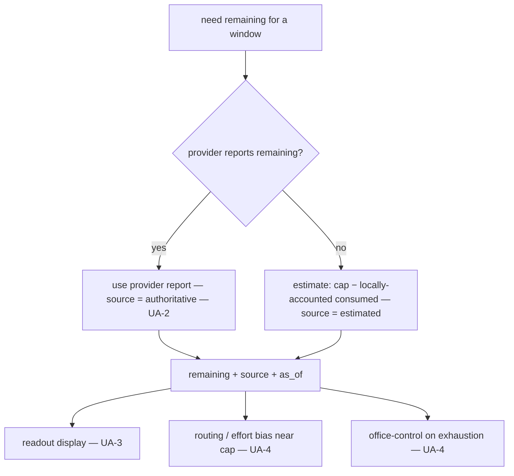

# Usage Allowance & Quota Windows

**Version:** 1.0.0
**Status:** Stable
**Layer:** concept

## Overview

Model access is not infinite: a provider account or a subscription grants a bounded
allowance over a rolling time window — so many tokens (or requests, or cost) per day,
per week. This spec models that **remaining allowance** as a first-class, windowed
quantity: how much of today's and this week's budget is left, taken from the
provider's own report when it exposes one and estimated locally otherwise, kept fresh
and honest about which it is, and surfaced to the user and to the systems that route
and pause on it.

It is the **external-allowance** member of the token economy — distinct from the
input-context budget (what enters the model) and the output-generation budget (what
the model produces). Those govern one request; this governs the standing allowance a
window grants across many requests. It is also the source of truth behind the
"remaining daily / weekly token balance" readout: the number the user sees is this
model's remaining, displayed through the unified readout mechanism.

## Related Specifications

- [l1-system-readout.md](l1-system-readout.md) — the remaining-allowance readout is displayed and refreshed through the unified readout mechanism (UA-3); its honest-staleness rule (SR-5) is the display parallel of UA-2.
- [l1-routing.md](l1-routing.md) — routing consumes remaining allowance: a near-exhausted lane biases lane choice (RTG-10) and effort (RTG-11) (UA-4).
- [l1-office-control.md](l1-office-control.md) — exhaustion drives the OC-3 model degradation / OC-4 hibernation path, whose recovery aligns with the window reset (UA-4/UA-5).
- [l1-generation-budget.md](l1-generation-budget.md) — the output-generation budget is a distinct axis (per-request generation cap, not a windowed external allowance) — composed, never conflated.
- [l1-operational-health.md](l1-operational-health.md) — OH-6 cost/usage accounting; approaching-cap is a health alert signal fed from this model.
- [l2-budget-engine.md](l2-budget-engine.md) — the concrete accounting engine that tracks consumption and realizes these windows.
- [l1-security.md](l1-security.md) — allowance data is local operational data; the credential behind a lane is never surfaced (UA-7).
- [l1-telemetry.md](l1-telemetry.md) — the only egress path for allowance metrics, opt-in (UA-7).

## 1. Motivation

A user running an autonomous office on a metered or subscription model needs a
truthful answer to a simple question: *how much have I got left today, and this week?*
Today that answer is absent or implicit. The office knows when a quota is **exhausted**
(office-control hibernates on it), but not how much **remains** before then — so the
user is surprised by a mid-work hibernation, and the router cannot ease off as a lane
approaches its cap.

Two things make this more than a counter:

- **The authoritative number lives at the provider.** Where a provider reports the
  remaining allowance for the day/week, that report is the truth — a subscription's
  weekly cap resets on the provider's schedule, not one the client can infer. Where the
  provider does not report it, the best the client can do is *estimate* from what it has
  accounted locally against a configured cap. Presenting an estimate as if it were the
  provider's truth is the failure mode to avoid.
- **Remaining is an input, not just a display.** A router that knows a lane is at 95%
  of its weekly cap can steer toward a cheaper lane or lower effort *before* exhaustion,
  and the office can warn the user rather than silently hibernating. The number earns
  its keep by feeding decisions, not only a status panel.

Modeling the windowed allowance once — provider-authoritative-or-estimated, honest
about which, and consumable by routing/control/health — turns "surprise exhaustion"
into "visible, actionable headroom."

## 2. Constraints & Assumptions

- An allowance is bounded over a rolling window; daily and weekly are the minimum, and
  the set is configurable (per-minute rate, monthly, …).
- Allowance is per resource that has one — a provider account or a credential lane; a
  metered key and a subscription have different caps (composes RTG-10).
- The provider's report is authoritative when present; a local estimate is a fallback,
  never a substitute presented as authoritative.
- Observing the remaining allowance must not meaningfully consume it.
- Allowance data is local operational data; concrete caps and reset schedules are
  configuration, not fixed here.

## 3. Core Invariants

Rules every Layer 2 implementation MUST NOT violate:

- **UA-1 (Rolling-window allowance model):** usage allowance is modeled as a bounded
  amount over a rolling time window — at minimum a **daily** and a **weekly** window,
  configurable beyond — each tracking its cap, amount consumed, and **remaining**, and
  resetting at its window boundary. Allowance is scoped to the resource that has one (a
  provider account or a credential lane); different lanes carry different caps.

- **UA-2 (Provider-authoritative, else estimated — never conflated):** the remaining
  allowance is taken from the **provider's own report** when the provider exposes it
  (the authoritative source); when it does not, the system **estimates** remaining from
  locally-accounted consumption against the configured cap. The two are always
  distinguished: an estimate is labeled as such and never presented as provider-truth,
  and an authoritative report supersedes the estimate the moment it arrives.

- **UA-3 (Remaining is a first-class readout):** remaining allowance per window is a
  system readout — displayed with its freshness and its source (authoritative /
  estimated), refreshed through the unified readout mechanism (activation / manual /
  event / scheduled poll), and never silently stale (composes `l1-system-readout`
  SR-5). This is the concrete "remaining daily / weekly token balance" surface.

- **UA-4 (Consumed by routing & control, not only displayed):** remaining allowance is
  an input to routing and office-control, not merely a number on screen — a lane
  approaching its cap biases routing toward a cheaper lane or lower effort (RTG-10 /
  RTG-11) *before* exhaustion, and true exhaustion drives the office-control degradation
  / hibernation path (OC-3 / OC-4). The allowance model is the source those consumers
  read; it observes and reports, it does not itself take the routing or pause action.

- **UA-5 (Honest, aligned window reset):** a window's remaining resets to full at the
  window boundary, aligned to the provider's boundary when the provider defines it (a
  subscription resets on the provider's schedule and timezone, not a client-inferred
  one). The system MUST NOT show a stale pre-reset remaining after the boundary, nor a
  confidently-full remaining before a confirmed reset when the provider's boundary is
  unknown — an unconfirmed transition is marked, not guessed.

- **UA-6 (Observation does not consume):** querying or refreshing the remaining
  allowance MUST NOT itself materially consume the allowance. A free provider
  quota-check endpoint is preferred; if a check has a cost, it is bounded, accounted,
  and rate-limited so that watching the budget does not distort it.

- **UA-7 (Local-first & secret-safe):** allowance data — caps, consumed, remaining,
  per-lane — is local operational data. It egresses only under the telemetry opt-in and
  never carries or reveals the credential/secret behind a lane (composes security and
  telemetry, and the log-legibility secret-safety rule).

> L2 specs cannot reach RFC status until all invariants here are addressed in their
> "Invariant Compliance" section.

## 4. Detailed Design

### 4.1 The windowed-allowance record

```text
[REFERENCE]
AllowanceWindow (per resource/lane, per window kind):
  window     : daily | weekly | ...          # UA-1
  cap        : the granted amount (tokens / requests / cost)
  consumed   : amount used this window
  remaining  : cap − consumed  OR provider-reported                  # UA-2
  source     : provider-authoritative | locally-estimated           # UA-2
  resets_at  : window boundary (provider-aligned when known)         # UA-5
  as_of      : freshness stamp                                       # UA-3
```

`remaining` and `source` travel together: a consumer always knows whether the number
is the provider's truth or the client's estimate.

### 4.2 Where the number comes from



### 4.3 The token-balance readout, sourced

The "remaining daily / weekly token balance" the user asked for is exactly UA-3 over
UA-1: the readout mechanism shows `remaining` for the daily and weekly windows, tagged
`authoritative` or `estimated` (UA-2) and `as of` its last refresh (SR-5). Pressing
*Refresh* or opening the panel triggers a refresh through the one readout core; a
scheduled poll keeps a pinned panel current — all without this spec re-implementing any
refresh logic (that is `l1-system-readout`'s job).

### 4.4 Relationship to exhaustion (office-control)

Office-control already hibernates on **exhaustion** and wakes on **recovery** (OC-3/
OC-4). This spec supplies the *leading* signal those rely on: the remaining allowance
trending toward zero, and the window `resets_at` that predicts recovery. Exhaustion is
the boundary case of remaining reaching zero; recovery is the window reset (UA-5). The
allowance model informs; office-control acts.

## 5. Drawbacks & Alternatives

- **Provider variance.** Not every provider reports remaining, and formats differ.
  Handled by UA-2: authoritative when available, honestly-labeled estimate otherwise —
  never a fabricated precision.
- **Estimate drift.** A local estimate diverges from provider truth over a window
  (untracked usage, shared accounts). Accepted and bounded: the estimate is labeled, and
  an authoritative report supersedes it on arrival (UA-2); the estimate is a
  best-effort headroom hint, not a guarantee.
- **Alternative — only detect exhaustion, no remaining model.** The status quo
  office-control assumes; rejected because it gives the user no headroom warning and the
  router no room to ease off before the wall.
- **Alternative — fold into the generation budget.** Rejected: generation-budget is the
  per-request output cap (a different axis); a windowed external allowance is not a
  property of one generation. Conflating them under-specifies both.

## Canonical References

| Alias | Path | Purpose |
| --- | --- | --- |
| `[READOUT]` | `.design/main/specifications/l1-system-readout.md` | The mechanism that displays and refreshes remaining allowance (UA-3). |
| `[ROUTING]` | `.design/main/specifications/l1-routing.md` | Lane/effort routing that consumes remaining near a cap (UA-4). |
| `[OFFICE-CONTROL]` | `.design/main/specifications/l1-office-control.md` | Exhaustion/recovery path this allowance model is the leading signal for (UA-4/UA-5). |
| `[BUDGET]` | `.design/main/specifications/l2-budget-engine.md` | The accounting engine that tracks consumption and realizes the windows. |

## Document History

| Version | Date | Author | Notes |
| --- | --- | --- | --- |
| 1.0.0 | 2026-07-07 | Core Team | Initial spec — the external-allowance member of the token economy: rolling-window allowance model with a daily + weekly minimum, per resource/lane (UA-1); provider-authoritative-when-reported else locally-estimated, the two never conflated (UA-2); remaining as a first-class readout displayed/refreshed through the unified readout mechanism, source-tagged and never silently stale (UA-3, the "remaining daily/weekly token balance" surface); consumed by routing/effort and office-control not merely displayed (UA-4); honest provider-aligned window reset (UA-5); observation does not consume the allowance (UA-6); local-first and secret-safe, credential never surfaced (UA-7). Distinct from input-context and output-generation budgets; the leading signal behind office-control exhaustion/recovery. Main-only (a host/provider quota concern). |
