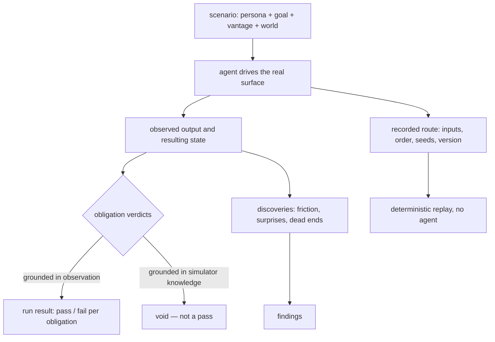
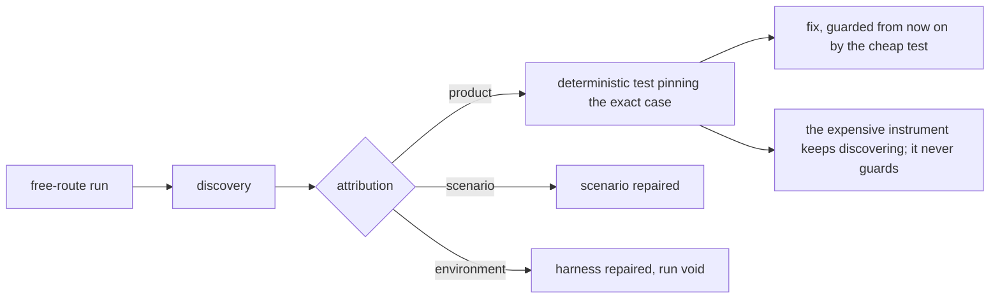

# Usage Simulation

**Version:** 1.0.2
**Status:** Stable
**Layer:** concept

## Overview

A usage simulation is a **durable, re-runnable scenario in which an agent plays a user
pursuing a goal against the product's real shipped surfaces**, and the product is judged by
what that pursuit reveals. Its defining property is a negative one: a scenario fixes the
user's *intent* and never the route. A test says *"run this command, expect this output"*;
a scenario says *"someone who has never seen this product wants three pieces of work
tracked in parallel, then abandons one — they may read the built-in help and nothing
else"*. Which commands get typed is the simulator's problem, and that is exactly where the
yield comes from: the routes nobody wrote a test for are the routes nobody checked.

This is the discovery instrument the verification stack does not otherwise have. Unit and
integration tests confirm the cases someone thought of. A cross-surface conformance corpus
proves two surfaces agree on a fixed fixture. An evaluation suite grades an agent
customization against golden tasks. All three fix the input and vary nothing, and the
defect class that survives all three is the one that appears only when a real sequence of
real decisions meets the product: a verb that exists but cannot be found, an error that is
accurate and useless, a second invocation that quietly behaves unlike the first, a state
the product can enter and not leave, a flag whose help text promises what the parser
refuses.

Because the route is free, no two runs are the same, and a discipline built on unrepeatable
runs cannot gate anything. The contract below is what makes it usable regardless:
**obligations** that must hold on *every* route are separated from **discoveries** that
held on *one*; every run records the exact route it took; and a defect a simulation finds
is pinned by a cheap deterministic test before its finding closes. The simulation
discovers, the pinned test guards, and neither does the other's job.

## Related Specifications

- [l1-simulation.md](l1-simulation.md) — The near-name sibling with the **inverted** effects discipline: it plays out a *generated mechanism* with effects suppressed (SIM-2), this plays out *usage of the shipped product* with effects real inside a disposable world (USM-2). The two must not be reconciled into one contract (§4.8).
- [../../nodus/specifications/l1-nodus-authoring.md](../../nodus/specifications/l1-nodus-authoring.md) — The nodus realization (NA-1…NA-9): this instrument transferred to a language, where the free route is the source an author writes and the coverage denominator is the diagnostic taxonomy rather than an action catalog.
- [l1-scenario-derivation.md](l1-scenario-derivation.md) — When a scenario comes into existence and from what. SD-1…SD-9 derive scenarios at planning time as a co-product of the task graph; SD-4 strengthens USM-10 wherever a planning step exists, and USM-10 remains the floor for behaviour that arrives without one.
- [l1-quality-standards.md](l1-quality-standards.md) — Where gates live. The cheap scenario tier joins the always-on gates (QLY-2); the exhaustive sweep is a conditional gate (QLY-3), never a per-change one (USM-9).
- [l1-acceptance-oracle.md](l1-acceptance-oracle.md) — Scenario obligations are acceptance criteria and inherit AO-1…AO-10 wholesale (USM-11).
- [l1-surface-parity.md](l1-surface-parity.md) — SP-11's action catalog is what coverage is claimed against (USM-8); SP-6's corpus is the deterministic sibling that compares surfaces on fixed fixtures rather than exploring free routes.
- [l1-evaluation-suites.md](l1-evaluation-suites.md) — Grades an agent *customization* against golden tasks; this exercises the *product's user-facing surfaces*. A scenario may be graded by a suite, but the unit under test differs.
- [l1-reproduction-recipe.md](l1-reproduction-recipe.md) — The recorded route is a recipe in that sense: product version, inputs, ordering, ambient configuration (USM-7).
- [l1-completion-verification.md](l1-completion-verification.md) · [l1-claim-verification.md](l1-claim-verification.md) — A run's claims about what happened are claims, and are grounded in observed output (USM-5).
- [l1-invariant-tripwires.md](l1-invariant-tripwires.md) — TW-6 separates structural checks from behavioural ones; free-route simulation is the third kind neither catches.
- [l1-execution-sandbox.md](l1-execution-sandbox.md) — The isolation substrate a disposable world is built on (USM-2).
- [l1-fault-ownership.md](l1-fault-ownership.md) — A failed run must be attributed: product defect, scenario defect, or environment defect (§4.6).
- [l1-development-workflow.md](l1-development-workflow.md) — Scenarios are authored in Design and run in Review; DW-4's spec-compliance verdict is what a scenario set makes checkable rather than asserted.
- [l1-outcome-attributed-cost.md](l1-outcome-attributed-cost.md) — An agent-driven run costs real inference; tiering exists because of it (USM-9).
- [l1-user-model.md](l1-user-model.md) — The product's model of its *actual* user; a scenario persona is a deliberately constructed fiction and never reads from it.

## 1. Motivation

**Every test in the stack fixes the input, and the interesting defects do not live there.**
A test is a claim about one point: given this, produce that. It is exactly as good as the
imagination of whoever wrote it, and it is written by the same person who wrote the
implementation, on the same day, holding the same mental model. The paths it covers are the
paths that were already in mind. Everything else — the order nobody tried, the second
attempt after the first failed, the workspace that was already half-populated, the flag
combination the parser accepts and the code does not — is uncovered by construction, and no
amount of additional fixed-input tests closes the class, because each new one is drawn from
the same imagination that missed it the first time.

**A free route reaches those paths for the same reason a real user does.** A simulator told
only *what the user wants* has to find its own way there, and it finds the way the product
actually affords, not the way the author remembers affording. When it takes six commands
for what should take two, that is a finding. When it reads the help text and picks the
wrong verb, that is a finding. When it succeeds by an accident of parsing that was never
intended to work, that is a finding, and it is one no fixed-input test could have produced,
because producing it required not knowing the answer.

**A product with several surfaces multiplies the gap rather than adding to it.** A library,
a command line, a terminal interface, a desktop shell and an agent-facing surface each
offer their own route to the same capability, and a user's session crosses them. The
sequence *"start on the command line, continue in the terminal interface, come back
tomorrow"* is a supported user journey that no per-surface test suite exercises, because
each suite is scoped to its own surface and stops at its edge.

**The obvious way to do this produces confident nonsense.** An agent asked to "use the
product like a user and report problems" will read the source, take the route the
implementation supports, understand an error message that would defeat a stranger, and
grade its own success — reporting a clean pass on a product a real newcomer could not
operate. This is not a prompting problem to be tuned away; it is structural, because the
same agent is both the actor and the judge, and it knows things the actor is not supposed
to know. Everything in §3 about a **declared vantage** and about **observed output as the
only evidence** exists to make that failure mechanically visible rather than to hope
against it.

**And unrepeatable runs cannot gate.** The moment a suite fails for reasons that change
between runs, it is disabled — first informally ("ignore that one"), then actually. A
discipline that wants to survive contact with a release schedule must therefore say, up
front and per scenario, which of its conclusions are stable across routes and which are
route-specific observations, and it must make discoveries cheap to convert into the
deterministic tests that *can* gate.

## 2. Constraints & Assumptions

- **The subject is the shipped product's real surface** — the real binary, the real command
  grammar, the real rendering, the real error text. A simulation against a mock of the
  surface studies the mock.
- **The actor is an agent, and inference is not free.** A run costs real money and real
  time, which caps how often the expensive tiers can run and forces the tiering in USM-9.
- **The actor is also the reporter, and it is biased toward the implementation it knows.**
  The contract must assume this rather than assume good faith.
- **Runs are not reproducible by construction.** Reproducibility is recovered *after the
  fact*, from the recorded route, not *before* it by constraining the route.
- **Effects are real, so the world must be disposable.** There is no interception layer
  here; containment is environmental, and a scenario that cannot be given a disposable
  world does not run.
- **Scenarios are product artifacts.** They live with the product, version with it, and
  survive the removal of any development scaffolding that happened to be in use when they
  were written.
- **A transcript is a verbatim record, and is handled as sensitive.** It captures whatever the
  product printed and whatever the world was seeded with. Transcripts stay out of tracked
  files by default, and a route is reviewed before it is pinned into one.
- **This never replaces deterministic testing.** It finds what deterministic tests could not
  have been written for, and hands each finding back to deterministic testing to keep.

## 3. Core Invariants

Rules every Layer 2 implementation MUST NOT violate:

- **USM-1 (Intent is fixed; the route is not):** a scenario declares a **persona**, a
  **goal**, a **starting world**, and what the persona is allowed to know — never the
  command sequence, keystrokes, or API calls that satisfy it. A scenario that prescribes its
  own route is a scripted test wearing a simulation's name: it costs an agent run and yields
  strictly less than the cheap deterministic test it should have been. The unwritten route is
  the entire source of value, and constraining it is the one change that removes all of it.

- **USM-2 (Real surfaces, real effects, disposable world):** a simulation drives the
  product's **actual shipped surface** and lets its effects **happen for real** — files
  written, state mutated, processes spawned — inside a world created for that run and
  destroyed after it. Containment is **environmental** (a throwaway working directory, state
  root, and configuration), never interception, because the writes are part of the behaviour
  under study. This inverts `l1-simulation`'s SIM-2 deliberately and the two MUST NOT be
  unified: suppressing effects there preserves the subject, suppressing them here destroys
  it. A scenario that cannot be given a disposable world is **not run**, never run against a
  real one.

- **USM-3 (Obligations hold on every route; discoveries hold on one):** a scenario separates
  **obligations** — conditions that must hold no matter which route the simulator took (the
  goal was reachable at all; no committed work was lost; no failure surfaced without a stated
  cause; the grammar accepted what its own help promised) — from **discoveries**, which are
  route-specific observations. Only obligations decide a run. A discovery **never** fails a
  run; it becomes a finding (§4.6). Conflating the two makes the suite flaky, and a flaky
  suite is a suite that gets turned off.

- **USM-4 (The persona's vantage is declared, and judgement happens only from inside it):**
  a scenario states what its simulated user knows and may consult — nothing, the built-in
  help, the published documentation, prior experience with the product — and every judgement
  about **discoverability, error clarity, naming, or recoverability** is made strictly from
  inside that vantage. The agent driving the scenario has read the specification and may have
  written the code; left unconstrained it will take the route the implementation supports and
  comprehend messages a stranger could not. A verdict resting on the simulator's
  implementation knowledge rather than on what the declared vantage could observe is **void**,
  and a run that cannot say which it rested on is treated as void.

- **USM-5 (Observed output is the only evidence):** every claim a run makes — *it worked*,
  *it reported X*, *nothing was lost* — cites what the product actually emitted and the state
  it actually left behind. The simulator's belief about what the product does is not evidence,
  and neither is the specification: the specification is what the product was *supposed* to
  do, and the gap between the two is the thing being measured. An obligation whose verdict
  cites no observation is **unmet**, not passed.

- **USM-6 (Situations develop — perturbation is scenario content, not an optional extra):**
  a scenario carries **perturbations**: the user changes their mind mid-task, abandons and
  returns later, repeats an action, supplies malformed or hostile input, interrupts the
  process, runs two things at once, or arrives with a world that is already large, stale, or
  half-migrated (§4.4). The happy path is where the implementation already agrees with
  itself; the yield is in the developments. A scenario declaring no perturbation is a smoke
  test and MUST be labelled as one rather than counted as simulation coverage.

- **USM-7 (Every run is replayable, and every finding is pinned by a deterministic test):**
  a run records the exact route it took — inputs in order, timing-relevant choices, seeds,
  environment, and the product version — in enough detail for a human or a machine to replay
  it without the agent. A defect discovered by simulation is **pinned by a cheap
  deterministic test before its finding is closed**; the simulation is the discovery
  instrument and the pinned test is the regression guard. A defect left guarded only by a
  free-route run is a defect that will be rediscovered, because nothing obliges the next run
  to take that route again.

- **USM-8 (Coverage is claimed against the action catalog; silence is a gap):** what a
  scenario set exercises is stated against the product's **declared catalog** of actions,
  surfaces, roles, and states, so that the set of things **nothing simulates** is visible and
  reviewable. An action no scenario reaches is a recorded gap finding, never an assumed pass.
  Coverage asserted as a percentage without the catalog behind it is a number about the
  scenarios, not about the product.

- **USM-9 (Tiered by cost and cadence — the exhaustive sweep is never the per-change gate):**
  scenario sets are tiered by run cost and each tier declares its cadence: a **short** set
  cheap enough to run on every change, a **broad** set per milestone or release candidate,
  and an **exhaustive** exploratory sweep on demand. What the project blocks on is the cheap
  tier; the expensive tiers inform. A discipline whose only mode is the exhaustive sweep is
  run once, admired, and abandoned. Each individual run additionally carries a **declared
  bound** — steps, wall time, and inference spend — because a free-route actor has no natural
  stopping point: an agent that cannot reach the goal will keep trying to. A run that exhausts
  its bound, or that is interrupted, **stops, tears its world down, and is reported
  `incomplete`**, naming which obligations were left undecided. An incomplete run is scored
  neither as a pass nor as a failure — *did not finish* is a third outcome, and folding it into
  either is how a suite begins to lie.

- **USM-10 (A scenario is a companion artifact of the behaviour it exercises):** new
  user-observable behaviour arrives **together with** the scenario that exercises it, in the
  same change, versioned in the same repository. A scenario written afterwards is written
  against what was built rather than against what was meant — the same goalpost move AO-1
  forbids, arriving through a different door — and a behaviour shipped without one is
  recorded as quality debt rather than silently uncovered.

- **USM-11 (An obligation that cannot fail is not an obligation):** scenario obligations are
  acceptance criteria and inherit the acceptance-oracle contract in full — one observable
  outcome each and never an activity (*"exercise the command line"* cannot be failed); a
  pass signal distinctive of success; an absence claim demonstrated to fail against a case
  where the thing does occur; a stated quantity derived from the source of truth rather than
  matched against the figure the scenario supplied. A set whose obligations are mostly the
  simulator's judgement **discloses that ratio** with its result.

- **USM-12 (A run reports; it does not repair):** a run's deliverable is evidence and written
  findings. Fixing what it found is a separate, separately-authorized act. A run that repairs
  as it goes destroys the evidence for the defect it found, makes the next run's baseline
  unknowable, and converts a measurement into an unreviewed change.

> L2 specs cannot reach RFC status until all invariants here are addressed in their
> "Invariant Compliance" section.

## 4. Detailed Design

### 4.1 Anatomy of a Scenario (USM-1 / USM-4 / USM-6 / USM-11)

A scenario is a small declarative artifact. Everything in it constrains *what the user
wants and knows*; nothing in it constrains *what the user does*.

```text
[REFERENCE]
id             stable identity, referenced by findings and pinned tests
tier           short | broad | exhaustive          (USM-9 — sets the cadence)
surfaces       which shipped surfaces are in play  (USM-8 — claimed against the catalog)

persona        who is acting, and why they care
vantage        what they may consult: nothing | built-in help | published docs | prior use
               (USM-4 — the horizon every discoverability judgement is made from)

goal           the outcome they want, in their words, not in the product's vocabulary
world          the starting state: fresh install | seeded small | seeded large | corrupted
               (declared and constructible; the run builds it, the run destroys it)

perturbations  the situation developments to introduce, and when   (USM-6)

obligations[]  must hold on EVERY route (USM-3), each one falsifiable (USM-11):
               - statement      the observable outcome
               - decided_by     observation of output | observation of state | judgement
               - evidence       what must be shown for the verdict to count (USM-5)

notes          what a discovery on this scenario would most likely mean
```

Two things are deliberately absent. There is **no expected output**, because the route that
produces output is not fixed. And there is **no step list**, because a step list is a route.

### 4.2 What a Free Route Buys, and What It Costs (USM-1 / USM-3)

Contrast the two instruments on the same behaviour:

| | Fixed-input test | Usage scenario |
| --- | --- | --- |
| Given | exact inputs | an intent and a vantage |
| Varies | nothing | the entire route |
| Finds | regressions in known cases | unknown cases, friction, dead ends |
| Repeatable | yes | no |
| Can gate | yes | only via its obligations |
| Costs | ~nothing per run | real inference per run |

The free route is the only reason the second column finds anything the first cannot, and
non-repeatability is its unavoidable price. USM-3 is how the price is paid without losing
the ability to gate: the obligations are the part that is route-independent, so they are the
part that may block, and everything else is information.

The failure mode to design against is the slow slide of obligations into route-dependence —
an obligation that quietly assumes the simulator will reach the goal *this particular way*.
It passes for months, then fails the first time a different route is taken, and is
diagnosed as flakiness rather than as the mis-stated obligation it is.

### 4.3 The Declared Vantage (USM-4)

The simulator is an unreliable narrator by construction, and in three specific ways:

1. **It routes like an implementer.** Knowing which verb exists, it reaches for that verb.
   The question a scenario asks — *could this be found?* — is answered by an actor for whom
   finding was never necessary.
2. **It comprehends messages a stranger could not.** An error naming an internal contract
   violation is perfectly clear to something that read the parser. A user with the built-in
   help and nothing else is stopped by it. Without a declared vantage, that message is
   reported as working.
3. **It grades its own success.** Having decided a route was reasonable, it reports the
   outcome of that route as the product's behaviour.

The declared vantage is the mechanism that makes all three checkable rather than
un-diagnosable. It converts *"was this discoverable?"* from an opinion into a question with
a stated basis: **discoverable from what?** A verdict then either names the observation
inside the vantage that supports it, or it is void (USM-4) — and voidness is detectable,
where bias is not.



### 4.4 Perturbation Classes (USM-6)

Situation development is what separates this from a scripted walkthrough. The classes below
are the catalog a scenario draws from; a scenario names which it introduces and at which
point.

| Class | What it introduces | What it typically exposes |
| --- | --- | --- |
| **Reversal** | the user changes their mind mid-task | one-way transitions, unreachable prior states |
| **Abandonment** | the task is left incomplete, the session ends | orphaned state, locks, resumption that is not offered |
| **Return** | the user comes back later, after other activity | stale handles, invalidated assumptions, lost context |
| **Repetition** | the same action is performed twice | non-idempotence, duplicate records, second-run divergence |
| **Malformed input** | wrong types, empty values, absurd sizes, wrong encoding | crashes, silent truncation, accepted nonsense |
| **Hostile input** | content that reads as instructions or as syntax | injection, escaping failures, content treated as command |
| **Interruption** | the process is killed mid-write | partial state, unrecoverable workspaces, missing rollback |
| **Concurrency** | two actions overlap | lost updates, corrupted state, misleading success |
| **Scale** | the world is already large | pagination absent, unusable output, quadratic behaviour |
| **Legacy world** | the world was produced by an older version | migration gaps, silent misreads, false compatibility |
| **Surface crossing** | the journey moves between surfaces mid-task | divergent state views, capability present on one side only |

A scenario that introduces none of these is a smoke test (USM-6), which is a legitimate
artifact — it simply does not count as simulation coverage and must not be reported as if
it does.

### 4.5 The Run (USM-2 / USM-5 / USM-7)

```text
[REFERENCE]
1. build the world      construct the declared starting state in a disposable location
2. hand over            give the agent: persona, goal, vantage, perturbation schedule
                        withhold: the route, the expected output, the implementation
3. drive                the agent acts on the real surface; every input and every emitted
                        byte is recorded as it happens, not reconstructed afterwards
4. perturb              introduce the scheduled developments at their declared points
5. verdict              each obligation is decided, citing the observation that decides it
6. record               route + observations + verdicts + product version -> transcript
7. destroy              the world is torn down; nothing survives into the next run

a run that exhausts its bound or is interrupted enters step 7 directly and is
reported `incomplete`, naming the obligations it left undecided (USM-9)
```

Steps 3 and 6 are the ones that carry the contract. Recording *as it happens* is what makes
the transcript evidence rather than a summary — a route reconstructed after the fact is the
simulator's account of what it did, which is precisely the thing USM-5 declines to accept.
And a torn-down world is what keeps runs independent: a second run that inherits the first
run's leftovers is measuring an accident.

### 4.6 Findings and the Promotion Path (USM-7 / USM-12)

A run produces findings, never fixes (USM-12). Each finding is attributed before it is
filed, because three different things produce a failed obligation and only one of them is a
product defect:

| Attribution | Meaning | Disposition |
| --- | --- | --- |
| **Product defect** | the product did the wrong thing | pin with a deterministic test, then fix |
| **Scenario defect** | the obligation was mis-stated or route-dependent | repair the scenario; no product change |
| **Environment defect** | the world or harness failed, not the product | repair the harness; the run is void, not failed |

The promotion path is the mechanism that keeps the discipline from accumulating an
ever-growing set of expensive runs as its only defence:



Once a case is pinned, the simulation is free to stop finding it — which is the point. The
expensive instrument is spent on what is not yet known, and the cheap one keeps what is.

### 4.7 Tiers and Cadence (USM-9)

| Tier | Scope | Cadence | Blocks? |
| --- | --- | --- | --- |
| **short** | the few journeys whose breakage makes the product unusable | every change | yes |
| **broad** | one scenario per catalog area, perturbations included | milestone / release candidate | yes, at the gate it runs in |
| **exhaustive** | every surface x every action x every role x the full perturbation catalog | on demand, and before a release | no — informs |

Every run within every tier is bounded (USM-9), and a run that hits its bound reports
`incomplete` rather than a verdict. This matters most in the exhaustive tier, where the
temptation to let a sweep run until it finishes is strongest and where an unbounded
free-route actor can spend without limit on a goal the product cannot satisfy — which is
itself the finding, and is reported as one.

The tiering is a cost constraint, not a maturity ladder: the exhaustive tier is not a
better version of the short tier that we will run once we can afford to. They answer
different questions at different rates, and the short tier's whole design goal is to be
cheap enough that nobody proposes skipping it.

### 4.8 Demarcation (USM-2 / USM-3)

| Discipline | Question | Input | Effects | Gates? |
| --- | --- | --- | --- | --- |
| **Usage simulation** (this spec) | What happens when someone tries to *use* this? | intent, route free | **real**, disposable world | via obligations only |
| Mechanism simulation (`l1-simulation`) | How does this generated mechanism behave? | a mechanism, at declared fidelity | **suppressed / modelled** | no — observational |
| Testing | Did this fixed input produce the expected output? | fixed | none or fixture-local | yes |
| Surface conformance | Do two surfaces agree on this fixture? | fixed, shared across surfaces | none | yes |
| Evaluation | How well did this *customization* do? | golden tasks | sandboxed | by score |

The pairing most at risk of being "cleaned up" is the first two, because both are called
simulation and both involve a run that is not production. Their effects disciplines are
opposite and each is correct for its subject: a mechanism being rehearsed must not fire, and
a product being used must actually write what it claims to write. A future refactor that
unifies them under one effects contract necessarily breaks one of them, and the one it
breaks will be this one, because suppression is the more conservative-looking default.

## 5. Drawbacks & Alternatives

- **Cost is the real constraint, and it is structural.** Each run spends inference, and the
  exhaustive tier spends a lot of it. USM-9 makes the spend deliberate rather than
  accidental, but it does not make it small — the honest position is that the expensive tiers
  run rarely and are worth it when they do.
- **Alternative — property-based testing instead.** Rejected as a replacement, accepted as a
  complement: generators explore the *input* space brilliantly and the *intent* space not at
  all. No generator produces *"gave up and tried the other surface"*.
- **Alternative — record real user sessions and replay them.** Rejected as the primary
  instrument: there are no users yet, replay of a recorded session is a fixed-input test by
  another name, and it cannot explore the situation developments in §4.4 that never happened
  to be recorded.
- **Alternative — let the agent freely explore with no scenario artifact.** Rejected: that is
  the existing ad-hoc quality pass, which is valuable and unrepeatable. Without a durable
  artifact there is no coverage claim, no cadence, no diff between releases, and no way to
  ask whether last month's finding stayed fixed.
- **Alternative — fold this into the conformance corpus.** Rejected: the corpus compares
  surfaces on fixed fixtures and must stay deterministic to gate every change. Admitting
  free-route runs into it would make it flaky and it would be disabled, taking the parity
  guarantee down with it.
- **The unreliable-narrator problem is mitigated, not solved.** A declared vantage makes the
  failure detectable and a void verdict namable; it cannot make an agent forget what it read.
  Independent runs by an actor with no repository access remain strictly better evidence, and
  where a judgement is high-consequence, that is what it deserves (AO-9).
- **Scenarios rot like any other artifact.** A scenario whose goal no longer corresponds to
  anything the product does will keep passing by finding some other way to be satisfied.
  USM-8's catalog claim is the only mechanism that surfaces this, and it surfaces it as a
  coverage gap rather than as a failure.

## Canonical References

| Alias | Path | Purpose |
| --- | --- | --- |
| `[MECHSIM]` | `.design/main/specifications/l1-simulation.md` | The near-name sibling whose SIM-2 effects discipline is deliberately inverted here (§4.8). |
| `[ORACLE]` | `.design/main/specifications/l1-acceptance-oracle.md` | AO-1…AO-10 — the contract scenario obligations inherit (USM-11). |
| `[CATALOG]` | `.design/main/specifications/l1-surface-parity.md` | SP-11's action catalog — what coverage is claimed against (USM-8). |
| `[GATES]` | `.design/main/specifications/l1-quality-standards.md` | QLY-2/QLY-3 — which tier blocks and which informs (USM-9). |

## Document History

| Version | Date | Author | Notes |
| --- | --- | --- | --- |
| 1.0.0 | 2026-09-11 | Core Team | Initial spec — usage simulation as a durable, re-runnable scenario in which an agent plays a user pursuing a goal against the product's real shipped surfaces: intent fixed, route free (USM-1); real surfaces and real effects inside a disposable world, deliberately inverting the mechanism-simulation effects discipline (USM-2); route-independent obligations separated from route-specific discoveries so only the former can gate (USM-3); the declared vantage that makes the simulator's unreliable narration detectable rather than hoped against (USM-4); observed output as the only evidence (USM-5); perturbation as scenario content, with an eleven-class catalog of situation developments (USM-6); every run replayable and every finding pinned by a cheap deterministic test — simulation discovers, the pinned test guards (USM-7); coverage claimed against the action catalog so silence reads as a gap (USM-8); short/broad/exhaustive tiers with declared cadence, the exhaustive sweep never the per-change gate, each run bounded in steps/time/spend because a free-route actor has no natural stopping point, and a bounded-out or interrupted run reported `incomplete` — a third outcome that is neither pass nor fail (USM-9); scenario as a companion artifact of the behaviour it exercises (USM-10); obligations inherit the acceptance-oracle contract (USM-11); a run reports and never repairs (USM-12). |
| 1.0.1 | 2026-09-11 | Core Team | Patch — cross-reference to `l1-scenario-derivation`, which schedules this instrument: scenarios derived at planning time from the requirements artifact, as a co-product of the task graph, with SD-4 strengthening USM-10 where a planning step exists. Documentation linkage only; no invariant added or changed. |
| 1.0.2 | 2026-09-11 | Core Team | Patch — cross-reference to the nodus realization `l1-nodus-authoring` (NA-1…NA-9): the instrument transferred to a language, where the free route is the source an author writes, the vantage excludes the runtime source, and coverage is claimed over the error taxonomy on a reachability axis and a recovery axis. Documentation linkage only; no invariant added or changed. |
