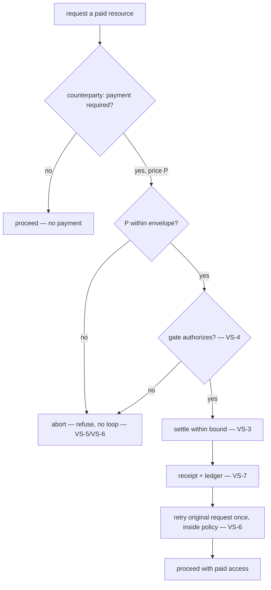

# Value Settlement

**Version:** 1.0.0
**Status:** Stable
**Layer:** concept

## Overview

An autonomous office sometimes has to **pay an outside party for value it receives** — a metered API, a paid data feed, a compute service, or another agent that charges for the work it does. This is a different concern from the two budgets the token economy already models: usage-allowance tracks the *product's own* model-usage allowance (what the office consumes from its provider), and generation-budget caps *one request's* output. Neither transfers value **out** to a counterparty. This spec names that missing concern: **outbound value settlement** — the discipline by which an agent may spend real value on the principal's behalf, always inside a bound the principal set, always gated, always audited, and never able to widen its own reach.

The load-bearing insight is that a paying agent is the highest-stakes agent there is: a hallucinated or hijacked step that can move money is far more dangerous than one that can only send an email. So the entire contract is built to make the payment authority **structurally bounded** — the agent holds only a scoped spending envelope it can read but never raise, cannot reach the funding source directly, is gated at the top of the authorization ladder on every payment, and fails **closed** (no payment, therefore no paid action) rather than ever falling back to unmetered access. Payment is modeled here as a first-class effect so that all of this discipline attaches to it by construction, not by the good behavior of a prompt. Consistent with the product's local-first posture, the capability is **off by default and rail-neutral**: the core names no currency, wallet, or payment protocol, performs no payment, and gains a way to pay only when a principal enables a host-supplied settlement provider.

## Related Specifications

- [l1-security.md](l1-security.md) — SEC-10 authority self-containment is the spine: the spending envelope lives on the **human-write-only** authority plane, and the agent's only move toward more spend is a request through the human approval path (VS-2). SEC-1 secret isolation keeps the funding credential out of the agent's reach (VS-3).
- [l1-action-gating.md](l1-action-gating.md) — every payment is a **value-at-stake** action, so AG-2/AG-4 place it at the top of the tier ladder (never auto); VS-4 defers the *how-much-friction* decision to action-gating rather than re-deriving it.
- [l1-usage-allowance.md](l1-usage-allowance.md) — the sibling budget it is **distinct** from: usage-allowance is the office's own inbound model-consumption allowance, value-settlement is outbound payment to a third party; composed, never conflated (VS-1).
- [l1-generation-budget.md](l1-generation-budget.md) — the per-request output cap, a third distinct axis (VS-1).
- [l1-tool-receipts.md](l1-tool-receipts.md) — TR unforgeable per-action receipts are how a payment proves it happened and to whom (VS-7); a narrated payment with no verifying receipt is unaccounted, never assumed settled (TR-4 kinship).
- [l1-operational-ledger.md](l1-operational-ledger.md) — the durable auditable record of every payment: recipient, amount, purpose, authorizing principal, outcome (VS-7).
- [l1-interception-model.md](l1-interception-model.md) — the decide→effect→observe seam (INT-1/INT-2) that gates a payment before it settles; INT-3 fail-closed is VS-5.
- [l1-agent-federation.md](l1-agent-federation.md) — paying a **peer agent** for work is the federation settlement case: AF-5 lets a relay facilitate settlement while holding no authority, AF-6 default-deny keeps a discoverable payee untrusted until explicitly engaged (VS-8).
- [l1-deployment-neutrality.md](l1-deployment-neutrality.md) — the payment rail is a host-supplied provider seam, off by default, zero-server; the core names no rail (VS-8, composing the DN provider-seam contract).
- [l1-policy-governance.md](l1-policy-governance.md) — the envelope defaults and the un-lowerable payment floor are administrator-governable (VS-2/VS-4, composing action-gating AG-8).
- [../../nodus/specifications/l1-nodus-portability.md](../../nodus/specifications/l1-nodus-portability.md) — LP-17 settlement effect seam is the nodus-workflow realization: a settlement is a distinct effect class gated against a host-held spending envelope, the rail host-supplied.

## 1. Motivation

The moment an agent can pay, two failures become catastrophic instead of merely annoying. First, an **over-broad grant**: hand the agent open access to a funding source and a single bad step — a hallucinated "this API needs $500", a prompt-injection that redirects a payment to an attacker's address — moves real money before anyone reviews it, and money does not roll back like a file edit. Second, a **self-widening grant**: if the agent can adjust its own spending limit, then the limit is theater — an injected instruction simply raises it first. Both failures share a root cause: treating payment as an ordinary tool call governed by prompt-level good intentions rather than by structure.

The resolution is to model outbound payment as its own effect with three structural guarantees baked in. The **envelope** — how much, to whom, how often — is set by the human principal outside anything the agent can write, so the agent spends inside a box it can see but never resize. The **authority is bounded by construction** — the agent never touches the funding source, only a scoped ability to spend up to the envelope, so even a fully compromised agent cannot exceed it. And the **default is refusal** — if payment can't be made safely (path down, envelope spent, recipient not allowlisted), the paid action simply doesn't happen; the system never "helpfully" falls back to unmetered access or an unbounded retry. Around that core sit the ordinary disciplines the rest of the system already provides — proportional gating, unforgeable receipts, a durable ledger — so that every payment is friction-gated where it matters, provable after the fact, and fully accountable. And because paying is a capability many deployments will never want, it stays **opt-in and rail-neutral**: the product is fully useful with no ability to pay at all, and gains one only when a principal deliberately wires in a settlement provider.

## 2. Constraints & Assumptions

- Value settlement is **outbound** — value leaving the office to a counterparty. Inbound accounting (the office's own model spend) is usage-allowance's concern and is not restated here.
- "Value" is deliberately abstract: money, credits, tokens, or any metered settlement unit. The core fixes no currency, rail, wallet, or protocol; those are host/provider concerns.
- A payment is **effectively irreversible** for gating purposes — the contract never assumes a payment can be clawed back.
- The capability is **off by default**. A deployment with no settlement provider cannot pay, and that is a valid, fully-functional configuration (a paid action it cannot fund is refused, not forced).
- Layer 1: it names no threshold, price, currency, wallet format, or protocol. Envelope values and rails are Layer-2 / host / governable.

## 3. Core Invariants

Rules every Layer 2 realization MUST NOT violate. They are technology-neutral.

- **VS-1 (Outbound settlement is a distinct, first-class concern):** paying an external party for value received — an API, a service, a data feed, a charging peer agent — is a **first-class effect distinct from** the office's own inbound model-usage allowance (usage-allowance) and its per-request generation budget (generation-budget). It transfers value **out** to a counterparty rather than accounting internal consumption. The three axes are composed, never conflated: an outbound payment is never silently drawn from, or hidden inside, an inbound-usage counter.

- **VS-2 (Principal-set envelope, never agent-set):** the **spending envelope** — per-payment ceiling, cumulative (session/window) ceiling, allowlisted recipients, and rate limits — is set by the **human principal or orchestrator on the human-write-only authority plane** (composing SEC-10), **before** any spending authority is delegated to the agent. The agent MAY **read** its remaining envelope, but MUST NOT set, raise, relax, or bypass it; the only path to more spend is a **request through the human approval gate** (a request is data, never a self-grant). An agent that can set its own spending limit effectively has no limit.

- **VS-3 (Bounded-authority custody):** the agent holds only a **scoped spending authority** bounded by the envelope, **never unbounded access to the funding source** or its controlling credential. The bound is **structural, not advisory** — a compromised, hijacked, or hallucinating agent still **cannot exceed the envelope**, because the authority it was handed cannot express a larger spend. The funding secret/key is never placed in the agent's context or logs (composing SEC-1 and the receipt-secret discipline TR-5); there is no pooled or custodial exposure beyond the granted envelope.

- **VS-4 (Every payment gated at the top of the ladder):** an outbound payment is a **value-at-stake** action and therefore is **never auto** — it takes at least a lightweight confirmation and by default a full approval, exactly as action-gating assigns value-at-stake actions to its top tier (composing AG-1/AG-2/AG-4). A payment to a **non-allowlisted recipient** is **refused**, never escalated through; recipient allowlisting is a gate precondition, not a friction the approver can wave past. This spec assigns the *stakes*; action-gating owns *how much friction*, and its governable floor (AG-8) means the payment gate cannot be silently lowered below approval for high-value or irreversible transfers.

- **VS-5 (Fail-closed — never fall back to unmetered):** if the settlement path is **unreachable**, **errors**, the **envelope is exhausted**, or authorization is **denied**, the paid action is **blocked**. The system MUST NOT fall back to unmetered or free access, retry the payment **outside** the envelope, or silently proceed as if payment had succeeded. The safe failure is **no payment, and therefore no paid action** — fail-closed to refusal, never fail-open to unbounded spend or to bypassing the paywall (composing action-gating AG-4 fail-safe-to-friction and interception INT-3 fail-closed).

- **VS-6 (Machine-negotiable, bounded settlement handshake):** where a counterparty signals **"payment required"** with a price, the settlement flow is a bounded handshake — **negotiate price → check envelope → authorize (gate) → settle → retry the original request** — and any retry happens **only inside the authorized policy-and-confirmation boundary**. A price the envelope cannot cover, or a renegotiation that raises the price **beyond** the authorized amount, **aborts** rather than loops or auto-escalates. The handshake terminates: it settles once within bounds, or it refuses; it never becomes an open-ended pay-and-retry loop.

- **VS-7 (Every payment is provable and audited):** each payment — attempted, authorized, settled, or refused — produces an **unforgeable receipt** binding **recipient, amount, purpose, time, and authorizing principal** (composing tool-receipts), and is recorded in the **operational ledger**. "What did the agent spend, to whom, for what, and who authorized it" is **always answerable**. A narrated payment with **no verifying receipt** is treated as **unaccounted**, never assumed to have settled (composing TR-4 existence-authenticity); a silent or unreceipted payment is a defect.

- **VS-8 (Opt-in, local-first, rail-neutral provider seam):** the ability to pay is **off by default and opt-in**. The product core **performs no payment** and **names no rail** — no currency, wallet, account, or payment protocol appears in it; a settlement rail is a **host-supplied provider seam** a principal deliberately enables (composing deployment-neutrality). A deployment with **no settlement provider** retains full local value and simply cannot pay — a paid action it cannot fund is refused (VS-5), never a runtime error that degrades unrelated function. Paying a **peer agent** is the federation settlement case (a relay MAY facilitate settlement while holding no content-authority, AF-5; a discoverable payee is untrusted until explicitly engaged, AF-6). Enabling payment adds a **capability, never a server dependency** (zero-server).

> L2 specs cannot reach RFC status until all invariants here are addressed in their "Invariant Compliance" section.

## 4. Detailed Design

### 4.1 The spending envelope

The envelope is the principal's grant, written on the authority plane the agent cannot reach (VS-2). The agent reads it; it never writes it.

```text
[REFERENCE]
SpendingEnvelope (set by principal/orchestrator, agent-read-only):     # VS-2
  per_payment_ceiling  : max value for a single payment
  cumulative_ceiling   : max value across a session / rolling window
  allowlisted_payees   : the closed set of recipients that may be paid  # VS-4
  rate_limit           : max payments per interval
  spent                : value settled so far this window (read-only)
  remaining            : cumulative_ceiling − spent                     # agent MAY read
```

The agent may read `remaining` to plan, but no field is agent-writable — the whole record lives behind the SEC-10 boundary. Raising any ceiling is a human act through the approval gate.

### 4.2 Authorizing one payment

```text
[REFERENCE]
settle(payment, envelope, rail):
    if rail is None:                                   return REFUSE  // VS-8 not enabled → cannot pay
    if payment.payee not in envelope.allowlisted_payees: return REFUSE // VS-4 non-allowlisted
    if payment.amount > envelope.per_payment_ceiling:   return REFUSE // VS-2 ceiling
    if payment.amount > envelope.remaining:             return REFUSE // VS-5 envelope exhausted
    if rate_exceeded(envelope):                         return REFUSE // VS-2 rate limit
    tier := action_gating.tier(value_at_stake=payment.amount)          // VS-4 → confirm/approval
    if not gate(tier, payment).authorized:              return REFUSE // VS-5 denied → no payment
    receipt := rail.settle(payment)                     // bounded authority only — VS-3
    if receipt is None or not verifies(receipt):        return UNACCOUNTED // VS-7
    ledger.record(payment, receipt)                     // VS-7 decide → settle → observe
    return SETTLED
```

Every exit that is not `SETTLED` leaves **no value transferred and the paid action not taken** (VS-5). The rail is invoked only after the gate authorizes, and it is handed a **bounded** instruction it cannot exceed (VS-3) — the agent never holds the funding credential.

### 4.3 The payment-required handshake



The handshake is **bounded** (VS-6): it settles once inside the authorized amount or it aborts. A renegotiation that raises the price re-enters the envelope check — it never silently pays the higher price, and it never loops.

### 4.4 Why the three budget axes stay separate

| Axis | Direction | Scope | Owner spec |
| --- | --- | --- | --- |
| usage allowance | inbound (own model use) | rolling window per lane | l1-usage-allowance |
| generation budget | inbound (own output) | one request | l1-generation-budget |
| **value settlement** | **outbound (pay a third party)** | **per-payment + cumulative envelope** | **this spec** |

Folding outbound payment into an inbound counter (VS-1) would under-specify both: an inbound allowance has no notion of a *payee* or an *allowlist*, and an outbound payment is not a property of one generation. They compose — a paid API call consumes an inbound allowance *and* settles an outbound payment — but they are never the same ledger.

## 5. Drawbacks & Alternatives

**Alternative — treat payment as an ordinary tool call.** Rejected by VS-1/VS-3/VS-4: an ordinary tool call carries none of the envelope, bounded-custody, or top-tier-gating guarantees; modeling payment as a first-class effect is what makes those structural instead of prompt-dependent.

**Alternative — let the agent manage its own budget for flexibility.** Rejected by VS-2: a self-settable limit is not a limit. Flexibility comes from the principal widening the envelope through the approval gate, never from the agent adjusting itself.

**Alternative — on payment failure, fall back to a free tier or retry harder.** Rejected by VS-5: a fallback that bypasses the paywall or an unbounded retry is exactly the fail-open behavior that turns a transient error into unmetered spend or terms-of-service violation. Refusal is the safe failure.

**Alternative — ship a built-in payment rail.** Rejected by VS-8: baking a currency/wallet/protocol into the core violates deployment-neutrality and the zero-server posture, and forces a capability most deployments never want. The rail is an opt-in provider seam.

**Risk — a compromised settlement provider.** The provider is trusted to move value, so a malicious rail is a real threat. Mitigation: the envelope still bounds total exposure (VS-3), the allowlist bounds recipients (VS-4), and every payment is receipted and ledgered (VS-7), so a misbehaving rail is bounded in blast radius and detectable after the fact. Provider integrity itself is an attestation/component-scanning concern at load time.

## Canonical References

| Alias | Path | Purpose |
| --- | --- | --- |
| `[SECURITY]` | `.design/main/specifications/l1-security.md` | SEC-10 human-write-only authority plane (VS-2), SEC-1 secret isolation (VS-3) |
| `[GATING]` | `.design/main/specifications/l1-action-gating.md` | Value-at-stake → top-tier friction the payment gate inherits (VS-4) |
| `[RECEIPTS]` | `.design/main/specifications/l1-tool-receipts.md` | Unforgeable per-payment receipt (VS-7) |
| `[DEPLOY]` | `.design/main/specifications/l1-deployment-neutrality.md` | The opt-in, rail-neutral, zero-server provider seam (VS-8) |
| `[NODUS]` | `.design/nodus/specifications/l1-nodus-portability.md` | The host-neutral realization: LP-17 settlement effect seam |

## Document History

| Version | Date | Author | Notes |
| --- | --- | --- | --- |
| 1.0.0 | 2026-07-17 | Core Team | Initial stable spec — outbound value settlement: paying an external party for value received, distinct from inbound usage-allowance and generation-budget (VS-1); principal-set spending envelope on the human-write-only authority plane, agent-read-only never agent-set (VS-2, SEC-10); bounded-authority custody — scoped spend the agent cannot exceed even if compromised, funding secret never in context (VS-3, SEC-1); every payment gated at the top of the action-gating ladder with allowlisted recipients as a precondition (VS-4, AG-1/AG-2/AG-4/AG-8); fail-closed — path down / envelope exhausted / denied blocks the paid action, never falls back to unmetered access or unbounded retry (VS-5, INT-3); bounded machine-negotiable payment-required handshake that settles once or aborts, never loops (VS-6); every payment provable via unforgeable receipt + operational ledger, unreceipted = unaccounted (VS-7, TR-4); opt-in, local-first, rail-neutral provider seam — core performs no payment and names no rail, a peer payee is the federation settlement case, enabling payment adds a capability not a server dependency (VS-8, deployment-neutrality / AF-5 / AF-6). Composes l1-security / l1-action-gating / l1-usage-allowance / l1-generation-budget / l1-tool-receipts / l1-operational-ledger / l1-interception-model / l1-agent-federation / l1-deployment-neutrality / l1-policy-governance. Nodus realization = l1-nodus-portability LP-17. Distilled from an adoption pass over an external agent-harness reference (agent-callable payment execution with orchestrator-set spending policy, per-task/per-session budgets, allowlisted recipients, non-custodial bounded-authority wallets, fail-closed budget enforcement, and a machine-negotiable payment-required handshake). Concept-only: no L2 realization planned yet (a durable gating contract, not pending implementation work). |
