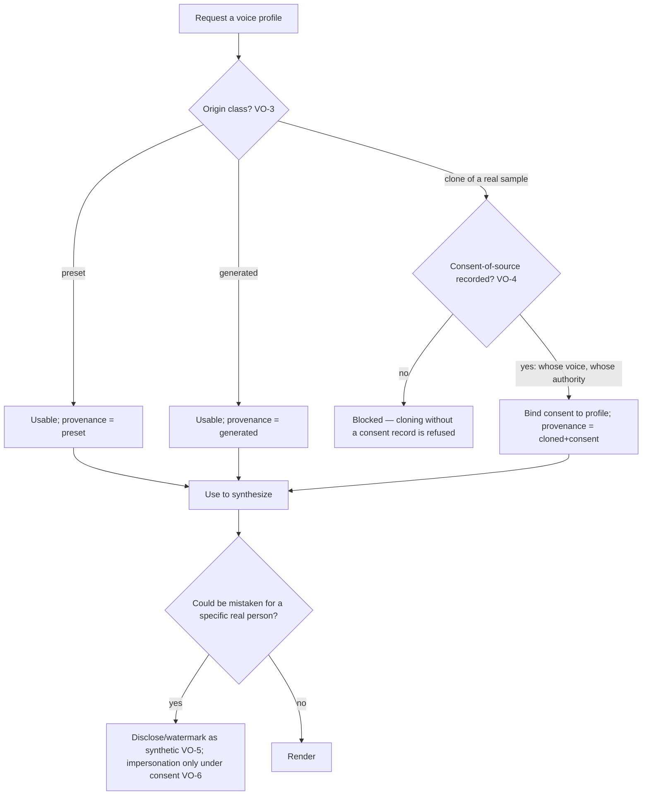

# Voice Output

**Version:** 1.0.0
**Status:** Stable
**Layer:** concept

## Overview

The output half of the voice loop: rendering the office's text into **synthetic speech**, in a chosen voice, on-device — the symmetric complement to voice input.

Most of this mirrors voice input by design (on-device synthesis, a pluggable engine, an explicit lifecycle, consent-gated activation). What it adds, and what makes it a spec rather than a UI feature, is two things voice input does not face. First, a **voice is an identity** — cloning one from a short sample can impersonate a specific real person, which is impersonation-capable, biometric-adjacent, and misusable — so a voice profile carries a consent, provenance, and disclosure contract that ordinary output does not. Second, the produced **audio is a derived rendering of canonical text, never the source of truth** — the text is the record, the audio is its projection, and a design that lets the two diverge silently loses the thing the record exists to hold.

This spec owns the *contract* — on-device, derived-from-text, and above all the voice-identity consent/disclosure discipline — not the synthesis math, the effects chain, or the UI, which are technology-stack and frontend concerns.

## Related Specifications

- [l1-voice-input.md](l1-voice-input.md) - The input sibling this completes into a full voice loop; the on-device, pluggable-engine, model-lifecycle, and consent-gated-activation invariants mirror VI-1/VI-7/VI-8/VI-3.
- [l1-security.md](l1-security.md) - Data residency (audio and voice profiles stay on-device) and the egress gate any sharing passes; VO-6's impersonation boundary composes SEC.
- [l1-policy-governance.md](l1-policy-governance.md) - The managed tier that can forbid voice cloning or require disclosure; prohibited-use classes (VO-6) are an enforced policy, not a footnote.
- [l1-reproduction-recipe.md](l1-reproduction-recipe.md) - The audio is reproducible from (text + voice profile + engine + version) — a rendering recipe (RR); the audio is a component-derived artifact, not the canonical result.
- [l1-derived-artifact-handoff.md](l1-derived-artifact-handoff.md) - The audio is a *derived* artifact over the canonical text (VO-2), rebuildable and never authoritative.
- [l1-attestation.md](l1-attestation.md) - A disclosure/watermark marking audio as synthetic is a checkable claim of origin (VO-5); the honesty family — a synthetic artifact never passes as genuine.
- [l1-model-runtime.md](l1-model-runtime.md) - On-device speech-model lifecycle (acquire → store → load → idle-unload, MR-6) reused for synthesis models (VO-8).
- [l1-action-gating.md](l1-action-gating.md) - Speaking is a gated effect; an agent's use of the voice modality passes the same authority as any other effect (VO-9).
- [l1-design-identity.md](l1-design-identity.md) - Visual identity's auditory sibling: a voice persona is part of how an office presents itself, under the same authored-identity discipline.
- [../../nodus/specifications/l1-nodus-portability.md](../../nodus/specifications/l1-nodus-portability.md) - A workflow that speaks invokes a host-supplied effect through the per-effect gate (LP-11); the voice is a host resource, no new language surface.

## 1. Motivation

An office that already accepts spoken input naturally produces spoken output: it reads a result aloud, an agent answers in a voice, a long document becomes listenable. The mechanics of *how* to synthesize speech are a solved, swappable, technology-stack problem. Two things about voice output are not solved by picking a good engine, and both are the reason this needs a contract rather than a checkbox.

**A voice is an identity, and a cloned voice is impersonation-capable.** Cloning a voice from a few seconds of audio can make a specific, real, identifiable person appear to say something they never said. That is not a stylistic choice like a color theme — it is biometric-adjacent identity data whose misuse is fraud, voice-authentication bypass, non-consensual content, and misrepresentation. The system fundamentally *cannot* verify who owns a voice sample, and the dangerous move is to pretend it can, or to treat cloning as an ordinary capability the user is simply trusted not to misuse. The honest design does the opposite: it makes the responsibility explicit and recorded — whose voice, on whose stated authority — refuses to clone without that record, discloses synthetic audio as synthetic, and holds the prohibited-use boundary as an enforced policy rather than a footnote. Privacy-by-locality does not remove the duty to respect other people's voices; if anything, a tool that keeps everything on-device must carry the responsibility contract itself, because no cloud reviewer will.

**The audio is a projection of the text, and letting the two diverge loses the record.** The authoritative artifact is the text the office produced; the spoken audio is a *rendering* of it. If a design lets the audio become an independent thing — edited directly, or with a transcript-of-the-audio treated as the record — then the text and the audio drift, and there are now two versions of what the office "said" with no authority between them. The rendering must be reproducible from the text (plus the voice and engine), and the text must stay the single source of truth across every take, effect chain, and voice. This is the same derived-artifact discipline the rest of the system applies to any expensive, rebuildable projection: keep the source authoritative, treat the rendering as recomputable.

Everything else — on-device synthesis, a pluggable engine, an explicit model lifecycle, consent-gated and interruptible activation — is voice input read in the mirror, and it is here for the same reasons: privacy by locality, backend independence, honest resource use, and a system that does not act (here, *speak*) unbidden.

## 2. Constraints & Assumptions

- **Local-first by construction**: synthesis runs on a locally-stored model; the text, the voice profile, and the produced audio never leave the device unless the user authorizes egress.
- **Technology-agnostic**: this spec names no synthesis method, model, effects library, or audio format. It constrains identity, consent, provenance, disclosure, and the derived-rendering discipline — not how waveforms are computed.
- **Opt-in**: an office is fully functional with no voice output at all; speech is an added modality, never a runtime dependency.
- A "voice profile" is a named, reusable synthesis identity — a preset, a clone of a reference sample, or a generated voice — attachable to an office, agent, or persona.
- The canonical artifact is always the **text**; audio is its rendering. This spec never makes audio authoritative.

## 3. Core Invariants

Rules every Layer 2 implementation MUST NOT violate:

- **VO-1 (On-device synthesis by default):** speech is synthesized on a **locally-stored** model; the text to be spoken, the voice profile, and the produced audio never leave the device unless the user explicitly authorizes egress. Speaking creates **no network dependency** — an office with no connectivity still speaks. (Mirrors VI-1.)
- **VO-2 (Audio is a derived rendering of canonical text — never the source of truth):** the authoritative artifact is the **text**; the audio is a **derived rendering** reproducible from (text + voice profile + engine + version). Audio MUST NOT become an independent source of truth the text is reconciled against: editing the waveform directly as the record, or treating a transcript-of-the-audio as authoritative, is forbidden. The text is the record; the audio is its projection. (Composes the derived-artifact / reproduction-recipe discipline.)
- **VO-3 (A voice profile is a provenance-bound identity artifact):** every voice profile records its **origin class** — built-in **preset**, **cloned** from a reference sample, or synthetically **generated** — and, for a clone, *from what sample and under what recorded consent* (VO-4). A profile whose provenance is unknown MUST NOT be used to represent a party; provenance travels with the profile and is inspectable.
- **VO-4 (Cloning a real person's voice requires a recorded consent-of-source; the system binds the claim, never fakes verification):** the system **cannot** independently verify who owns a voice sample, and MUST NOT pretend to. Cloning therefore **requires and records** an explicit consent-of-source assertion at clone time — *whose* voice, on *whose* stated authority — bound to the resulting profile, and cloning **without** that record is a **blocked** operation, not a silent capability. The responsibility is made explicit, recorded, and auditable, never assumed away by the tool because it happens to run locally.
- **VO-5 (Synthetic speech is disclosed as synthetic where it could be mistaken for a real person):** audio that could be mistaken for a genuine recording of a specific real person carries a **disclosure** — an audible marker and/or an embedded watermark — identifying it as synthetic, so it cannot be passed off as authentic. Removing or suppressing that disclosure in order to misrepresent synthetic audio as a genuine human recording is forbidden. (A synthetic artifact never passes as genuine — the honesty family, at the audio grain.)
- **VO-6 (Impersonation-without-consent and the prohibited-use classes are an enforced boundary, not a footnote):** generating speech that impersonates a specific real person is permitted **only** under the VO-4 consent record; absent it, the operation is refused. The prohibited-use classes — fraud, voice-authentication bypass, non-consensual sexual content, harassment, and misleading official (political/legal/financial/medical/emergency) communications — are a **declared, policy-enforced** boundary the system holds, with the managed policy tier able to forbid cloning or mandate disclosure outright. This is a boundary the system enforces, not one the user is merely trusted to honor.
- **VO-7 (Pluggable synthesis engine):** synthesis runs through an **engine abstraction**, not a single hard-wired model; engines are swappable, and the profile / text / consent / disclosure contract is **engine-independent** — changing the engine changes the sound, never the identity or consent guarantees. (Mirrors VI-7.)
- **VO-8 (On-device model lifecycle):** synthesis models follow an explicit **acquire → store → load → idle-unload** lifecycle on-device, occupying hardware only while active. (Mirrors VI-8; composes MR-6.)
- **VO-9 (Speaking is an explicit, gated, interruptible output mode — the office does not speak unbidden):** audio output begins only under an **explicit grant** (a user setting, or a per-utterance authorized effect) and is **interruptible at any point** without side effects. An agent's use of speech as an output modality is a **gated effect** subject to the same authority as any other effect — the office does not start talking on its own, and a spoken utterance can always be stopped. Interruption stops the *rendering*, never the record: a half-spoken utterance leaves the canonical text wholly intact (VO-2), so "the audio was cut off" is never mistaken for "the result was incomplete" — the text was complete before a single word was voiced. (Mirrors VI-3/VI-5; composes action-gating / interception.)
- **VO-10 (Rendering never mutates the canonical result; renderings are retryable and versioned):** producing a rendering **never alters** the canonical text; a failed rendering is **retryable** and never corrupts the source; and multiple renderings (takes, effect chains, alternate voices) are **versioned with lineage** while the text remains the single authoritative artifact across all of them. A rendering is a recomputable projection, not an edit of the record. (Composes reproduction-recipe versions, work-liveness retry, crash-recovery.)

> L2 specs cannot reach RFC status until all invariants here are addressed in their "Invariant Compliance" section.

## 4. Detailed Design

### 4.1 The voice loop, completed

| | Voice input (l1-voice-input) | Voice output (this spec) |
| --- | --- | --- |
| Direction | Speech → text | Text → speech |
| Canonical artifact | The **text** (transcript, reviewed) | The **text** (the audio is its rendering, VO-2) |
| On-device | Audio never leaves (VI-1) | Audio + profile never leave (VO-1) |
| Engine | Pluggable (VI-7) | Pluggable (VO-7) |
| Activation | Explicit, cancellable (VI-3/VI-5) | Explicit, interruptible, gated (VO-9) |
| The asymmetry | Transcribing *your* speech | Synthesizing *a* voice — possibly a real person's (VO-3…VO-6) |

The rows are a mirror until the last one. Transcribing your own words carries no identity risk; synthesizing a voice does, because the voice may belong to someone who never agreed to say what the office is about to make them say. That single asymmetry is the reason voice output is more than voice input run backwards.

### 4.2 The voice-identity contract (VO-3 / VO-4 / VO-5 / VO-6)



The load-bearing move is the **block on clone-without-consent** (VO-4). The system cannot verify ownership, so it does the only honest thing: it refuses to manufacture an impersonation-capable artifact without a recorded, auditable assertion of the right to do so. This does not make misuse impossible — a determined user can assert falsely — but it converts a silent capability into a deliberate, recorded act, which is the difference between a tool that enables misuse by default and one that requires someone to lie on the record to misuse it.

### 4.3 Audio is derived, text is the record (VO-2 / VO-10)

```text
[REFERENCE]
canonical      : the text the office produced          // authoritative, the record
rendering      : synth(text, voice_profile, engine, version)  // derived, recomputable, versioned
edit the audio : forbidden as a way to change the record — edit the text, re-render
transcript(audio) as record : forbidden — the text is already the record
```

Keeping the text authoritative is what makes every downstream property hold: a rendering can be retried without touching the record (VO-10), reproduced exactly from its inputs (reproduction-recipe), re-voiced or re-effected as a new version with lineage, and discarded without loss — because the thing of value, the text, was never at risk.

### 4.4 Boundary with neighbouring layers

| Concern | Owner |
| --- | --- |
| Rendering text to speech; the voice-identity consent/disclosure contract | **This spec** |
| Transcribing speech to text | Voice input (the input sibling) |
| Whether an agent is *allowed* to speak (the effect) | Action gating / interception (VO-9 composes) |
| Reproducing the exact audio from its inputs | Reproduction recipe (the audio is a recipe-derived artifact) |
| Forbidding cloning / mandating disclosure org-wide | Policy governance (managed tier, VO-6) |
| The synthesis models' storage and lifecycle | Model runtime (MR-3/MR-6) |
| The synthesis engine, effects, formats, and UI | Technology stack / frontend (out of scope here) |

## 5. Drawbacks & Alternatives

- **The consent record can be falsely asserted.** Accepted and stated (VO-4): the system cannot verify ownership, so it makes the assertion explicit, recorded, and auditable rather than silent. It converts misuse from a default capability into a deliberate lie on the record — the most a local tool honestly can do, and strictly better than pretending to verify or not asking at all.
- **Disclosure/watermarking adds friction and can be stripped.** Accepted (VO-5): the disclosure raises the effort and visibility of passing synthetic audio as genuine, and stripping it to misrepresent is a declared prohibited act (VO-6). A removable marker that most honest uses keep is worth more than no marker.
- **Voice output looks like a frontend feature.** The rendering *surface* is; the identity/consent/disclosure contract and the derived-rendering discipline are not — they are security and record-integrity concerns that belong in the core regardless of who builds the UI, exactly as voice input's on-device and review contracts do.
- **Alternative — treat a cloned voice like any other output style.** Rejected by VO-3/VO-4: a voice is impersonation-capable identity data, not a stylistic parameter; treating it as a theme choice is the exact failure the responsibility contract exists to prevent.
- **Alternative — let the audio be editable and authoritative.** Rejected by VO-2: it creates two versions of what the office said with no authority between them; the text stays the record, the audio stays its projection.
- **Alternative — skip disclosure to sound more natural.** Rejected by VO-5/VO-6: undisclosed synthetic audio of a real person is the precise capability that enables fraud and misrepresentation, and it is a declared prohibited use.
- **Alternative — trust the user with an unenforced responsible-use note.** Rejected by VO-6: prohibited-use classes are a policy the system holds and the managed tier can harden, not a footnote — locality of the tool does not offload the duty onto a document nobody reads.

## Canonical References

| Alias | Path | Purpose |
| --- | --- | --- |
| `[INPUT]` | `.design/main/specifications/l1-voice-input.md` | The input sibling; the on-device / pluggable / lifecycle / gated-activation invariants mirror it. |
| `[SECURITY]` | `.design/main/specifications/l1-security.md` | Data residency and the egress gate; the impersonation boundary composes SEC. |
| `[POLICY]` | `.design/main/specifications/l1-policy-governance.md` | Managed tier that can forbid cloning or mandate disclosure (VO-6). |
| `[RECIPE]` | `.design/main/specifications/l1-reproduction-recipe.md` | The audio as a reproducible, component-derived rendering of canonical text (VO-2). |

## Document History

| Version | Date | Author | Notes |
| --- | --- | --- | --- |
| 1.0.0 | 2026-07-23 | Core Team | Initial spec — the output half of the voice loop, the symmetric complement to voice input, whose contract centers on the two things engine choice does not solve: on-device synthesis with no network dependency (VO-1, mirrors VI-1); **audio as a derived rendering of canonical text, never the source of truth** — editing the waveform as the record or treating a transcript-of-audio as authoritative is forbidden (VO-2); a voice profile as a **provenance-bound identity artifact** with a recorded origin class (VO-3); **cloning a real person's voice requiring a recorded consent-of-source**, since the system cannot verify ownership and must not pretend to — clone-without-consent is blocked, not a silent capability (VO-4); synthetic speech **disclosed/watermarked** where it could be mistaken for a genuine recording of a real person (VO-5); impersonation-without-consent and the prohibited-use classes (fraud, voice-auth bypass, non-consensual content, misleading official communications) an **enforced policy boundary** the managed tier can harden, not a footnote (VO-6); a pluggable engine whose swap changes the sound never the identity/consent guarantees (VO-7); on-device model lifecycle (VO-8, mirrors VI-8); speaking an explicit, gated, interruptible output mode so the office never speaks unbidden (VO-9, mirrors VI-3); and rendering that never mutates the canonical text, retryable and versioned with lineage (VO-10). The identity/consent/disclosure contract and the derived-rendering discipline are core concerns; the synthesis engine, effects, and UI are out of scope. Concept-only. |
