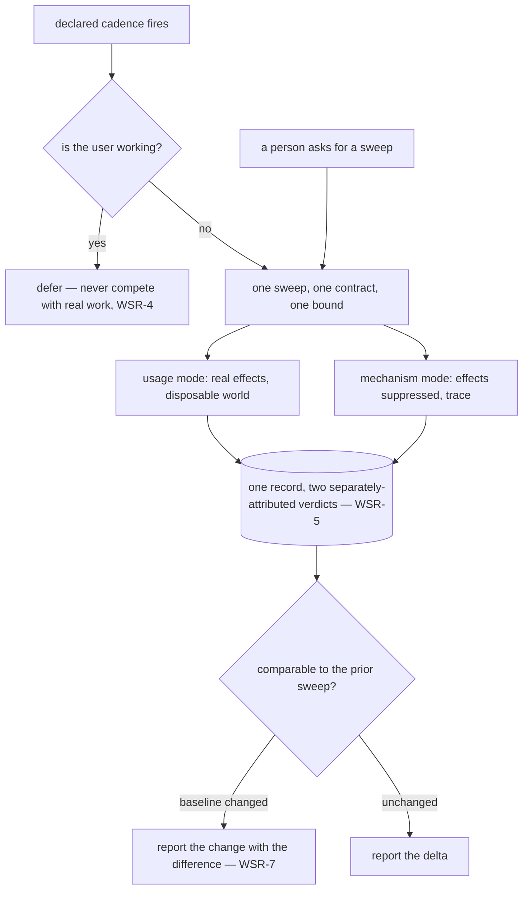

# Whole-System Rehearsal

**Version:** 1.0.0
**Status:** Stable
**Layer:** concept

## Overview

Per-change verification asks whether the piece that just moved still works. A
**whole-system rehearsal** asks the question nothing else asks: *does the assembled thing
still behave like one system?* It runs on a declared cadence without being asked, and on
demand whenever someone wants to know — and it is the same sweep either way.

It has **two modes, and they answer different questions**. The **usage** mode drives the
product's real shipped surfaces the way people do, with effects happening for real inside
a disposable world, and reports whether the journeys still complete. The **mechanism**
mode plays the assembled system out with effects suppressed and produces a readable trace
of what actually moves — which components wake, in what order, what they hand each other,
where control goes when something declines.

Neither mode's result implies the other's. A corpus that passes end to end says the
journeys work; it says nothing about a component that wakes twice per request, or a
retry path nothing exercises. A clean trace says the mechanics are coherent; it says
nothing about whether anyone can actually get anything done. Running one and reporting
"the system is healthy" is the failure this spec exists to prevent.

## Related Specifications

- [l1-usage-simulation.md](l1-usage-simulation.md) — the **usage** mode's contract in full: USM-2's real-effects-in-a-disposable-world, USM-3 obligations-versus-discoveries, USM-8 coverage against the action catalog, USM-9 tiering and bounds. This spec adds the sweep grain and the cadence; it re-specifies none of that.
- [l1-simulation.md](l1-simulation.md) — the **mechanism** mode's contract in full: SIM-2's suppressed effects, SIM-3 declared fidelity, SIM-4 determinism, SIM-6 the trace as the product. WSR-1 is the rule that keeps this mode's effects discipline from being relaxed to match its sibling's.
- [l1-scheduler-model.md](l1-scheduler-model.md) — the recurring fire behind the scheduled trigger, durable across restarts (SCH-6).
- [l1-improvement-loop.md](l1-improvement-loop.md) — IMP-1's never-tax-the-user's-work discipline is the constraint WSR-4 inherits for an unattended sweep, and IMP-1's taxonomy classifies what a sweep finds.
- [l1-remedy-authority.md](l1-remedy-authority.md) — a sweep produces findings in volume, which makes it the surface where an over-granted rung does the most damage. WSR-6 keeps the sweep reporting; RA decides what happens next.
- [l1-plan-rehearsal.md](l1-plan-rehearsal.md) — the same fit-together question asked of the plan before the build. The two bracket the work: one before it, this one repeatedly after.
- [l1-scenario-derivation.md](l1-scenario-derivation.md) — SD-5's two coverage denominators; a sweep claims against the shipped action catalog, which is the second of them, and SD-7's plan-time budget is where a sweep's recurring cost should already have been counted.
- [l1-quality-standards.md](l1-quality-standards.md) — QLY-3's conditional tier is where a sweep belongs; it is emphatically not an always-on per-change gate (WSR-3).
- [l1-outcome-attributed-cost.md](l1-outcome-attributed-cost.md) — a recurring unattended sweep is a recurring unattended spend, and it is attributed like any other.
- [l1-log-legibility.md](l1-log-legibility.md) — LL-5's honest-reduction discipline behind WSR-9's partial reporting and the mechanism mode's fidelity marking.

## 1. Motivation

**Everything is verified in pieces, and the assembly is nobody's subject.** Units are
verified by their own strategies, journeys by derived scenarios, changes by per-change
gates. Each is scoped to something smaller than the product. The behaviours that emerge
only when all of it is present and running together — a component that wakes on every
request because two areas each registered it, a recovery path that works in isolation and
deadlocks against a live scheduler, a default that two subsystems each believe they own —
have no artifact whose subject they are. They are found in production, by users, or not
at all.

**Two different things are both called "checking the whole system", and conflating them
is how a healthy report gets written about a sick system.** Asking whether people can
still do their work and asking how the machinery actually moves are different questions
with different instruments and *opposite* effects disciplines. One needs the writes to
happen, because the writes are the behaviour; the other needs them suppressed, because
the trace is the behaviour. A single mode cannot be both, and a sweep offering one while
claiming to answer both is worse than a sweep offering neither.

**A check nobody remembers to run is a check that does not exist.** The exhaustive tier
exists, is admired once, and is never run again, because running it is always less urgent
than whatever else is happening. A declared cadence is what converts an available
capability into a standing one — and the on-demand command is what keeps the cadence from
being the only way to get an answer when someone actually wants one.

**Sweeps are only useful against each other.** A single sweep reports a large number of
facts about a large system, most of which were also true last month. What a reader needs
is the difference: what regressed, what is newly uncovered, what changed shape. That
requires the denominators to be stable enough to compare, or the difference is measuring
the measuring stick.

## 2. Constraints & Assumptions

- **The sweep composes; it does not re-specify.** Each mode runs under its own existing
  contract, unmodified. What is new here is the grain, the pairing, the cadence, and the
  comparability rules.
- **The assembled system must be constructible on demand.** A product that cannot be stood
  up whole cannot be swept whole, and that inability is itself the first finding.
- **Unattended runs cost money and attention.** Both are bounded and attributed; an
  unbounded recurring sweep is a standing charge nobody approved.
- **Neither mode is a per-change gate.** The sweep is expensive by construction and
  blocking on it would make every change wait for the whole system.
- **The sweep observes.** It is an instrument, and instruments that repair destroy the
  baseline that makes the next sweep meaningful.
- **Findings arrive in volume.** A sweep's report is read by someone with limited
  attention, so ranking and deduplication are part of being usable rather than a nicety.

## 3. Core Invariants

Rules every Layer 2 implementation MUST NOT violate:

- **WSR-1 (Two modes, each keeping its own effects discipline intact):** a sweep runs a
  **usage** mode under the usage-simulation contract — real shipped surfaces, effects
  happening for real inside a disposable world — and a **mechanism** mode under the
  simulation contract — the assembled system played out with effects suppressed, producing
  a trace. Neither discipline is relaxed toward the other. Suppression preserves the
  subject in one mode and destroys it in the other, so a "unified" sweep that picks one
  effects rule for both has silently stopped answering one of the two questions.

- **WSR-2 (The subject is the assembly, not the sum of the parts):** what a sweep adds over
  the per-change tiers is the behaviour that exists **only when everything is present at
  once** — cross-area interactions, shared resources, ordering under a live scheduler,
  emergent duplication. A sweep whose content is its component checks re-run together is
  expensive repetition wearing the sweep's name, and it will be switched off for exactly
  that reason.

- **WSR-3 (Declared cadence, bounded run, never the per-change gate):** every sweep
  declares when it runs and what it may spend — work, wall time, and inference — and the
  bound is enforced independently of the actor performing it. A sweep is a **conditional**
  gate at most: blocking every change on it makes the cheapest change wait for the whole
  system, which is how the cadence gets suspended and then forgotten.

- **WSR-4 (An unattended sweep never taxes the work it observes):** a sweep that fires on
  its cadence rather than on request runs **without blocking, delaying, or degrading** the
  user's actual work, and without competing with it for the resources that work needs. An
  unattended instrument that makes the product worse while measuring whether the product is
  good has inverted its own purpose.

- **WSR-5 (Neither mode's outcome is inferred from the other's):** the two modes report
  into one record and their verdicts stay **separate and separately attributed**. A passing
  usage corpus never certifies the mechanism trace, and a coherent trace never certifies
  that anything is achievable. A report that merges them into one health claim has asserted
  something neither mode measured.

- **WSR-6 (A sweep reports; it does not repair):** the deliverable is evidence, a trace,
  and findings. Repair during a sweep destroys the baseline the next sweep compares
  against and converts the one measurement with system-wide scope into an unreviewed
  system-wide change. What may be done about a finding afterwards is
  `l1-remedy-authority`'s question, at the rung recorded for its class.

- **WSR-7 (Comparability is a declared property, not an assumption):** a sweep states the
  **baseline** it is comparable against — the scenario corpus, the action catalog, the
  system composition, and the bounds in force. When any of those changed since the prior
  sweep, the change is **reported with the difference**, because a "regression" measured
  against a corpus that grew, or an improvement measured against a catalog that shrank, is
  a fact about the instrument rather than about the product.

- **WSR-8 (On demand and on cadence are the same sweep):** the sweep a person requests and
  the sweep the cadence fires run the **same contract, modes, and bounds**. Where cost
  requires a smaller run, that is a declared, named scope with its own comparability
  baseline (WSR-7) — never the full sweep's name attached to a quietly reduced version,
  which makes two incomparable things share one record.

- **WSR-9 (An incomplete sweep reports as incomplete, naming what went undecided):** a
  sweep that exhausts its bound, is interrupted, or cannot stand the system up **stops,
  tears its world down, and reports partially** — naming which areas, journeys, and seams
  were left undecided. *Did not finish* is a third outcome and is never folded into pass or
  fail; a partial sweep read as a clean one is the most expensive possible misreport,
  because its scope is the whole product.

> L2 specs cannot reach RFC status until all invariants here are addressed in their
> "Invariant Compliance" section.

## 4. Detailed Design

### 4.1 The two modes (WSR-1 / WSR-5)

| | **Usage** mode | **Mechanism** mode |
| --- | --- | --- |
| Asks | can people still get their things done? | how does the assembled machinery actually move? |
| Subject | the real shipped surfaces | the assembled system as a mechanism |
| Effects | **real**, inside a disposable world | **suppressed** / quarantined |
| Driven by | the scenario corpus, free-route | a play-out at a declared fidelity |
| Output | verdicts, findings, coverage against the catalog | an ordered, attributed trace |
| Governing contract | `l1-usage-simulation` | `l1-simulation` |
| Characteristic find | a journey that no longer completes | a component that wakes twice, a branch nothing reaches |

The row that explains the rest is **Effects**. It is the reason these cannot be one mode
with a flag: the usage question is answered by letting the writes happen, because the
writes are the behaviour being judged; the mechanism question is answered by suppressing
them, because what is being read is the shape of the movement, and a play-out that commits
real effects cannot be run freely or repeatedly.

### 4.2 What the sweep adds (WSR-2)

```text
[REFERENCE]
already covered elsewhere — a sweep that only does this is repetition:
  does each unit work?                  per-unit verification strategy
  does each journey complete?           the cheap scenario tier, per change
  did this change break something?      the per-change gates

the sweep's own subject — present only when everything runs at once:
  cross-area interaction    two areas built apart, meeting for the first time
  shared resource contention    both believe they own the same thing
  emergent duplication      a component registered twice, woken twice
  live-scheduler ordering    a path that works alone and deadlocks under load
  unreached machinery       a branch, retry, or recovery nothing ever enters
  drift between areas       two subsystems' ideas of the same default diverged
```

The bottom list is what justifies the sweep's cost. When a sweep's findings all belong to
the top list, the sweep is not finding the assembly's problems — it is re-finding the
components' ones, at several times the price.

### 4.3 Triggers and cadence (WSR-3 / WSR-8)



Both entry points converge on the same node deliberately (WSR-8). The alternative —
a thorough scheduled sweep and a quick interactive one — produces two records that look
comparable, are not, and will be compared anyway.

### 4.4 The baseline (WSR-7)

```text
[REFERENCE]
a sweep record carries the baseline it is comparable against:

  corpus        which scenarios existed, at which version
  catalog       the declared action/surface set coverage is claimed against
  composition   which components were assembled, at which versions
  bounds        the work/time/spend ceilings in force

comparing two sweeps whose baselines differ:
  -> report the baseline difference FIRST, then the delta
  -> never present a delta across a changed baseline as a product change

the failure this prevents: the corpus grew by thirty scenarios, eleven of them
fail, and the report says "eleven new regressions" about behaviour that was
never passing and was simply never examined before.
```

### 4.5 Demarcation

| Instrument | Subject | Scope | When |
| --- | --- | --- | --- |
| **Whole-system rehearsal** (this spec) | the assembled system | everything at once | on cadence, and on demand |
| Usage-simulation tier (cheap) | the built product | the change's own area | every change |
| Plan rehearsal | the seams between planned units | the plan | before the build |
| Mechanism simulation | one generated mechanism | that mechanism | whenever it is generated |
| Per-unit verification | one unit | that unit | with the task |

This spec owns exactly one column of that table — *scope* — and borrows both of its
modes' contracts wholesale. That is deliberate: the temptation with a system-wide
instrument is to give it its own private rules for effects, fidelity, and evidence, and
the result is a third dialect in which no result can be compared to anything produced by
the instruments it was supposed to aggregate.

## 5. Drawbacks & Alternatives

- **A sweep is expensive and its value is mostly differential.** The first one finds a lot
  and costs a lot; the tenth finds little and costs the same. Accepted: the differential
  *is* the product, and the cadence exists so the difference stays small enough to read.
  WSR-3's bound is what keeps the cost from growing with the system indefinitely.
- **Volume will bury the reader.** A system-wide run over a real product produces more
  findings than anyone will act on, and an unranked list is functionally an empty one.
  Mitigated by classification and deduplication at report time — and not fully solved
  here. <!-- TBD: whether a sweep report should cap its surfaced findings and defer the remainder, or rank exhaustively and let the reader stop -->
- **Alternative — one mode, with a flag for effects.** Rejected (WSR-1): the flag would
  silently change which question is being answered while keeping the same result shape, so
  a reader could not tell from the record which one they were reading.
- **Alternative — cadence only, no on-demand command.** Rejected (WSR-8): the moment
  someone most needs the answer is the moment something looks wrong, which is never when
  the cadence happens to fire.
- **Alternative — make the sweep a release gate.** Rejected as a hard rule (WSR-3): it
  sounds responsible and it produces either a release blocked on a flaky system-wide run or
  a gate that gets waived by habit. Conditional placement keeps it meaningful.
- **The standing-up problem is real.** Some assembled systems cannot be constructed on
  demand cheaply, and for those the sweep degrades to whatever subset can be stood up —
  which WSR-7 requires be declared as a different baseline, and WSR-9 as a partial result.

## Canonical References

| Alias | Path | Purpose |
| --- | --- | --- |
| `[USAGE]` | `.design/main/specifications/l1-usage-simulation.md` | The usage mode's contract, borrowed whole: USM-2/3/8/9. |
| `[MECHANISM]` | `.design/main/specifications/l1-simulation.md` | The mechanism mode's contract, borrowed whole: SIM-2/3/4/6. |
| `[CADENCE]` | `.design/main/specifications/l1-scheduler-model.md` | SCH-6 durable recurring fire behind the scheduled trigger. |
| `[REMEDY]` | `.design/main/specifications/l1-remedy-authority.md` | What may happen to a sweep finding once WSR-6 has refused to act on it. |
| `[GATES]` | `.design/main/specifications/l1-quality-standards.md` | QLY-3 conditional tier, the placement WSR-3 claims. |

## Document History

| Version | Date | Author | Notes |
| --- | --- | --- | --- |
| 1.0.0 | 2026-09-13 | Core Team | Initial spec — the assembled system as a subject nothing previously owned, swept on a declared cadence and on demand. Two modes run with their own effects disciplines intact — usage under the usage-simulation contract with real effects in a disposable world, mechanism under the simulation contract with effects suppressed — because suppression preserves the subject in one and destroys it in the other (WSR-1); the subject is the behaviour present only when everything runs at once, not the component checks re-run together (WSR-2); cadence and bound are declared and enforced independently, and a sweep is conditional rather than a per-change gate (WSR-3); an unattended sweep never blocks, delays, degrades, or competes with the user's real work (WSR-4); the two modes report separately-attributed verdicts into one record and neither certifies the other (WSR-5); a sweep reports and never repairs, since repair destroys the baseline the next sweep compares against (WSR-6); comparability is declared via an explicit baseline — corpus, catalog, composition, bounds — and a delta across a changed baseline is reported as such (WSR-7); the requested sweep and the fired sweep are the same contract, with any reduced run named and separately based (WSR-8); an incomplete sweep reports partially and names what went undecided, *did not finish* being a third outcome (WSR-9). Post-Update Review (Spec Council) surfaced no blocking finding: the **Layer Purity** lens confirmed the mechanism mode's suppressed-effects rule is not quietly relaxed anywhere in the text (WSR-1 is the guard, and §4.1's Effects row is where a reader checks it), and the **Ecosystem** lens confirmed WSR-3's conditional placement stays consistent with SIM-1, which likewise refuses to make a mechanism play-out a definition-of-done gate. `[DR]` Promoted `Draft → Stable` in the authoring pass under Trust Mode; the spec borrows both modes' contracts wholesale and adds only scope, cadence and comparability, which is the smallest surface of the three written in this pass. |
