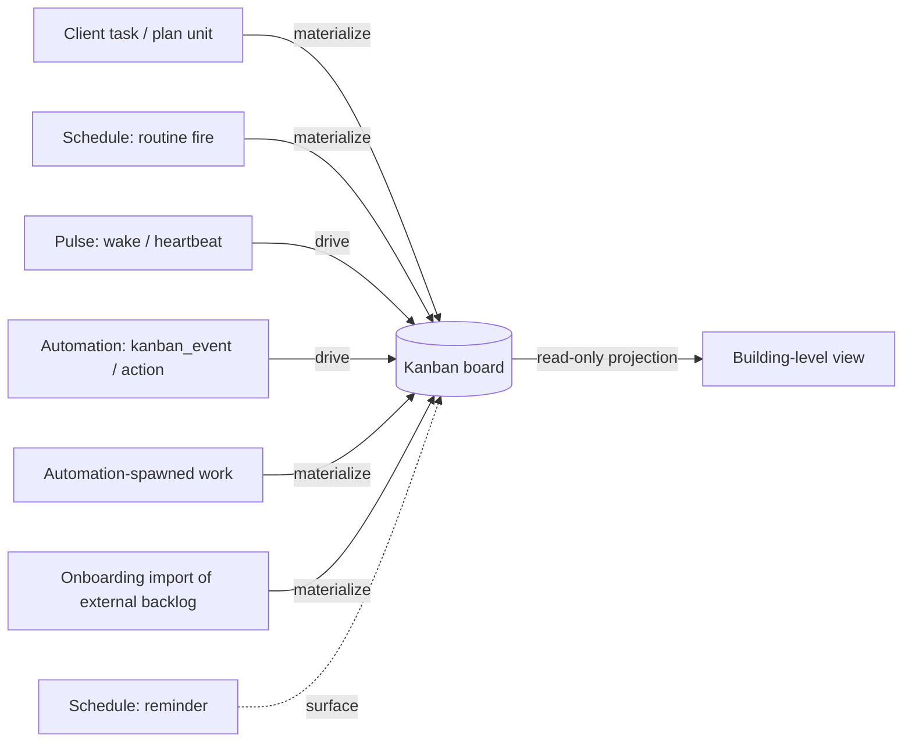

# Work Convergence

**Version:** 1.1.0
**Status:** Stable
**Layer:** concept

## Overview

The technology-agnostic principle that an office runs **all** of its activity through one legible surface: the Kanban board. Tasks the client asks for, work that scheduled routines produce, the autonomous pulse that keeps the office moving, and the reactions an automation pipeline fires — every stream of activity converges on the same board rather than running in a private queue nobody can see. This spec does not replace the board, the scheduler, or the plan; it names the one concept those subsystems compose around: **there is no shadow work.** Reading a single board answers "what is this office doing, and where does it stand," and every activity stream declares, in one of three fixed ways, how it relates to that board.

This is a **model-spec** — a sibling to [l1-kanban-model.md](l1-kanban-model.md), [l1-scheduler-model.md](l1-scheduler-model.md), and [l1-task-graph-model.md](l1-task-graph-model.md). The board *structure* (states, archival, isolation) lives in the kanban model; *time-driven* activity lives in the scheduler model; the *plan* whose units become cards lives in the task-graph model. This document owns what none of them names alone: the **convergence contract** binding every activity stream to that single board.

## Related Specifications

- [l1-kanban-model.md](l1-kanban-model.md) - The single board activity converges onto; supplies the pipeline (KAN-1), the card as unit of work (KAN-5), office-management (KAN-2), and traceable transitions (KAN-7) this contract binds every stream to.
- [l1-scheduler-model.md](l1-scheduler-model.md) - Time-driven streams: `routine` fires *materialize* cards (SCH-3), `wake`/pulse *drives* the board without creating a card (SCH-4), `reminder` *surfaces*; this spec classifies each and reconciles "pulse passes through the board" with SCH-4.
- [l1-task-graph-model.md](l1-task-graph-model.md) - The decomposition algebra whose task units *materialize* as cards; the board *tracks* what the plan produces.
- [l1-automation-pipeline.md](l1-automation-pipeline.md) - Event-driven reactions: `kanban_event` triggers and board-mutating actions are *drive*-relation participants; work an automation spawns *materializes* as a card, never a shadow queue.
- [l1-work-liveness.md](l1-work-liveness.md) - The affirmative liveness contract (WL-3) is why the board can hold no silently-dead work; convergence makes the board the surface that contract keeps honest.
- [l1-office-model.md](l1-office-model.md) - Managed work lifecycle (OFF-7) and client-not-managing (OFF-5); convergence never shifts board management to the client.
- [l1-global-orchestration.md](l1-global-orchestration.md) - Building-level unified visibility (GO-4) is a read-only projection *of* office boards; convergence makes each board the ground truth those views roll up from.
- [l1-work-import.md](l1-work-import.md) - Onboarding migration of an existing external backlog; imported work-items are a *materialize* stream (§4.2) that lands as canonical cards, never a shadow queue.

## 1. Motivation

An always-on office generates activity from several directions at once. The client asks for a task. A schedule fires a recurring routine. A heartbeat rouses the manager to keep advancing what already exists. An automation reacts to an external event. If each of these streams kept its own private list of "what I am doing," the office would fragment into parallel, invisible work queues — and the client (and the office's own manager) would lose the single answer to the only question that matters over a long-running project: *what is happening here right now?*

A human team avoids this socially: work lands on one shared board, and anything not on the board effectively does not exist. An autonomous office has no shared social board unless the architecture guarantees one. The guarantee is convergence: **every stream of activity relates to the one canonical board**, so the board is not merely *a* view of the work but *the* record of it. Nothing runs off to the side. This is what makes the office legible, auditable, and recoverable — and it is the precondition the liveness contract (WL-3) and the building-level aggregate view (GO-4) both quietly assume.

The subtlety this spec resolves is that "everything goes through the board" does **not** mean "every tick spawns a card." Some activity *becomes* work (a card); some activity *moves* work (advances existing cards); some activity merely *announces* itself (a notification). Convergence is the discipline that every stream picks exactly one of these relations and none of them is "invisible."

## 2. Constraints & Assumptions

- One board per office (KAN-6); convergence is per-office and never spans offices. Cross-office aggregate views are projections, not a second board.
- The board's state set and card semantics are owned by the kanban model; this spec adds *how streams relate to* the board, not new states or a new work unit.
- "Pulse" is the scheduler's `wake`/heartbeat (SCH-3, scheduler §4.3) — the office's cadence that advances existing work. Reconciling it with the board does **not** amend SCH-4: the pulse still creates no card. Its convergence relation is *drive*, not *materialize*.
- Convergence is a *visibility and routing* guarantee, not a throughput or de-duplication policy. Coalescing repeated fires and keeping owned work alive are the scheduler's and the liveness contract's concern (WL-4), invoked here but not redefined.
- The client may read the board but is never required to manage it (KAN-2, OFF-5); convergence must not create a stream that only the client can route.

## 3. Core Invariants (Layer 1 only)

Rules every Layer 2 implementation MUST NOT violate:

- **CONV-1 (Single activity surface — no shadow work):** an office's Kanban board is the one canonical, legible surface for all of its activity. Every stream — client-originated tasks, scheduled fires, the autonomous pulse, automation reactions, onboarding imports of an existing external backlog — relates to that board; none executes entirely off-board and invisible. "What is this office doing" MUST be answerable by reading one board.
- **CONV-2 (Three convergence relations):** every activity event relates to the board through exactly one declared relation: **materialize** (creates a persistent pipeline card), **drive** (advances or transitions existing cards without creating one), or **surface** (emits an observable, traceable signal that never enters the pipeline). A stream MUST declare which relation(s) it uses; "touches work but shows nothing on the board" is forbidden.
- **CONV-3 (One kind of work unit — the card):** convergence introduces no parallel work representation. When activity *materializes* work, the unit is a Kanban card obeying the canonical pipeline (KAN-1, KAN-5). There is never a second, hidden queue of work units running alongside the board.
- **CONV-4 (Pulse drives, never manufactures):** the autonomous pulse/heartbeat's convergence relation is **drive** — it rouses the office to advance work that already exists and MUST NOT materialize a card (reaffirming SCH-4). "The pulse passes through the board" means precisely that the pulse's only effect is to move board cards, not to spawn them.
- **CONV-5 (Time-driven activity converges by declared relation):** each scheduled fire converges according to its action kind — `routine` **materializes** a card (SCH-3), `wake` **drives** (CONV-4), `reminder` **surfaces** (a notification, no pipeline card). No time-driven activity may run off-board.
- **CONV-6 (Automation converges through board events and actions):** automation-pipeline participation is board-relative — board-observing triggers (`kanban_event`) and board-mutating actions are **drive**-relation, and any new work an automation spawns **materializes** as a card. An automation MUST NOT maintain a shadow work queue parallel to the board.
- **CONV-7 (Convergence is traceable and office-managed):** every convergence event records its originating stream, actor, time, and reason so the board stays legible (composing KAN-7), and convergence never shifts board management onto the client (reaffirming KAN-2, OFF-5). An untraceable convergence, or one that requires the client to route it, is a violation.
- **CONV-8 (Aggregate views project from boards, never replace them):** any higher-level or cross-office activity view is a read-only projection *of* office boards, not an independent source of truth (composing GO-4). The per-office board is ground truth; building-level visibility rolls up from it and never becomes a competing off-board record.

> L2 specs cannot reach RFC status until all invariants here are addressed in their "Invariant Compliance" section.

## 4. Detailed Design

### 4.1 The three convergence relations

Every activity event answers one question — *how does this touch the board?* — with exactly one of three relations (CONV-2):

| Relation | Effect on the board | The card | Example streams |
| --- | --- | --- | --- |
| **materialize** | a new card enters the pipeline (at `triage`/`todo`) | created | a client task, a `routine` schedule fire, work spawned by an automation, an imported external work-item (onboarding migration) |
| **drive** | one or more existing cards advance / transition | moved, not created | the pulse/`wake` heartbeat, an automation acting on `kanban_event`, the manager routing work |
| **surface** | an observable signal is emitted, traceable, outside the pipeline | none | a `reminder` fire, a notification, a status announcement |

The relations are exhaustive and exclusive *per event*: a single stream may use different relations on different events (a schedule `routine`-materializes yet its owning scheduler also `wake`-drives), but any one event is exactly one relation. There is no fourth relation "acts invisibly" — its absence is the whole point (CONV-1).

### 4.2 Stream → relation map

Onboarding import (a bounded, one-directional migration of an existing external backlog) is a **materialize** stream: each imported work-item becomes a canonical card, entering through triage exactly as any other materialized work, never a shadow queue. The migration mechanics — source adapters, entity reconciliation, provenance — are owned by [l1-work-import.md](l1-work-import.md); convergence owns only that its output lands on the one board.

| Stream | Convergence relation | Governing invariant | Composes |
| --- | --- | --- | --- |
| Client task / task-graph unit | materialize | CONV-3 | KAN-5, TG (plan → card) |
| Schedule `routine` fire | materialize | CONV-5 | SCH-3 |
| Pulse (`wake`/heartbeat) | drive | CONV-4 | SCH-4 |
| Schedule `reminder` fire | surface | CONV-5 | SCH-3 (reminder) |
| Automation `kanban_event` trigger / board action | drive | CONV-6 | automation-pipeline |
| Automation-spawned new work | materialize | CONV-6 | KAN-5 |
| Building-level activity view | (projection, not a stream) | CONV-8 | GO-4 |

### 4.3 Why the pulse "passes through" without materializing

The scheduler model already calls the heartbeat "the office's pulse" and says it "rouses the manager to advance whatever already exists, creating nothing" (scheduler §4.3, SCH-4). Convergence promotes this observation to a first-class relation rather than contradicting it: the pulse *is* board activity — it is the recurring push that keeps cards flowing through `ready → running → done` — but its relation is **drive**, not **materialize**. Saying "the pulse goes through the Kanban" is therefore exact: the pulse's entire purpose is to act on the board's cards. A pulse that produced a card on every tick would flood the board (the failure SCH-4 exists to prevent); a pulse that touched work *without* the board seeing it would be shadow work (the failure CONV-1 exists to prevent). The **drive** relation is precisely the space between those two failures.

### 4.4 No shadow queue

CONV-3 and CONV-6 together forbid the most common way convergence erodes in practice: a subsystem quietly keeping its own list of "pending things to do" that never surfaces as cards. A scheduled routine does not maintain a private backlog — it materializes a card and the card *is* the backlog entry. An automation does not hold a hidden queue of reactions — its board-affecting effects are cards (materialize) or transitions (drive). The board is not a *reflection* of where the work is; it is *where the work is*. Any design that would answer "what work is pending?" from somewhere other than the board (plus its archive) has already violated CONV-1.

## 5. Drawbacks & Alternatives

- **Pressure to over-materialize:** a naive reading of "everything goes through the board" tempts an implementation to spawn a card for every heartbeat and every notification, which would flood the board and violate SCH-4. The three-relation model (CONV-2) exists exactly to resist this: *drive* and *surface* are first-class, so most activity legitimately relates to the board **without** a card. The reconciliation is normative (§4.3), not incidental.
- **Alternative — let each stream keep its own queue and merely *report* to a board:** rejected. A board that only mirrors private queues is a dashboard, not a source of truth; the queues drift, and the board silently lies (violating CONV-1/CONV-3). Convergence requires the board *be* the record, not a copy of one.
- **Alternative — fold this into the kanban model as another KAN invariant:** rejected. The convergence contract spans the scheduler, the plan, the automation pipeline, and the liveness contract; hanging it inside the board-structure spec would overload a spec that should stay focused on states, archival, and isolation. A sibling model-spec (the same choice the task-graph model made) keeps each concept at its own altitude.
- **Custom/multi-board futures:** the current model assumes one board per office (KAN-6). If user-defined or per-project sub-boards are ever introduced, CONV-1's "one legible surface" must be restated as "one legible surface *set* with a defined roll-up," and CONV-8's projection rule extended accordingly. <!-- TBD: revisit CONV-1/CONV-8 if multi-board-per-office is introduced (tracks KAN-6 and kanban-model custom-columns TBD) -->

## Document History

| Version | Date | Change |
| --- | --- | --- |
| 1.0.0 | 2026-07-02 | Initial concept: convergence contract (CONV-1…8) binding every activity stream (task, `routine`, pulse, `reminder`, automation) to the single Kanban board via three relations — materialize / drive / surface; reconciles the pulse with SCH-4 as *drive*, not *materialize*. |
| 1.1.0 | 2026-07-09 | Onboarding import of an existing external backlog added as a **materialize** stream — CONV-1 enumeration, §4.1 materialize examples, and the §4.2 stream→relation map extended so imported work-items land as canonical cards through triage, never a shadow queue; migration mechanics delegated to the new l1-work-import (source adapters / entity reconciliation / provenance). Additive — no CONV invariant changes (materialize already covered it); L1 stays Stable (C9). |

## Canonical References

| Alias | Path | Purpose |
| --- | --- | --- |
| `[KANBAN]` | `.design/main/specifications/l1-kanban-model.md` | The single board (KAN-1/2/5/6/7) activity converges onto |
| `[SCHED]` | `.design/main/specifications/l1-scheduler-model.md` | Time-driven streams; pulse/`wake` (SCH-4) reconciled as the *drive* relation |
| `[AUTOMATION]` | `.design/main/specifications/l1-automation-pipeline.md` | `kanban_event` triggers and board-mutating actions (drive); spawned work materializes |
| `[LIVENESS]` | `.design/main/specifications/l1-work-liveness.md` | WL-3 affirmative liveness — why the board holds no silently-dead work |
