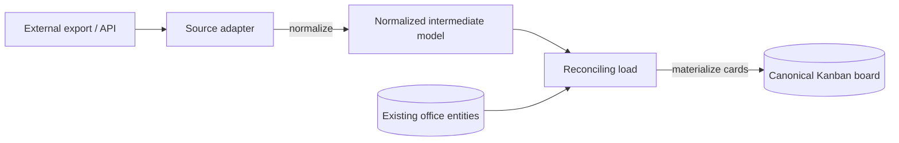

# Work Import

**Version:** 1.0.0
**Status:** Stable
**Layer:** concept

## Overview

A paradigm-neutral model for **work import** — the onboarding subsystem that brings an existing
body of work (issues, tasks, tickets) from an external tracker into the office's canonical work
model, so an office adopting a live project inherits its backlog instead of starting empty.

Import is a **one-directional migration**, distinct from live integration: a source adapter reads
an external export or API into a normalized intermediate model, and a source-agnostic load
reconciles that model onto the canonical Kanban board — mapping external statuses onto the fixed
pipeline, deduplicating labels and actors against what already exists, rewriting embedded assets,
and recording each item's provenance. It is the counterpart to the automation pipeline's *ongoing*
event ingestion: automation reacts to a stream of new external events, whereas work import performs
a bounded, authorized, resumable migration of an existing corpus.

This spec owns the import contract only. It does not define the board states (that is the Kanban
model), the ongoing external-event stream (that is the automation pipeline), or the live-service
connection (that is the connector extension). It is the migration layer those compose with.

## Related Specifications

- [l1-kanban-model.md](l1-kanban-model.md) — The canonical pipeline (`triage → todo → ready → running → blocked → done`, KAN-1) imported work lands on; external statuses map onto canonical states, custom columns anchor to canon (KAN-8) — WI-4.
- [l1-work-convergence.md](l1-work-convergence.md) — Imported work-items **materialize** as cards (CONV-2/CONV-3); import is a materialize-relation stream, never a shadow queue — WI-10.
- [l1-task-graph-model.md](l1-task-graph-model.md) — Imported items and their parent/sub-item and blocking relations may seed task-graph units (TG-*); import supplies units, the task graph structures them.
- [l1-project-support.md](l1-project-support.md) — SUP-3 triage; imported items enter through the office's existing triage intake, not a parallel path.
- [l1-workspace-lifecycle.md](l1-workspace-lifecycle.md) — Adopting a project workspace is when import typically runs; import is a bounded onboarding action, not a standing sync.
- [l1-data-lineage.md](l1-data-lineage.md) — Provenance/lineage of imported records (WI-6); an imported item is traceable to its origin.
- [l1-context-provenance.md](l1-context-provenance.md) — Imported content is external-authored and therefore untrusted-by-default (CP-1); it passes the neutralization boundary before an agent acts on it — WI-6.
- [l1-extensions.md](l1-extensions.md) — A service connector (EXT-10) MAY be the transport for a live-API import source; the adapter normalizes what the connector fetches.
- [l1-file-management.md](l1-file-management.md) — Embedded external attachments/images are re-hosted through the file subsystem (WI-8).
- [l1-security.md](l1-security.md) — Pulling from a live external tracker is a consent-gated, credential-scoped egress action (WI-10).
- [l1-nodus-portability.md](../../nodus/specifications/l1-nodus-portability.md) — The workflow-library schema-provider / import seams behind which a host implements a live-pull source; see §5.7.

## 1. Motivation

An office is most useful when adopted for a project that already exists — and an existing project
almost always already has a body of tracked work somewhere else: a backlog of issues, a board of
tickets, an exported spreadsheet. If the office cannot ingest that, adoption means either
abandoning the history or re-entering hundreds of items by hand. Neither is acceptable, and yet
naive import is worse: it duplicates labels, invents states that break the canonical pipeline,
strips attachments into dead links, loses the trail back to the original, and silently drops fields
it cannot map.

Naming work import as a contract buys four things:

1. **Onboarding without loss.** An existing external backlog becomes canonical office work in one
   authorized, resumable operation, with history and provenance intact.
2. **Source independence.** One normalized intermediate model and one reconciling load mean adding
   support for a new external tool is adding a source adapter, never touching the load path — the
   same pattern the knowledge and agent-migration subsystems already use.
3. **Canonical integrity.** External statuses map onto the fixed pipeline rather than proliferating
   ad-hoc states; labels and actors deduplicate against what already exists; the board stays
   legible after import, not fragmented.
4. **Honest fidelity.** What is preserved, folded, rewritten, or unmappable is declared — an import
   never silently discards data or leaves a dangling external reference.

The cost of *not* modeling this is either no migration path (adoption friction that blocks real
use) or an ad-hoc per-tool importer that duplicates entities, breaks the pipeline, and loses
provenance — exactly the failures this contract prevents.

## 2. Constraints & Assumptions

- **Technology-agnostic.** This is a Layer 1 concept. It names no external tracker, file format,
  API, or CSV/JSON dialect. Concrete adapters and their parsers are Layer 2.
- **Migration, not sync.** Import is a bounded, one-directional migration of an existing corpus,
  not a continuous two-way synchronization. Ongoing external events are the automation pipeline's
  concern; a live bidirectional mirror is explicitly out of scope.
- **Canonical target is owned elsewhere.** The board's states and card semantics belong to the
  Kanban model; import maps *onto* them and never invents new states or a second work unit.
- **Defers where a concern is owned.** Triage of imported items defers to project-support; the
  live-service transport defers to the connector extension; attachment storage defers to file
  management; provenance defers to data-lineage; egress/credential handling defers to security.
  This model owns only the adapter → normalize → reconciling-load contract.
- **On-device-first.** Importing from a local export file requires no egress; pulling from a live
  external tracker is an explicit, consent-gated, credential-scoped action.

## 3. Core Invariants

Layer 2 realizations MUST NOT violate these.

- **WI-1 Source-adapter isolation.** Importing from an external tool is done by a **source adapter**
  — one per tool/format — conforming to a uniform interface: read the source, emit the normalized
  intermediate model (WI-2). An adapter's only job is to normalize; it holds no knowledge of the
  target board's identifiers or structure. Adding a new source is adding an adapter, never changing
  the load path.

- **WI-2 Normalized intermediate model.** Every adapter emits one canonical intermediate
  representation — work-items plus id-keyed side tables of statuses, actors, labels, and attachments
  — decoupled from both the source format and the target schema. An item's status, assignee, and
  labels are references resolved through the side tables, so the load path is fully source-agnostic.

- **WI-3 Reconciling load, never blind insert.** The load maps every incoming entity onto the
  target's **existing** entities before creating anything: labels/tags are deduplicated against the
  office's existing set (only the genuinely missing are created), actors are resolved by a stable
  key (e.g. an email) then by name (else unassigned/policy default), and statuses map onto the
  canonical pipeline (WI-4). The load reuses existing target entities; it never blindly duplicates
  a label, actor, or state that already exists.

- **WI-4 Status maps onto the canonical pipeline.** An incoming external status maps onto the
  office's fixed canonical Kanban states (KAN-1). A status with no direct match is placed by
  inferring its canonical **kind** from evidence (a completion timestamp → done; a start timestamp →
  running/started; otherwise a backlog/todo kind), and any office-specific refinement is a custom
  column anchored to a canonical state (KAN-8). Imported work never introduces a state outside the
  canonical backbone.

- **WI-5 Idempotent, resumable, limit-aware load.** The load is robust to interruption and target
  limits: it retries under rate limits with backoff, reports progress, and is **idempotent on
  re-run** — re-importing the same source does not duplicate already-imported items, keyed by
  recorded source identity (WI-6). A partial import leaves a resumable state, never a corrupt
  half-migrated board.

- **WI-6 Provenance preserved, imported content untrusted.** Every imported work-item records its
  **origin** — the source tool/format and a back-reference (link/identifier) to the original — so an
  imported item is always distinguishable from a natively-created one and traceable to where it came
  from (composes data-lineage). This recorded origin is also the idempotency key (WI-5). Because
  imported content was authored **outside** the office, it is **untrusted-by-default** (composes
  context-provenance CP-1): item descriptions and comments pass the same neutralization boundary as
  any external content before an agent acts on them.

- **WI-7 Fidelity-honest, lossy-declared mapping.** The import declares what it preserves and what
  it cannot: fields with a canonical target are mapped, comments are folded into the item with
  author and date, and a field with **no** canonical target (source-specific metadata) is surfaced
  — recorded or reported — never silently discarded. The result is honest about fidelity; a
  reader can tell what did not survive the migration and why.

- **WI-8 Asset and reference rewriting.** External references embedded in imported content —
  attachment/image URLs, cross-item links — are rewritten to resolve in the target: re-hosted
  through the file subsystem or authenticated, with an explicit escape hatch when the target
  resolves them itself. A rewritten asset never leaves a dangling external link or a
  credential-leaking reference in imported content.

- **WI-9 Interactive and headless parity.** Import runs both **interactively** (guided selection of
  target scope, actor policy, comment inclusion) and **headless** (the same choices declared as
  flags/config), producing identical results. The headless form is the embeddability contract — a
  script or agent drives an import with no prompts — mirroring the office's CLI/UI parity stance
  (INV-3).

- **WI-10 Converges onto the board, consent-gated, local-first.** Imported work-items
  **materialize** as canonical Kanban cards (composes work-convergence CONV-3) — never a parallel
  shadow queue, and they enter through the office's existing triage intake (SUP-3), not a bespoke
  path. Pulling from a **live** external tracker is an explicit, consent-gated, credential-scoped
  egress action (composes the security egress gate); importing from a **local export file** requires
  no egress. Import is an onboarding action the user authorizes, never a silent background sync.

> A Layer 2 spec cannot reach RFC status until every WI-n invariant above is addressed in its
> "Invariant Compliance" section.

## 4. Detailed Design

### 4.1 Adapter → normalized model → reconciling load



The adapter (WI-1) is the only source-aware component; everything downstream operates on the
normalized model (WI-2). The reconciling load (WI-3) reads the office's existing labels, actors, and
states, maps incoming entities onto them, creates only what is missing, and materializes each
work-item as a card (WI-10).

### 4.2 The normalized intermediate model

```text
[REFERENCE]
ImportModel {
  items    : [ WorkItem ]                       // the work to import
  statuses : map<Id, { name, kind? }>           // external status catalog (kind: backlog|started|completed|canceled)
  actors   : map<Id, { name, email?, avatar? }> // external users, resolved on load (WI-3)
  labels   : map<Id, { name, color?, desc? }>   // external labels, deduped on load (WI-3)
  assets   : rewrite hints                       // attachment/image handling (WI-8)
}
WorkItem {
  title, description?, statusRef?, assigneeRef?, labelRefs?, priority?, estimate?,
  comments?, createdAt?, startedAt?, completedAt?, dueDate?, archived?,
  origin : { source, url|id }                    // provenance (WI-6), also the idempotency key (WI-5)
}
```

Every reference (`statusRef`, `assigneeRef`, `labelRefs`) resolves through the side tables, so the
load never parses source-specific inline strings — the model is the seam between source and target.

### 4.3 Reconciling the load

```text
[REFERENCE]
load(model, office):
  labelMap  := dedup(model.labels, office.labels)      // reuse existing; create only missing (WI-3)
  actorMap  := resolve(model.actors, office.members)   // by email, then name, else policy default (WI-3)
  for item in model.items:
     if already_imported(item.origin): continue        // idempotent re-run (WI-5)
     stateId := map_status(item.statusRef, office.pipeline)   // onto canonical states (WI-4)
     desc    := rewrite_assets(fold_comments(item))    // WI-7, WI-8
     card    := materialize(item, stateId, labelMap, actorMap, desc, origin=item.origin)  // WI-10
     record_provenance(card, item.origin)              // WI-6
```

`map_status` places an incoming status on the canonical pipeline (WI-4): a direct name match reuses
that state; otherwise the status's **kind** is inferred from `completedAt`/`startedAt` and mapped to
the matching canonical band, with a custom column (KAN-8) carrying the original name if the office
wants to preserve it.

### 4.4 Provenance and idempotency

Each imported card carries its `origin` (source + back-reference), which serves three roles: it makes
an imported item distinguishable from a native one (WI-6), it is the key that makes re-import
idempotent (WI-5, an already-seen origin is skipped), and it is the lineage pointer that lets a later
reader trace a card to the external item it came from. Because the origin is external, the imported
text is untrusted-by-default and neutralized at any prompt/tool boundary before an agent acts on it
(WI-6, composes context-provenance).

### 4.5 Ideas-to-adopt mapping

What the studied open-source tracker-migration tooling contributes, and where each lands. Sources are
named by structural idea, not by product.

| Source idea | Worth adopting | Where it lands |
| --- | --- | --- |
| One adapter per external tool behind a uniform `import()` interface | Source-adapter isolation. | **New** as WI-1; §4.1 (same pattern as knowledge/agent-migration adapters) |
| A single normalized result (items + id-keyed status/user/label tables) | Source-agnostic normalized intermediate model. | **New** as WI-2; §4.2 |
| Dedup labels + resolve users (email→name) against existing entities | Reconciling load, never blind insert. | **New** as WI-3; §4.3 |
| Map incoming status to an existing state, else create by inferred type | Status maps onto the canonical pipeline. | **New** as WI-4; §4.3 (reuses Kanban KAN-1/KAN-8) |
| Rate-limit retry + progress + skip-already-imported | Idempotent, resumable, limit-aware load. | **New** as WI-5; §4.3 |
| Keep a link back to the original issue | Provenance preserved (+ untrusted-content marking). | **New** as WI-6; reuses data-lineage + context-provenance |
| Fold comments into the item; leave hard-to-map fields visible | Fidelity-honest, lossy-declared mapping. | **New** as WI-7 |
| Rewrite embedded image URLs (re-host / authenticate), with a skip hatch | Asset and reference rewriting. | **New** as WI-8; reuses file-management |
| Interactive prompts **and** non-interactive flags for the same run | Interactive/headless parity. | **New** as WI-9; reuses the INV-3 parity stance |
| (Composition) imported work must land on the one board | Converges as materialize cards, consent-gated. | WI-10; composes work-convergence CONV-3 + security egress |
| A live two-way sync mirror | **Not adopted** | Out of scope — import is a bounded one-directional migration; ongoing events are the automation pipeline's concern. |

### 4.6 Nodus relevance

The disposition for the workflow library is **Reuse, no new nodus invariant**:

- **Import is a host-side onboarding operation.** Reading an external source and reconciling it onto
  the office board is a host/office concern; a nodus workflow could *drive* an import (a step that
  invokes a host-provided import capability declared in its LP-8 manifest and gated per-effect by
  LP-11), but the adapter/normalize/reconcile machinery is host-supplied (LP-2), never nodus core.
- **The adapter→normalized-model→load shape is already the schema-provider pattern.** A source
  adapter emitting a normalized model is structurally the same seam as nodus's host-supplied
  providers — a concrete host implementation behind an abstract interface — so it needs no new
  portable invariant; it is an instance of the pattern LP-2 already owns.
- **Live-pull egress is already a host concern.** Whether an import pulls from a live tracker (egress)
  or a local file is exactly the host egress decision LP-15's storage seam and the main security gate
  already govern; nodus neither performs nor assumes it.

Recorded here at concept level; if a future host observation shows an import concern that genuinely
must surface in the portable contract (the LP-7 feedback lifecycle), it graduates via a spec
amendment then — not speculatively now.

## 5. Implementation Notes

1. Define the normalized intermediate model (§4.2) first; adapters and the load both depend on it.
2. Build the reconciling load (§4.3) against the model, not against any one source — dedup/resolve/
   map-status are source-agnostic and are where the real work is.
3. Each adapter is then thin: parse the source, populate the model. A local-file adapter (an export
   parser) is the simplest first vertical slice and needs no egress.
4. Make idempotency (WI-5) concrete early: record `origin` on every card and check it before
   creating, so a re-run or a resumed partial import never duplicates.
5. Asset rewriting (WI-8) and the live-pull egress path (WI-10) are additive over a working
   local-file import; gate the live path behind the consent/credential flow before enabling it.

## 6. Drawbacks & Alternatives

- **Migration is inherently lossy.** No two trackers share a schema. Mitigation: WI-7 makes loss
  *declared* rather than silent, and WI-4 maps onto the canonical pipeline rather than importing a
  foreign state machine — the office stays coherent, and what did not survive is visible.
- **Overlap with the automation pipeline.** Both bring external data in. Mitigation: import is a
  bounded one-directional migration of an *existing corpus*; the automation pipeline is a continuous
  reaction to a *stream of new events*. §2 draws the line; a live two-way mirror is explicitly out of
  scope.
- **Alternative — a live two-way sync instead of import.** Rejected as the primary need: onboarding
  wants the existing backlog *in* the office once, coherently, not a permanent mirror that couples
  the office to an external tool's availability and semantics.
- **Alternative — one bespoke importer per tool, no shared load.** Rejected: it duplicates the
  fragile reconciliation logic per tool, diverges on dedup/mapping, and re-opens the duplicate-entity
  and lost-provenance failures WI-2/WI-3/WI-6 close.

## Canonical References

| Alias | Path | Purpose |
| --- | --- | --- |
| `[KANBAN]` | `.design/main/specifications/l1-kanban-model.md` | Authoritative canonical pipeline (KAN-1) and custom-column anchoring (KAN-8) imported statuses map onto (WI-4). |
| `[CONVERGE]` | `.design/main/specifications/l1-work-convergence.md` | Authoritative materialize relation (CONV-3) imported work-items land through (WI-10). |
| `[SECURITY]` | `.design/main/specifications/l1-security.md` | Authoritative egress/credential gate governing live-tracker pull (WI-10). |
| `[LINEAGE]` | `.design/main/specifications/l1-data-lineage.md` | Authoritative provenance/lineage record for imported items (WI-6). |
| `[PROVENANCE]` | `.design/main/specifications/l1-context-provenance.md` | Authoritative untrusted-by-default neutralization boundary for imported content (WI-6). |

## Document History

| Version | Date | Change |
| --- | --- | --- |
| 1.0.0 | 2026-07-09 | Initial model: work import — bounded one-directional migration of an existing external backlog into the canonical office model: source-adapter isolation (WI-1), source-agnostic normalized intermediate model (WI-2), reconciling load that dedups labels/resolves actors/reuses existing entities (WI-3), external-status-to-canonical-pipeline mapping with kind inference (WI-4), idempotent + resumable + rate-limit-aware load (WI-5), preserved provenance with imported-content-untrusted-by-default (WI-6), fidelity-honest lossy-declared mapping (WI-7), asset/reference rewriting (WI-8), interactive/headless parity (WI-9), and consent-gated local-first convergence as materialize cards (WI-10); ideas-to-adopt mapping (mined from studied open-source tracker-migration tooling) + nodus-relevance disposition (Reuse behind the host provider seams, no new nodus invariant). |
