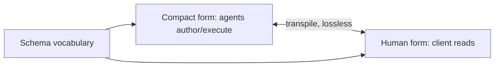

# Workflow Language

**Version:** 1.0.0
**Status:** Stable
**Layer:** concept

## Overview

The technology-agnostic model of Cronus's **agent workflow language** — a compact, LLM-native DSL in which routines, delegated tasks, and `/goal` plans are expressed and executed. A workflow has two equivalent renderings (a compact machine form and a human-readable form), is interpreted against a shared schema (vocabulary contract), declares inviolable constraints, and binds its steps to Cronus subsystems rather than reimplementing them.

## Related Specifications

- [l1-orchestration.md](l1-orchestration.md) - Delegated work and `/goal` plans are expressed as workflows.
- [l1-scheduler-model.md](l1-scheduler-model.md) - A `routine` schedule runs a workflow.
- [l1-quality-standards.md](l1-quality-standards.md) - Workflow validation is a quality gate.
- [l1-memory-model.md](l1-memory-model.md) - Memory steps bind to the memory subsystem.
- [l2-workflow-runtime.md](l2-workflow-runtime.md) - The runtime that lexes, validates, and executes workflows.

## 1. Motivation

Natural language is ambiguous; raw code is rigid and loses intent. A purpose-built workflow language is the middle ground — precise enough for machines, readable enough for the client. It gives Cronus a single, validated, portable way to express "what an agent should do, step by step, under which constraints," instead of leaving routines and plans as free-form prose. Because the same workflow renders both compact (for agents) and human-readable (for the client), it serves maximum automation without hiding intent.

## 2. Constraints & Assumptions

- A workflow is interpreted only against a loaded schema (its vocabulary).
- Workflow steps call existing Cronus subsystems; the language is a scripting layer, not a re-implementation.
- Execution is always bounded and always returns a structured result.
- The client interacts with the human rendering; agents use the compact form.

## 3. Core Invariants (Layer 1 only)

- **WFL-1 (Dual representation):** a workflow has two equivalent renderings — compact machine form and human-readable form — convertible without loss of logic.
- **WFL-2 (Schema vocabulary contract):** a shared schema defines the vocabulary (commands, types, flags, validators). A workflow MUST be interpreted against a loaded schema, which makes workflows portable across agents and models.
- **WFL-3 (Hard constraints inviolable):** a workflow may declare hard constraints (never/always) that MUST NOT be bypassed — even on orchestrator request; contradicting hard constraints halt and escalate.
- **WFL-4 (Preferences are soft):** preferences bias behavior unless a more specific rule overrides them, and never override hard constraints.
- **WFL-5 (Validate before run):** a workflow is validated (structure + lint) before execution; undefined variables or parse errors halt rather than being guessed.
- **WFL-6 (Bounded execution):** execution respects explicit limits (max iterations, budget) and supports halt/pause; unbounded loops are forbidden (consistent with ORC-7).
- **WFL-7 (Subsystem-bound steps):** workflow steps bind to Cronus subsystems — memory ops to memory, human-interaction steps to HITL, routing to orchestration, validation to quality, model calls to the model router — rather than reimplementing them.
- **WFL-8 (Result contract):** a workflow always returns a structured result on completion or failure; errors escalate per a declared error handler.
- **WFL-9 (Human view for the client):** the client-facing rendering is the human form (consistent with OFF-5); agents author/execute the compact form.

> L2 specs cannot reach RFC status until all invariants here are addressed in their "Invariant Compliance" section.

## 4. Detailed Design

### 4.1 Anatomy of a workflow

A workflow declares: a trigger, typed inputs, context, hard constraints and preferences, an ordered list of steps (with conditionals, branching, retry, mapping), an output, and an error handler. Steps invoke named commands grouped by category.

### 4.2 Command categories (vocabulary)

| Category | Examples (semantic, not syntax) | Binds to |
| --- | --- | --- |
| Generation/analysis | generate, analyze | model router |
| Data/IO | fetch, read, scan, env, date | core services |
| Memory | remember, recall, forget, query | memory subsystem |
| Human interaction | ask, confirm, escalate | HITL (OFF-6) |
| Control | if, switch, retry, map, halt, pause, break | runtime |
| Validation | validate (+ lint) | quality gates |
| Routing | route | orchestration |
| Effects | publish, move, copy, log, hash | core services |

### 4.3 Dual rendering

### 4.4 Where workflows are used

Routines (scheduler), delegated tasks and `/goal` plans (orchestration), and reusable skills are all expressed as workflows. This unifies "how the office acts" under one validated language.

## 5. Drawbacks & Alternatives

- **Learning a DSL:** mitigated by the human rendering and schema-guided authoring; the client never has to read the compact form.
- **Schema versioning:** workflows pin a schema version for portability. <!-- TBD: schema version-compatibility policy -->
- **Alternative — free-form prose plans:** rejected; ambiguous and unvalidatable. Alternative — general-purpose code: rejected; loses LLM-native semantics and the dual rendering.

## Canonical References

| Alias | Path | Purpose |
| --- | --- | --- |
| `[ORCH]` | `.design/main/specifications/l1-orchestration.md` | Plans/delegation expressed as workflows |
| `[SCHED]` | `.design/main/specifications/l1-scheduler-model.md` | Routines run workflows |
| `[RUNTIME]` | `.design/main/specifications/l2-workflow-runtime.md` | Concrete runtime |
