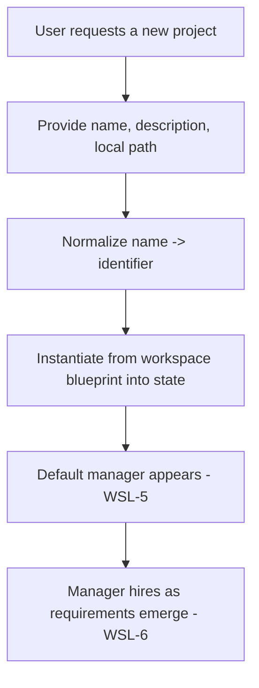

# Workspace Lifecycle

**Version:** 1.0.0
**Status:** Stable
**Layer:** concept

## Overview

The technology-agnostic model of how workspaces (offices) come into being, are managed, and end. It defines two kinds of workspace — a single permanent **home** workspace (a shared organizer and building-level boss) and any number of **project** workspaces — and the lifecycle each follows: creation from a blueprint, a default manager appearing immediately, the manager adaptively hiring and releasing staff as the project's requirements emerge, editing of metadata, and deletion.

## Related Specifications

- [l1-office-model.md](l1-office-model.md) - Each workspace is an office; refines OFF-1 (isolation), OFF-2 (one manager), OFF-4 (adaptive staffing).
- [l1-storage-model.md](l1-storage-model.md) - Instantiation from blueprint (STO-3) and scope lifecycle (STO-5).
- [l2-workspace-management.md](l2-workspace-management.md) - Concrete tab UX, creation flow, naming, manager bootstrap.

## 1. Motivation

The user lives in a building of offices. They need one always-present "home base" to organize their life and oversee everything, and the ability to spin up a dedicated office per project with a single gesture. Each new office must be productive immediately (a boss is already there) and must right-size its team over time — growing when work demands it, shrinking when it does not. Encoding this lifecycle keeps office creation cheap, isolated, and self-managing.

## 2. Constraints & Assumptions

- There is always exactly one home workspace; it predates and outlives all project workspaces.
- A project workspace is cheap to create and fully isolated from others.
- A workspace is usable the moment it exists — it is never empty of management.
- Workspace metadata (name, description, local path, etc.) changes over a project's life and must be editable in place.

## 3. Core Invariants (Layer 1 only)

Rules every Layer 2 implementation MUST NOT violate:

- **WSL-1 (Home workspace is singular and permanent):** exactly one **home** workspace exists; it is a shared organizer with cross-workspace oversight and MUST NOT be deletable.
- **WSL-2 (Workspace is an office with one manager):** every workspace — home or project — is an office with exactly one manager (consistent with OFF-2). The home workspace's manager additionally oversees and coordinates across project workspaces (the building-level boss).
- **WSL-3 (Project lifecycle):** project workspaces can be created, edited, and deleted by the user. The home workspace is created once and cannot be deleted.
- **WSL-4 (Instantiation from blueprint):** a new workspace is materialized from the workspace blueprint into the mutable state tier (consistent with STO-3); its identifier is a normalized name (lowercase, hyphen-separated only).
- **WSL-5 (Default manager bootstrap):** upon creation a workspace immediately has its own manager — before any other staff exist.
- **WSL-6 (Bidirectional adaptive staffing):** the manager hires roles as requirements emerge AND may release roles that are no longer needed; the roster tracks evolving need over the project's life (extends OFF-4).
- **WSL-7 (Editable metadata):** workspace metadata (name, description, local path, and similar) is editable at any time without recreating the workspace.
- **WSL-8 (Isolation and clean deletion):** creating, editing, or deleting one workspace MUST NOT affect another's state (consistent with OFF-1). Deleting a project workspace removes its state, staff, and memory (consistent with STO-5 / MEM-5); the home workspace persists.

> L2 specs cannot reach RFC status until all invariants here are addressed in their "Invariant Compliance" section.

## 4. Detailed Design

### 4.1 Two kinds of workspace

| Kind | Count | Deletable | Manager | Default purpose |
| --- | --- | --- | --- | --- |
| Home | exactly 1 | no | building-level boss (oversees all offices) | personal organizer: life management, reminders, scheduling, and managing other workspaces |
| Project | 0..n | yes | office manager for that project | execute the project |

### 4.2 Creation flow (conceptual)

### 4.3 Adaptive staffing over the project's life

The manager interprets the inputs that accumulate as a project develops and adjusts the roster in both directions:

- **Hire** a specialist role when a need emerges that no current member covers.
- **Release** a role whose specialty is no longer needed, keeping the office right-sized.

Staffing is never fixed up front; it is a continuous response to evolving need (OFF-4 extended to firing).

### 4.4 The home workspace as organizer

The home workspace is the building's lobby: always open, never closed. By default it serves personal-organizer functions (reminders, scheduling, life management) and is where the building-level boss coordinates the creation and oversight of project offices.

## 5. Drawbacks & Alternatives

- **Two-level management (building boss + office managers):** adds a coordination layer; justified by the need for cross-project oversight without breaking per-office autonomy (OFF-2 still holds per workspace).
- **Alternative — no special home workspace:** simpler, but loses the always-present organizer and a clear cross-project owner; rejected.
- **Alternative — manual staffing only:** predictable but defeats maximum automation (OFF-5); rejected in favor of manager-driven hire/fire. <!-- TBD: criteria/guardrails the manager uses to decide when to fire a role -->

## Canonical References

| Alias | Path | Purpose |
| --- | --- | --- |
| `[OFFICE]` | `.design/main/specifications/l1-office-model.md` | Office, manager, and staffing invariants refined here |
| `[STORAGE]` | `.design/main/specifications/l1-storage-model.md` | Blueprint instantiation and scope lifecycle |
| `[MGMT]` | `.design/main/specifications/l2-workspace-management.md` | Concrete realization (UI + filesystem + bootstrap) |
