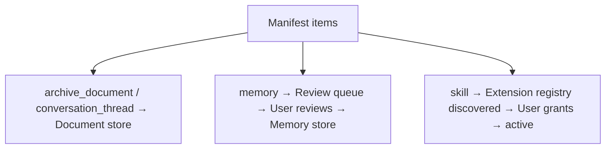

# Agent Migration

**Version:** 1.0.0
**Status:** Stable
**Layer:** implementation
**Implements:** l1-memory-model.md, l1-extensions.md

## Overview

A source-neutral migration manifest that lets an agent receive memories, skills, conversation history, and long-form documents from another agent. The manifest separates **archive documents** (searchable source material) from **memory candidates** (short facts reviewed before saving). Adapters are source-specific; the manifest is not. A staged apply protocol with dry-run preview and backup prevents unreviewed data from entering durable memory.

## Related Specifications

- [l1-memory-model.md](l1-memory-model.md) - Memory service that receives reviewed candidates.
- [l1-extensions.md](l1-extensions.md) - Skills imported via migration go through the same lifecycle as any skill.
- [l2-memory-store.md](l2-memory-store.md) - Concrete store that receives migrated memory entries.
- [l2-extension-registry.md](l2-extension-registry.md) - Migrated skills enter as `source: imported`, status `discovered`.
- [l2-backup.md](l2-backup.md) - Apply protocol requires a backup before writing.
- [l2-tool-security.md](l2-tool-security.md) - Imported skill content goes through the skill scanner at activation.

## 1. Motivation

Users accumulate memories, skills, and conversation history in other agent systems. Importing that history "as memory" without review would contaminate Cronus's memory with stale facts, outdated preferences, and low-signal noise. The two-layer model (archive = searchable but not memory; candidate = reviewed before saving) gives the agent a large knowledge base while keeping durable memory compact and trusted.

## 2. Constraints & Assumptions

- The manifest is generated read-only; no adapter writes to `data/` or calls the LLM.
- The manifest is treated as **untrusted user-provided data** at apply time; it goes through the same prompt-injection scanning as any external content.
- Secrets (credentials, API keys) are never imported automatically — they require a provider-specific flow.
- Content embedding is opt-in; manifests may contain only metadata (path, hash, size, count) for large or private datasets.

## 3. Invariant Compliance (Layer 2 only)

| L1 Invariant | Implementation |
| --- | --- |
| MEM-1 Dual-store | Imported content is assigned to the correct store tier: archive documents go to document store, memory candidates to the review queue, not directly to vector store. |
| EXT-3 Default-deny | Imported skills start as `discovered` (inactive); activation requires an explicit grant. |
| SEC-2 Safe defaults | Secrets skipped by default; explicit consent required. |

## 4. Detailed Design

### 4.1 Manifest format

```text
[REFERENCE]
AgentMigrationManifest {
  schema_version: "agent-migration.v1",
  generated_at: DateTime<Utc>,
  source: {
    name: String,
    kind: "generic" | "hermes" | "chatgpt" | "claude" | String
  },
  summary: {
    item_count: u32,
    counts_by_kind: { [ItemKind]: u32 },
    warning_count: u32
  },
  items: MigrationItem[],
  warnings: MigrationWarning[]
}
```

### 4.2 Item kinds

```text
[REFERENCE]
ItemKind: "memory" | "skill" | "conversation_thread" | "archive_document"
```

| Kind | Contents | Destination |
| --- | --- | --- |
| `memory` | `{text, category?, source?, provenance}` — a short fact or preference | Memory review queue (not auto-saved) |
| `skill` | `{content, frontmatter_meta}` — a `SKILL.md` file with parsed metadata | Extension registry as `source: imported`, status `discovered` |
| `conversation_thread` | `{id, title, messages[]?, timestamp, message_count?, hash?}` — normalized transcript | Searchable archive; not imported as memory |
| `archive_document` | `{path?, hash?, size?, content?}` — long-form source material | Document store; content is optional |

Each item carries a stable `id` for deduplication and a `source` back-reference to the origin system.

### 4.3 Two-layer import model



Archive documents and conversation threads are imported to the searchable document store first. They can be cited and read by the agent but are not durable memories. This keeps the memory store compact and intentional.

### 4.4 Staged apply protocol

```text
[REFERENCE]
apply_stages:
  1. dry_run_summary   — show counts, warnings, duplicate detection, sample items
  2. backup            — snapshot current state/ before any write
  3. import_archives   — archive_document and conversation_thread items → document store
  4. review_memories   — present memory candidates one by one for user review before saving
  5. import_skills     — after name/category conflict check; go to discovered/inactive
  6. skip_secrets      — credentials items always skipped; flag for manual review
```

No stage proceeds without the previous stage completing successfully. Stage 1 never writes anything.

### 4.5 Source adapters

An adapter translates a source-specific format into `agent-migration.v1`. Adapters may be:

- Bundled (generic, chatgpt) — shipped with Cronus.
- Extension-provided — third-party adapters installed via the extension registry.
- Script-based — read-only helper that writes JSON without importing Cronus modules.

Adapter responsibilities:
- Read source files (e.g. `~/.hermes/config.yaml`, ChatGPT `conversations.json`, a Markdown notes folder).
- Normalize to `agent-migration.v1` items.
- Never write to `data/` or call an LLM.

### 4.6 Command surface

| Action | CLI | TUI | Library (no code) |
| --- | --- | --- | --- |
| generate manifest | `cronus migrate export --from <path> [--kind chatgpt\|generic\|hermes]` | `/migrate export …` | `migration.export(source, kind) -> Manifest` |
| preview manifest | `cronus migrate preview <manifest.json>` | `/migrate preview …` | `migration.preview(manifest) -> PreviewReport` |
| apply manifest | `cronus migrate apply <manifest.json> [--dry-run]` | `/migrate apply …` | `migration.apply(manifest, dryRun?) -> ApplyResult` |
| list imports | `cronus migrate list` | `/migrate list` | `migration.listImports() -> ImportRecord[]` |

## 5. Drawbacks & Alternatives

- **No automatic memory import:** users must review candidates one by one. This is intentional — direct import without review would poison the memory store with outdated or incorrect facts from the source agent.
- **Conversation threads are not memories:** they can be searched but not recalled via the memory service. This keeps the memory store compact; a user who wants specific facts from a conversation uses the review flow.
- **Schema version `v1` is fixed:** future versions bump the `schema_version` field; importers must validate this field and reject unknown versions.
- **Alternative — direct database import:** rejected; bypasses skill scanner, memory review, and backup protocol.

## Canonical References

| Alias | Path | Purpose |
| --- | --- | --- |
| `[MEM]` | `.design/main/specifications/l1-memory-model.md` | Memory service invariants |
| `[EXT]` | `.design/main/specifications/l1-extensions.md` | Skill lifecycle |
| `[BACKUP]` | `.design/main/specifications/l2-backup.md` | Backup before apply |
| `[CLI]` | `.design/main/specifications/l2-cli.md` | Command grammar standard |
