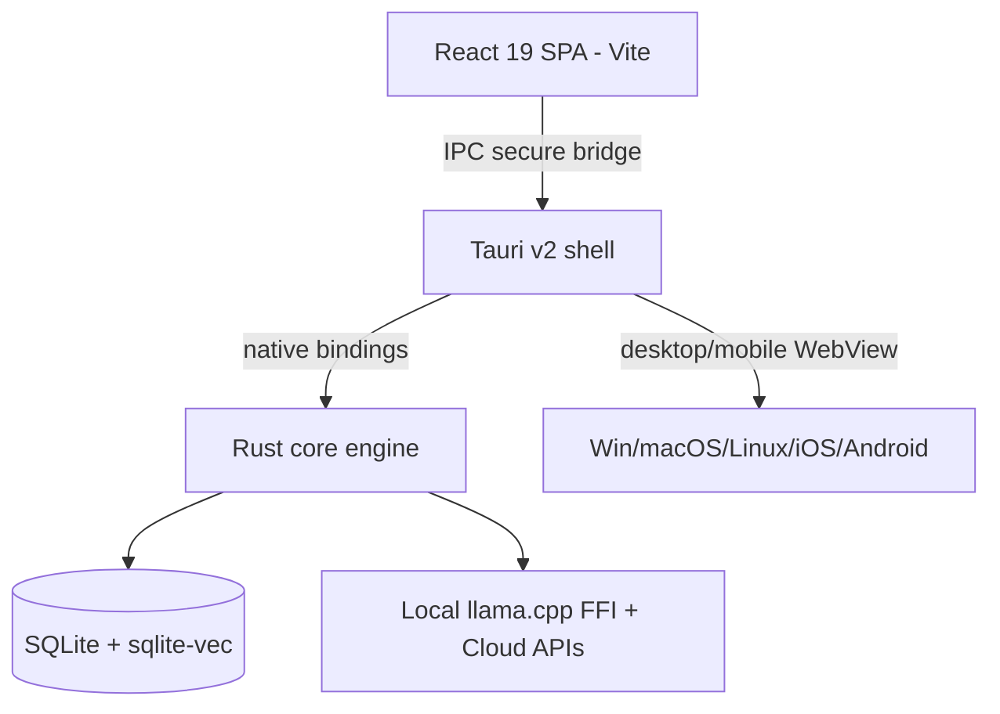

# Application UI/UX Frontend (Desktop / Web / Mobile)

**Version:** 1.0.0
**Status:** Stable
**Layer:** implementation
**Implements:** l1-architecture.md

## Overview

Architectural layer 4: the **full graphical application** — the premium UI/UX surface ("the interactive office"). It runs on desktop (Windows/macOS/Linux) and as a mobile client (iOS/Android), rendering the core's state and capabilities with rich visuals. Per the hub-and-spoke topology, the desktop build can host the always-on engine, while the mobile build is a thin client.

## Related Specifications

- [l1-architecture.md](l1-architecture.md) - Concept this layer implements.
- [l2-core-library.md](l2-core-library.md) - The core this app drives.
- [l2-technology-stack.md](l2-technology-stack.md) - Frontend + shell technology choices.
- [l2-cli.md](l2-cli.md) - Sibling frontend (parity).
- [l2-tui.md](l2-tui.md) - Sibling frontend (parity).

## 1. Motivation

Non-technical clients ("the client who brings ideas") need a graphical, low-friction surface: a visual office, Kanban board, chat/briefings, and editors. The app must render the same core capabilities as CLI/TUI with full UI/UX, while respecting the platform constraints that forbid a phone from acting as an always-on server.

## 2. Constraints & Assumptions

- Shell: **Tauri v2** (system WebView), packaging desktop + iOS/Android from one Rust core.
- UI: **React 19 + Vite + TypeScript**, **Tailwind CSS v4**, one of **shadcn/ui** or **DaisyUI**, **Lexical** editor.
- The frontend holds no domain logic (INV-2); it calls the core over Tauri's IPC bridge.
- **Mobile is a thin client** (INV-4): foreground use + push-driven (APNs/FCM) sync; optional foreground-only local LLM (1–3B Q4 via the core's llama.cpp FFI). It does NOT run a persistent background server.
- A minimum OS/WebView floor is enforced for Tailwind v4 (see [l2-technology-stack.md](l2-technology-stack.md) §5).

## 3. Invariant Compliance (Layer 2 only)

| L1 Invariant | Implementation |
| --- | --- |
| INV-1 Embeddable core | The Rust core is embedded as the Tauri backend (desktop) and a static lib (mobile). |
| INV-2 Logic in core only | React renders state and forwards intents over IPC; no business logic in TypeScript. |
| INV-3 Command parity | UI actions map to the same core capabilities as CLI/TUI commands. |
| INV-4 Hub-and-spoke autonomy | Desktop build can run/host the always-on engine; **mobile build is a client**, woken by push, never a 24/7 server. |
| INV-5 Durable, restartable state | UI is stateless beyond view; core persists state; app rehydrates on launch/reconnect. |
| INV-6 Graceful capability scaling | Mobile exposes a capability subset (foreground + sync); behavior stays consistent with the core. |
| INV-7 Security of client data | Secrets handled by the core via OS keychain; UI never persists credentials; only anonymized telemetry leaves the device. |

## 4. Detailed Design

### 4.1 Surfaces

| Surface | Content |
| --- | --- |
| Office | Visual schema of agents/departments and their tasks (the "interactive office") |
| Kanban board | `triage → todo → ready → running → blocked → done → archive` + custom boards |
| Chat / briefings | Conversation with the manager/orchestrator; office/department sync briefings |
| Editor | Rich-text notes/plans (Lexical) |
| Dashboard | Status, progress, schedules, memory views |

### 4.2 Shell ↔ core bridge

### 4.3 Desktop vs mobile responsibilities

| Concern | Desktop build | Mobile build |
| --- | --- | --- |
| Always-on engine (hub) | Yes — via OS service / headless core | No — thin client only |
| Background autonomy | Yes | No (OS/store prohibit it) |
| Wake mechanism | Local service | APNs/FCM push → short foreground sync |
| Local LLM | Optional, larger models | Optional, 1–3B Q4, foreground only |

### 4.4 Store-compliance notes

To mitigate App Store Guideline 4.2 ("repackaged website") risk for a WebView app, the mobile build provides genuine native integrations (push, native share, file pickers, app-like navigation, offline UI). See [l2-technology-stack.md](l2-technology-stack.md) §5.

## 5. Drawbacks & Alternatives

- **System-WebView variance:** styling can break on old WebKitGTK/Android WebView; mitigated by the OS floor / PostCSS downgrade.
- **No on-device 24/7 agent on mobile:** by design (INV-4); the hub carries autonomy.
- **Alternative — Electron + Capacitor split:** heavier and duplicates desktop/mobile shells; rejected in favor of one Tauri v2 core. <!-- TBD: confirm shadcn/ui vs DaisyUI selection before UI build -->

## Canonical References

| Alias | Path | Purpose |
| --- | --- | --- |
| `[ARCH]` | `.design/main/specifications/l1-architecture.md` | Invariants (esp. INV-4 hub-and-spoke) |
| `[CORE]` | `.design/main/specifications/l2-core-library.md` | The contract the app binds to |
| `[STACK]` | `.design/main/specifications/l2-technology-stack.md` | Frontend/shell technology + WebView floor |
