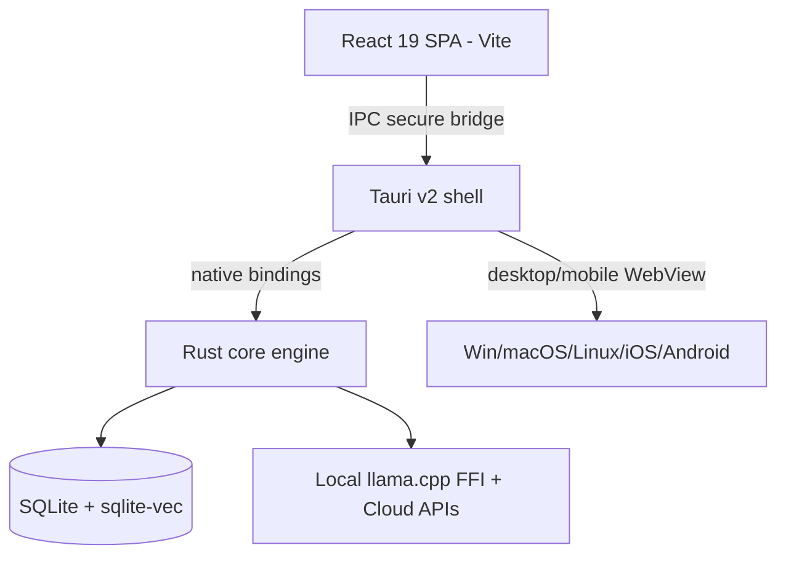

# Application UI/UX Frontend (Desktop / Web / Mobile)

**Version:** 1.4.1
**Status:** Stable
**Layer:** implementation
**Implements:** l1-architecture.md

## Overview

Architectural layer 4: the **full graphical application** — the premium UI/UX surface ("the interactive office"). It runs on desktop (Windows/macOS/Linux) and as a mobile client (iOS/Android), rendering the core's state and capabilities with rich visuals. Per the hub-and-spoke topology, the desktop build can host the always-on engine, while the mobile build is a thin client.

## Related Specifications

- [l1-architecture.md](l1-architecture.md) - Concept this layer implements.
- [l2-core-library.md](l2-core-library.md) - The core this app drives.
- [l2-technology-stack.md](l2-technology-stack.md) - Frontend + shell technology choices.
- [l2-cli.md](l2-cli.md) - Sibling frontend (parity).
- [l2-tui.md](l2-tui.md) - Sibling frontend (parity).
- [l1-design-identity.md](l1-design-identity.md) - Design-identity catalog; the built-in **colour schemes** (§4.5) are its built-in layer, user/imported identities its user layer (DI-2, DI-8).
- [l2-design-system.md](l2-design-system.md) - The concrete token-contract realization behind §4.5 theming: the Tailwind v4 `@theme` token set, the scheme manifest + token schema, and the two-axis (mode × scheme) resolver.
- [l2-navigation.md](l2-navigation.md) - Renders the four-layer navigation; owns the concrete surface catalog and order (its §4.3) that §4.1 groups thematically.
- [l2-ui-module-topology.md](l2-ui-module-topology.md) - How the `packages/ui` source is partitioned and which module may import which; the §4.1 surfaces are its surface tier, and its single-seam rule keeps §4.2's bridge the only site performing core calls.

## 1. Motivation

Non-technical clients ("the client who brings ideas") need a graphical, low-friction surface: a visual office, Kanban board, chat/briefings, and editors. The app must render the same core capabilities as CLI/TUI with full UI/UX, while respecting the platform constraints that forbid a phone from acting as an always-on server.

## 2. Constraints & Assumptions

- Shell: **Tauri v2** (system WebView), packaging desktop + iOS/Android from one Rust core.
- UI: **React 19 + Vite + TypeScript**, **Tailwind CSS v4**, **shadcn/ui**, **Lexical** editor.
- The frontend holds no domain logic (INV-2); it calls the core over Tauri's IPC bridge.
- **Mobile is a thin client** (INV-4): foreground use + push-driven (APNs/FCM) sync; optional foreground-only local LLM (1–3B Q4 via the core's llama.cpp FFI). It does NOT run a persistent background server.
- A minimum OS/WebView floor is enforced for Tailwind v4 (see [l2-technology-stack.md](l2-technology-stack.md) §5).

## 3. Invariant Compliance (Layer 2 only)

| L1 Invariant | Implementation |
| --- | --- |
| INV-1 Embeddable core | The Rust core is embedded as the Tauri backend (desktop) and a static lib (mobile). |
| INV-2 Logic in core only | React renders state and forwards intents over IPC; no business logic in TypeScript. |
| INV-3 Command parity | UI actions map to the same core capabilities as CLI/TUI commands. |
| INV-4 Hub-and-spoke autonomy | Desktop build can run/host the always-on engine; **mobile build is a client**, woken by push, never a 24/7 server. |
| INV-5 Durable, restartable state | UI is stateless beyond view; core persists state; app rehydrates on launch/reconnect. |
| INV-6 Graceful capability scaling | Mobile exposes a capability subset (foreground + sync); behavior stays consistent with the core. |
| INV-7 Security of client data | Secrets handled by the core via OS keychain; UI never persists credentials; only anonymized telemetry leaves the device. |
| INV-8 Single-deployable modular monolith | The graphical app is the frontend over the frontend↔core boundary: the desktop build embeds one in-process core (the Tauri backend); the mobile build is a client of a hub. Neither decomposes the engine into services — IPC to the embedded core is the sanctioned boundary (INV-3), not an inter-service network call, and no orchestration platform is required. |
| INV-9 Shipped-surface honesty | A button, menu item, or action is rendered only when bound to a shipped core capability; a not-yet-shipped capability yields no dead control — it is hidden or explicitly marked unavailable, never a control that fails with "not implemented". This is INV-9 for a graphical surface, and it aligns with the no-faked-agency rule (`l1-directability` DIR-9). |
| INV-10 Representation isolation at the inward seam | INV-10's inward seam is inside the core; React sits outward and renders core contract types received over IPC (INV-2), never an adapter's representation (a store row, a keychain record). The IPC payload is the contract type, mapped at the core boundary — the UI cannot leak an adapter shape inward because it never holds one. |

## 4. Detailed Design

### 4.1 Surfaces

The concrete subsystem catalog and its order are owned by [l2-navigation.md](l2-navigation.md) §4.3 (`SIDEBAR_PRIMARY` + `SIDEBAR_UTILITY`, per NV-1). This table groups the surfaces thematically for orientation only — it is not the ordering authority.

| Group | Surfaces |
| --- | --- |
| Overview | Dashboard (Agent Statistics, Token Usage) |
| Conversation | Chat, Inbox (Messages, Poll/Clarify), Channels (gateway + per-channel detail) |
| Work | Kanban (`triage → todo → ready → running → blocked → review → done` + custom boards), Automation (visual pipeline canvas) |
| Office | Office (agent graph + floor projection), Employees (staffed roster), Sessions |
| Operate | Schedule (Cron + Pulse/Heartbeat), Memory, Security, Providers/ACP |
| Reference | Wiki, Editor (rich-text notes/plans, Lexical) |
| Config | Settings (two-tier: in-place Local + full-screen Global overlay) |

Each surface renders only when bound to a shipped core capability (INV-9); until then it is an explicit placeholder, never fabricated data.

### 4.2 Shell ↔ core bridge


```mermaid
graph TD
    UI[React 19 SPA - Vite] -- IPC secure bridge --> SHELL[Tauri v2 shell]
    SHELL -- native bindings --> CORE[Rust core engine]
    CORE --> DB[(SQLite + sqlite-vec)]
    CORE --> AI[Local llama.cpp FFI + Cloud APIs]
    SHELL -- desktop/mobile WebView --> OS[Win/macOS/Linux/iOS/Android]
```

### 4.3 Desktop vs mobile responsibilities

| Concern | Desktop build | Mobile build |
| --- | --- | --- |
| Always-on engine (hub) | Yes — via OS service / headless core | No — thin client only |
| Background autonomy | Yes | No (OS/store prohibit it) |
| Wake mechanism | Local service | APNs/FCM push → short foreground sync |
| Local LLM | Optional, larger models | Optional, 1–3B Q4, foreground only |

### 4.4 Store-compliance notes

To mitigate App Store Guideline 4.2 ("repackaged website") risk for a WebView app, the mobile build provides genuine native integrations (push, native share, file pickers, app-like navigation, offline UI). See [l2-technology-stack.md](l2-technology-stack.md) §5.

### 4.5 Theming

Theming has **two orthogonal axes**. The active look is `(mode) × (scheme)`; changing either is instant and never alters behavior (cosmetic only, DI-2). Both persist in `app.json` and apply across all surfaces.

**Axis 1 — mode** (`theme`): which light/dark rendering is shown.

| Mode | Behavior |
| --- | --- |
| system | follow OS light/dark preference (default) |
| light | force light |
| dark | force dark |

**Axis 2 — colour scheme** (`colorScheme`): which named visual language renders. A scheme is a design identity — a full token package (colour roles, typography, spacing, radius, motion) that declares a light and a dark variant; the mode axis picks the variant. The app ships one built-in scheme (`default`, authored dark-first from the reference desktop identity, with a derived light variant); more built-in schemes may follow. The default `{ theme: "system", colorScheme: "default" }` reproduces today's behavior.

**Built-in schemes are the catalog's built-in layer.** The app resolves `(mode, scheme)` through the design-identity catalog ([l1-design-identity.md](l1-design-identity.md) DI-2), so user-defined and imported identities (project and personal layers, DI-8) extend the scheme axis without a code change. Switching any scheme stays instant and cosmetic-only (DI-2); imported schemes carry provenance + an integrity witness verified before activation (DI-4). This resolves the prior open question of whether to support custom themes: they are the scheme axis's user layer, not a bespoke second theming path. The concrete token contract, scheme package shape, and the `(mode × scheme)` resolver are specified in [l2-design-system.md](l2-design-system.md).

### 4.6 Localization (i18n)

The UI is localized via language packs from the program tier (`languages/`); the active locale persists in `app.json` (`locale`). Initial languages: **English (`en`, default)** and **Russian (`ru`)**; the catalog is extensible. UI strings are externalized (no hardcoded user-facing text); missing translations fall back to English.

<!-- TBD: RTL support timing; pluralization/format library choice -->

### 4.7 Settings Persistence System

Application settings are stored as a JSON file in the platform config directory. The persistence system uses a `load_or_create` pattern that merges new defaults without destroying existing user choices, followed by an additive migration step.

#### load_or_create pattern

```text
[REFERENCE]
load_or_create_settings(path):
  if path.exists():
    settings = json.load(path)           // deserialize existing
    changed = false
    for each field with a default:
      if settings.field is absent or zero-value:
        settings.field = default()       // fill in new defaults
        changed = true
    if changed:
      json.write(path, settings)         // persist merged defaults back
  else:
    settings = all_defaults()
    json.write(path, settings)           // first launch: write defaults
  settings = run_migrations(settings)    // additive migration pass
  return settings
```

Every settings field MUST carry `#[serde(default = "fn_name")]` so that adding new fields never breaks existing settings files on deserialization.

#### Dual deserializer for backward compatibility

When a settings field changes wire format between releases (e.g., stored as integer, then as string), support both formats in the same deserializer to avoid a migration step:

```text
[REFERENCE]
// Log level was stored as integer 0–5, now stored as string "trace"|"debug"|…
#[serde(deserialize_with = "deserialize_log_level")]
fn deserialize_log_level<'de, D>(d: D) -> Result<LogLevel, D::Error>
{
    // Try string form first; fall back to integer for legacy configs.
}
```

#### Additive migration

After load, run an `ensure_defaults()` pass that inserts any newly added entries (new shortcut bindings, new provider catalog entries) without touching existing values. Migration is always forward-only: never remove or rename existing keys.

#### Platform-specific defaults

Use `#[cfg(target_os = "...")]` inside default functions — not at call sites — to produce per-platform defaults:

```text
[REFERENCE]
fn default_overlay_position() -> OverlayPosition {
    #[cfg(target_os = "linux")]
    { OverlayPosition::None }     // avoid compositor focus-steal on Linux
    #[cfg(not(target_os = "linux"))]
    { OverlayPosition::Bottom }
}
```

#### AtomicU8 for hot settings

Settings read on every log call (e.g., log level) bypass the normal settings lock using a module-level `AtomicU8` that is updated whenever the setting changes. Read with `Ordering::Relaxed` — log level staleness is acceptable and avoids contention.

### 4.8 Tray Icon State Machine

The system tray icon reflects the app's current operation state × the active theme. All icon variants are pre-loaded at startup to eliminate file I/O on state transitions.

#### States and themes

```text
[REFERENCE]
OperationState: Idle | Active | Processing

AppTheme: Dark | Light | Colored

Pre-loaded matrix (State × Theme = 9 variants):
  Idle       × Dark | Light | Colored
  Active     × Dark | Light | Colored
  Processing × Dark | Light | Colored
```

#### State-dependent menu

The tray context menu is rebuilt on every state transition. Actions that abort in-progress work (e.g., "Cancel") appear ONLY while that operation is active; they are absent when idle. This prevents accidental cancellation and hides no-op items.

#### Copy-last-result fallback chain

```text
[REFERENCE]
copy_last_result():
  text = post_processed_text.or(raw_output_text)
  if text.is_some(): clipboard.write(text)
// Prefer the refined result; fall back to raw output if post-processing did not run.
```

### 4.9 Global Shortcut Binding System

Keyboard shortcuts are stored as named bindings that separate the factory default from the user's override.

#### ShortcutBinding struct

```text
[REFERENCE]
ShortcutBinding {
    id:              String,   // stable key (e.g. "trigger", "cancel")
    name:            String,   // user-visible label
    description:     String,
    default_binding: String,   // reset target
    current_binding: String,   // user override; starts equal to default
}

Stored as HashMap<id, ShortcutBinding> in settings.
ensure_defaults() inserts new built-in bindings without touching user overrides.
```

#### Dual backend with auto-rollback

Support two shortcut backends selectable at runtime: the platform's built-in global shortcut plugin and an extended hook library. On switching:

1. Unregister all shortcuts from the current backend.
2. Validate each binding's key-string for the target backend (different backends accept different formats).
3. Reset any invalid bindings to their defaults; report which were reset to the frontend.
4. Register all valid bindings with the new backend.

If the extended library fails to initialize, persist the fallback choice to settings so the next launch does not retry the failing backend.

#### Lifecycle management

```text
[REFERENCE]
suspend_binding(id):
  Unregister while user edits the binding — prevents accidental firing during capture.

resume_binding(id):
  Re-register after the user finishes editing.

Dynamic shortcuts:
  cancel shortcut         — registered on active-operation start; unregistered on stop.
  optional-feature shortcut — registered only while the feature is enabled.
```

### 4.10 Overlay Window System

The overlay is a small, always-on-top window that shows active state without stealing keyboard focus.

#### Position enum

```text
[REFERENCE]
OverlayPosition: None | Top | Bottom

Default by platform:
  Linux  → None  (GTK layer shell may steal focus or be unsupported on some compositors)
  Others → Bottom
```

#### Platform-specific implementation

```text
[REFERENCE]
macOS   — NSPanel (floating, non-key window; cannot become key window; sits above normal windows)
Linux   — GTK layer shell (Wayland compositor integration)
          Escape hatch: APP_NO_GTK_LAYER_SHELL=1 falls back to a borderless normal window
Windows — Standard borderless WebView window with topmost flag
```

Fixed `width × height` constants in code; per-OS vertical offsets account for menu bar / taskbar clearance.

### 4.11 Single Instance & Runtime-Only CLI Flags

#### Single instance enforcement

Only one process instance may run at a time. If the user launches a second instance:

1. The second instance detects the running instance via an OS lock or named IPC channel.
2. It forwards its parsed CLI arguments to the running instance.
3. It exits immediately.

The running instance processes the received arguments as if they had been typed directly.

#### Runtime-only CLI flags

Flags that control immediate behavior MUST NOT be written to the settings file:

```text
[REFERENCE]
Runtime-only (never persisted):
  --toggle-<feature>   Toggle an active operation in the running instance
  --cancel             Cancel the current operation
  --start-hidden       Launch without showing the main window (tray visible)
  --debug              Verbose logging for this session only
  --no-tray            No system tray; closing the window quits the app

Persisted (written to settings, survive restart):
  Settings changed via UI controls or settings commands only.
```

#### Shared trigger entry point

All external triggers — shortcut handler, Unix signal handlers, and CLI remote-control arguments — funnel through a single dispatch function to the application state coordinator. This eliminates duplicated state logic and ensures consistent behavior regardless of trigger source.

### 4.12 Per-provider system prompt dispatch

Different model providers interpret instruction format and tone differently. The system
prompt builder dispatches a provider-specific variant based on the resolved provider ID
rather than a single universal text:

```text
[REFERENCE]
build_system_prompt(provider_id: ProviderId, model_id: ModelId) -> String:
  match provider_id:
    "anthropic"               -> anthropic_prompt(model_id)
    "openai" where is_o_series(model_id)  -> o_series_prompt()
    "openai" where is_codex(model_id)     -> codex_prompt()
    "openai"                  -> gpt_prompt()
    "google"                  -> gemini_prompt()
    "openrouter" where is_kimi(model_id)  -> kimi_prompt()
    _                         -> default_prompt()
```

Each variant encodes provider-specific quirks (token budget, persona framing, XML vs
plain-text delimiters, tool-calling guidance). The variants live in separate prompt
modules; the dispatch function is the single decision point. Model IDs within a provider
family may further branch (e.g., reasoning-heavy `o*` models vs standard `gpt-*`).

### 4.13 XML structured environment context

The environment block injected into the agent's system prompt at session start uses an
XML envelope rather than prose. This provides stable machine-parseable landmarks that the
model can reference across providers:

```text
[REFERENCE]
<env>
  <working_directory>/path/to/project</working_directory>
  <worktree>/path/to/worktree-if-different</worktree>
  <git_status>
    <branch>main</branch>
    <clean>true</clean>
  </git_status>
  <platform>macOS 14.2 / darwin x64</platform>
  <date>2026-06-20T09:30:00Z</date>
  <model>
    <id>claude-sonnet-4-6</id>
    <provider>anthropic</provider>
  </model>
</env>

<available_references>
  <reference>
    <name>project-root</name>
    <path>/path/to/project</path>
    <description>Primary workspace</description>
  </reference>
  <!-- one <reference> per active reference directory -->
</available_references>
```

The `<env>` block is emitted once at session start and kept stable for all turns (KV-cache
stability — see `l2-agent-session.md §4.6`). Git status is captured at session start; it
is not updated mid-session.

### 4.14 MCP client connection and status

The MCP client layer connects to each configured server via one of three transports and
tracks connection state per server.

#### Transport variants

```text
[REFERENCE]
StdioTransport:    subprocess communicates via stdin/stdout
                   → for local executables; lowest latency, no auth needed
SSETransport:      hosted endpoint using Server-Sent Events with OAuth
                   → for remote servers that use the OAuth-protected SSE variant
StreamableHTTP:    hosted endpoint using streamable HTTP (MCP HTTP+SSE spec)
                   → modern remote servers; stateless HTTP request + SSE response stream
```

DEFAULT_TIMEOUT = 30_000 ms applies to all remote transports; local stdio has no timeout.

#### Client capabilities declared at connect

```text
[REFERENCE]
CLIENT_OPTIONS.capabilities = {
  roots: {}           // client exposes a roots list (workspace directories)
  // explicitly NOT declared (pending standardization):
  // sampling: {}     // server-initiated LLM calls
  // elicitation: {}  // server-initiated user prompts
  // tasks: {}        // long-running task management
}

The client always responds to ListRootsRequest with the current worktree directory:
  roots: [{ uri: file:///path/to/worktree }]
```

#### Connection status states

```text
[REFERENCE]
MCPStatus:
  "connected"                — tools available; client is live
  "disabled"                 — server is configured but disabled by the user
  "failed" { error: String } — connection attempt errored; error message shown in UI
  "needs_auth"               — OAuth flow required; browser open has been attempted
  "needs_client_registration" { error: String }
                             — OAuth server requires dynamic client registration
                               before the auth flow can proceed

The status for each configured server is exposed via the diagnostics endpoint and the
_cronus/workspace/mcp ACP method (see l2-agent-session.md §4.10).
```

#### OAuth flow

For servers that require OAuth (`SSETransport`, `StreamableHTTP`):

1. The client starts the authorization flow and captures the pending transport in
   `pending_oauth_transports: Map<server_name, Transport>`.
2. A browser window opens to the authorization URL.
3. The OAuth callback (local HTTP server on a fixed callback path) completes the flow
   and resumes the pending transport.
4. On success: status → `"connected"`; transport removed from pending map.
5. On failure: status → `"needs_auth"` (retryable) or `"needs_client_registration"`.

## 5. Drawbacks & Alternatives

- **System-WebView variance:** styling can break on old WebKitGTK/Android WebView; mitigated by the OS floor / PostCSS downgrade.
- **No on-device 24/7 agent on mobile:** by design (INV-4); the hub carries autonomy.
- **Alternative — Electron + Capacitor split:** heavier and duplicates desktop/mobile shells; rejected in favor of one Tauri v2 core. <!-- TBD: confirm shadcn/ui vs DaisyUI selection before UI build -->

## Canonical References

| Alias | Path | Purpose |
| --- | --- | --- |
| `[ARCH]` | `.design/main/specifications/l1-architecture.md` | Invariants (esp. INV-4 hub-and-spoke) |
| `[CORE]` | `.design/main/specifications/l2-core-library.md` | The contract the app binds to |
| `[STACK]` | `.design/main/specifications/l2-technology-stack.md` | Frontend/shell technology + WebView floor |
| `[NAV]` | `.design/main/specifications/l2-navigation.md` | The concrete surface catalog/order + shell chrome |
| `[DESIGN-SYS]` | `.design/main/specifications/l2-design-system.md` | Token contract + (mode × scheme) resolver behind §4.5 |

## Document History

| Version | Date | Change |
| --- | --- | --- |
| 1.4.0 | 2026-09-02 | §4.5 Theming split into two orthogonal axes — **mode** (`system`/`light`/`dark`) × **colour scheme** (a named design-identity token package); one built-in scheme ships (`default`, dark-first), more added as data; the resolver + token contract move to the new `l2-design-system`. §4.1 Surfaces regrouped and deferred to `l2-navigation` §4.3 as the ordering authority; INV-9 placeholder rule restated. Related Specs + Canonical References extended with `l2-design-system` and `l2-navigation`. Document History section introduced with this entry (versions ≤1.3.1 summarised in the `INDEX.md` row). |
| 1.4.1 | 2026-09-03 | Cross-link only: added `l2-ui-module-topology.md` to Related Specifications — the source-partition spec for `packages/ui`, whose surface tier is populated by the §4.1 surfaces and whose single-seam rule keeps the §4.2 shell-core bridge the sole site performing core calls. No design or requirement change; stays Stable. |
