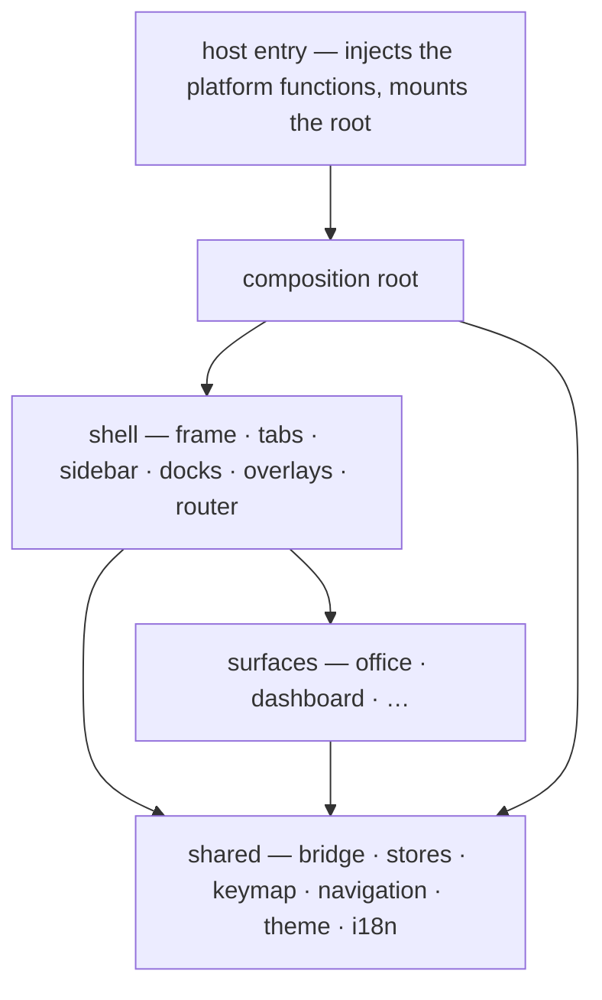
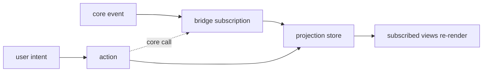

# Application Shell Runtime (React 19 · Tauri v2)

**Version:** 1.0.1
**Status:** Stable
**Layer:** implementation
**Implements:** l1-application-shell.md

## Overview

The concrete realization of the reactive frontend runtime (AS-1…AS-13) in this
project's stack: React 19 rendering inside a Tauri v2 WebView, over a single
inter-process seam to the embedded Rust core.

It owns the four contracts the L1 model names and no other L2 claims: **where
application state is held and how change propagates to what is shown**; **how
user intent is named, bound, and routed along focus**; **how the visible workbench
is composed and restored**; and **how asynchronous work is owned and cancelled**.

It also settles a fork that exists in the source today and belongs to no spec:
`packages/ui` currently exports **two composition roots** — the shipped `Workbench`
that the desktop app mounts, and the shell frame that is built, exported, tested,
and rendered by nothing. This spec makes one of them the root and gives the other
a defined place beneath it.

## Related Specifications

- [l1-application-shell.md](l1-application-shell.md) - L1 parent; AS-1…AS-13, the runtime contracts realized here.
- [l2-app-ui.md](l2-app-ui.md) - The surrounding application layer: surface catalog (§4.1), the shell↔core bridge picture (§4.2), settings persistence (§4.7), tray (§4.8), **OS-global** shortcuts (§4.9), overlay windows (§4.10). This spec owns the **in-app** runtime those surfaces run on; it never re-specifies them.
- [l2-navigation.md](l2-navigation.md) - The concrete navigation catalog and its four layers; the surfaces this runtime hosts and routes between.
- [l2-ui-module-topology.md](l2-ui-module-topology.md) - The tier partition (composition root → shell → surfaces → shared) every module named here is placed into; UMT-6 is the single-seam rule this spec's core access obeys.
- [l2-design-system.md](l2-design-system.md) - The token contract the rendered surfaces resolve against; theming is cosmetic and never crosses into this runtime's state model.
- [l1-architecture.md](l1-architecture.md) - INV-2 (logic in core only), INV-3 (command parity), INV-5 (durable state in core), INV-9 (shipped-surface honesty) — the outer constraints every decision below is taken under.
- [l1-navigation-model.md](l1-navigation-model.md) - NV-7's L0 facilities (command palette, file-tree dock) are delegated surfaces and panels in this runtime's vocabulary.
- [l1-agent-framework-skeleton.md](l1-agent-framework-skeleton.md) - Typed state channels and lifecycle-bound observation; the UI-side echo realized in §4.2.
- [l1-invariant-tripwires.md](l1-invariant-tripwires.md) - The discipline §5's verification table follows: a contract is claimed only against a check that can fail, and what is judgment is declared as judgment.

## 1. Motivation

Phase-scale work has now produced a frontend that is larger than the conventions
holding it together. The shell frame, its menus, its docks, its overlays and its
palette are built and tested, but the application does not render them, no module
owns application state, keyboard intent is a hard-coded handler on a root
container, and every projection the frame displays is a prop with no source.

Three consequences follow, and each is a defect the L1 model already forbids:

1. **No state authority (AS-1).** View state lives in component-local hooks
   scattered across the frame. Two components that need the same fact each hold
   their own copy, and there is no place for a core-pushed change to land.
2. **No dispatch model (AS-6/AS-7).** One shortcut is bound by a key comparison
   inside a container's event handler. A second shortcut has nowhere to go that
   is not another comparison in another handler, and neither is discoverable,
   rebindable, or context-aware.
3. **A fork with no owner.** Two roots both compose "the application". Whichever
   one a future change targets, the other silently diverges — and the divergence
   is invisible because both compile, both pass their tests, and only one runs.

The cost of each is paid at the same moment: the first time real core data flows
into the frame. Specifying the runtime before that moment is what keeps the
wiring from being invented once per surface.

## 2. Constraints & Assumptions

- **Presentation only (INV-2).** This runtime holds *projections* of core state
  and *view* state. It computes no domain result. Where the L1 speaks of a state
  authority, the authority for domain facts is the core process; the frontend
  owns only the cache and the view state built over it.
- **One seam (UMT-6).** All core access — request and event alike — passes
  through the single shared-tier bridge module. No other module imports the host
  API, so the whole runtime is exercisable against an injected fake.
- **No new runtime dependency.** The reactive substrate is built from what React
  19 already provides. A state-management library is not introduced for a package
  that holds no domain state.
- **The tier partition is a precondition.** Every path in §4 is written against
  the four-tier layout of [l2-ui-module-topology.md](l2-ui-module-topology.md)
  §4.3. This spec is realized *after* that partition lands, not alongside it.
- **Durability belongs to the core (INV-5).** Anything that must survive a
  restart — layout, keymap overrides, the active floor — is persisted by the core
  through the settings system of [l2-app-ui.md](l2-app-ui.md) §4.7. The frontend
  persists nothing on its own.
- **The studied platform is native; this one is not.** The L1 model generalizes
  from an in-process, handle-based runtime. Two of its invariants (AS-2, AS-11)
  describe mechanisms a garbage-collected WebView does not have. §3 states how
  their *intent* is satisfied and where the mechanism legitimately differs,
  rather than renaming React primitives to match.

## 3. Invariant Compliance (Layer 2)

| L1 Invariant | Implementation |
| --- | --- |
| **AS-1 Single-authority state** | Each state domain has exactly one store instance created at the composition root and reached only through its hook (§4.2). Mutation goes through the store's typed actions, never through a setter passed down the tree. Domain facts have their authority in the core; the store holds the projection and the status of the request that produced it, so a slow call never blocks render. |
| **AS-2 State as typed handles** | The stack has no handle/weak-handle distinction and has a tracing collector, so reference cycles do not leak and the mechanism is not simulated. The invariant's *intent* — scoped access, never a long-lived borrow held across an async boundary — is realized as: a store is read through a scoped subscription re-read per render, never captured; an async action reads state at dispatch time and writes back only through the store's action, never through a value captured before the await. Capturing a snapshot across an await and writing it back is the forbidden pattern this invariant maps to here. |
| **AS-3 Push-based reactivity** | Two push edges, no polling anywhere. Core → frontend: the bridge exposes a typed event subscription (§4.3); a core event updates the store, and the store notifies subscribers. Store → view: a subscribed component re-renders only when the slice it selected actually changed. No surface uses a timer to stay current; the sole permitted interval is a user-visible one (a relative-time label re-rendering), which reads no new state. |
| **AS-4 Typed events with lifecycle-bound subscriptions** | Every subscription — store or bridge — returns an unsubscribe function, and every call site registers it as the cleanup of the effect that opened it. The subscriber owns the subscription: unmounting deregisters it. There is no module-scope listener registry that outlives its components, and the bridge holds no global emitter. |
| **AS-5 Declarative render from state** | React function components are the views; render is a pure function of props and subscribed store state. Imperative DOM work is confined to effects and limited to what the platform exposes no declarative form for (focus placement, scroll restoration). No component mutates a store during render. Stateless presentational components compose views without subscribing. |
| **AS-6 Actions are the command vocabulary** | Every user-invokable operation is a namespaced action (`{group}.{verb}`) carrying a localized descriptive label and an optional binding, registered in a registry rather than wired to a control (§4.4). A control invokes by id; it never holds the behavior. Because the label is required, the same action is renderable in a menu, the palette, and the keymap settings without bespoke wiring. |
| **AS-7 Context-scoped dispatch over a focus tree** | Key input resolves against a **context stack** assembled from the focus path, not against a single root handler. A binding declares a context predicate and fires only when that predicate holds over the active stack. Multi-keystroke sequences are supported through a pending-prefix state that either completes, times out, or is cancelled. Conflicts resolve most-specific-first, then most-recently-layered (§4.4). |
| **AS-8 Layered, user-overridable bindings and settings** | Bindings compose in three layers merged deterministically in fixed order — base preset, platform defaults, user overrides — with a later layer replacing a binding of the same action id and an explicit null disabling it. Every action is listed with its effective binding and its origin layer in the keymap surface, so a user can see *why* a key does what it does. Persistence of the override layer is the core's (`l2-app-ui` §4.7); the merge is this runtime's. |
| **AS-9 Workbench composition** | The frame is expressed in the L1 vocabulary and nothing else: a **workspace** root, a **center** holding panes of interchangeable items, edge **docks** holding panels, and floating transient surfaces above (§4.5). Panels and items are uniform units behind one contract, so the router places a surface without knowing which surface it is. The shipped center holds exactly one pane; that is a populated subset of the vocabulary, declared as such, not a different model. |
| **AS-10 Delegated selection surfaces** | One selection surface parameterized by a delegate (source, match, order, render, confirm). The command palette is one delegate; every later chooser — file finder, office switcher, action picker — is another delegate on the same surface. A new chooser that ships its own list widget violates this invariant rather than varying it. |
| **AS-11 Structured, cancellable async** | The stack has no task executor, so ownership is expressed through the subscription model instead: every async core call is issued from an effect that owns it, carries a cancellation signal, and cancels on cleanup — an unmounted owner cancels its in-flight work, and a late response for a cancelled request is discarded rather than written. There is no foreground/background executor split, because all work here waits on the core and none of it is CPU-bound. Every rejection resolves into a visible state (an error surface or an explicit unavailable marker); a bare catch that swallows a failure is forbidden. |
| **AS-12 Persisted, restorable layout** | Layout state — dock visibility, sidebar state, open floors, the active floor/subsystem/facet path — is a named, versioned record distinct from content state, written through the core's settings system and re-applied at mount, so a window reopens as it was left. Content and projection caches are never written into it. A layout record from an older version loads by field-wise default fill, never by discarding the record. |
| **AS-13 Platform behind one surface** | Every OS-facing operation — window controls, clipboard, opening a link, notifications, quit — is a method on the single bridge module, invoked as an action. The frontend package imports no host package; the boundary is mechanically enforced by the forbidden-call rule of `l2-ui-module-topology` §4.4. A simulated context is therefore the default in tests: the entire runtime mounts against an injected fake with no WebView present. |

## 4. Detailed Design

### 4.1 One composition root

The package publishes exactly one application root. The shell frame becomes that
root; the earlier workbench composer stops being a rival root and becomes what it
always was structurally — the **office** surface's own composition, mounted by
the router like every other surface.



Three rules make the collapse checkable rather than aspirational:

- **R-1 One mount.** The host entry point mounts the composition root and nothing
  else. A second exported component that composes a frame is a defect; the
  package's public API declares one root.
- **R-2 The router owns placement.** A surface is reached only through the
  router's registry. No surface is imported by name into the frame, which is what
  keeps the frame from special-casing a feature surface (AS-9).
- **R-3 The root injects, the tree consumes.** The bridge client, the store
  instances, and the action registry are created once at the root and passed down
  through one provider each. No module reaches a store through a module-level
  singleton, because a singleton is not resettable between tests and makes two
  windows share one authority.

### 4.2 Projection stores and the reactive path

A **store** is a shared-tier module holding one state domain: a typed snapshot, a
subscriber set, and the typed actions that may change it. It is the AS-1
authority for that domain within the frontend.

Contract shape `[REFERENCE]` — one store module per domain, no framework:

```text
[REFERENCE]
Store<S> {
  snapshot()            -> S              // read; cheap, referentially stable
  subscribe(listener)   -> unsubscribe    // AS-4: handle whose call deregisters
  dispatch(action)                        // the only mutation path (AS-1)
}

useStore(store, selector) -> selected     // scoped external-store subscription
                                          // AS-3: re-renders only on a change
                                          // the selector actually observes
```

Domains are separated by *who owns the truth*, which is the distinction the L1's
cross-process note makes load-bearing:

| Domain | Truth lives in | Shape |
| --- | --- | --- |
| **View** | the frontend | active floor / subsystem / facet, dock and sidebar visibility, open overlay |
| **Projection** | the core | floors and their live state, badge counts, file tree, recent offices |
| **Session** | the frontend, derived | pending and failed request status per projection, so a surface renders "loading" and "unavailable" distinctly |

A projection store never invents a value. Its snapshot is one of: *unrequested*,
*pending*, *loaded with data*, or *unavailable with a reason*. There is no
default-empty state that a surface could mistake for a real empty result — the
distinction between "no offices" and "could not ask" is preserved all the way to
the render, because collapsing it is exactly how a shell starts showing
fabricated data (INV-9).

Change flows one way:



### 4.3 The core seam: widening without multiplying

The seam gains an event direction and more methods; it does not gain siblings.

```text
[REFERENCE]
CoreClient {
  // request/response — one method per bound core capability
  version()  -> Promise<string>
  status()   -> Promise<string>
  ...                                    // widened per the admission rule below

  // push — AS-3's core-to-frontend edge
  subscribe(channel, handler) -> unsubscribe
}

createCoreClient(invoke, listen) -> CoreClient   // both host functions injected
```

**Admission rule (INV-3 + INV-9).** A method may be added to the seam only when
it binds a capability that **already exists in the core or the host** and is
**not frontend-only** — something another actor could exercise if it had reason
to, whether or not one does today. The rule has a single purpose: to make the
seam incapable of growing a frontend-only feature, which is how presentation-only
erodes in practice — not by someone writing domain logic in TypeScript, but by
adding one bridge method that exists only to serve the UI and has no counterpart
anywhere. Until an admissible capability exists, the surface that would consume
it renders an explicit placeholder.

Two admissible classes, and the test is *not frontend-only*, not *has a CLI
verb*:

- **A core capability another surface binds.** A capability the CLI or TUI
  already reaches is the clearest case — parity (INV-3) makes the counterpart
  visible. This is a *sufficient* signal of admissibility, never the necessary
  condition.
- **A host-owned facility.** The shell's own durable state — the layout record
  and the theming axes (§4.5) — is written by the host's settings store. No
  command-line verb reaches it and no other frontend binds it, yet it is not a
  feature the frontend invented: it is configuration the host owns, and reading
  or writing it through one seam method is marshalling, not logic. A method that
  binds host configuration is admissible on that basis alone.

What stays excluded is a seam method with no counterpart in *either* class — no
core capability, no host facility, no other binder. That is the erosion the rule
exists to stop.

Consequently the shell ships partly bound, and says so. A projection with no
capability behind it is *unavailable with a reason*, never an empty list styled
to look like data.

**Channel liveness.** A push edge can die while the surfaces it feeds keep
rendering, and a projection that stops being updated is indistinguishable from
one that is merely stable — which is the fabricated-data failure of §4.2 arriving
through the back door. The seam therefore treats the event channel as observable
state of its own: a subscription that fails to open, or a channel that the host
reports as closed, moves every projection sourced from it to *unavailable with a
reason* rather than leaving the last-known value on screen as if current.
Re-establishing the channel re-requests those projections rather than resuming
mid-stream, because a gap of unknown length cannot be reconciled by the next
delta alone. The frontend does not retry on a timer — reconnection is driven by
the host's own connection lifecycle, and a projection stays honestly unavailable
until it is refilled.

### 4.4 Actions, contexts, and keymaps

Three collaborating shared-tier modules, all leaf-tier and all pure:

```text
[REFERENCE]
ShellAction {
  id          : "{group}.{verb}"     // namespaced, stable, the only handle
  labelKey    : MessageKey           // AS-6: a description is mandatory
  run         : (ctx) -> void
  when?       : ContextPredicate     // AS-7: where it is live
}

Keymap   : ordered layers [base, platform, user] -> merged binding table (AS-8)
Resolver : (keystroke, contextStack, keymap) -> Action | Pending | Unbound (AS-7)
```

Resolution, stated as behavior rather than code:

1. The focus path yields a **context stack**, outermost first, each frame naming
   the contexts it contributes (for example: workspace, then the active dock,
   then the focused panel).
2. Candidate bindings are those whose keystroke matches and whose predicate holds
   over that stack.
3. The winner is the most specific — the one whose predicate is satisfied deepest
   in the stack — and among equals, the most recently layered.
4. A matched **prefix** yields `Pending`: the runtime holds the prefix, shows it,
   and resolves on the next keystroke, a timeout, or cancellation. A pending
   prefix suppresses no input path other than key dispatch.
5. `Unbound` falls through to the platform. A shell that swallows unhandled keys
   breaks text input, and this step is the reason it does not.

The keymap surface renders every action with its effective binding **and its
originating layer**, so an override is legible as an override (AS-8).

**Boundary.** OS-global shortcuts — the ones that fire while the app is not
focused — are a host-side concern owned by [l2-app-ui.md](l2-app-ui.md) §4.9 and
are out of scope here. The two systems meet at exactly one point: a global
shortcut, once received, dispatches a named action through this registry, so a
binding never has two implementations.

### 4.5 Workbench vocabulary and layout persistence

The frame is described in the L1's fixed vocabulary, which keeps the composition
open to surfaces that do not exist yet:

| L1 part | This shell |
| --- | --- |
| workspace root | the application root's frame element, owner of the outermost context |
| center | the surface region; holds **panes**, each hosting interchangeable **items** |
| dock | the fixed edge regions — the subsystem sidebar and the right dock |
| panel | a dock-hosted unit behind the common panel contract (file tree, and later peers) |
| floating | modal and transient surfaces — settings overlay, selection surfaces, menus |

The shipped center holds one pane with one item. The vocabulary is nevertheless
expressed in the types, because a split introduced later must be a *population*
of the model rather than a redesign of it — which is the whole reason the L1
fixes a vocabulary instead of a layout.

**Layout record.** Persisted through the core's settings system, versioned, and
kept strictly separate from content:

```text
[REFERENCE]
LayoutRecord v1 {
  activeFloorId, openFloorIds[]
  activeSubsystem, activeFacet?
  sidebarVisible, rightDockVisible
  dockSizes { sidebar, rightDock }
}
```

Restoration is field-wise: an unknown field is ignored, a missing field takes its
default, and a floor id that no longer resolves is dropped rather than failing
the whole restore. A layout record can therefore never prevent the application
from starting — the failure mode a persisted-layout feature classically
introduces.

### 4.6 Delegated selection surfaces

Already realized in shape, and named here so later choosers inherit it rather
than re-invent it:

```text
[REFERENCE]
SelectionDelegate {
  placeholderKey : MessageKey
  items(query)   -> SelectionItem[]      // source + match + order
  // render and confirm carried per item
}
SelectionSurface(delegate)               // the single reusable surface
```

The command palette is the first delegate. Its item sources — go-to-surface,
recent offices, settings, registered actions — are separate delegate *sources*
inside one delegate, not separate surfaces. A finder over the file tree, an
office switcher, or a model picker is a new delegate and no new widget (AS-10).

### 4.7 Async ownership and failure

Every core call is owned by the effect that issued it:

1. The effect creates a cancellation source and passes its signal to the bridge
   call.
2. Cleanup cancels. A response arriving after cancellation is discarded — it is
   never written to a store, which is what makes an unmounted surface unable to
   resurrect stale data.
3. A rejection resolves into store state: the projection becomes *unavailable*
   with its reason, and the surface renders that. Nothing is caught and dropped.

There is no executor split (AS-11's interactive/background distinction) because
every asynchronous operation here is a wait on the core, not a computation.
Should frontend-side computation ever be introduced, it belongs off the
interactive path by AS-1's own second sentence — and that is the point at which
this section, not a surface, gets amended.

## 5. Implementation Notes

1. **The tier partition first.** Every path above assumes the four-tier layout.
   Realizing this spec before that partition lands would place the new modules in
   the flat arrangement and then move them, doubling the change.
2. **Root collapse before wiring.** Make the shell frame the single root and
   remount the earlier composer as the office surface *before* introducing stores
   — a fork wired twice is worse than a fork.
3. **Stores, then dispatch, then persistence.** The keymap resolver needs a
   context stack, which needs the frame to own its regions; layout persistence
   needs the view store it serializes.
4. **The seam last and narrowly.** Widen the bridge only for projections whose
   core capability is already bound elsewhere; everything else stays an explicit
   placeholder. The honest partial shell is the deliverable, not a milestone on
   the way to one.

**What counts as verified.** Each contract above is claimed only against a check
that can fail, in the discipline of
[l1-invariant-tripwires.md](l1-invariant-tripwires.md):

| Contract | Check |
| --- | --- |
| R-1 one mount | the package's declared public API exports exactly one application root; a second frame-composing export fails review |
| AS-13 no host import | the existing structural gate's forbidden-call rule — already configured, no new tool |
| AS-3 no polling | no timer drives a state read; a periodic re-request is a failing case, not a fallback |
| AS-1 single authority | a domain's state is reachable only through its store's hook; a component-local copy of a store-owned fact fails review |
| AS-4 subscription lifetime | every subscription site registers its unsubscribe as effect cleanup; a mount/unmount cycle leaves no live listener |
| AS-7 dispatch | resolution is a pure function over (keystroke, context stack, keymap) and is tested directly, including prefix-pending, precedence ties, and fall-through on unbound |
| AS-11 cancellation | a response arriving after its owner unmounted writes nothing to a store |
| AS-12 restore | a truncated, extended, and unresolvable-reference layout record each restore without throwing |
| §4.2 four-state projection | *unrequested*, *pending*, *loaded-empty*, and *unavailable* are separately observable; a test that cannot distinguish loaded-empty from unavailable is the regression this row exists to catch |
| §4.3 channel liveness | a channel that fails to open, and one closed after opening, both move dependent projections to *unavailable* |

Two things this list deliberately does not claim to check: whether a proposed
bridge method meets the §4.3 admission rule — that it binds a core capability
another surface exercises, or a host-owned facility, and is not a feature the
frontend invented — since neither the counterpart nor the facility is visible
from this package; and whether a given piece of state belongs in the view domain
or the projection domain. Both are judgment, and naming them as such is the
point.

## 6. Drawbacks & Alternatives

- **A hand-rolled store instead of a library.** A state library would supply
  selectors, devtools, and middleware for free. It is rejected because the
  package holds no domain state: what it needs is a subscribable projection cache
  of a few hundred lines, and a dependency whose main value is managing complex
  client state is an invitation to acquire some — the same reasoning that
  rejected the domain-shaped boundary preset in
  [l2-ui-module-topology.md](l2-ui-module-topology.md) §4.4.
- **Keeping two roots and deprecating one later.** Cheaper today, and it is the
  option that produced the current fork. A deprecation with no removal date is a
  fork with better manners.
- **Persisting layout in the WebView's own storage.** Simpler than a core round
  trip, and it is what most WebView applications do. Rejected: it splits the
  user's durable state across two stores with different backup, migration, and
  portability stories, and INV-5 puts durable state in the core.
- **Simulating handles and executors to match the L1 mechanism.** It would make
  the compliance table read more uniformly. Rejected as dishonest: the value of
  §3 is that a reader can tell which invariants are held by construction and
  which are held by discipline, and renaming primitives would erase exactly that
  distinction.

## Canonical References

| Alias | Path | Purpose |
| --- | --- | --- |
| `[SHELL-L1]` | `.design/main/specifications/l1-application-shell.md` | L1 parent — AS-1…AS-13, the runtime contracts this spec realizes |
| `[TOPOLOGY]` | `.design/main/specifications/l2-ui-module-topology.md` | The tier partition and the single-seam rule every module placement obeys |
| `[APP-UI]` | `.design/main/specifications/l2-app-ui.md` | Settings persistence (§4.7) and OS-global shortcuts (§4.9) — the host-side halves this runtime defers to |
| `[NAV]` | `.design/main/specifications/l2-navigation.md` | The navigation catalog and four-layer surface model this runtime hosts |
| `[BRIDGE]` | `packages/ui/src/bridge.ts` | The current seam — the exact surface the admission rule widens |
| `[ROOT]` | `apps/desktop/src/main.tsx` | The host mount point the root collapse targets |

## Document History

| Version | Date | Change |
| --- | --- | --- |
| 1.0.0 | 2026-09-03 | Initial implementation spec — the L2 realization `l1-application-shell` had never received. One composition root (§4.1), projection/view/session stores over a scoped external-store subscription (§4.2), the single seam's event direction plus the capability-admission rule (§4.3), namespaced actions with context-stack keymap resolution and three-layer merge (§4.4), the workbench vocabulary and versioned layout record (§4.5), delegated selection surfaces (§4.6), cancellation-owned async (§4.7), and a verification table naming one failable check per contract plus the two obligations that stay judgment (§5). Maps AS-1…AS-13, stating explicitly where the stack lacks the L1's mechanism (AS-2, AS-11) and how the intent is met instead. Post-Update Review added §4.3 channel liveness (a dead push edge moves dependent projections to *unavailable* rather than leaving stale values on screen) and the §5 verification table. |
| 1.0.1 | 2026-09-03 | §4.3 admission rule reconciled to the principle it states. The old text made *"the capability the corresponding command-line verb reaches"* the necessary condition for adding a seam method; the stated purpose was only *"incapable of growing a frontend-only feature"*. §4.5's layout record and the theming axes are written by the host settings store — reached by no CLI verb and no other frontend, yet not a frontend invention — so the old letter forbade what §4.5 requires. Now: admissibility = the bound capability exists in the core **or the host** and is **not frontend-only**; two admissible classes named (a core capability another surface binds; a host-owned facility), CLI/TUI parity demoted from necessary condition to sufficient signal. No new requirement — a self-contradiction repaired. |
