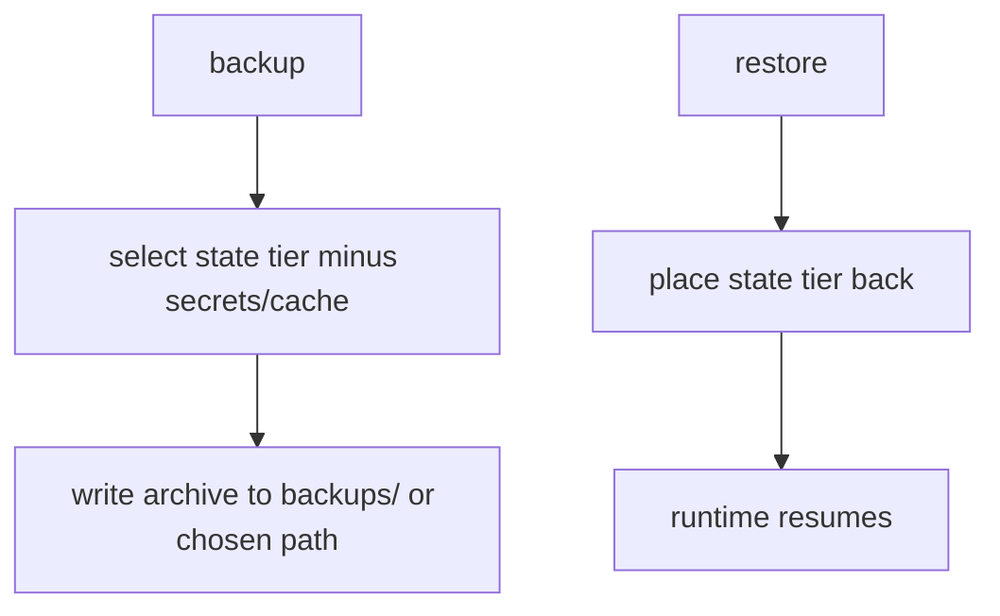

# Backup & Restore

**Version:** 1.0.0
**Status:** Stable
**Layer:** implementation
**Implements:** l1-storage-model.md

## Overview

The concrete backup/restore realization of the storage model's restore-by-copy invariant: back up the mutable state tier — minus secrets and regenerable cache — restore it elsewhere, and optionally schedule it. "Nothing extra": small, self-contained, recoverable.

## Related Specifications

- [l1-storage-model.md](l1-storage-model.md) - Restore-by-copy, secret isolation, durability (STO-2/5/6/7).
- [l2-filesystem-layout.md](l2-filesystem-layout.md) - What is in the state tier; cache/log locations excluded.
- [l2-security.md](l2-security.md) - Secrets excluded from backups.
- [l2-scheduler.md](l2-scheduler.md) - Optional scheduled backups.

## 1. Motivation

The storage model guarantees the state tier is restorable by copying it. This spec makes that an explicit, scheduled, secret-safe operation so a user never loses offices, memory, or learning.

## 2. Constraints & Assumptions

- A backup excludes `.env`/secrets and regenerable cache.
- A backup is self-contained: restoring it reconstitutes a working state tier.
- Backups land under the state tier's `backups/` or a user-chosen location.

## 3. Invariant Compliance (Layer 2 only)

| L1 Invariant | Implementation |
| --- | --- |
| STO-1 Two-tier separation | Only the state tier is backed up; the program tier is reinstalled, never backed up. |
| STO-2 Durable, restartable | A restored backup yields a state tier the runtime resumes from. |
| STO-5 Scope lifecycle | Per-scope contents (offices, roles, memory) are captured as they are on disk. |
| STO-6 Secret isolation | `.env`/secrets are excluded from every backup. |
| STO-7 Restore-by-copy | A backup is a copy of the state tier (minus secrets/cache); restore drops it back. |

## 4. Detailed Design

### 4.1 What is included / excluded

| Included | Excluded |
| --- | --- |
| config (non-secret), AGENTS.md | `.env` / secrets |
| memory, graph, skills | cache (regenerable) |
| workspaces (offices): board, sessions, schedules, snapshots, office layout | logs (optional) |
| hired employees (config, memory, skills, skins) | — |

### 4.2 Flow

Optional: a scheduled `routine` runs periodic backups (retention configurable). <!-- TBD: default retention/rotation policy -->

### 4.3 Command surface

| Action | CLI | TUI | Library (no code) |
| --- | --- | --- | --- |
| back up state | `cronus backup [--to <path>]` | `/backup …` | `backup.create(path?) -> BackupRef` |
| list backups | `cronus backup list` | `/backup list` | `backup.list() -> BackupRef[]` |
| restore | `cronus restore <backup>` | `/restore <backup>` | `backup.restore(ref) -> void` |

## 5. Drawbacks & Alternatives

- **Large state over time:** mitigated by excluding cache and by retention/rotation.
- **Secrets not in backup:** intentional (STO-6); the user re-supplies secrets on restore.
- **Alternative — full-tier backup incl. program:** rejected; the program is reinstallable (STO-1).

## Canonical References

| Alias | Path | Purpose |
| --- | --- | --- |
| `[STORAGE]` | `.design/main/specifications/l1-storage-model.md` | Invariants this implements |
| `[LAYOUT]` | `.design/main/specifications/l2-filesystem-layout.md` | What the state tier contains |
