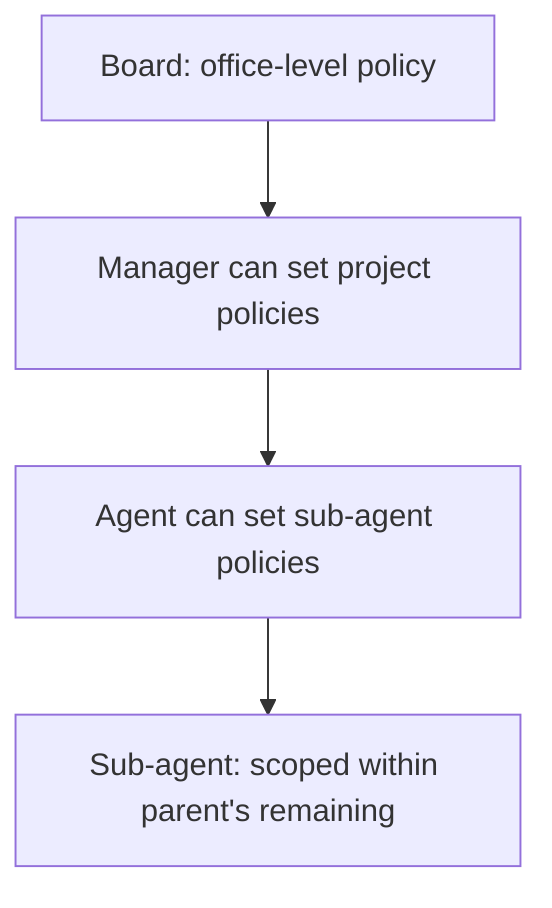

# Budget Engine

**Version:** 1.0.0
**Status:** Stable
**Layer:** implementation
**Implements:** l1-orchestration.md

## Overview

The concrete cost-tracking and budget-enforcement system: hierarchical budget policies scoped to any level (office / project / agent), cost event ingestion and roll-up, warn/hard-stop thresholds, and the monthly-UTC reset window. When an agent exhausts its budget, it is paused automatically; dependent tasks transition to `blocked` until the budget resets or is raised.

## Related Specifications

- [l1-orchestration.md](l1-orchestration.md) - ORC-7 budget circuit-breaker that this spec concretizes.
- [l2-orchestration.md](l2-orchestration.md) - Per-run and per-agent budget enforcement during goal execution.
- [l2-role-catalog.md](l2-role-catalog.md) - Agent instances that carry `budgetMonthlyCents`, `spentMonthlyCents`, and `pauseReason`.
- [l2-kanban-board.md](l2-kanban-board.md) - Cards transition to `blocked` when agent budget is exhausted.
- [l2-security.md](l2-security.md) - Budget incidents are written to the audit log.

## 1. Motivation

Autonomous agents can produce runaway costs if nothing constrains them. A budget engine with hard-stop enforcement means "the worst-case spend is bounded" — a property that makes autonomous operation safe to delegate to business stakeholders. Warn thresholds give visibility before the limit is hit; cascade scoping lets each level of the org control its own budget envelope.

## 2. Constraints & Assumptions

- Budget periods are calendar-aligned UTC windows (monthly by default); the engine resets spent counters at the start of each new period.
- Budget policies use a polymorphic scope: any budget can apply to an office, a project, or an agent.
- A child's budget cannot exceed its parent's remaining budget (cascade invariant).
- The board (human operator) can read and override any budget at any level at any time.
- Cost events are append-only; they are never deleted (audit requirement).

## 3. Invariant Compliance (Layer 2 only)

| L1 Invariant | Implementation |
| --- | --- |
| ORC-7 Budget circuit-breaker | `hardStopEnabled = true` auto-pauses an agent when `spent >= amount`; an in-progress run receives a stop signal. |
| SEC-7 Auditable | Every budget incident (warn/hard_stop) and policy change is appended to the audit log. |

## 4. Detailed Design

### 4.1 Budget policy

A budget policy is an entity separate from the object it governs. This allows a policy to be applied, revised, or removed without changing the agent or project definition.

```text
[REFERENCE]
BudgetPolicy {
  id,
  scopeType: "office" | "project" | "agent",
  scopeId,                      // workspace id, project id, or agent id
  metric: "billed_cents" | "input_tokens" | "output_tokens" | "total_tokens",
  windowKind: "monthly_utc" | "weekly_utc" | "daily_utc" | "lifetime",
  amount: u64,                  // limit in the metric's unit (e.g. cents, tokens)
  warnPercent: u8,              // default 80 — alert when spent >= amount * warnPercent / 100
  hardStopEnabled: bool,        // default true — auto-pause on exhaustion
  notifyEnabled: bool,          // default true — send alert on warn/hard_stop
  isActive: bool,
  createdByUserId?, updatedByUserId?
}
```

**Cascade invariant:** a policy cannot set `amount` higher than the parent scope's remaining budget for the same metric and window. The engine enforces this at write time; a policy creation that would violate the invariant is rejected with a validation error.

### 4.2 Cost events

Every LLM or compute call that incurs a cost produces a cost event, which the agent runtime reports to the budget engine:

```text
[REFERENCE]
CostEvent {
  agentId,
  runId,
  issueId?,
  projectId?,
  metric: "billed_cents" | ...,
  amount: u64,
  model,
  provider,
  timestamp
}
```

Cost events are append-only and written to the audit log. They are then rolled up into:

- `agent.spentMonthlyCents` — per-agent running total for the current window
- `project.spentMonthlyCents` — per-project running total
- `office.spentMonthlyCents` — office-level aggregate

Rollups are eventually consistent; the hard-stop check reads the fresh per-event total, not the cached rollup, to avoid races.

### 4.3 Budget incidents

When spending crosses a threshold, the engine creates a `BudgetIncident` record and optionally notifies the board:

```text
[REFERENCE]
BudgetIncident {
  id,
  policyId,
  scopeType, scopeId,
  kind: "warn" | "hard_stop",
  spentAmount,                  // amount at incident time
  policyAmount,                 // policy limit
  triggeredAt
}
```

`warn` — spending crossed `warnPercent` of `amount`. Notification only; agent continues.

`hard_stop` — spending reached `amount`. If `hardStopEnabled = true`:

1. The current run receives a `BudgetExhausted` stop signal; the run terminates with status `budget_paused`.
2. The agent's `status` is set to `paused` with `pauseReason = "budget_exhausted"`.
3. Cards assigned to this agent that are in `running` state transition to `blocked` with reason `"budget_exhausted"`.
4. Future heartbeat runs for this agent are rejected until the budget is reset or raised.

### 4.4 Budget delegation cascade



Hierarchy rules:

- A manager can set a budget policy for any agent in its reporting subtree.
- A policy's `amount` cannot exceed the parent scope's `(policy.amount - spentToDate)` at the time of creation.
- The board can override any policy regardless of hierarchy.
- Budget delegation does not automatically transfer unspent budget; each scope starts fresh each window.

### 4.5 Monthly reset

At the start of each new window (midnight UTC for `monthly_utc`), the engine:

1. Resets all `spentMonthlyCents` to zero for agents and projects.
2. Unpauses agents whose `pauseReason = "budget_exhausted"` (budget is fresh again).
3. Transitions their `blocked` cards back to `ready` (unless blocked for another reason).

The reset is a scheduled task run by the core service.

### 4.6 Command surface

| Action | CLI | TUI | Library (no code) |
| --- | --- | --- | --- |
| list policies | `cronus budget list [--scope office\|project\|agent] [--id <id>]` | `/budget list …` | `budget.listPolicies(scope?) -> BudgetPolicy[]` |
| show policy | `cronus budget show <policy-id>` | `/budget show <id>` | `budget.getPolicy(id) -> BudgetPolicy` |
| set policy | `cronus budget set --scope <type> --id <id> --amount <n> [--warn 80] [--metric billed_cents]` | `/budget set …` | `budget.setPolicy(scope, id, spec) -> BudgetPolicy` |
| list incidents | `cronus budget incidents [--scope <type>] [--kind warn\|hard_stop]` | `/budget incidents …` | `budget.listIncidents(filter?) -> BudgetIncident[]` |
| show spent | `cronus budget spent [--scope <type>] [--id <id>]` | `/budget spent …` | `budget.getSpent(scope?, id?) -> SpentSummary` |

## 5. Drawbacks & Alternatives

- **Eventual consistency on rollups:** the hard-stop check reads fresh totals, but UI displays rolled-up values which may lag by seconds. This is acceptable; the control-plane guarantee is the hard-stop, not the display.
- **Monthly UTC window may not align with billing periods:** operators using a provider with a calendar-month billing cycle that differs from UTC midnight may see slight mismatches. Mitigation: window reset timing is configurable.
- **No automatic budget re-distribution:** unspent budget in a child scope does not roll up to the parent. By design — over-allocation at parent level requires a human decision.
- **Alternative — token-only budgets:** rejected; cents are a universal unit across providers (some charge differently per token). The `metric` field supports token budgets for operators who prefer them.

## Canonical References

| Alias | Path | Purpose |
| --- | --- | --- |
| `[ORC]` | `.design/main/specifications/l1-orchestration.md` | ORC-7 budget circuit-breaker invariant |
| `[L2ORC]` | `.design/main/specifications/l2-orchestration.md` | Run and agent budget enforcement |
| `[ROLES]` | `.design/main/specifications/l2-role-catalog.md` | Agent budget fields |
| `[CLI]` | `.design/main/specifications/l2-cli.md` | Command grammar standard |
