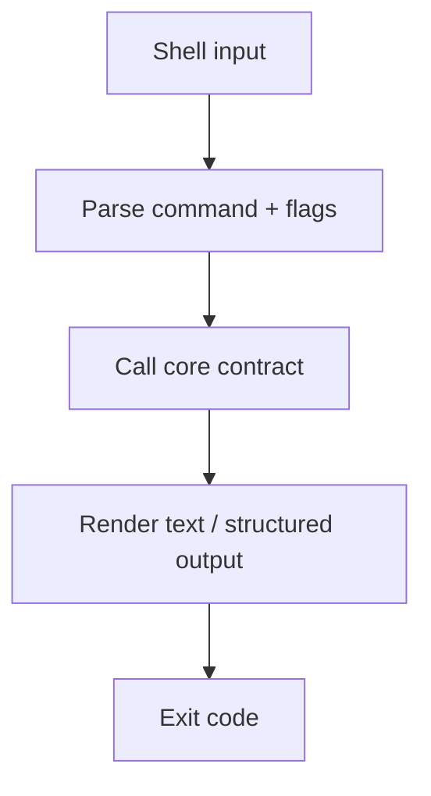

# CLI Frontend

**Version:** 1.0.0
**Status:** Stable
**Layer:** implementation
**Implements:** l1-architecture.md

## Overview

Architectural layer 2: the **command-line frontend** for Cronus. It maps shell commands and flags to the core contract and renders results as text. It is the automation-friendly surface and the lowest-overhead way to drive the engine.

## Related Specifications

- [l1-architecture.md](l1-architecture.md) - Concept this layer implements.
- [l2-core-library.md](l2-core-library.md) - The core this CLI drives.
- [l2-tui.md](l2-tui.md) - Sibling frontend (interactive terminal).
- [l2-technology-stack.md](l2-technology-stack.md) - Technology choices.

## 1. Motivation

CLI is the contract for scripts, CI, and power users. It must be scriptable (non-interactive), composable (pipeable output), and have full command parity with the other frontends so any capability is reachable from a terminal.

## 2. Constraints & Assumptions

- Implemented in **Rust**, linking the core crate directly (no IPC needed on the hub host).
- Supports interactive and **headless/non-interactive** invocation (flags + exit codes for automation).
- Text output is human-readable by default with a structured (machine-readable) output mode.
- No domain logic in the CLI layer (INV-2): it parses input and calls the core.

## 3. Invariant Compliance (Layer 2 only)

| L1 Invariant | Implementation |
| --- | --- |
| INV-1 Embeddable core | CLI links the core library; it is a consumer, not a reimplementation. |
| INV-2 Logic in core only | CLI does argument parsing + rendering; all behavior delegates to core calls. |
| INV-3 Command parity | The `cronus <command>` set maps 1:1 to the core capability set shared with TUI/app. |
| INV-4 Hub-and-spoke autonomy | On a hub host the CLI can start/stop the autonomous service; on a spoke it operates as a client to a hub. |
| INV-5 Durable, restartable state | CLI is stateless; all state lives in the core's durable store. |
| INV-6 Graceful capability scaling | Commands unavailable in the current host/mode report a clear, non-divergent "unsupported here" result. |
| INV-7 Security of client data | CLI never prints secrets; reads credentials from env/keychain via the core. |

## 4. Detailed Design

### 4.1 Command set (parity baseline)

| CLI | Capability |
| --- | --- |
| `cronus help` | Usage / command discovery |
| `cronus init` | Initialize a workspace/office |
| `cronus idea` | Capture an idea/intent |
| `cronus plan` | Generate a plan |
| `cronus task` | Generate/list tasks |
| `cronus run` | Execute work |
| `cronus status` | Show current state |
| `cronus compact` | Compact context/state |
| `cronus analyze` | Analyze project/workspace |
| `cronus memory` | Query/manage memory |
| `cronus goal` | Start an autonomous goal loop |
| `cronus quit` / `cronus exit` | Terminate session |

> The TUI mirrors these as `/help`, `/init`, … (slash form). Parity is required by INV-3.

### 4.2 Invocation modes

- **Interactive:** a REPL-style session bound to a core session.
- **Headless:** `cronus <command> [--flags]` returns a result and a process exit code suitable for scripting/CI.
- **Output mode:** default text; `--format json` (or equivalent) for structured consumption.

### 4.3 Flow

### 4.4 Command grammar (project standard)

The CLI follows mainstream-CLI conventions (the git/docker/kubectl family). This grammar is the project-wide standard for every command group; new functionality MUST conform.

- **Verb-first with flags:** `cronus <noun> <verb> [<id>] [--flag <value>]`.
- **Explicit verbs:** `create`, `delete`, `open`, `list`, `info`, `set`, `close` — no terse aliases.
- **Sub-command groups (namespaces):** related operations group under a noun (e.g. `workspace`; later `memory`, `kanban`, `model`).
- **Editing properties:** `set <id> --<property> <value>`; multiple `--property` flags may be combined in one call.
- **TUI parity:** the TUI mirrors the same grammar in slash form, `/<noun> <verb> …` (INV-3).
- **Library is the source:** each command binds to a public core method `<noun>.<verb>(...)`; the CLI/TUI add no behavior.

> Per-group command tables live in each group's profile spec (e.g. workspace commands in `l2-workspace-management.md`), all conforming to this grammar.

## 5. Drawbacks & Alternatives

- **Limited richness:** CLI cannot show live boards well; that is the TUI/app's role — acceptable by INV-6.
- **Alternative — wrap the TUI only:** rejected; a scriptable non-interactive CLI is required for automation. <!-- TBD: confirm structured output format (JSON vs other) for v0.1.0 -->

## Canonical References

| Alias | Path | Purpose |
| --- | --- | --- |
| `[ARCH]` | `.design/main/specifications/l1-architecture.md` | Invariants (esp. INV-3 parity) |
| `[CORE]` | `.design/main/specifications/l2-core-library.md` | The contract the CLI binds to |
