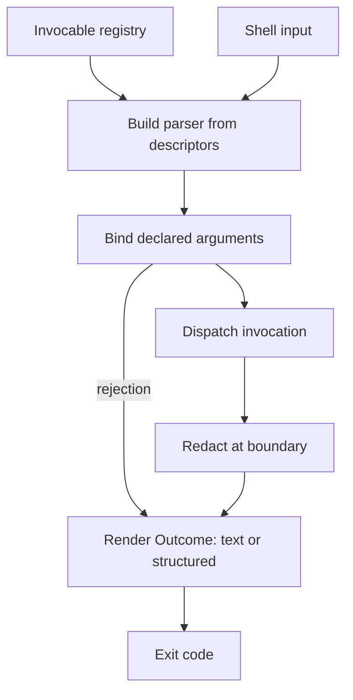

# CLI Frontend

**Version:** 1.2.0
**Status:** Stable
**Layer:** implementation
**Implements:** l1-architecture.md

## Overview

Architectural layer 2: the **command-line frontend** for Cronus. It maps shell commands and flags to the core contract and renders results as text. It is the automation-friendly surface and the lowest-overhead way to drive the engine.

Its command surface is not declared here. It is a **projection of the core's invocable registry**, built at startup: the verb set, the argument schema, help, and completion all derive from one catalog this frontend consumes and never restates.

## Related Specifications

- [l1-launch-handoff.md](l1-launch-handoff.md) — `[ADDED v1.2.0]` The entry contract this frontend implements: one binary, one entry procedure, a closed launcher grammar, and the ordering that lets an extension contribute a verb without every invocation loading every extension.
- [l1-architecture.md](l1-architecture.md) - Concept this layer implements.
- [l2-core-library.md](l2-core-library.md) - The core this CLI drives.
- [l2-tui.md](l2-tui.md) - Sibling frontend (interactive terminal).
- [l2-application-shell.md](l2-application-shell.md) - Sibling frontend (desktop shell); the third consumer of the same registry.
- [l2-invocable-registry.md](l2-invocable-registry.md) - The catalog and dispatch this frontend projects. `[ADDED v1.1.0]`
- [l2-surface-conformance.md](l2-surface-conformance.md) - The corpus this frontend registers against. `[ADDED v1.1.0]`
- [l1-surface-parity.md](l1-surface-parity.md) - Why the surface is derived rather than declared. `[ADDED v1.1.0]`
- [l1-input-binding.md](l1-input-binding.md) - Declared binders as the single source of the advertised argument schema. `[ADDED v1.1.0]`
- [l2-technology-stack.md](l2-technology-stack.md) - Technology choices.

## 1. Motivation

CLI is the contract for scripts, CI, and power users. It must be scriptable (non-interactive), composable (pipeable output), and have full command parity with the other frontends so any capability is reachable from a terminal.

Parity is the requirement that shaped this spec's 1.1.0 amendment. A command set declared in this frontend is a second statement of what the product can do, and a second statement drifts: at the time of the amendment the shipped verb set, the sibling terminal frontend's verb set, and this spec's own parity table were three different lists. Deriving the surface removes the possibility rather than policing it.

## 2. Constraints & Assumptions

- Implemented in **Rust**, linking the core crate directly (no IPC needed on the hub host).
- Supports interactive and **headless/non-interactive** invocation (flags + exit codes for automation).
- Text output is human-readable by default with a structured (machine-readable) output mode.
- No domain logic in the CLI layer (INV-2): it parses input and calls the core.
- **The argument parser is generated, not written.** `[ADDED v1.1.0]` It is constructed at startup from the registry's descriptors. A statically declared command enum is forbidden as a source of truth: it is fixed at build time and therefore cannot carry a verb contributed by an extension the user installs afterwards.
- **Rendering is a projection of a structured outcome.** `[ADDED v1.1.0]` The frontend receives `Outcome` values and renders them; it does not assemble output formats by hand, and it does not decide per command whether the requested format applies.

## 3. Invariant Compliance (Layer 2 only)

| L1 Invariant | Implementation |
| --- | --- |
| INV-1 Embeddable core | CLI links the core library; it is a consumer, not a reimplementation. |
| INV-2 Logic in core only | CLI does argument parsing + rendering; all behavior delegates to core calls. A domain fact the frontend needs — an on-disk location, a default target, an ordering — is obtained from the core, never derived locally. `[MODIFIED v1.1.0]` |
| INV-3 Command parity | `[MODIFIED v1.1.0]` Parity is **structural, not asserted**. The `cronus` verb set is a projection of the invocable registry shared with the TUI and the desktop shell, so this frontend has no place to hold a verb the registry lacks and no way to miss one it has. Residual behavioral agreement — two projections of one descriptor answering differently — is proven by the conformance corpus, which this frontend registers against from its own test target (SP-6/SP-7). |
| INV-4 Hub-and-spoke autonomy | On a hub host the CLI can start/stop the autonomous service; on a spoke it operates as a client to a hub. |
| INV-5 Durable, restartable state | CLI is stateless; all state lives in the core's durable store. |
| INV-6 Graceful capability scaling | Commands unavailable in the current host/mode report a clear, non-divergent "unsupported here" result. |
| INV-7 Security of client data | `[MODIFIED v1.1.0]` The CLI never prints secrets and reads credentials from env/keychain via the core. Masking is applied by the **dispatch boundary**, not by this frontend: the amendment closes a live asymmetry in which the sibling frontends masked and this one did not. The separate obligation that the core actually supply a non-empty secret list is tracked as a residual in `l2-surface-conformance` §4.7. |
| INV-8 Single-deployable modular monolith | The CLI is one of INV-8's sanctioned boundaries (frontend↔core): it links the core in-process, or attaches to a hub over the sanctioned client connection — never a network service in an orchestrated set. `cronus <group> <verb>` invocations are in-process contract calls; the CLI adds no service tier and needs no orchestration platform to run. |
| INV-9 Shipped-surface honesty | `[MODIFIED v1.1.0]` Enforced at the projection rather than by discipline. Only invocables marked shipped appear on the default surface, in help, and in completion; an action the core cannot yet perform has no descriptor and is therefore **unrepresentable** on this surface, closing the "parses and then answers *not implemented*" shape that five command groups exhibited at the time of this amendment. Departure is governed identically (l1-architecture v1.4.0): a retired verb leaves the shipped surface and completion while its migration path stays discoverable, resolving to a message naming its replacement — never silent deletion, never a permanent alias. |
| INV-10 Representation isolation at the inward seam | INV-10 governs the inward domain↔adapter seam, inside the core; the CLI sits on the outward side (INV-2) and stays clean by consuming only the core's contract types — it opens no store, keychain, or socket and names no storage row or wire DTO. The `l2-crate-topology` §6.4 finding (a CLI reaching a leaked database connection) is precisely the inward leak this frontend must not carry; once `codegraph` hides its storage engine the CLI binds contract types alone. |

## 4. Detailed Design

### 4.1 Command set

`[MODIFIED v1.1.0]` **This section deliberately contains no command table.**

The shipped verb set is whatever the invocable registry currently holds with shipped stability, grouped by each descriptor's declared group. Help, completion, and discovery render from the same descriptors. There is nothing here to maintain and therefore nothing here to drift.

The prior revision carried a hand-maintained parity table. By the time of this amendment it listed verbs the product did not have and omitted every group it did — the same defect as the frontends' hand-copied verb lists, one altitude up. It is recorded as finding F-3 and tombstoned in `l2-surface-conformance` §4.3.

> The TUI mirrors the same set in slash form and the desktop shell in generic dispatch. Parity is required by INV-3 and is structural, not restated.

### 4.1.1 Two halves, split by locus

`[ADDED v1.2.0]` Not every verb on this surface comes from the registry, and the division is not a convenience — it is forced by when each kind can be answered.

| Half | Source | Contents |
| --- | --- | --- |
| **Semantic verbs** | Generated from `Semantic` descriptors after composition | Every domain operation, including every verb an extension contributed |
| **Installation verbs** | Declared by this frontend, in its own closed grammar | Workspace initialization, configuration, extension management, diagnostics, completion generation |

The installation half is the **launcher grammar** of [l1-launch-handoff.md](l1-launch-handoff.md) and obeys LH-1 and LH-5: it is closed, small, owned entirely by this frontend's own source, and contains **no name an extension can define**. That last property is what makes it answerable at all — an installation verb must work when the composition it would configure is precisely what failed to come up, so it cannot be projected from a registry that does not yet exist.

The semantic half is resolved **after** composition, which is when the extensions contributing to it exist. This ordering is the whole reason a command line can be extended by a plugin without every invocation paying to load every plugin (EP-9): the launcher never asks a question the plugin set answers.

Generating *all* of it was the v1.1.0 reading of this spec and it does not survive the launcher contract. Hand-declaring *all* of it is the fork the registry exists to remove. The split is by locus and is checkable: a descriptor's locus decides which half it belongs to, and nothing is in both.

### 4.2 Invocation modes

`[MODIFIED v1.2.0]` **One binary.** `cronus` is the only executable this product ships; the terminal UI is a composition it brings up, not a separate program. A second binary is a second entry procedure, and two entry procedures resolve configuration in two orders — a difference discovered only when one of them starts honoring a setting the other ignores (LH-10).

- **Bare invocation:** `cronus` with no verb brings up the **default composition**, the terminal UI. The verb `cronus tui` names that same composition explicitly. Both are required and neither replaces the other (LH-4): the default is what makes the product usable by typing its name, and the explicit name is what makes it usable from a script or a shortcut whose meaning must not change on the day the default does.
- **Interactive:** a REPL-style session bound to a core session.
- **Headless:** `cronus <command> [--flags]` returns a result and a process exit code suitable for scripting/CI.
- **Output mode:** default text; `--format json` for structured consumption. `[MODIFIED v1.1.0]` The flag is honored **uniformly**, because rendering is one function of `Outcome` and the requested format rather than a per-command decision. Nine sites that silently discarded the flag, and five that assembled structured output by unescaped string formatting, are recorded as finding F-6 with their corrections staged as residuals.
- **Exit codes and rejections:** `[ADDED v1.1.0]` A binding rejection is a typed outcome carrying its mode (absent / unreadable / malformed / ill-shaped) and its location, which the frontend renders as a located message and maps to a non-zero exit code. An unavailable resource and an empty result are **different outcomes**; reporting the former as the latter with a success code is a correctness defect, recorded as a residual.
- **Three failures, three reports:** `[ADDED v1.2.0]` A malformed invocation, a composition that failed to come up, and a verb that ran and failed are distinguishable outcomes with distinct exit signals (LH-7). A usage failure opens no session and journals no run, so a misspelled flag leaves nothing resembling an execution behind it. This is the distinction an operator needs first — *did my command reach the product at all?* — and it is the one a single non-zero exit code destroys.
- **Help belongs to its grammar's owner:** `[ADDED v1.2.0]` This frontend renders usage for the installation half from its own declarations and for the semantic half from descriptors (LH-3). Where usage must be produced before composing — shell completion above all, which is asked on a keystroke — it is served from an artifact built by a prior composition that records the conditions under which it stops being valid (LH-6). A completion script regenerated by composing on every keypress is one the user will disable.

### 4.3 Flow

```mermaid
graph TD
    REG[Invocable registry] --> BUILD[Build parser from descriptors]
    SH[Shell input] --> BUILD
    BUILD --> BIND[Bind declared arguments]
    BIND -->|rejection| RENDER
    BIND --> CALL[Dispatch invocation]
    CALL --> MASK[Redact at boundary]
    MASK --> RENDER[Render Outcome: text or structured]
    RENDER --> EXIT[Exit code]
```

### 4.4 Command grammar (project standard)

The CLI follows mainstream-CLI conventions (the git/docker/kubectl family). This grammar is the project-wide standard for every command group; new functionality MUST conform.

- **Verb-first with flags:** `cronus <noun> <verb> [<id>] [--flag <value>]`.
- **Explicit verbs:** `create`, `delete`, `open`, `list`, `info`, `set`, `close` — no terse aliases.
- **Sub-command groups (namespaces):** related operations group under a noun, taken from the descriptor's declared group.
- **Editing properties:** `set <id> --<property> <value>`; multiple `--property` flags may be combined in one call.
- **TUI parity:** the TUI mirrors the same grammar in slash form, `/<noun> <verb> …` (INV-3).
- **Library is the source:** each command binds to a public core invocable; the CLI/TUI add no behavior.
- **The grammar constrains descriptors, not this frontend.** `[ADDED v1.1.0]` Because the parser is generated, conformance to this grammar is a property a descriptor must satisfy when it is registered. The check belongs to the registry, which is why it holds for a contributed verb as well as a core one.

> Per-group command detail lives in each group's profile spec (e.g. workspace commands in `l2-workspace-management.md`), all conforming to this grammar.

## 5. Drawbacks & Alternatives

- **Limited richness:** CLI cannot show live boards well; that is the TUI/app's role — acceptable by INV-6.
- **A generated parser gives up compile-time exhaustiveness.** `[ADDED v1.1.0]` A statically derived command enum is checked by the compiler. The trade is forced rather than chosen: a build-time surface cannot accept a verb contributed after the build, which is the whole plugin story. The conformance corpus buys the assurance back.
- **Alternative — wrap the TUI only:** rejected; a scriptable non-interactive CLI is required for automation.
- **Alternative — keep the declared command enum and add a check that it matches the registry:** `[ADDED v1.1.0]` rejected. It preserves the copy and therefore the drift, and the check it enables is the same shape as the one that was already passing while the surfaces differed.

## Canonical References

| Alias | Path | Purpose |
| --- | --- | --- |
| `[ARCH]` | `.design/main/specifications/l1-architecture.md` | Invariants (esp. INV-3 parity, INV-9 honesty) |
| `[CORE]` | `.design/main/specifications/l2-core-library.md` | The contract the CLI binds to |
| `[REGISTRY]` | `.design/main/specifications/l2-invocable-registry.md` | The catalog and dispatch this surface projects |
| `[CORPUS]` | `.design/main/specifications/l2-surface-conformance.md` | The corpus this surface registers against |

## Document History

| Version | Date | Notes |
| --- | --- | --- |
| 1.2.0 | 2026-09-06 | Entry-contract amendment. **One binary** — the terminal UI becomes a composition this executable brings up rather than a second program, since two entry procedures resolve configuration in two orders and the difference surfaces only when one starts honoring a setting the other ignores (LH-10). **Bare invocation** brings up the default composition (the terminal UI) and `cronus tui` names it explicitly; both are required (LH-4). **§4.1.1 splits the verb set by locus**: semantic verbs are generated from descriptors after composition, installation verbs are declared in this frontend's own closed grammar — because an installation verb must be answerable when the composition it configures is exactly what failed to come up, and because a launcher that resolved a contributed name would have to load every extension on every invocation (LH-1/LH-5). Generating all of it was the v1.1.0 reading and does not survive that constraint; hand-declaring all of it restores the fork the registry removes. Adds the three-way failure distinction (LH-7) and help ownership with a pre-composition artifact for completion (LH-3/LH-6). |
| 1.0.1 | 2026-07-29 | Extended §3 Invariant-Compliance to INV-8/9/10 (sanctioned frontend↔core boundary; honest verb surface — the strong INV-9 case; consumes contract types only, no adapter shape) — completeness fix. |
| 1.1.0 | 2026-09-05 | The command surface becomes a **projection of the invocable registry** rather than a declaration of its own: the parser is generated at startup from descriptors, and help, completion, and grouping derive from the same catalog. INV-3 parity is restated as **structural rather than asserted** — a frontend that derives its verbs cannot hold one the registry lacks — with residual behavioral agreement proven by the conformance corpus this surface registers against. INV-9 moves from discipline to representability: an unshipped action has no descriptor, so the "parses then answers *not implemented*" shape (five command groups at the time of amendment) cannot be expressed, and the v1.4.0 declared-retirement rule governs departure symmetrically. INV-7 masking moves to the dispatch boundary, closing the asymmetry in which the sibling frontends masked and this one did not; the inert-empty-secret-list half is recorded as a residual, not claimed as fixed. §4.1's hand-maintained parity table is **deleted** — it had drifted to listing verbs the product lacked while omitting every group it had — and tombstoned as finding F-3. §4.2 gains uniform format handling and the typed located rejection model, with the ignored-format and unescaped-structured-output defects recorded as residuals for separate correction. Adds the constraint that a statically declared command enum is forbidden as a source of truth, and the reasoning: it is fixed at build time and forecloses contributed verbs permanently. |
