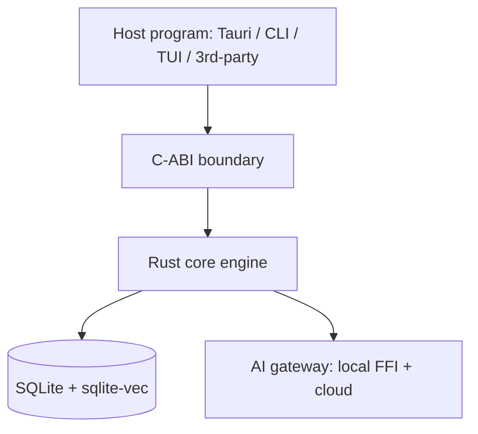

# Core Library (Foundation)

**Version:** 1.0.0
**Status:** Stable
**Layer:** implementation
**Implements:** l1-architecture.md

## Overview

Architectural layer 1: the **embeddable core library** that is the foundation of Cronus. It contains all domain logic and exposes a stable programmatic contract consumed by every frontend (CLI, TUI, application) and, optionally, by third-party host programs. It has no presentation dependencies.

## Related Specifications

- [l1-architecture.md](l1-architecture.md) - Concept this layer implements.
- [l2-technology-stack.md](l2-technology-stack.md) - Technology choices for the core.
- [l2-cli.md](l2-cli.md) - A consumer of this core.
- [l2-tui.md](l2-tui.md) - A consumer of this core.
- [l2-app-ui.md](l2-app-ui.md) - A consumer of this core.

## 1. Motivation

A reusable foundation lets every surface share one behavior and lets the engine be embedded elsewhere. The core owns agent orchestration, memory, scheduling, model routing, Kanban state, and persistence so that no frontend has to.

## 2. Constraints & Assumptions

- Written in **Rust** as a library crate; exposes a **C-ABI/FFI** surface for embedding (Tauri backend, mobile static lib, external hosts).
- No UI, terminal, or windowing dependencies (INV-1).
- Async via Tokio; long-running work never blocks a host's UI thread.
- Local-first: the default datastore is an embedded file (SQLite + sqlite-vec); remote/sync is optional.

## 3. Invariant Compliance (Layer 2 only)

| L1 Invariant | Implementation |
| --- | --- |
| INV-1 Embeddable core | Rust library crate with C-ABI; compiles for desktop and iOS/Android targets; linkable into external programs. |
| INV-2 Logic in core only | All domain modules (orchestration, memory, router, scheduler, board, persistence) live here; frontends hold none. |
| INV-3 Command parity | The core contract is the single definition of each capability; frontends bind to it, guaranteeing parity. |
| INV-4 Hub-and-spoke autonomy | The autonomous loop is a core service runnable headless on a hub; on spokes the same crate runs in foreground/sync-only mode. |
| INV-5 Durable, restartable state | Persistence module writes durable state (SQLite file); engine reconstructs sessions/memory/tasks on restart. |
| INV-6 Graceful capability scaling | The contract is capability-flagged; a host enables the subset it can support. |
| INV-7 Security of client data | Secret handling and telemetry separation are enforced in the core, not delegated to frontends. |

## 4. Detailed Design

### 4.1 Core modules (domain)

| Module | Responsibility |
| --- | --- |
| Orchestrator | Hierarchical agent coordination (manager → department agents); task delegation; adaptive hiring of roles on demand. |
| Memory | Tiered memory (working / recall / archival), scope-aware decay + prune, knowledge graph of entities/relations, hybrid retrieval. |
| Model router | Selects local vs cloud models by cost/tokens/capability; fallback cascade; semantic cache. |
| Scheduler | Cron + heartbeat wake queue (coalesced) driving autonomous work without spamming the board. |
| Board | Kanban state machine: `triage → todo → ready → running → blocked → done → archive` (+ custom). |
| Persistence | Durable local state (SQLite + sqlite-vec); optional remote sync (libSQL/PostgreSQL). |
| AI gateway | Local inference (llama.cpp via FFI) and cloud API clients behind one interface. |

### 4.2 Contract surface (illustrative)

The core exposes capability operations consumed by frontends; equivalent to the command set in [l1-architecture.md](l1-architecture.md) §4.4. `[REFERENCE]` illustrative shape, not final API:

```text
[REFERENCE]
core.init(config) -> Session
core.idea(text) -> CapturedIntent
core.plan(scope) -> Plan
core.task() -> Tasks
core.run(scope) -> RunHandle
core.status() -> StatusSnapshot
core.memory(query) -> MemoryResult
core.goal(condition) -> GoalHandle    // autonomous loop, judged termination
core.compact() -> void
core.analyze(scope) -> Report
```

### 4.3 Embedding model



### 4.4 Autonomy safety rails

- Per-agent budget checks before each wake; overspend auto-pauses (circuit breaker).
- Goal completion gated by an independent judge before the loop may stop.
- Checkpointing + context reconstruction for long-horizon runs.

## 5. Drawbacks & Alternatives

- **C-ABI surface is verbose:** mitigated by generating bindings; the embeddability benefit (INV-1) justifies it.
- **Alternative — TypeScript/Node core:** richer AI SDK ecosystem but high memory footprint and poor mobile embedding; rejected for the foundation. <!-- TBD: confirm whether a thin Go alternative core is worth a spike given repo history -->

## Canonical References

| Alias | Path | Purpose |
| --- | --- | --- |
| `[ARCH]` | `.design/main/specifications/l1-architecture.md` | Invariants the core must satisfy |
| `[STACK]` | `.design/main/specifications/l2-technology-stack.md` | Technology choices for the core |
