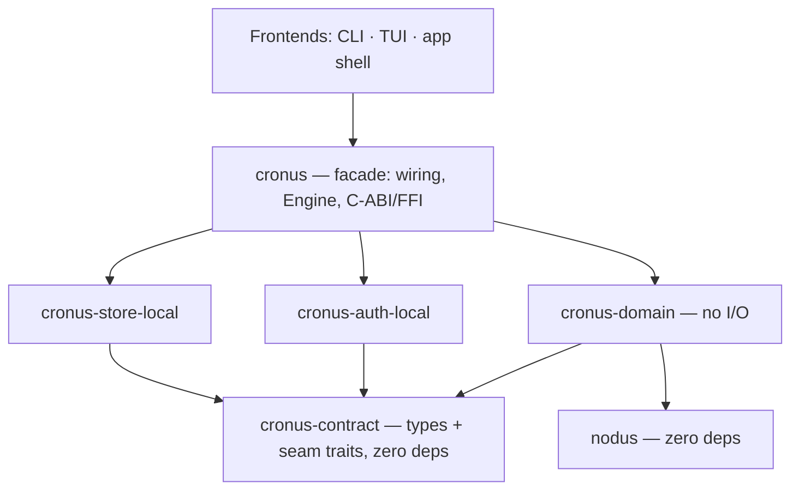

# Crate Topology (Core Decomposition)

**Version:** 1.0.0
**Status:** RFC
**Layer:** implementation
**Implements:** l1-architecture.md

## Overview

How the engine's domain logic is partitioned into Cargo crates. It resolves the open granularity question left by [l2-source-layout.md](l2-source-layout.md) §4.4 (single `core` crate vs. sub-crates) and turns INV-8's "strongly-bounded internal modules with strictly inward dependencies" from a convention the compiler cannot see into a boundary the compiler enforces.

The decomposition axis is **dependency weight and provider seams**, not domain area. A crate boundary exists where a module reaches for infrastructure (a database, a platform keychain, a cryptographic primitive) or where it backs one of the three deployment-neutrality provider planes. Domain modules — however large — stay together.

> Scope: the **compilation-unit** topology of `crates/`. The developer/source directory layout is [l2-source-layout.md](l2-source-layout.md); the user/install layout is [l2-filesystem-layout.md](l2-filesystem-layout.md). A crate boundary is **not** a process or network boundary — see §4.7.

## Related Specifications

- [l1-architecture.md](l1-architecture.md) - The layer model and INV-8 (modular monolith) this topology enforces.
- [l2-source-layout.md](l2-source-layout.md) - The source tree this topology populates; its §4.4 granularity question is resolved here.
- [l1-deployment-neutrality.md](l1-deployment-neutrality.md) - DN-2 provider seams (identity / auth / user-data) realized as crate boundaries.
- [l2-core-library.md](l2-core-library.md) - The core library contract; this spec partitions its modules without changing that contract.
- [l2-technology-stack.md](l2-technology-stack.md) - Dependency policy (prefer std; justify every third-party crate).
- [../../nodus/specifications/l1-nodus-portability.md](../../nodus/specifications/l1-nodus-portability.md) - LP-1 / LP-2: the host-neutral, adapters-in-separate-crates discipline this spec applies to the core itself.
- [l2-memory-store.md](l2-memory-store.md) - The persistence adapter that moves behind the user-data seam.
- [l2-multi-user-auth.md](l2-multi-user-auth.md) - The local authentication adapter that moves behind the auth seam.
- [l2-codegraph.md](l2-codegraph.md) - A sibling crate whose public surface currently leaks its storage engine (§6.4).

## 1. Motivation

The core is a single crate holding ~20k lines across 53 modules. Three measured properties of that crate, taken together, make the current shape untenable:

**The modules are already independent.** Only 11 inter-module dependency edges exist across 53 modules; just 14 of 74 source files reference `crate::` at all. The domain is not a tangle — it is a set of islands sharing a compilation unit. Whatever the single crate is buying, it is not cohesion.

**A small minority carries all the infrastructure.** Six modules (`memory`, `auth`, `inbox`, `workspace`, `scheduler`, `error_reporting` — ≈3.6k lines, 18%) hold every external dependency: an embedded SQL database, an OS keychain, password hashing, an AEAD cipher. The other 47 modules (≈16.3k lines, 82%) are pure `std`. Because they share a crate, the 82% cannot be built, tested, or linked without the 18%'s C toolchain and platform services.

**One edge causes the contamination.** `context_router` holds a `&MemoryStore` — a concrete SQLite-backed struct — and calls exactly one method on it. That single field is what chains the entire domain to `rusqlite`. Everywhere else, infrastructure modules depend on domain modules; never the reverse.

The consequences are already visible. The core pulls 95 transitive crates; the TUI pulls 152 in order to use one module — a 37-line string-redaction helper — and therefore compiles a bundled SQLite and a Windows keychain binding to render a terminal. The CLI reaches past the core contract and opens a database `Connection` directly, because a sibling crate exposes one in its public API (§6.4).

The deeper defect is architectural rather than mechanical. `l1-deployment-neutrality` DN-2 requires identity, authentication, and user-data persistence to sit behind **abstract provider interfaces** so a remote backend can be added without editing the core. Those interfaces do not exist. The core targets `rusqlite` and `bcrypt` directly; DN-3 ("the base binary and the hosted binary are the same code with different providers") is currently unrealizable, because there is no seam to swap.

Meanwhile the project already enforces exactly this discipline — on someone else. `crates/nodus` is bound by LP-1/LP-2: host-neutral, every integration point an abstract interface, **concrete implementations in separate adaptor crates, never in the library core**. It holds to it: 11,895 lines, zero external dependencies. Cronus imposed on its dependency a standard it never applied to its own foundation. The core is less portable than the library it consumes.

This spec closes that gap. It is not a new architectural decision; it is the missing implementation of DN-2 and the enforcement mechanism for INV-8.

## 2. Constraints & Assumptions

- **A crate boundary is a compilation boundary, never a process or network boundary.** All crates link into one deployable (INV-8). Nothing here introduces a service, an on-box network hop, or an orchestration dependency.
- **The public contract does not change.** The facade crate re-exports the current module paths, so `cronus::memory::…` and every existing frontend call site keep working. This is a physical reorganization, not an API redesign.
- **`l2-technology-stack.md` §"One crate → desktop + mobile is real"** is read as *one Rust codebase serves both targets*, not *exactly one Cargo crate*. Every crate defined here builds for desktop and mobile targets; the property is preserved. <!-- TBD: confirm this reading with the stack spec's author before promoting to Stable -->
- **The domain tier performs no I/O and links no C toolchain, platform service, or cryptographic implementation.** It may depend on pure-computation, leaf, no-I/O crates (see §4.3 allowlist). This is a weaker rule than nodus's absolute LP-1 zero-dependency contract, and deliberately so: the core is a host, not a portable library.
- **The async runtime, if adopted, is not a domain dependency.** `l2-core-library.md` §2 specifies Tokio; no async runtime is present in the tree today (§6.5). Whenever it lands, it belongs to the adapter and facade tiers, where I/O lives — never to the domain tier.
- Crate count is a cost. This topology mints five crates, not fifty; the minting rule (§4.4) is what keeps it there.

## 3. Invariant Compliance (Layer 2 only)

| L1 Invariant | Implementation |
| --- | --- |
| INV-1 Embeddable core | The facade crate (`cronus`) remains the embeddable unit and the sole owner of the C-ABI/FFI surface. Embedding hosts link one crate exactly as today. A host wanting the domain without persistence may instead link `cronus-domain`, which has no platform or C dependencies at all — strictly *more* embeddable than the status quo. |
| INV-2 Logic in core only | Enforced by the compiler rather than by review. Domain logic lives in `cronus-domain`; the tier holds no I/O, so a frontend cannot host domain logic by accident and an adapter cannot host it at all. The current CLI violation (a frontend opening a database `Connection`, §6.4) becomes unrepresentable once `codegraph` hides its storage engine. |
| INV-3 Command parity | Unchanged. The capability contract stays on the facade crate, which every frontend binds to. Parity is a property of the contract, and the contract does not move. |
| INV-4 Hub-and-spoke autonomy | Unchanged. The autonomous loop is domain logic (`autonomy`, `scheduler`, `orchestration`) plus a persistence adapter. A hub links the facade with durable providers; a spoke may link the domain tier with in-memory providers, which makes the spoke's foreground/sync-only posture a *link-time* fact rather than a runtime promise. |
| INV-5 Durable, restartable state | Unchanged in behavior, strengthened in structure. Durability moves behind the `UserDataStore` seam (§4.5); the default on-device provider is the same SQLite store, wired by the facade. The domain cannot bypass the seam to write state, because it cannot reach a database. |
| INV-6 Graceful capability scaling | A host now scales capability by **which provider crates it links**, not only by which contract calls it makes. Reduced capability (in-memory providers, no keychain) is expressible; divergent behavior is not, because every provider implements the same seam trait. |
| INV-7 Security of client data | Strengthened. Credential hashing, at-rest encryption, and keychain access are confined to two adapter crates with a named public surface, so the blast radius of a secret-handling defect is a crate, not the engine. The domain tier cannot log a secret it has no means to read. `redact` stays in the domain tier so every tier can sanitize output. |
| INV-8 Single-deployable modular monolith | This spec is INV-8's enforcement mechanism, not an exception to it. "Strongly-bounded internal modules with strictly inward dependencies" is unverifiable while every module can `use crate::anything`; a crate graph is acyclic by construction and checked on every build. All crates link into one binary; cross-crate communication is a function call. No sanctioned process boundary is added, and none is implied (§4.7). |

## 4. Detailed Design

### 4.1 Tier model

Four tiers, dependencies pointing strictly downward. No tier may name a tier above it.



The shape is ports-and-adapters. `cronus-contract` is the ports; `cronus-store-local` and `cronus-auth-local` are the adapters; `cronus-domain` is the hexagon; `cronus` is the composition root that chooses which adapters are installed.

Two properties fall out of the graph and are worth naming because they are what the single-crate layout cannot provide:

- **The domain never learns where its data lives.** It cannot: nothing it depends on knows about a database. This is DN-2, made structural.
- **Adding a remote backend edits no existing crate.** A new crate implements `UserDataStore`; the facade (or an extension registry, per DN-5) selects it. This is DN-3, made literal.

### 4.2 The crate set

| Crate | Path | Depends on | External deps | Contents |
| --- | --- | --- | --- | --- |
| `cronus-contract` | `crates/contract` | — | **none** | Shared types (`MemoryEntry`, typed prefixed IDs, `ThinkingLevel`, error taxonomy) and the seam traits: `UserDataStore`, `AuthProvider`, `IdentityProvider`, plus the existing `StateStore`, `ModelProvider`, `CheckpointWriter`, `Compactor`, `BusSender`, `ArchiveSink`. |
| `cronus-domain` | `crates/domain` | `cronus-contract`, `nodus` | pure-computation allowlist only (§4.3) | The 47 pure-`std` modules — orchestration, router, kanban, roles, session, quality, autonomy, tool_security, redact, … — plus the domain halves of the six infrastructure modules (§4.6). No I/O. |
| `cronus-store-local` | `crates/store-local` | `cronus-contract` | `rusqlite`, `aes-gcm`, `argon2`, `keyring` | The on-device `UserDataStore` default (DN-2): SQLite persistence for memory / inbox / workspace, at-rest encryption, keychain-held keys. |
| `cronus-auth-local` | `crates/auth-local` | `cronus-contract` | `bcrypt`, `hmac`, `sha1`, `getrandom` | The on-device `AuthProvider` default (DN-2): password hashing, session tokens, TOTP. Also carries the trivial single-principal `IdentityProvider` default. |
| `cronus` | `crates/core` | all of the above | — | Facade and composition root: `Engine`, `Capabilities`, the C-ABI/FFI surface, default-provider wiring, and `pub use` re-exports preserving today's module paths. |

`crates/nodus` and `crates/codegraph` are unchanged by this spec, except that `codegraph` must stop exposing `rusqlite::Connection` in its public API (§6.4).

### 4.3 The domain dependency allowlist

`cronus-domain` may depend only on crates that are **leaf, pure-computation, no-I/O, no-C, no-platform**. Today that admits exactly three, each already in the tree:

| Crate | Used by | Why it is not infrastructure |
| --- | --- | --- |
| `blake3` | `error_reporting` (content-addressed report dedup) | Pure hash function; no I/O, no allocation of platform resources. |
| `chrono`, `cron` | `scheduler` (cron-expression parsing, wake times) | Pure calendar arithmetic and expression parsing; the *effect* of a wake is domain logic, and nothing here touches a clock the domain cannot inject. |

Anything that opens a file, a socket, a database, a keychain, or a C library is infrastructure by definition and belongs to an adapter crate. A candidate that is merely *convenient* fails the project's standing dependency policy before it reaches this allowlist.

The distinction from nodus's LP-1 is intentional: nodus is a portable library that must name no host at all, so its zero-dependency bar is absolute. The core *is* the host. Its domain tier needs the weaker, checkable property "performs no I/O", which is what makes the tier fast to compile, trivial to test, and impossible to couple to a backend.

### 4.4 The crate-minting rule

This rule is the whole defense against a fifty-crate workspace, and it is the direct answer to the granularity question `l2-source-layout.md` §4.4 left open.

> **A crate is minted when, and only when, a module**
> **(a) requires an external dependency the domain tier may not hold; or**
> **(b) implements one of the DN-2 provider planes (identity / auth / user-data); or**
> **(c) acquires a consumer outside this workspace.**
>
> **Size, age, and domain distinctness never justify a crate.**

The open TBD proposed splitting along domain lines — `engine` / `memory` / `scheduler`. The measurements reject that axis: with 11 edges across 53 modules, domain-to-domain coupling is already near zero, so a domain split would purchase nothing and pay in manifests, version skew, and cross-crate refactoring friction. `router` (1,300 lines) and `tool_security` (1,116 lines) are the largest domain modules and stay exactly where they are, because neither triggers (a), (b), or (c).

Conversely `memory/store.rs` (14.5k characters) and `auth.rs` (794 lines) are not extracted because they are large. They are extracted because one opens a database and the other hashes passwords — clauses (a) and (b).

Applied in reverse, the rule also says when to *merge*: a crate whose last external dependency is removed, and which backs no provider plane, folds back into the domain tier.

### 4.5 The three seams (DN-2 realized)

| Plane | Seam trait (in `cronus-contract`) | On-device default (DN-1) | A remote provider supplies (DN-3) |
| --- | --- | --- | --- |
| User-data persistence / sync | `UserDataStore` | `cronus-store-local` (SQLite, on-device) | a remote database crate; cross-device sync |
| Authentication | `AuthProvider` | `cronus-auth-local` (bcrypt, TOTP) | remote sign-in, SSO, tokens |
| Principal identity | `IdentityProvider` | single local principal (no account) | accounts, handles, tenancy (DN-6) |

Exactly one provider is active per plane (DN-5). The facade selects it; the domain never sees the choice. A downstream building a hosted product ships two crates and changes one wiring statement — it does not fork the core, which is precisely the promise DN-3 makes and the current layout cannot keep.

Contract sketch — illustrative shape, not the final signature:

```rust
// [REFERENCE] crates/contract/src/seams.rs
pub trait MemorySearch {
    fn search_fts(&self, query: &str, limit: usize) -> Result<Vec<MemoryEntry>>;
}

/// The DN-2 user-data plane. `MemorySearch` is one facet; the full seam also
/// covers write, prune, and export (DN-7 portability).
pub trait UserDataStore: MemorySearch + Send + Sync {
    fn put(&self, entry: &MemoryEntry) -> Result<()>;
    fn export(&self) -> Result<Vec<MemoryEntry>>;   // DN-7: always able to come home
}
```

### 4.6 The single inverted edge

Ten of the eleven inter-module edges already point the right way: infrastructure depends on domain (`scheduler → tool_security`, `error_reporting → redact`), or domain depends on domain. Exactly one edge is inverted:

```text
[REFERENCE] crates/core/src/context_router.rs
    use crate::memory::{MemoryEntry, MemoryStore, Result as MemResult};

    pub struct ContextRouter<'a> {
        memory_store: &'a MemoryStore,   // ← concrete, SQLite-backed struct
    }
    // ... the only method ever called on it:
    self.memory_store.search_fts(query, limit)
```

`ContextRouter` — domain logic — names a concrete persistence struct in order to call one method. That single field is why the pure-`std` 82% of the engine cannot be compiled without SQLite, and it is DN-2's violation in miniature: domain code targeting a backend instead of an interface.

Inverting it is the pivot of the entire migration. `MemorySearch` moves to `cronus-contract`; `ContextRouter` holds a `&dyn MemorySearch` (or a generic parameter); `cronus-store-local::MemoryStore` implements it. With that one edge reversed, the domain/infrastructure cut is clean and mechanical, because no other domain module reaches downward.

The six infrastructure modules split rather than move wholesale:

| Module | Domain half → `cronus-domain` | Infrastructure half → adapter crate |
| --- | --- | --- |
| `memory` | `chain`, `trust`, `consolidation`, entry types | `store` (rusqlite), `encryption` (aes-gcm, argon2, keyring) |
| `auth` | privilege maps, reserved-name policy | password hashing, TOTP, token issuance |
| `inbox`, `workspace` | lifecycle rules and state machines | their SQLite persistence |
| `scheduler` | wake queue, coalescing | — (stays domain; `cron`/`chrono` are allowlisted) |
| `error_reporting` | sanitization, report shaping | — (stays domain; `blake3` is allowlisted) |

### 4.7 Crate boundaries are not process boundaries

INV-8 rejects decomposing the engine into independently-deployed network services. Nothing here does that, and the distinction is worth stating explicitly because "split the core" reads, at a glance, like the thing INV-8 forbids.

| Property | Microservice split (rejected by INV-8) | Crate split (this spec) |
| --- | --- | --- |
| Communication | network call, serialized | function call, in-process |
| Deployment | N units, orchestrated | 1 unit, one install |
| Failure mode | partial, distributed | none introduced |
| Enforcement of boundaries | runtime, by protocol | compile time, by the crate graph |
| Cost | on-box hops, an orchestration platform | five manifests |

INV-8 already anticipates this: *"A subsystem MAY be kept as a self-contained module behind a clean seam to preserve a future extraction option, but in-process linking is the default and the seam is not a network boundary."* Crates are how that seam is made real in Rust — and INV-8 itself cites `nodus` as the precedent.

### 4.8 Frontend dependency surface

A frontend links the tier it actually needs:

| Frontend | Links | Uses today | Transitive crates now → after |
| --- | --- | --- | --- |
| TUI | `cronus-domain` | one module (`redact`) | 152 → drops the bundled SQLite, the OS keychain, and both password-hashing schemes; retains only its own terminal stack and the §4.3 allowlist |
| CLI | `cronus` (facade) | 17 modules incl. `memory`, `state` | unchanged; but it stops depending on `rusqlite` directly (§6.4) |
| app shell | `cronus` (facade) | full contract + FFI | unchanged |

The TUI figure is the sharpest illustration and the weakest argument, since the TUI is unfinished and will grow toward the full contract. The durable win is not the TUI's crate count — it is that `cargo test -p cronus-domain` exercises 82% of the engine with no C compilation, no keychain, and no database, on every platform, in a fraction of the time.

## 5. Implementation Notes

The migration is ordered so that each step compiles and the test suite stays green throughout. Only step 2 is intellectually load-bearing; the rest is mechanical movement.

1. **Mint `cronus-contract`.** Move shared types and the existing traits. No behavior change; `crates/core` re-exports them. The workspace still has one real crate.
2. **Invert the one edge (§4.6).** Introduce `MemorySearch` in the contract, implement it for `MemoryStore` in place, retarget `ContextRouter`. This is the only step that changes a type signature, and after it the domain/infrastructure cut is a pure file move.
3. **Extract `cronus-store-local`** — `memory::store`, `memory::encryption`, and the persistence halves of `inbox` / `workspace`. `rusqlite`, `aes-gcm`, `argon2`, `keyring` move to its manifest and leave the core's.
4. **Extract `cronus-auth-local`** — `auth.rs`'s hashing, TOTP, and token issuance. `bcrypt`, `hmac`, `sha1`, `getrandom` move with it.
5. **Rename the remainder to `cronus-domain`**; keep `crates/core` as the `cronus` facade with `pub use` re-exports so no frontend call site changes.
6. **Repoint the TUI** at `cronus-domain`, and **fix `codegraph`'s public surface** (§6.4) so the CLI can drop its direct `rusqlite` dependency.
7. **Add the guard.** A CI check (or `fallow`-style boundary rule) asserting `cronus-domain`'s manifest lists no dependency outside the §4.3 allowlist. Without this step the discipline decays exactly as it did before, and the crate split becomes decoration.

Step 7 is not optional. The reason the current layout drifted is that nothing failed a build when it drifted.

## 6. Findings Surfaced During Analysis

Recorded here because each bears on the topology, and each is independently actionable.

- **6.1 — DN-2 seams are specified but absent.** No `IdentityProvider`, `AuthProvider`, or `UserDataStore` trait exists anywhere in the tree, though `l1-deployment-neutrality` is `Stable`. DN-3 is therefore currently unrealizable. §4.5 is the remedy.
- **6.2 — The core is less portable than its own dependency.** `nodus` holds LP-1/LP-2 (zero deps, adapters in separate crates) across 11,895 lines; `crates/core` embeds a database, a keychain, and two password-hashing schemes.
- **6.3 — `pub mod` provides no enforcement.** Today's low coupling (11 edges) is a product of discipline, not structure. INV-8's "strongly-bounded" is currently unfalsifiable.
- **6.4 — INV-2 violation in the CLI.** `crates/cli` opens a `rusqlite::Connection` and calls `migrate` / `store_symbols` / `fts_search` in production code (not tests), because `codegraph` exposes `Connection` in its public API. A frontend is performing persistence. `codegraph` must hide its storage engine behind its own API; the CLI then drops `rusqlite` from its manifest.
- **6.5 — Async-runtime gap.** `l2-core-library.md` §2 specifies "Async via Tokio"; the tree contains no `tokio` dependency and no `async fn`. This is an implementation gap rather than a spec defect, and it is left to that spec's owner. This topology only constrains *where* a runtime may live when it arrives: the adapter and facade tiers, never the domain (§2).

## 7. Drawbacks & Alternatives

**Drawback — five manifests instead of one.** Workspace dependency tables absorb most of it, and the minting rule (§4.4) prevents the count from creeping. Judged a fair price for compiler-enforced boundaries.

**Drawback — the facade must be maintained.** Re-exports keep frontends working, but a re-export layer can rot into a second, divergent API. Mitigation: the facade contains wiring and `pub use` only — no logic, no types of its own. It is reviewable in one sitting.

**Drawback — `dyn` dispatch at the memory seam.** `ContextRouter` gains a virtual call per search. The cost is invisible next to an FTS query, and generics remain available where a monomorphized call is warranted.

**Alternative — keep one crate, rely on discipline.** Rejected. It is the status quo, and it has already produced an inverted dependency edge, a frontend performing persistence (§6.4), and three specified-but-absent provider seams (§6.1). Discipline that no build step checks is a preference, not a boundary.

**Alternative — Cargo feature flags instead of crates.** Rejected on two independent grounds. Features do not enforce dependency *direction*: with `#[cfg(feature = "sqlite")]`, a domain module can still `use crate::store`, so INV-8 stays unverifiable. And features are additive across a workspace build graph, so a `--workspace` build that enables SQLite for the CLI re-enables it for the TUI — the isolation is not real. Most decisively, DN-3 requires adding a provider *without editing the core*; a `cfg` arm for each backend is an edit to the core by construction.

**Alternative — split by domain (`engine` / `memory` / `scheduler`), as the now-resolved TBD in [l2-source-layout.md](l2-source-layout.md) §4.4 proposed.** Rejected on measurement. Domain-to-domain coupling is already near zero, so this axis cuts where there is no pain and leaves the real coupling — the dependency axis — untouched. It would produce more crates *and* still ship SQLite to the TUI.

**Alternative — full microservice decomposition.** Rejected by INV-8, and not what this spec proposes; §4.7 draws the distinction explicitly.

**Risk — the split decays.** A future module adds `rusqlite` to `cronus-domain` and the tier's central property silently dies. Mitigation: step 7 of §5 makes it a build failure. This risk is the reason step 7 is mandatory rather than advisory.

## Canonical References

| Alias | Path | Purpose |
| --- | --- | --- |
| `[WORKSPACE]` | `Cargo.toml` | Current workspace members and the shared dependency table the split repartitions |
| `[CORE-LIB]` | `crates/core/src/lib.rs` | The 53 `pub mod` declarations this topology partitions |
| `[CORE-MANIFEST]` | `crates/core/Cargo.toml` | The external dependencies that determine each module's tier |
| `[PIVOT]` | `crates/core/src/context_router.rs` | The single inverted domain→infrastructure edge (§4.6); step 2 of the migration |
| `[EXEMPLAR]` | `crates/nodus/Cargo.toml` | The zero-dependency discipline (LP-1/LP-2) this spec applies to the core |

## Document History

| Version | Date | Notes |
| --- | --- | --- |
| 1.0.0 | 2026-07-10 | Initial spec. Resolves the `l2-source-layout.md` §4.4 crate-granularity TBD: decompose on the dependency/seam axis (contract · domain · store-local · auth-local · facade), not the domain axis. Establishes the crate-minting rule (§4.4), realizes the DN-2 provider seams as crate boundaries (§4.5), identifies the single inverted `context_router → MemoryStore` edge as the migration pivot (§4.6), and distinguishes a crate boundary from a process boundary under INV-8 (§4.7). Records five analysis findings (§6), incl. an INV-2 violation in the CLI and the absent DN-2 seams. |
