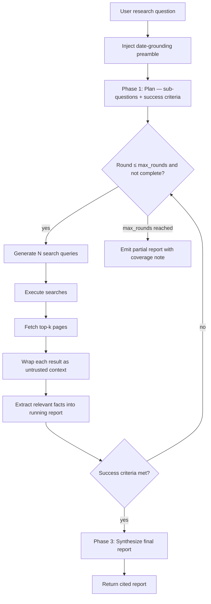

# Deep Research

**Version:** 1.0.0
**Status:** Stable
**Layer:** implementation
**Implements:** l1-orchestration.md

## Overview

An iterative Think→Plan→Search→Extract→Synthesize research engine. The agent generates a structured research plan (sub-questions + success criteria), drives multiple rounds of web searches with LLM-generated queries, extracts relevant content, and synthesizes a cited report. All fetched content is treated as untrusted and wrapped before being passed to the model. A date-grounding preamble prevents training-cutoff-year confusion in query generation.

## Related Specifications

- [l1-orchestration.md](l1-orchestration.md) - ORC-1 adaptive topology; research runs as a multi-step goal.
- [l2-orchestration.md](l2-orchestration.md) - Research is dispatched as a goal; judge evaluates completeness.
- [l2-tool-security.md](l2-tool-security.md) - All fetched content goes through the untrusted-context wrapper (§4.6).
- [l2-agent-session.md](l2-agent-session.md) - Research runs inside a session with its own TurnContext.
- [l2-memory-store.md](l2-memory-store.md) - Research reports may be saved as documents for later recall.
- [l2-context-management.md](l2-context-management.md) - Long research sessions trigger compaction; report is a `_protected` message.

## 1. Motivation

Single-shot web search is insufficient for complex research questions: one query rarely covers all sub-topics, and the first results rarely contain all needed facts. An iterative loop driven by the model — where the model decides what to search next based on what it already knows — produces substantially more complete reports. Planning ahead (sub-questions, success criteria) keeps the loop focused and provides a stopping criterion.

## 2. Constraints & Assumptions

- All external content (search results, fetched pages) is untrusted and must be wrapped before reaching the model context (see l2-tool-security.md §4.6).
- A date-grounding preamble is injected into every query-generation prompt to prevent the model from using its training-cutoff year as "current."
- A `max_rounds` circuit breaker prevents infinite loops.
- The research report is marked `_protected` in the session to prevent it from being trimmed.
- Low-quality results (too short, duplicate, error pages) are filtered before inclusion.

## 3. Invariant Compliance (Layer 2 only)

| L1 Invariant | Implementation |
| --- | --- |
| ORC-1 Adaptive topology | Research rounds are determined dynamically by the model; the number of rounds is not fixed. |
| SEC-3 No exfiltration | All fetched pages pass through the egress gate; only HTTP/HTTPS is allowed. |
| SEC-6 Sandboxed execution | Fetch operations run under the egress gate (l2-security.md §4.2); no shell execution. |

## 4. Detailed Design

### 4.1 Research loop



### 4.2 Date grounding

Every prompt that generates search queries or evaluates completeness receives a preamble:

```text
[REFERENCE]
Today's date is {MMMM DD, YYYY} ({YYYY-MM-DD}).
When a query needs a year or refers to "latest"/"current"/"this year",
use {YYYY} or relative wording — never a year inferred from training data.
```

This prevents queries like "best models 2024" when the year is 2026.

### 4.3 Plan phase

The first LLM call generates a structured research plan:

```text
[REFERENCE]
ResearchPlan {
  sub_questions: String[],       // 3–6 specific sub-questions to investigate
  key_topics: String[],          // key angles to cover
  success_criteria: String       // one sentence: what a complete answer looks like
}
```

The plan is injected into every subsequent query-generation prompt so the model knows what has been covered and what remains.

### 4.4 Query generation

Each round generates `num_queries` search queries (default 3–5) as a JSON array. The prompt receives:

- The original question.
- The research plan.
- The running report (what is already known).
- The round number (with a round-specific instruction, e.g. "focus on gaps from previous rounds").

### 4.5 Content filtering

Before wrapping and injecting fetched content, a quality filter rejects:

- Results shorter than a minimum character threshold (likely error pages or stubs).
- Exact duplicates of already-seen URLs.
- Results matching known low-quality patterns (e.g. empty body, HTTP error status).

Filtered results are logged but not injected into the model context.

### 4.6 Untrusted content wrapping

Every fetched page and search result is wrapped via the untrusted-context protocol before injection. The label carries the source URL. This prevents prompt-injection attacks embedded in fetched pages from being treated as instructions.

### 4.7 Report structure

The running report accumulates facts across rounds. The final synthesis produces:

```text
[REFERENCE]
ResearchReport {
  question: String,
  sub_questions_answered: String[],
  report_body: String,           // Markdown with inline citations
  citations: [{ url, title, retrieved_at }],
  rounds_completed: u8,
  success_criteria_met: bool,    // false → partial report
  partial_reason?: String        // why criteria were not met
}
```

The report is marked `_protected` in the session history so it is never trimmed or compacted.

### 4.8 Circuit breaker

`max_rounds` (default 5, configurable per research task) caps the loop. On reaching the limit, the engine emits a partial report with `success_criteria_met = false` and a `partial_reason` explaining what gaps remain. The report is still useful; the user can launch a follow-up research task to close specific gaps.

### 4.9 Command surface

| Action | CLI | TUI | Library (no code) |
| --- | --- | --- | --- |
| start research | `cronus research start "<question>" [--rounds 5] [--queries-per-round 4]` | `/research start …` | `research.start(question, opts) -> ResearchJob` |
| show status | `cronus research status <job-id>` | `/research status <id>` | `research.getStatus(id) -> ResearchJob` |
| show report | `cronus research report <job-id>` | `/research report <id>` | `research.getReport(id) -> ResearchReport` |
| list jobs | `cronus research list` | `/research list` | `research.list() -> ResearchJob[]` |
| cancel | `cronus research cancel <job-id>` | `/research cancel <id>` | `research.cancel(id) -> void` |

## 5. Drawbacks & Alternatives

- **Quality depends on search backend:** if the configured search provider returns low-quality results, the report will be thin regardless of the number of rounds. Mitigation: multiple search providers can be configured with fallback.
- **Date grounding helps but is not a guarantee:** the model may still hallucinate dates for events not in its training data. Mitigation: citations let the user verify claims.
- **`max_rounds` may terminate too early for deep topics:** users can re-run with a higher limit or launch a follow-up focused on identified gaps.
- **Alternative — single-shot RAG:** rejected; RAG over pre-indexed content cannot answer questions about recent or niche topics that were not indexed.

## Canonical References

| Alias | Path | Purpose |
| --- | --- | --- |
| `[ORC]` | `.design/main/specifications/l1-orchestration.md` | ORC-1 adaptive topology |
| `[TOOLSEC]` | `.design/main/specifications/l2-tool-security.md` | Untrusted-context wrapper |
| `[CTX]` | `.design/main/specifications/l2-context-management.md` | _protected report + compaction |
| `[CLI]` | `.design/main/specifications/l2-cli.md` | Command grammar standard |
