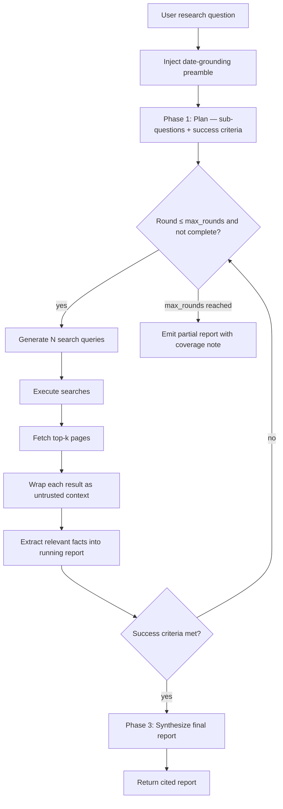

# Deep Research

**Version:** 1.3.0
**Status:** Stable
**Layer:** implementation
**Implements:** l1-deep-research.md, l1-orchestration.md

## Overview

An iterative Think→Plan→Search→Extract→Synthesize research engine. The agent generates a structured research plan (sub-questions + success criteria), drives multiple rounds of web searches with LLM-generated queries, extracts relevant content, and synthesizes a cited report. All fetched content is treated as untrusted and wrapped before being passed to the model. A date-grounding preamble prevents training-cutoff-year confusion in query generation.

## Related Specifications

- [l1-deep-research.md](l1-deep-research.md) - The Layer-1 concept this realizes: autonomous investigation over open sources ending in a claim-verified, attributed report (DR-1…DR-11).
- [l1-orchestration.md](l1-orchestration.md) - ORC-1 adaptive topology; research runs as a multi-step goal.
- [l1-recursive-decomposition.md](l1-recursive-decomposition.md) - The map-then-reduce discipline for the sub-question tree and for oversized fetched pages (DR-2/DR-3).
- [l1-claim-verification.md](l1-claim-verification.md) - The faithfulness gate the delivered report should pass (DR-4); the enhancement path beyond inline citations.
- [l1-context-provenance.md](l1-context-provenance.md) - The untrusted-content neutralization the §4.6 wrapper realizes (DR-5).
- [l2-orchestration.md](l2-orchestration.md) - Research is dispatched as a goal; judge evaluates completeness.
- [l2-tool-security.md](l2-tool-security.md) - All fetched content goes through the untrusted-context wrapper (§4.6).
- [l2-agent-session.md](l2-agent-session.md) - Research runs inside a session with its own TurnContext.
- [l2-memory-store.md](l2-memory-store.md) - Research reports may be saved as documents for later recall.
- [l2-context-management.md](l2-context-management.md) - Long research sessions trigger compaction; report is a `_protected` message.
- [l1-output-contracts.md](l1-output-contracts.md) - Caller-supplied report skeleton validated as an output contract (§4.10).
- [l2-budget-engine.md](l2-budget-engine.md) - Per-task cost estimate, post-run accounting, and hard-threshold gating (§4.10).
- [l1-acp.md](l1-acp.md) - Typed streaming event protocol reused for research progress (§4.10).

## 1. Motivation

Single-shot web search is insufficient for complex research questions: one query rarely covers all sub-topics, and the first results rarely contain all needed facts. An iterative loop driven by the model — where the model decides what to search next based on what it already knows — produces substantially more complete reports. Planning ahead (sub-questions, success criteria) keeps the loop focused and provides a stopping criterion.

## 2. Constraints & Assumptions

- All external content (search results, fetched pages) is untrusted and must be wrapped before reaching the model context (see l2-tool-security.md §4.6).
- A date-grounding preamble is injected into every query-generation prompt to prevent the model from using its training-cutoff year as "current."
- A `max_rounds` circuit breaker prevents infinite loops.
- The research report is marked `_protected` in the session to prevent it from being trimmed.
- Low-quality results (too short, duplicate, error pages) are filtered before inclusion.

## 3. Invariant Compliance (Layer 2 only)

Primary parent — l1-deep-research (DR-1…DR-11):

| L1 Invariant | Implementation |
| --- | --- |
| DR-1 Open, discovered sources | The search backend discovers pages per round from model-generated queries (§4.4); the source set is not supplied up front. |
| DR-2 Bounded investigation tree | The plan phase (§4.3) decomposes the question into 3–6 sub-questions with a success criterion; `max_rounds` (§4.8) bounds the tree depth by construction. |
| DR-3 Gather→read→synthesize, no dump | Fetched pages are content-filtered (§4.5), extracted into a running report (§4.1), and synthesized (§4.7) — raw pages are never dumped into the answer; an oversized page is decomposed per l1-recursive-decomposition. |
| DR-4 Grounded, claim-verified synthesis | **Partial.** The report carries inline citations and a `success_criteria_met`/`partial_reason` honesty flag (§4.7). A dedicated claim-verification gate (l1-claim-verification CV-9) over the synthesized report is the enhancement path — currently grounding is by cited extraction, not an independent per-claim verdict. |
| DR-5 Untrusted-by-default content | Every fetched page and search result is wrapped via the untrusted-context protocol before injection (§4.6); progress events never carry page content (§4.10). |
| DR-6 Fixed budget; question-measured progress | `max_rounds` circuit breaker (§4.8) plus per-task cost estimate and hard-threshold budget gating (§4.10, l2-budget-engine) bound effort; completion is judged against the plan's success criteria, not fetch count. |
| DR-7 Monotonic findings, keep/discard | The running report accumulates extracted facts across rounds (§4.1); the content filter (§4.5) discards low-quality/duplicate results before inclusion; filtered results are logged, not blended in. |
| DR-8 Frozen criteria + gated faithfulness | The `ResearchPlan.success_criteria` is fixed at the plan phase and reused every round (§4.3) — not moved mid-run; `max_rounds` is the frozen hard ceiling; output faithfulness rests on citations today, with the claim-verification gate as the independent-check path (see DR-4). |
| DR-9 Autonomous, never-stall, ceilinged | The loop runs autonomously round-to-round without asking to continue; `max_rounds` is the hard ceiling; a detached job runs on the durable tier and survives frontend exit (§4.10). |
| DR-10 Observable, cost-rolled-up, resumable | Streaming progress events at phase/round granularity (§4.10); token/cost accounting recorded on the finished job through the budget engine; a detached job is durable and addressable by id. |
| DR-11 Attributed, coverage-honest deliverable | `ResearchReport` carries per-finding citations, `sub_questions_answered`, `success_criteria_met`, and `partial_reason` (§4.7); a partial report declares its gaps rather than hiding them (§4.8). |

Secondary parent — l1-orchestration + security envelope:

| L1 Invariant | Implementation |
| --- | --- |
| ORC-1 Adaptive topology | Research rounds are determined dynamically by the model; the number of rounds is not fixed. |
| SEC-3 No exfiltration | All fetched pages pass through the egress gate; only HTTP/HTTPS is allowed. |
| SEC-6 Sandboxed execution | Fetch operations run under the egress gate (l2-security.md §4.2); no shell execution. |

## 4. Detailed Design

### 4.1 Research loop



<!-- [ADDED] v1.2.0 -->
**Concurrent fan-out within a round.** The search and fetch stages are I/O-bound and independent per item: the round's `num_queries` searches execute concurrently, and the resulting top-k page fetches execute concurrently, both under one bounded worker cap (`research.max_concurrent_fetches`, default 4). Results join before the extract stage, so extraction sees the same complete round a sequential engine would produce — within-round ordering carries no semantics, and the content filter (§4.5) and untrusted wrapping (§4.6) apply per result independently. A failed or timed-out fetch is dropped by the existing quality filter without failing the round. Wall-clock time per round approaches the slowest single fetch instead of the sum of all fetches.

### 4.2 Date grounding

Every prompt that generates search queries or evaluates completeness receives a preamble:

```text
[REFERENCE]
Today's date is {MMMM DD, YYYY} ({YYYY-MM-DD}).
When a query needs a year or refers to "latest"/"current"/"this year",
use {YYYY} or relative wording — never a year inferred from training data.
```

This prevents queries like "best models 2024" when the year is 2026.

### 4.3 Plan phase

The first LLM call generates a structured research plan:

```text
[REFERENCE]
ResearchPlan {
  sub_questions: String[],       // 3–6 specific sub-questions to investigate
  key_topics: String[],          // key angles to cover
  success_criteria: String       // one sentence: what a complete answer looks like
}
```

The plan is injected into every subsequent query-generation prompt so the model knows what has been covered and what remains.

### 4.4 Query generation

Each round generates `num_queries` search queries (default 3–5) as a JSON array. The prompt receives:

- The original question.
- The research plan.
- The running report (what is already known).
- The round number (with a round-specific instruction, e.g. "focus on gaps from previous rounds").

### 4.5 Content filtering

Before wrapping and injecting fetched content, a quality filter rejects:

- Results shorter than a minimum character threshold (likely error pages or stubs).
- Exact duplicates of already-seen URLs.
- Results matching known low-quality patterns (e.g. empty body, HTTP error status).

Filtered results are logged but not injected into the model context.

### 4.6 Untrusted content wrapping

Every fetched page and search result is wrapped via the untrusted-context protocol before injection. The label carries the source URL. This prevents prompt-injection attacks embedded in fetched pages from being treated as instructions.

### 4.7 Report structure

The running report accumulates facts across rounds. The final synthesis produces:

```text
[REFERENCE]
ResearchReport {
  question: String,
  sub_questions_answered: String[],
  report_body: String,           // Markdown with inline citations
  citations: [{ url, title, retrieved_at }],
  rounds_completed: u8,
  success_criteria_met: bool,    // false → partial report
  partial_reason?: String        // why criteria were not met
}
```

The report is marked `_protected` in the session history so it is never trimmed or compacted.

### 4.8 Circuit breaker

`max_rounds` (default 5, configurable per research task) caps the loop. On reaching the limit, the engine emits a partial report with `success_criteria_met = false` and a `partial_reason` explaining what gaps remain. The report is still useful; the user can launch a follow-up research task to close specific gaps (a cold follow-up; see §4.10 for threaded continuation that inherits this report's context).

### 4.9 Command surface

| Action | CLI | TUI | Library (no code) |
| --- | --- | --- | --- |
| start research | `cronus research start "<question>" [--rounds 5] [--queries-per-round 4] [--format "<skeleton>"] [--detach]` | `/research start …` | `research.start(question, opts) -> ResearchJob` |
| show status | `cronus research status <job-id>` | `/research status <id>` | `research.getStatus(id) -> ResearchJob` |
| stream progress | `cronus research stream <job-id>` | `/research stream <id>` | `research.stream(id) -> AsyncIterator<ResearchProgress>` |
| wait for completion | `cronus research wait <job-id>` | `/research wait <id>` | `research.wait(id) -> ResearchReport` |
| continue (threaded) | `cronus research continue <job-id> "<follow-up>"` | `/research continue <id> …` | `research.continue(id, followUp, opts) -> ResearchJob` |
| show report | `cronus research report <job-id> [--json \| --raw]` | `/research report <id>` | `research.getReport(id) -> ResearchReport` |
| list jobs | `cronus research list` | `/research list` | `research.list() -> ResearchJob[]` |
| cancel | `cronus research cancel <job-id>` | `/research cancel <id>` | `research.cancel(id) -> void` |

### 4.10 Long-running operation lifecycle

A research task runs for minutes, so it is operated as a durable, addressable job rather than a blocking call. Five operational facets extend §4.9 — each wires existing infrastructure rather than re-inventing it.

**Detached vs. attached start.** `start` returns a `ResearchJob` handle immediately. The caller chooses the mode:

- *attached* (default for interactive use): the frontend streams progress until completion.
- *detached* (`--detach`): the job runs on the durable background tier; the caller gets the job id and disconnects. The job survives frontend exit (durability per the orchestration model's scheduled/queued tiers).

**Streaming progress.** A subscriber receives ordered progress events at phase/round granularity, so the long tail of a task shows motion instead of a frozen prompt:

```text
[REFERENCE]
ResearchProgress {
  job_id, phase: plan|search|extract|synthesize,
  round, round_of_max, note,
  queries_in_flight?, pages_fetched?, elapsed_ms
}
```

Progress events are advisory and carry only counts and labels — never untrusted page content. Streaming reuses the session's typed event channel (l1-acp); a dropped subscriber never affects the running job.

**Wait.** `wait` blocks on an existing job until it reaches a terminal state (`done | partial | cancelled | error`) and returns the report. Polling (`status`) and waiting are equivalent — they differ only in who owns the wait loop, the caller or the engine.

**Threaded continuation.** `continue <job-id> "<follow-up>"` starts a new job that inherits the parent job's plan, accumulated report, and citations as seed context — distinct from the cold follow-up of §4.8, which starts from nothing. Use it to drill into a single point ("elaborate on finding 2") without re-researching the whole question. The continuation records a `parent_job_id` back-pointer for lineage. The inherited report is wrapped as the office's own prior output (trusted); any newly fetched pages remain untrusted (§4.6).

**Caller-supplied output contract.** `start --format "<skeleton>"` lets the caller declare the report's section structure up front (e.g. `"1. Executive Summary / 2. Comparison Table / 3. Recommendations"`). The skeleton becomes part of the synthesis prompt and an output-validation contract (l1-output-contracts): a missing required section forces one repair pass before the report is returned. Absent a skeleton, the default `ResearchReport` structure (§4.7) applies.

**Cost & time transparency.** Because a task spends real tokens and money, the engine is transparent on both ends:

- *Estimate at start* — a pre-run estimate of rounds, token range, and wall-clock, surfaced before a detached job is launched and recorded on the job.
- *Accounting at end* — actual input/output tokens and derived cost recorded on the finished job, attributed through the budget engine (l2-budget-engine) under the office/project budget hierarchy. A task that would breach a hard budget threshold is gated by the budget engine, not silently run.

```text
[REFERENCE]
ResearchJob (extended) {
  job_id, parent_job_id?,            // parent set for continuations
  question, format_skeleton?,        // caller output contract
  status: planning|searching|extracting|synthesizing|done|partial|cancelled|error,
  estimate?:  { rounds, input_tokens_range, wall_clock_range },
  usage?:     { input_tokens, output_tokens, cost },   // filled on completion
  created_at, finished_at?
}
```

These facets compose cleanly with existing subsystems: the durability tier from the orchestration model, streaming from the session event channel, output validation from output-contracts, and cost from the budget engine. The research engine wires them together; it owns none of them.

## 5. Drawbacks & Alternatives

- **Quality depends on search backend:** if the configured search provider returns low-quality results, the report will be thin regardless of the number of rounds. Mitigation: multiple search providers can be configured with fallback.
- **Date grounding helps but is not a guarantee:** the model may still hallucinate dates for events not in its training data. Mitigation: citations let the user verify claims.
- **`max_rounds` may terminate too early for deep topics:** users can re-run with a higher limit or launch a follow-up focused on identified gaps.
- **Alternative — single-shot RAG:** rejected; RAG over pre-indexed content cannot answer questions about recent or niche topics that were not indexed.

## Canonical References

| Alias | Path | Purpose |
| --- | --- | --- |
| `[ORC]` | `.design/main/specifications/l1-orchestration.md` | ORC-1 adaptive topology |
| `[TOOLSEC]` | `.design/main/specifications/l2-tool-security.md` | Untrusted-context wrapper |
| `[CTX]` | `.design/main/specifications/l2-context-management.md` | _protected report + compaction |
| `[CLI]` | `.design/main/specifications/l2-cli.md` | Command grammar standard |
| `[OUT]` | `.design/main/specifications/l1-output-contracts.md` | Caller output skeleton validation (§4.10) |
| `[BUDGET]` | `.design/main/specifications/l2-budget-engine.md` | Per-task cost gating + accounting (§4.10) |

## Document History

| Version | Date | Change |
| --- | --- | --- |
| 1.0.0 | 2026-06-22 | Initial specification: iterative Think→Plan→Search→Extract→Synthesize loop, date grounding, ResearchPlan (sub-questions + success criteria), content filtering, untrusted-content wrapping, ResearchReport with citations, `max_rounds` circuit breaker, async-job command surface. |
| 1.3.0 | 2026-07-10 | Re-parented under the new l1-deep-research concept (Implements: l1-deep-research.md, l1-orchestration.md) — this engine is the Layer-2 realization of deep research, previously parented only under orchestration. Invariant Compliance extended to map DR-1…DR-11 (most fully satisfied by the existing design; DR-4 grounded/claim-verified synthesis marked Partial — inline citations today, an independent claim-verification gate is the enhancement path). Implementation design unchanged; this is a layer-integrity/traceability correction. |
| 1.2.0 | 2026-07-04 | Bounded-concurrent fan-out within a round (§4.1): per-round searches and top-k page fetches run under one shared worker cap (default 4) with a join before extraction; per-result filtering/wrapping unchanged; failed fetches drop via the quality filter instead of failing the round. |
| 1.1.0 | 2026-06-25 | Long-running operation lifecycle (§4.10): detached/attached start, streaming progress events, blocking wait, threaded continuation with `parent_job_id` lineage, caller-supplied output-format contract, and cost/time/token transparency with budget-engine gating. Command surface extended (stream/wait/continue, `--format`/`--detach`/`--json`/`--raw`). |
