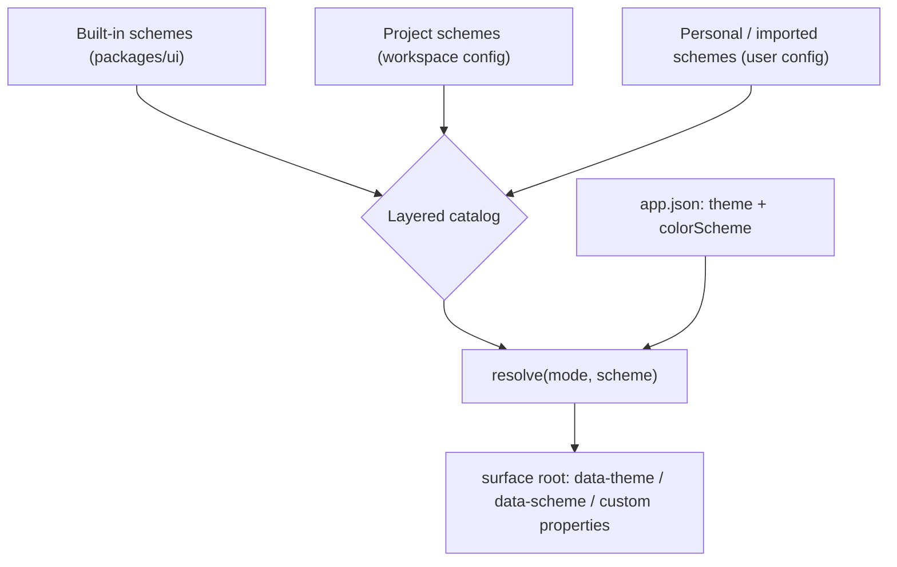

# Design System (Frontend Token Contract)

**Version:** 1.0.0
**Status:** Stable
**Layer:** implementation
**Implements:** l1-design-identity.md

## Overview

The concrete realization of the design-identity token contract for the desktop/web
frontend (React 19 + Vite + Tailwind CSS v4). It specifies: the **token taxonomy**
every visual attribute derives from; the **colour-scheme package** shape (manifest +
per-mode token files) that makes a scheme a data package, not code; the **two-axis
resolver** that composes an OS-appearance *mode* with a named *scheme* into the active
token set; the **Tailwind v4 `@theme` binding** that exposes tokens to components as
utilities and CSS custom properties; and the **craft lint** that mechanically enforces
"tokens are the single source of visual truth". Presentation-only: no domain logic,
no core round-trip to switch a look.

## Related Specifications

- [l1-design-identity.md](l1-design-identity.md) — the L1 parent: identity-as-data (DI-1), layered catalog (DI-2), token contract (DI-3), provenance/fidelity import (DI-4), tiered craft bar (DI-5…DI-7), uniform across UI + generated surfaces (DI-8), local-first secret-safe (DI-9).
- [l2-app-ui.md](l2-app-ui.md) — §4.5 defines the two theming axes and their persistence in `app.json`; this spec provides the resolver and token contract behind it.
- [l2-navigation.md](l2-navigation.md) — every navigation surface (frame, sidebar, palette, docks) renders from this token set; no hardcoded visual values.
- [l1-application-shell.md](l1-application-shell.md) — AS-5 render-from-state: the active `(mode, scheme)` is view state on the shell store; components read tokens, never literals.
- [l2-technology-stack.md](l2-technology-stack.md) — Tailwind CSS v4 (CSS-first config via `@theme`), the WebView floor Tailwind v4 requires.
- [l1-generative-surface.md](l1-generative-surface.md) — agent-generated surfaces consume the same token contract (DI-8); this spec is the host side of that shared contract.

## 1. Motivation

The reference desktop identity is expressed as ~40 literal colour values, a bound
display font, and fixed radii/spacing scattered inline across the shell markup.
Shipped as-is that is a craft defect (DI-3): no value is swappable, a second colour
scheme is impossible without editing components, and an agent-generated surface has no
token layer to target.

[l2-app-ui.md](l2-app-ui.md) §4.5 now declares a second theming axis — a named
**colour scheme** orthogonal to the light/dark **mode** — and [l1-design-identity.md](l1-design-identity.md)
DI-1 requires an identity to be a *schema-validated data package resolved through a
manifest*. Neither had a Layer 2 realization. This spec is that realization: it fixes
the token names, the package layout, and the resolver so a new scheme is a dropped-in
data package and switching either axis is an instant, cosmetic attribute change.

## 2. Constraints & Assumptions

- **Stack**: React 19 + Vite + TypeScript, **Tailwind CSS v4** with CSS-first configuration (`@theme` in a stylesheet — no `tailwind.config.js`). Tokens are CSS custom properties.
- **Presentation-only** (INV-2): the design system holds no domain logic; the active `(mode, scheme)` is view state, persisted by the shell in `app.json`, never a core call to apply.
- **Cosmetic-only** (DI-2): changing mode or scheme never alters behavior, data, or the meaning of any surface.
- **On-device-first** (DI-9): built-in schemes ship with `packages/ui`; project/personal schemes load from workspace/user config; acquiring a scheme from a remote source is an explicit, egress-gated action (import path is additive, out of scope for the first slice).
- **No hardcoded visual values** in components — colour, type, spacing, radius, motion come from tokens. Enforced by the craft lint (§5.6).
- **i18n-independent**: this spec governs visual tokens only; user-facing strings are externalized separately (l2-app-ui §4.6).
- First slice ships **one** built-in scheme (`default`) with a light and a dark variant; the mechanism must not assume exactly one.

## 3. Invariant Compliance (Layer 2)

| L1 Invariant | Implementation |
| --- | --- |
| DI-1 Identity as validated data | A scheme is a directory: `manifest.json` (schema-validated: `id`, `name`, `category`, `provenance`, `fidelity`, file map) + `tokens.light.css` + `tokens.dark.css` (declared custom properties) + optional `guidance.md` + optional `preview/`. Adding/removing a scheme is a data operation — no component or config code changes. |
| DI-2 Layered, swappable, cosmetic catalog | Schemes layer built-in (shipped in `packages/ui`) < project (workspace config dir) < personal (user config dir) with id-stable override; exactly one `scheme` is active per rendering scope. Switching `mode` or `scheme` swaps the `data-theme` / `data-scheme` attributes and the applied custom-property set on the surface root — instant, reversible, no reflow of state. |
| DI-3 Token contract is the single source of visual truth | Every visual attribute in every component resolves to `var(--token)` (directly or via a Tailwind utility mapped in `@theme`). The craft lint (§5.6) fails a build on a literal colour / `font-family` / raw pixel radius outside the token layer. |
| DI-4 Provenance-tagged, fidelity-declared import | `manifest.provenance` records `{ kind: bundled \| local \| repository \| registry, reference, importedAt? }`; `manifest.fidelity` ∈ `verbatim \| normalized \| hybrid`. A `verbatim` scheme keeps its own custom-property names behind a mapping shim; `normalized` is mapped onto the canonical token names (§5.1); `hybrid` (default) maps where it can. Imported packages are integrity-verified before activation (composes l1-attestation / l1-extensions). Import UI is additive and deferred past the first slice. |
| DI-5 Tiered craft conformance bar | The craft lint has a **must-fix** subset (no un-tokenized colour/font/radius; no default-accent tell) that blocks a build, and **advisory** rules (templated section rhythm, accent overuse) that are surfaced but non-blocking. The auto-enforced vs advisory split is declared in the lint config, never blurred. |
| DI-6 Distinctiveness over default | The `default` scheme carries the reference identity's specific palette, its bound display + mono families, and its radius/motion signature — not stack defaults. The must-fix lint blocks the named default tells (default accent, unbound default display font). |
| DI-7 Craft rules are data-driven | The lint rule set (tier + auto/advisory flag per rule) is configuration, layered like the scheme catalog; a project or user retunes the bar without an engine change. |
| DI-8 Uniform across office UI and generated surfaces | The same token names and the same `(mode × scheme)` resolution apply to the shell chrome, the placeholder surfaces, and (via the shared contract) agent-generated surfaces. A generated surface renders under the active scheme and is held to the same craft lint. |
| DI-9 Local-first, secret-safe, non-authoritative | Schemes are local data packages; a manifest, its tokens, its preview and assets carry no secrets. A scheme preview is rendered sample content, never real product data. The catalog is a presentation asset — never a source of truth for behavior. |

## 4. Detailed Design

### 4.1 Token taxonomy (canonical names)

The single visual source of truth. Every scheme declares a value (per mode) for every
token below; a component references only these.

```text
[REFERENCE]  canonical token groups (CSS custom properties, kebab-case under --)

colour · surface       --surface-0 (app ground) · --surface-1 (panel) · --surface-2 (raised) · --surface-3 (overlay)
colour · text          --text-primary · --text-secondary · --text-muted · --text-inverse
colour · line          --border-subtle · --border-strong · --focus-ring
colour · accent        --accent · --accent-hover · --accent-contrast
colour · semantic      --success · --warning · --danger · --info  (+ each -subtle background variant)
typography · family    --font-sans (display/body) · --font-mono
typography · size       --text-xs … --text-2xl  (scale)
typography · weight     --weight-regular · --weight-medium · --weight-semibold
typography · leading    --leading-tight · --leading-normal · --leading-relaxed
spacing                 --space-1 … --space-8   (4px base scale)
radius                  --radius-sm · --radius-md · --radius-lg · --radius-pill
motion                  --duration-fast · --duration-base · --duration-slow · --ease-standard · --ease-emphasized
elevation              --shadow-panel · --shadow-overlay
```

Semantic-role names (not raw hues) so a scheme can recolour without touching components.
The set is extensible additively; removing or renaming a token is a breaking change to
every consumer and is versioned as such.

### 4.2 Two-axis resolution

```text
[REFERENCE]
mode   ∈ { system, light, dark }          // OS-appearance axis (app.json: theme)
scheme ∈ { <built-in ids> ∪ <user ids> }  // visual-language axis (app.json: colorScheme)

resolve(mode, scheme, osPrefersDark):
    resolvedMode := (mode == system) ? (osPrefersDark ? dark : light) : mode
    pkg          := catalog.lookup(scheme)                 // id-stable layered override
    tokenSet     := pkg.tokens[resolvedMode]               // the per-mode custom-property block
    return { resolvedMode, schemeId: pkg.id, tokenSet }
```

The resolved result is applied on the surface root as `data-theme={resolvedMode}`,
`data-scheme={schemeId}`, plus the scheme's custom-property block for that mode.
Components and Tailwind utilities read the properties; nothing reads `mode` or
`scheme` directly except the resolver. A missing scheme id falls back to `default`
with a surfaced warning (never a blank surface). If `default` itself is
unresolvable — a corrupt install — the resolver applies a minimal built-in safe
token set and logs an integrity error; the surface stays legible, never blank.

### 4.3 Tailwind v4 binding

```text
[REFERENCE]
/* one stylesheet, loaded once */
@import "tailwindcss";

@theme {
  /* map Tailwind's generated utilities to the canonical custom properties */
  --color-surface-0: var(--surface-0);
  --color-text-primary: var(--text-primary);
  --color-accent: var(--accent);
  --radius-md: var(--radius-md);
  --font-sans: var(--font-sans);
  /* … one line per canonical token … */
}

/* the active scheme's per-mode values are set on the root by the resolver, e.g. */
:root[data-scheme="default"][data-theme="dark"]  { --surface-0: …; --text-primary: …; /* … */ }
:root[data-scheme="default"][data-theme="light"] { --surface-0: …; --text-primary: …; /* … */ }
```

Components use Tailwind utilities (`bg-surface-1`, `text-text-secondary`,
`rounded-md`) or `var(--token)` directly. No literal hex, `rgb()`, or px radius in a
component file. The existing `theme.ts` `data-theme` attribute is retained and gains
`data-scheme`.

### 4.4 Scheme package shape

```text
[REFERENCE]
schemes/<id>/
  manifest.json      { id, name, category, provenance{kind,reference,importedAt?}, fidelity, files{...} }
  tokens.light.css   :root[data-scheme=<id>][data-theme=light]  { --<token>: <value>; … }
  tokens.dark.css    :root[data-scheme=<id>][data-theme=dark]   { --<token>: <value>; … }
  guidance.md?       prose: what this scheme is, when to use it, how it should feel
  preview/?          indexed sample pages for human review — rendered content, never real data (DI-9)
```

Built-in schemes ship under `packages/ui`; project schemes resolve from the workspace
config directory; personal schemes from the user config directory. `manifest.json`
validates against a published JSON schema before the scheme enters the catalog.

### 4.5 Catalog layering and persistence



`app.json` carries `theme` (mode) and `colorScheme` (scheme id) alongside `locale`,
each with a serde default so an older settings file loads unchanged (l2-app-ui §4.7
`load_or_create`). Id-stable override: a project/personal scheme with the same id as a
built-in replaces it in the catalog without breaking a persisted `colorScheme`
reference.

### 4.6 Craft lint

A lint pass in the `packages/ui` verification gate:

| Tier | Rule (examples) | Enforcement |
| --- | --- | --- |
| must-fix | literal colour (`#rgb`, `rgb()`, `hsl()`) outside a token file; `font-family` literal; raw px on `border-radius`; hardcoded default accent | blocks the build |
| should-fix | accent used past a density threshold; identical section rhythm across surfaces | surfaced, non-blocking |
| nice-to-fix | missing targetable ids; decorative-but-empty geometry | guidance only |

Rule tiers and the auto/advisory flag live in a lint config (data, layered per DI-7),
not in engine code. The must-fix subset is the mechanically-decidable core of the
DI-5 craft bar for this stack.

## 5. Implementation Notes

1. Define §4.1 token names and the `manifest.json` JSON schema first — the resolver, the `@theme` map, and every component depend on the names being stable.
2. Author the `default` scheme (light + dark variants) from the reference identity; wire the resolver + `data-theme` / `data-scheme` attributes into the shell root (extends the existing `theme.ts`).
3. Add the `@theme` custom-property map and migrate shell chrome to utilities/`var(--token)`; turn on the must-fix craft lint in the gate once migration is clean.
4. Add `colorScheme` to `app.json` with a serde default; expose mode + scheme pickers in Settings ▸ Appearance.
5. The import path (DI-4 remote/project schemes, attestation) is additive and follows in a later slice — the package shape and resolver already accommodate it.

## 6. Drawbacks & Alternatives

- **Tailwind v4 `@theme` vs a JS design-token pipeline (e.g. Style Dictionary).** A build-time token compiler gives multi-target output but adds tooling and a build step for a single-target (WebView) app. Rejected for the first slice: native `@theme` + CSS custom properties covers mode × scheme with zero extra build tooling; a compiler can be added later without changing token names.
- **One scheme file with `[data-theme]` selectors vs per-mode files.** A single file is fewer artifacts; per-mode files (`tokens.light.css` / `tokens.dark.css`) keep each variant reviewable in isolation and diff cleanly. Chose per-mode.
- **Fold mode into scheme (a "dark default" and "light default" as two schemes).** Rejected: it multiplies the catalog by two, breaks "switch appearance without losing my scheme", and diverges from the OS `system` preference the mode axis tracks.
- **Skip the craft lint for the first slice.** Rejected: without it, literal values re-accumulate exactly as in the mockup and DI-3 is unenforceable; the must-fix subset is small and mechanical.

## Canonical References

| Alias | Path | Purpose |
| --- | --- | --- |
| `[IDENTITY]` | `.design/main/specifications/l1-design-identity.md` | L1 parent — DI-1…DI-9 the token contract and craft bar realize |
| `[APP-UI]` | `.design/main/specifications/l2-app-ui.md` | §4.5 two theming axes + `app.json` persistence this resolver serves |
| `[NAV]` | `.design/main/specifications/l2-navigation.md` | The shell surfaces that consume these tokens |
| `[STACK]` | `.design/main/specifications/l2-technology-stack.md` | Tailwind CSS v4 CSS-first config + WebView floor |

## Document History

| Version | Date | Change |
| --- | --- | --- |
| 1.0.0 | 2026-09-02 | Initial implementation spec — token taxonomy (§4.1), two-axis `(mode × scheme)` resolver (§4.2), Tailwind v4 `@theme` binding (§4.3), scheme package shape (§4.4), layered catalog + `app.json` persistence (§4.5), tiered craft lint (§4.6); maps DI-1…DI-9. Realizes the L2 gap behind l2-app-ui v1.4.0 §4.5. |
