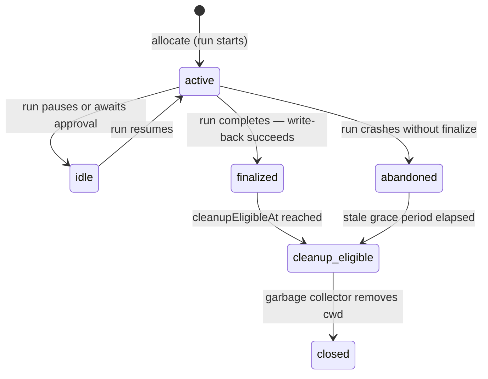

# Execution Workspace

**Version:** 1.0.1
**Status:** Stable
**Layer:** implementation
**Implements:** l1-orchestration.md, l1-storage-model.md

## Overview

Isolated filesystem environments in which agents execute tasks. Each workspace is a scoped directory (local, git worktree, SSH remote, or OS sandbox) with a well-defined lifecycle: allocated before a run starts, finalized when it completes (changes written back), and eventually cleaned up. Workspaces may be forked to support parallel work streams.

## Related Specifications

- [l1-orchestration.md](l1-orchestration.md) - ORC-2 state isolation that this spec concretizes.
- [l1-storage-model.md](l1-storage-model.md) - Two-tier layout (program / mutable state) that workspaces live inside.
- [l2-security.md](l2-security.md) - Sandbox backend and egress gate; workspace finalization obeys SEC-3.
- [l2-kanban-board.md](l2-kanban-board.md) - Issues reference `executionWorkspaceId`; `workspace_finalize=failed` blocks dependent wakes.
- [l2-filesystem-layout.md](l2-filesystem-layout.md) - `<state>/execution/` tree where workspace metadata lives.

## 1. Motivation

Agents that write files directly to the project root or a shared temp directory create race conditions and corrupted partial writes. An explicit workspace object gives each task a clean, named, owned directory. The finalize step creates an audit-able checkpoint: a run either wrote back its changes or it didn't — no partial-write ambiguity.

## 2. Constraints & Assumptions

- Workspaces never push to a git remote. All state stays on-device until an explicit user export or backup. This is the **no-remote-git contract**.
- A workspace belongs to exactly one run at a time (via the run's ownership lock).
- Forked workspaces inherit the parent's content at fork time but diverge independently thereafter.
- Sandbox workspaces are the default when the security policy requires it; local-fs is available for trusted agents.

## 3. Invariant Compliance (Layer 2 only)

| L1 Invariant | Implementation |
| --- | --- |
| ORC-2 State isolation | Each run gets a distinct workspace; concurrent runs cannot share a workspace. |
| ORC-6 Reversible delegation | A run that fails before finalize does not write back; the workspace stays at the pre-run snapshot. |
| SEC-6 Sandboxed execution | `sandbox` provider type delegates to the OS-native isolation backend from the stack spec. |
| STORE-3 Two-tier boundary | Workspace content goes under `<state>/execution/`; it is never mixed with `<program>/`. |

## 4. Detailed Design

### 4.1 Provider types

```text
providerType: "local_fs" | "worktree" | "ssh" | "sandbox"
```

| Provider | Description | Isolation | Use case |
| --- | --- | --- | --- |
| `local_fs` | Direct path on the host filesystem. | None (trusted agents only). | Fast, low-overhead tasks inside a trusted workspace. |
| `worktree` | A git worktree on a separate branch (`branchName`). | Branch boundary — diverges cleanly from main. | Parallel feature work that must not conflict. |
| `ssh` | Remote host: bundle → transfer → run → sync back. | Network isolation. | Remote compute or air-gapped environments. |
| `sandbox` | OS-native container/sandbox backend. | Full OS isolation; no network unless granted. | Untrusted code execution; default for unknown adapters. |

### 4.2 Workspace lifecycle



State definitions:
- **active** — a run is currently executing inside this workspace.
- **idle** — run is paused (waiting for approval, budget, or a wake signal); workspace is held warm.
- **finalized** — run completed, changes written back to the control-plane; workspace may be kept for inspection.
- **abandoned** — run crashed; workspace content is stale. Cannot auto-recover; requires human review.
- **cleanup_eligible** — `cleanupEligibleAt` timestamp has passed; garbage collector may remove `cwd/`.
- **closed** — `cwd/` removed; metadata record is retained for audit.

### 4.3 Workspace record

```text
[REFERENCE]
ExecutionWorkspace {
  id,
  runId,                              // owning run
  issueId,                            // issue being worked
  providerType,
  mode: "exclusive" | "read_only",
  status,                             // active | idle | finalized | abandoned | cleanup_eligible | closed

  // filesystem
  cwd: String,                        // absolute path to working directory
  branchName?: String,                // git branch (worktree provider)
  baseRef?: String,                   // the ref this workspace was branched from

  // forking
  derivedFromExecutionWorkspaceId?: , // parent workspace (fork)

  // cleanup
  cleanupEligibleAt?: Timestamp,

  // audit
  createdAt, updatedAt, finalizedAt?
}
```

### 4.4 No-remote-git contract

Worktree workspaces operate on a local git branch. The contract:

1. The workspace may commit locally to `branchName`.
2. The workspace **never** calls `git push` or any remote-write operation.
3. On finalize, changes are packed into a diff bundle and handed to the control-plane. The control-plane applies the bundle to the office's main state.
4. SSH workspaces transfer via `rsync`-style sync, not git push.

Violations of this contract fail the finalize step; the workspace transitions to `abandoned`.

### 4.5 Finalization protocol

When a run completes:

1. **Pre-flight** — verify workspace status is `active`.
2. **Bundle** — capture diff of `cwd/` against the base snapshot.
3. **Write-back** — apply bundle to the control-plane state tree.
4. **Record** — set `workspace.status = finalized`, `workspace.finalizedAt = now()`.
5. **Schedule cleanup** — set `cleanupEligibleAt = now() + retention_window` (default: 7 days).

If step 2 or 3 fails:
- Set `workspace.status = abandoned`.
- Set the owning issue's `executionLockedAt = null` (release the run's ownership lock).
- Emit `workspace_finalize_failed` event — dependent issues with a wake-on-finalize dependency remain `blocked`.

### 4.6 Workspace forking

A manager agent may fork an existing workspace to spawn parallel sub-tasks:

```text
fork_workspace(parentId) -> ExecutionWorkspace
```

The fork copies `cwd/` contents at fork time and sets `derivedFromExecutionWorkspaceId = parentId`. Each fork proceeds independently. Merging forks back is the orchestration layer's concern (it uses the diff bundle approach from §4.5); no merge tooling is built into the workspace layer.

### 4.7 Storage layout

```text
<state>/execution/
└── <workspace-id>/
    ├── workspace.json   # ExecutionWorkspace metadata
    └── cwd/             # actual working directory (or symlink for worktree)
```

For `worktree` provider, `cwd/` is a symlink to the git worktree path.
For `ssh` provider, `cwd/` is a local staging area; the remote path is stored in `workspace.json`.

### 4.8 Command surface

| Action | CLI | TUI | Library (no code) |
| --- | --- | --- | --- |
| list workspaces | `cronus workspace list [--issue <id>] [--status <s>]` | `/workspace list …` | `workspace.list(filter?) -> ExecutionWorkspace[]` |
| show workspace | `cronus workspace show <workspace-id>` | `/workspace show <id>` | `workspace.get(id) -> ExecutionWorkspace` |
| finalize | `cronus workspace finalize <workspace-id>` | `/workspace finalize <id>` | `workspace.finalize(id) -> FinalizeResult` |
| abandon | `cronus workspace abandon <workspace-id>` | `/workspace abandon <id>` | `workspace.abandon(id) -> void` |
| cleanup | `cronus workspace cleanup [--dry-run]` | `/workspace cleanup …` | `workspace.runCleanup(dryRun?) -> CleanupReport` |

### 4.9 Git worktree lifecycle (worktree provider)

This section specifies the concrete implementation of the `worktree` provider type.

#### Naming convention

```text
[REFERENCE]
MAX_NAME_ATTEMPTS = 26

makeWorktreeInfo(name?: String) -> Info:
  root = <state>/worktrees/<project_id>/
  fs.makeDirectory(root, recursive=true)
  base = name ? slugify(name) : ""  // lowercase-kebab, strip non-[a-z0-9], collapse dashes

  for attempt in 0..MAX_NAME_ATTEMPTS:
    slug = (attempt == 0 AND base != "") ? base : Slug.create()
    branch = "<tool>/<slug>"          // e.g. "agent/charming-fox"
    directory = root + "/" + slug
    if directory exists on disk: continue
    if git branch "refs/heads/<branch>" exists: continue
    return Info { name: slug, branch, directory }

  throw NameGenerationFailedError
```

The `<tool>` prefix in the branch name identifies the owning component and namespaces worktree branches from hand-crafted development branches.

#### Boot sequence

```text
[REFERENCE]
createFromInfo(info: Info, start_command?: String):
  1. setup(info):
       git worktree add --no-checkout -b <info.branch> <info.directory>
       project.addSandbox(project_id, info.directory)  // register with security sandbox

  2. boot(info, start_command?):
       git reset --hard                          // populate from HEAD
       BootstrapRuntime.run(info.directory)      // init workspace state tier
       runStartScripts(info.directory):
         a. project.commands.start (from project config)
         b. start_command (per-worktree override, runs after project command)
       publish worktree.ready (name, branch) via GlobalBus
```

If `git reset --hard` fails, `worktree.failed { message }` is published and the boot sequence aborts; the workspace stays registered but unusable.

#### isPristine check

Used by the workflow runtime to decide whether to keep or reclaim an isolated worktree after an agent turn:

```text
[REFERENCE]
isPristine(directory: String, base: String) -> bool:
  status = git status --porcelain  (in directory)
  if exit-code != 0: return false
  if status.text.trim() != "": return false      // uncommitted changes
  current = git rev-parse HEAD  (in directory)
  return current.text.trim() == base             // HEAD hasn't moved
```

A worktree is kept only when the agent succeeded AND the worktree is non-pristine (i.e., the agent produced changes).

#### Reset lifecycle

The `reset` operation brings a worktree back to a clean state against the project's default branch. Used when a failed task needs to be re-run in the same worktree slot:

```text
[REFERENCE]
reset(directory: String):
  1. Fetch the remote default branch (if remote-tracking ref).
  2. git reset --hard <default_branch_ref>  (in worktree)
  3. sweep(worktree_path):
       result = git clean -ffdx
       if result.code != 0:
         entries = parseFailedRemovePaths(result.stderr)
         if entries != []:
           prune(root, entries)   // rm -rf each locked file individually
           git clean -ffdx        // retry once after pruning locked files
  4. git submodule update --init --recursive --force
  5. git submodule foreach --recursive git reset --hard
  6. git submodule foreach --recursive git clean -fdx
  7. Verify: git status --porcelain must be empty after reset.
  8. Run project start scripts in the reset worktree (fork-in-scope).
```

The prune-and-retry pattern handles file-system lock contention (common on Windows where antivirus or indexer may hold files briefly).

#### Path canonicalization

Before any worktree lookup, paths are canonicalized:

```text
[REFERENCE]
canonical(path: String) -> String:
  abs = Path.resolve(path)
  real = fs.realPath(abs)  // resolve symlinks; fall back to abs on error
  norm = Path.normalize(real)
  return (platform == "win32") ? norm.toLowerCase() : norm
```

Case-insensitive comparison on Windows ensures that `C:\Users\X\worktrees\abc` and `c:\users\x\worktrees\abc` are treated as the same path.

#### Removal

```text
[REFERENCE]
remove(directory: String) -> bool:
  1. git worktree list --porcelain to find the entry.
  2. If entry not found but directory exists: stopFsmonitor + rm -rf directory.
  3. git fsmonitor--daemon stop (in worktree, if it exists).
  4. git worktree remove --force <path>.
  5. rm -rf <path>.
  6. git branch -D <branch>.
  7. return true.
```

Events:

| Event | Payload | When |
| --- | --- | --- |
| `worktree.ready` | `{ name, branch }` | Boot sequence completed successfully. |
| `worktree.failed` | `{ message }` | `git reset --hard` failed or bootstrap errored. |

## 5. Drawbacks & Alternatives

- **No auto-merge on fork convergence:** forks that touch the same files need human resolution. The workspace layer intentionally does not bundle a merge strategy — that is orchestration policy.
- **SSH provider adds latency:** bundle-transfer-sync adds overhead compared to local providers. This is accepted; SSH is for environments where local execution is not viable.
- **Retention window is fixed at 7 days:** configurable via `execution.workspace_retention_days` in the workspace config.
- **Alternative — shared mutable directory:** rejected; races and partial-write corruption are unacceptable for autonomous agents.

## Canonical References

| Alias | Path | Purpose |
| --- | --- | --- |
| `[ORC]` | `.design/main/specifications/l1-orchestration.md` | ORC-2 state isolation invariant |
| `[STORE]` | `.design/main/specifications/l1-storage-model.md` | Two-tier layout |
| `[SECURITY]` | `.design/main/specifications/l2-security.md` | Sandbox and egress |
| `[LAYOUT]` | `.design/main/specifications/l2-filesystem-layout.md` | `<state>/execution/` path |
