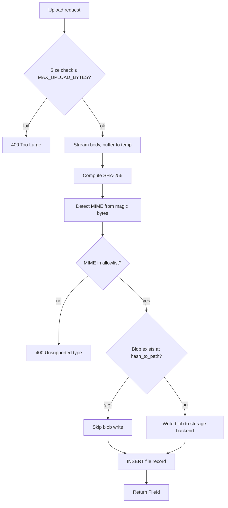

# File Store (Implementation)

**Version:** 1.0.0
**Status:** Stable
**Layer:** implementation
**Implements:** l1-file-management.md

## Overview

Concrete implementation of the file management subsystem: SQLite schema for file metadata records, content-addressed blob storage via SHA-256 deduplication, an async upload pipeline, a configurable storage backend trait, access control integration, and a garbage collection scheduler. The `crates/file-store` crate is the single point of contact for all file operations.

## Related Specifications

- [l1-file-management.md](l1-file-management.md) - The concept this spec implements.
- [l2-resource-sharing.md](l2-resource-sharing.md) - `access-grants` crate enforces FM-4.
- [l2-knowledge-store.md](l2-knowledge-store.md) - Knowledge documents reference `FileId`.
- [l2-notes.md](l2-notes.md) - Note content embeds `FileId` for inline images.
- [l2-filesystem-layout.md](l2-filesystem-layout.md) - Blob storage path under the mutable state tier.
- [l2-source-layout.md](l2-source-layout.md) - Crate at `crates/file-store/`.

## 1. Motivation

Multiple subsystems (knowledge base, notes, chat attachments) need to store and retrieve binary content. Without a shared file store, each duplicates upload handling and storage code, and the same binary may be stored multiple times. One store with SHA-256 deduplication keeps storage efficient and access control centralised.

## 2. Constraints & Assumptions

- Default storage backend is the local filesystem (under the state tier's `files/` directory). Object stores (S3-compatible) are a pluggable backend via a trait.
- Blob paths are derived from the content hash (`<sha256[0:2]>/<sha256[2:4]>/<sha256>`) — identical to the Git object store layout — enabling directory-level sharding.
- MIME type is determined server-side using magic bytes (first 4 KiB of content); the client-supplied MIME hint is advisory and may be overridden.
- The reference count for deduplication is maintained by counting `file` rows sharing the same `hash` and `storage_path`; no separate refcount column.

## 3. Invariant Compliance (Layer 2)

| L1 Invariant | Implementation |
|---|---|
| FM-1 Explicit ingestion | Upload endpoint + server-side ingest function; no implicit capture path. |
| FM-2 Content-addressed dedup | SHA-256 computed server-side; `storage_path` is derived from the hash. Before writing, check if the blob already exists at that path. |
| FM-3 Metadata decoupled | `file` table holds metadata; blob lives at `storage_path` in the backend. |
| FM-4 Access control | `access-grants` crate `has_access(File, file_id, Permission::Read)` enforced in download handler. |
| FM-5 Reference tracking | `file_reference(file_id, resource_type, resource_id)` tracks consumers; GC checks this table. |
| FM-6 Size enforcement | `MAX_UPLOAD_BYTES` config guard checked at upload start; streams are aborted before persistence. |
| FM-7 Immutable blobs | No in-place blob overwrite; "replace file" creates a new `file` record (possibly reusing the blob if hash matches). |

## 4. Detailed Design

### 4.1 Schema

```sql
[REFERENCE]
CREATE TABLE file (
    id           TEXT PRIMARY KEY,       -- fil/ prefix
    owner_id     TEXT NOT NULL,
    name         TEXT NOT NULL,          -- original filename
    mime_type    TEXT NOT NULL,
    size         INTEGER NOT NULL,       -- bytes
    hash         TEXT NOT NULL,          -- SHA-256 hex
    storage_path TEXT NOT NULL,          -- backend-relative path (hash-derived)
    meta         TEXT,                   -- JSON
    status       TEXT NOT NULL DEFAULT 'ready',  -- uploading|ready|deleted
    created_at   INTEGER NOT NULL,
    updated_at   INTEGER NOT NULL
);
CREATE INDEX ix_file_owner  ON file(owner_id);
CREATE INDEX ix_file_hash   ON file(hash);
CREATE INDEX ix_file_status ON file(status);

-- Reference tracking: who uses this file
CREATE TABLE file_reference (
    id            TEXT PRIMARY KEY,
    file_id       TEXT NOT NULL REFERENCES file(id),
    resource_type TEXT NOT NULL,         -- 'knowledge_document'|'note'|'chat_message'|…
    resource_id   TEXT NOT NULL,
    created_at    INTEGER NOT NULL,
    UNIQUE (file_id, resource_type, resource_id)
);
CREATE INDEX ix_fileref_file ON file_reference(file_id);
CREATE INDEX ix_fileref_resource ON file_reference(resource_type, resource_id);
```

### 4.2 Storage Backend Trait

```rust
[REFERENCE]
/// Pluggable backend for blob storage.
#[async_trait]
pub trait StorageBackend: Send + Sync {
    /// Write a blob; returns the backend-relative storage_path.
    async fn write(&self, hash: &str, data: &[u8]) -> Result<String>;

    /// Check if a blob already exists (for deduplication).
    async fn exists(&self, storage_path: &str) -> Result<bool>;

    /// Read a blob as a byte stream.
    async fn read(&self, storage_path: &str) -> Result<BoxStream<'static, Result<Bytes>>>;

    /// Delete a blob.
    async fn delete(&self, storage_path: &str) -> Result<()>;
}

/// Default local filesystem backend.
pub struct LocalFileBackend {
    base_dir: PathBuf,
}

// S3-compatible backend is a separate optional crate feature.
```

**Blob path derivation (FM-2):**

```rust
[REFERENCE]
fn hash_to_path(hash: &str) -> String {
    // e.g. "a1b2c3..." -> "a1/b2/a1b2c3..."
    format!("{}/{}/{}", &hash[..2], &hash[2..4], hash)
}
```

### 4.3 Upload Pipeline



### 4.4 Download (Access-Controlled)

```rust
[REFERENCE]
pub async fn download_file(
    store       : &FileStore,
    grants      : &AccessGrantService,
    file_id     : &FileId,
    requesting_user: &UserId,
    user_groups : &[GroupId],
) -> Result<(FileMetadata, BoxStream<Bytes>)> {
    let file = store.get_metadata(file_id).await?;
    let is_owner = file.owner_id == *requesting_user;
    if !grants.has_access(File, file_id, Permission::Read, requesting_user, is_owner, user_groups).await? {
        return Err(Error::Forbidden);
    }
    let stream = store.backend.read(&file.storage_path).await?;
    Ok((file.into(), stream))
}
```

### 4.5 Reference Tracking (FM-5)

Consumers register references when they link to a file:

```rust
[REFERENCE]
// When a knowledge document is created referencing a file:
file_store.add_reference(file_id, "knowledge_document", doc_id).await?;

// When a knowledge document is deleted:
file_store.remove_reference(file_id, "knowledge_document", doc_id).await?;
```

### 4.6 Garbage Collection

GC runs at startup and on a configurable periodic schedule:

1. Find `file` rows where `status = 'deleted'` AND `deleted_at < now() - RETENTION_WINDOW`.
2. For each, check `file_reference` — if any row exists, skip (still referenced).
3. Check blob dedup: count other `file` rows with the same `hash` and `status != 'deleted'`. If count > 0, skip blob deletion (blob is shared).
4. If no references and no live duplicates: delete blob via backend, delete `access_grant` rows for the file, delete `file` row.

### 4.7 MIME Allowlist (Configurable)

Default allowed categories: `text/*`, `application/pdf`, `application/json`, `image/*`, `audio/*`.

Blocked regardless of config: `application/x-executable`, `application/x-msdos-program`, and any magic byte that indicates a script or executable.

### 4.8 Crate Layout

```plaintext
crates/
└── file-store/
    ├── src/
    │   ├── lib.rs          // FileStore service: upload, download, delete, gc
    │   ├── model.rs        // File, FileReference, FileMetadata, FileId
    │   ├── db.rs           // SQLite queries
    │   ├── backend/
    │   │   ├── mod.rs      // StorageBackend trait
    │   │   └── local.rs    // LocalFileBackend
    │   ├── mime.rs         // MIME detection (magic bytes) + allowlist
    │   ├── hash.rs         // SHA-256 streaming hash + path derivation
    │   └── gc.rs           // GC scheduler
    └── tests/
        └── upload_tests.rs
```

## 5. Implementation Notes

1. Use `blake3` or `sha2` crate for hash computation; Blake3 is faster but SHA-256 is the more universal choice for interoperability.
2. Stream the upload body; do not buffer the entire file in memory before hashing — use an incrementally-updating hasher.
3. Temp file during upload: write to a `.tmp` path in the same directory, then rename to the final hash-derived path (atomic on most filesystems).
4. Magic-byte MIME detection: inspect only the first 4 KiB; use `infer` crate or equivalent.

## 7. Drawbacks & Alternatives

- **Per-file encryption:** encrypting blobs at rest adds security but requires key management per file or per user. Out of scope for the base implementation; `l2-memory-encryption.md` shows the pattern for key management if needed.
- **Storing blobs in SQLite:** avoids separate backend but SQLite is not optimised for large binary blobs. External file system remains the default.

## Canonical References

| Alias | Path | Purpose |
|---|---|---|
| `[L1]` | `.design/main/specifications/l1-file-management.md` | Invariants FM-1…FM-7. |
| `[LAYOUT]` | `.design/main/specifications/l2-filesystem-layout.md` | State tier path where blobs live. |
| `[SHARING]` | `.design/main/specifications/l2-resource-sharing.md` | Grant enforcement for file access. |
